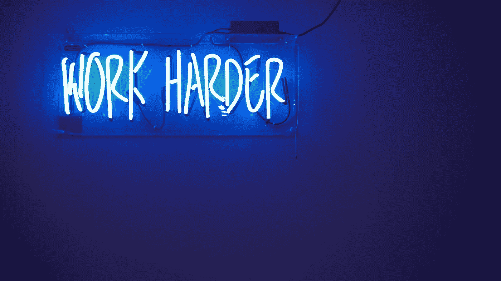

# 为什么我没有在硅谷建立我的公司

> 原文：<https://medium.com/swlh/why-i-didnt-build-my-company-in-silicon-valley-9b5adb035d6c>

## 以及我是如何熬过 9 年多的。

Photo by Steven Wei via [Unsplash](https://unsplash.com/@stevenwei)

大约九年前，我与里克和罗伊(Rick and Roy)共同创办了一家公司，并开发了一款产品，帮助企业创建表格并通过贝宝收款。它吞噬了我们三个的生命，让一些小企业的日子过得更好。老实说，这第一个产品并没有颠覆一个行业。它可能只从更大的竞争对手那里获得了少数客户，而我们没有来自硅谷的投资者。我们的天空没有价值。相反，我们开始靠制造别人的产品赚钱。是的。我们变成了一个机构。我们放弃了成为一家性感的初创公司，而成为了另一家代理公司。我们得到的工作比我们能处理的还要多，所以我们招募了更多的开发人员来帮忙。

现在，我们是一家与雅虎这样的上市公司合作过的机构和飞利浦，并创造了拥有 50 万活跃用户的产品。我们还在台湾开设了一个卫星办公室。我分享这个是因为我是世界上成千上万的科技创始人之一，他们创立的公司不在硅谷，却能赚钱，有快乐的客户和优秀的团队成员。

# 学习不一定要亲自进行，或者在硅谷进行。

Image by Jordan Whitfield via [Unsplash](https://unsplash.com/@whitfieldjordan)

在我创办公司的一年前，保罗·格拉厄姆说[创业中心在硅谷做得更好](http://paulgraham.com/startuphubs.html)，因为创业公司是一个专业化的行业，硅谷有专家帮助他们成长。我们永远也不会知道如果我去了，我会学到什么代码，我会遇到谁，我会遇到什么想法。但是我知道一个叫做互联网的便利工具。在那里，我找到了所有我想自学最新技术的信息。阅读、在线讨论和现实生活中的应用填满了我每周 80 小时的在职学习。同时，我为我们公司的校友(离开的开发人员)感到骄傲，他们已经去了苹果和脸书。我并不反对现场学习(因为我们的开发人员大多在现场工作)，只是指出，如果你非常想学习或构建一些东西，你会使用任何可用的东西(人、互联网、书籍)。我是一个典型的内向怪胎，所以在家自学很正常。尽管我不喜欢社交活动，但和好朋友一起社交才是香港的家。有时我和我的朋友会谈论代码，但我们也会谈论其他事情——比如政府政策、最新电影以及其他只对香港人重要的事情。尽管我去过硅谷，去过欧洲，但我从未想过要搬家。我可以在世界上的任何地方输入同样的代码，但是在世界上的任何其他地方我都不能和我最好的朋友一起吃同样的夜宵。

# 因为估价不是我的验证。

Screencap from *Sin City* via [Movie-screencaps.com](https://movie-screencaps.com/)

当我开始的时候，我只是想让我的公司运转起来。创业公司并不酷，在这个 700 万人口的城市里，你找不到 10 个经验丰富的科技天使投资人。当时没有那么多的技术天使对本地创业公司感兴趣。

刚注册公司的时候不知道估值是多少。我没有考虑天使投资人或筹款，所以硅谷从来没有在我的雷达上。九年后，我不觉得我错过了什么。估值只对退出重要——如果你想建立一家公司，就退出，然后赚钱。如果你没有在寻找这种方法，那么就去读读 Basecamp 的联合创始人 DHH 的《T2，重新考虑 T3》，这是建立公司的另一种方法。

当我与其他科技创始人交谈并了解了更多关于初创公司和融资的信息时，我了解到初创公司创始人和风投/天使投资人的动机并不总是一致的。风险投资可以寻找 10 倍的退出机会，有很多创始人希望继续下去的故事，但他们的投资者认为最好是做大或回家。这种情况通常不会有好结果。我的公司年复一年的正现金流就是我的验证。

# 硅谷从来不是我的梦想。

Photo by Chris Leipelt via [Unsplash](https://unsplash.com/@cleipelt)

在 Web 1.0 起飞之前，我在香港郊区长大。我接触的第一台电脑是 386 SX。当我本科毕业时，我想进入非政府组织为香港工作。我申请成为立法会和大赦国际的助理。两者都没有成功，所以我在一所大学找了一份临时的研究和教学工作。尽管我学的是信息工程，可以称自己为开发人员，但我认为我的职业生涯会在社会领域。我的理想工作从来都不是一家公司的创始人——我的理想工作是任何能帮助我家乡的事情。但是当我创办 Oursky 时，也许我选择呆在家里的最大原因是因为我想慢慢开始。我认为，如果我想为社会做贡献，并以一种好的方式扰乱世界，我们应该从小做起，建立一个拥有相同价值观的核心团队，有时间进行大量的尝试和错误，并从那里成长。为什么不马上做大？我不认为你会以那种方式扰乱世界——你只会跟随潮流和他人的逻辑。对我来说，许多“扰乱世界”的故事只是社会趋势，因为它们正在发展壮大。

随着我们有了更多的团队成员，我学会了去确保我们有合同支付他们的薪水。九年来，我年复一年地来到香港，见证了香港开发者社区的成长，并参加了越来越多的科技活动，如 [PyCon](http://pycon.hk/2016/) 、 [WIDS](http://isoc.hk/wids) 和 [RISE](https://riseconf.com/) 。他们说要么做大，要么回家。但这一次，通过在家里建立一个有机的公司，我已经能够看到我的开发社区不断壮大。我仍然是其中的一部分。

*搭建 app？我们免费的* [*开发者工具*](https://oursky.com/products/) *和* [*开源后端*](http://skygear.io/) *会让你的工作更轻松。*