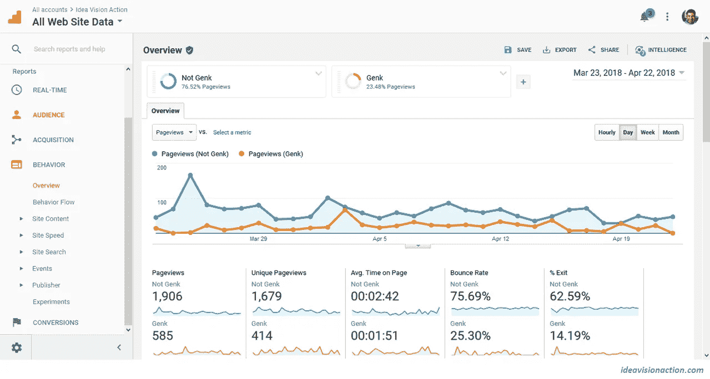

# 为什么我的博客只关注单一的流量来源

> 原文：<https://medium.com/swlh/why-i-focus-on-a-single-source-of-traffic-for-my-blog-78dd751d1d50>

[Ben_Kerckx/pixabay](https://pixabay.com/en/archery-arrow-goal-sports-focus-472932/)

在过去的三周里，我的重点是分析我的中等统计数据。这给了我很多关于写博客的教训。从我的中等数据来看，还有很多东西需要学习。

媒体是我的内容营销模式的关键部分。除了我的博客和电子邮件简讯，目前我 90%以上的博客推广工作都是通过媒体进行的。

我的主要目标不是建立一个成功的中型客户。我的主要目标是建立一个成功的内容营销业务。成功的中型客户是其中的一部分。

本周，我想分析一下[我在媒体方面的努力如何服务于我的总体营销目标](https://ideavisionaction.com/marketing/measuring-the-contribution-of-my-medium-posts-to-my-content-marketing-goals/?20180423)。为此，我将使用[谷歌分析](http://analytics.google.com/)我博客的统计数据。我将重点关注最近 30 天的数据。

**使用谷歌分析的第一步**

我不打算解释如何安装和使用谷歌分析(GA)。我将解释如何处理它。一旦你知道“什么”，你可以谷歌“如何”

使用 GA 的第一步是从数据中排除内部流量。我们不希望自己的使用影响结果。网站管理员的使用和普通访问者的使用是完全不同的。你可以在下面的图 1 中看到。

**Fig. 1.** [Google Analytics](http://analytics.google.com/) Screenshot

*   我是 929 访客中的一员，但我占了所有页面浏览量的 24%。
*   我的跳出率是 25%。普通访客的跳出率是 76%。
*   我的%退场是 14%。普通游客的退场率是 63%。

**如何从 Google Analytics 中过滤掉自己？**

要找到过滤自己流量的不同方法，谷歌“谷歌分析排除内部流量”或“如何从谷歌分析中过滤自己。”

**我创建了一个分段，并使用该分段过滤所有视图。**我使用的细分是人口统计、位置、城市，“不完全匹配”，即我所在城市的名称。我称这个部分不是我的城市。

这个解决方案没有考虑手机的使用，但是我并不经常使用手机数据来访问我的博客。而且，还没有考虑到我出行时的使用情况。

我排除自己内部流量的方法很简单，但并不完美。以后我得找个更好的方法。

**在我的博客流量来源中，媒体的份额是多少？**

担心流量过于依赖 Medium。

> **依赖单一的流量或收入来源从来都不是一个好主意。**

在过去的十年里，我看到了多次谷歌算法的改变，摧毁了许多在线业务。我不为此责怪谷歌。他们必须做对他们的业务和用户最有利的事情。

**媒体算法的最新变化**

Medium 最近对他们的算法做了一些修改。新算法似乎更喜欢永恒、常青的内容。我已经能感觉到我状态的变化了。

我的旧帖子比我最近的帖子点击率高。这在短期内是不好的，但从长期来看是好的。

**短期内不好**

在过去的几个月里，我学到了很多关于将媒体读者转化为电子邮件时事通讯订阅者的知识。我在最近的文章中应用了这些经验。现在，那些最近的帖子收到的流量减少了。

**长远来看很棒**

我不写时间敏感的内容。我试着写永恒的、常青的内容。最终，我的新帖子也将获得公平的流量份额。

总的来说，比起旧算法，我更喜欢新算法，尽管我的时事通讯的注册人数在短期内有所下降。

**为什么我现在关注媒体**

尽管我不喜欢依赖单一的流量来源，但我 90%以上的内容营销工作都是在我的媒体账户上进行的。

这在我的网站上看起来可能是矛盾和错误的。然而，这是一个有意识的选择。此时此刻，我有两个选择。

*   侧重于中等。
*   在所有社交媒体渠道传播我的努力。

我选择了第一个选项。优化我的媒体账户让我从[博客](https://ideavisionaction.com/tag/blogging/?20180423)中学到了很多东西。如果我不吸取这些教训，我的博客帖子会很烂。如果我的博文很烂，我在其他渠道做多少推广都没用。

**给新内容营销人员的有用建议**

如果你像我一样是一个新的内容营销者，我建议你专注于一个单一的渠道，并尽可能多地了解这个渠道。这是我从加里·维纳查克和约翰·周那里听到的建议。

内容营销是我的副业。我能投资这个项目的时间有限。因此，我需要找到最有价值的活动来投资我有限的时间。优化我的中型客户对我来说是一项有价值的活动。

**找到你的主要媒介**

博客不一定是你的主要媒介。也许是给你的。也许，是播客。也许，它是 Instagram，Twitter，一个脸书页面，或者一个脸书小组。

这是你必须做出的决定。查看我的帖子[到 Vlog 还是博客？这是网上营销人员第一次问](https://ideavisionaction.com/entrepreneurship/to-vlog-or-to-blog-thats-the-question-for-the-first-time-online-marketer/?20180423)这个话题。

**投资至少六个月在你的主要媒体上**

一旦你确定了你的主要媒介，我建议你投资至少六个月在这个媒介上完善你的技艺。

我在博客和媒体上投入了五个月的时间。在前五个月里，我学到了很多东西。然而，我离最佳状态还远着呢。我仍然每天都在学习新的东西。

我会继续关注博客和媒体至少三个月。也许更多。谁知道呢，也许我会在余下的职业生涯中专注于这个媒介。我就这么喜欢。

**不切实际的期望**

我们花四年时间获得大学学位，然后找工作谋生。然而，大多数第一次网上营销期望在第一个月后谋生。

> **为什么你期望一个月后就能谋生，而普通人需要四年才能做到？这有多现实？**

也许，在以此谋生之前，你应该在这门手艺上投资至少三年。

我的博客对媒体的依赖程度如何？

我认为我的博客的流量至少有 80%依赖于媒体。根据 Google Analytics 的统计，这个数字只有 35%。这仍然很高，但远没有达到我怀疑的 80%。这是好消息。

也有可能剩下的 65%间接来自于介质。以下是 Medium 可能对我的博客流量有所贡献的一些间接方式。

*   一些人可能通过 feed 阅读器来消费媒体内容。
*   有些人可能会通过媒体注册我的电子邮件简讯。
*   中等导入功能可能会增加我的搜索流量。

**结论**

如果你已经建立了业务，依赖单一的流量来源是一个坏主意。

如果你和我一样是刚起步，专注于单一媒介和单一渠道是可以的。这给了你很多可以应用到其他媒体和渠道的经验。

就我而言，我很幸运地选择了中号。它不仅给我带来了直接的流量，还以许多间接的方式为我的博客带来了流量。

我将进一步深入我的谷歌分析统计，并在这里报告我的发现。所以，请继续关注这个话题。

**轮到你了**

*   你如何衡量社交媒体活动对网站流量的影响？
*   你对使用谷歌分析有什么建议吗？

***如果你觉得这篇文章很有价值，注册*** [***每周简讯***](https://ideavisionaction.com/email-newsletter/?20180423) ***就能收到我关于创业、企业家精神、领导力和自我提升的文章综述。***

## 这个故事发表在 [The Startup](https://medium.com/swlh) 上，这是 Medium 最大的创业刊物，拥有 318，583+人关注。

## 在这里订阅接收[我们的头条新闻](http://growthsupply.com/the-startup-newsletter/)。

