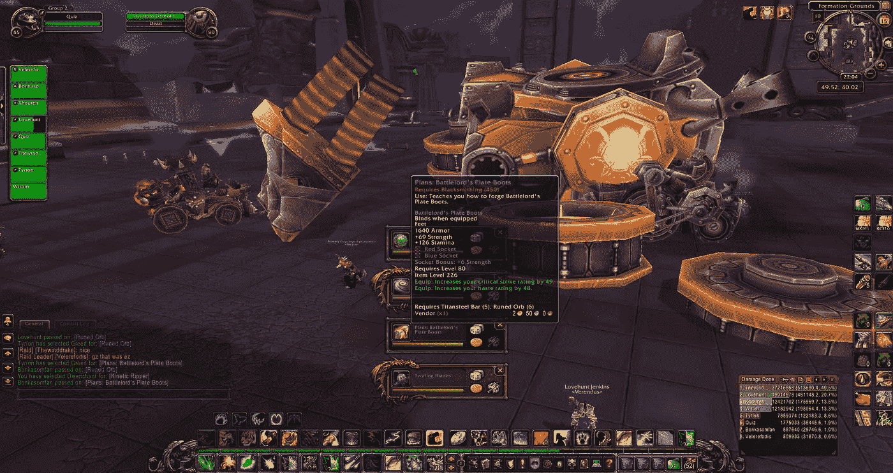
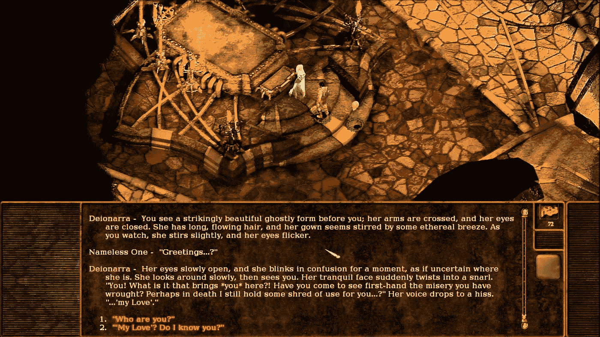
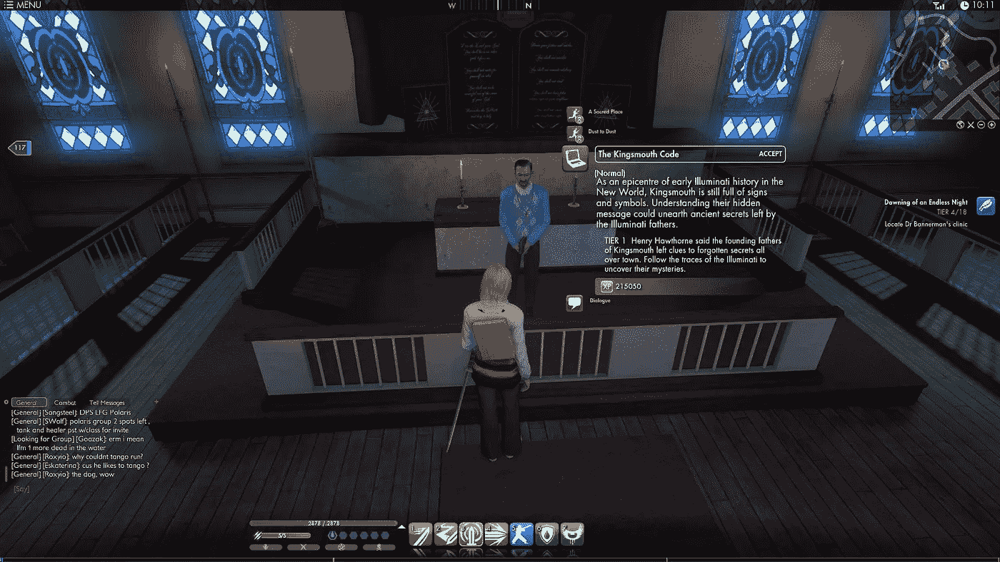
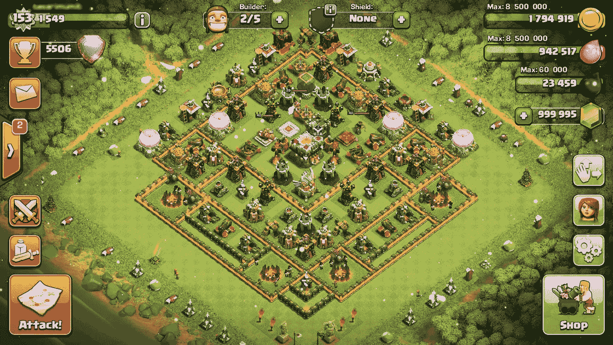
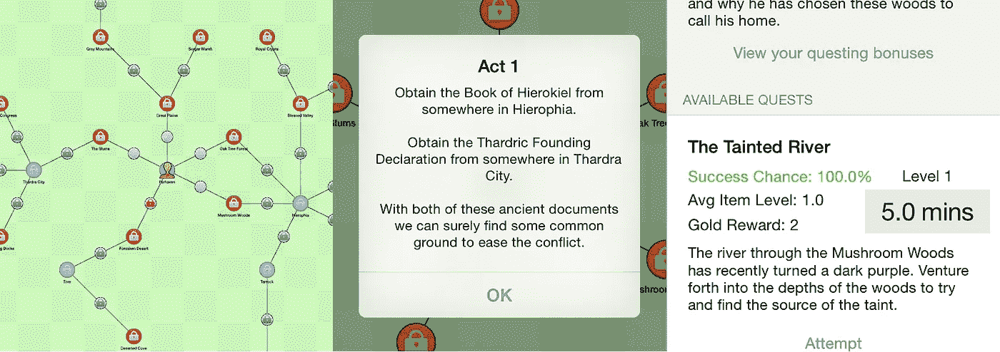
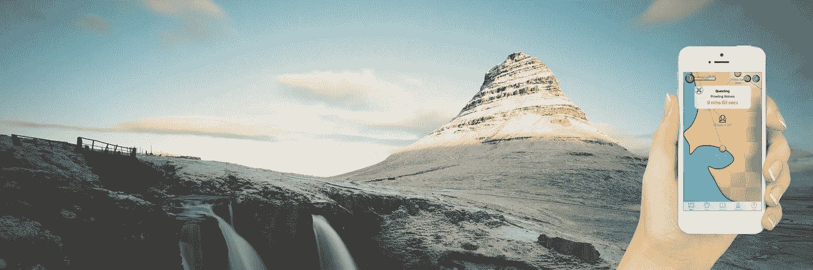
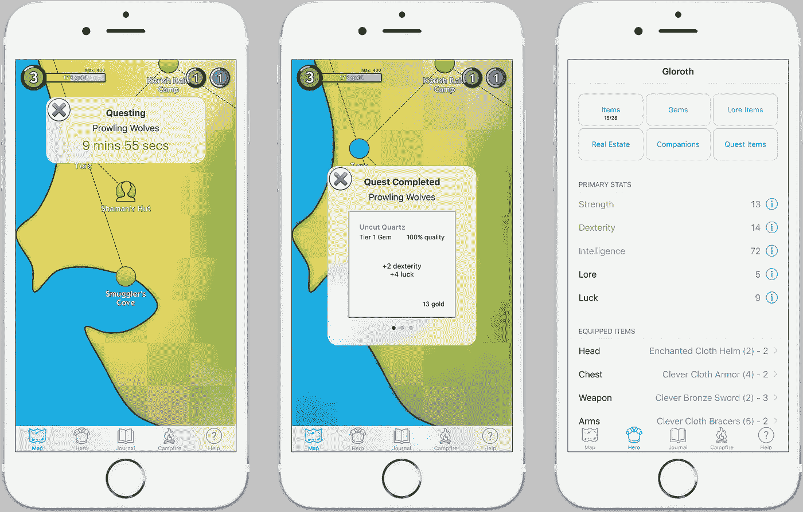
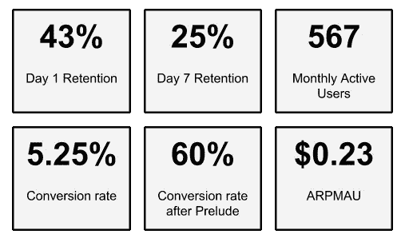
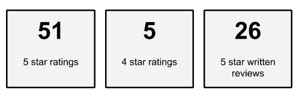
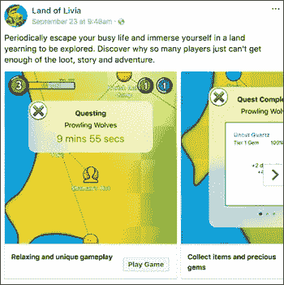

# 为什么我不能放弃我的独立游戏

> 原文：<https://medium.com/swlh/why-i-just-cant-give-up-on-my-indie-game-7ef9895b408a>

时间过了凌晨 1 点，我怀孕的妻子转过身去，避开我笔记本电脑屏幕的强光。我疯狂地敲击键盘，疯狂地融合了工程学和讲故事。我知道我不能停止，直到释放完成；这既是我的祝福，也是我的诅咒。我运行了一些最终测试并上传了构建。然后我又等了几分钟，等待最后的解脱…

*你的应用(iOS)状态正在等待审核*

我合上笔记本电脑，躺下来睡觉。我筋疲力尽，但努力想把过去 6 个小时里我去过的那个*的另一个地方*。

早上醒来时，我筋疲力尽，焦急地拿起手机查看我的指标。令人惊讶和欣慰的是，这款游戏是专门为这类玩家设计的，他们又给出了另一个 **5 星**评论。当我意识到我又一次获得了继续前进的足够能量和灵感时，我的脸上不由自主地露出了微笑。

**我的独立游戏**是[利维雅之地](http://www.landoflivia.com)，这就是为什么我不能放弃它的原因。

# 我的痒

从我记事起，我就深深地爱上了游戏。无论是通过游戏、电影还是小说，我总是强烈地渴望在另一个世界失去理智，逃离现实。然而，在我年轻的时候，我对游戏的热情和推动它们的机制被投入到一个更实用的技能中——软件开发。1997 年，我 12 岁的时候，父母给我买了一本关于 C++的大学课本。通读完之后，不久我就制作了自己的臭名昭著的《毒品战争》游戏的克隆版。

我对游戏的热情实际上是我选择在大学学习软件工程的一大动力。当时的游戏行业因竞争激烈和难以进入而臭名昭著。尽管如此，我还是很幸运，在[红色部落](https://en.wikipedia.org/wiki/Redtribe)找到了我的第一份工作，然后在[邦迪团队](https://en.wikipedia.org/wiki/Team_Bondi)工作了一段时间。这两个职位都极具挑战性。我从了不起的工程师那里学到了很多，但我也学到了伟大的工程并不总是与成功的游戏相关联。

我在 2008 年离开游戏行业，当时澳元走强导致许多公司萎缩和解体。我发现了科技行业中一个不断增长的领域，它非常适合我对融合硬工程和创造性思维的热爱——初创企业。

在接下来的 6 年里，我在 4 家不同的初创公司工作，虽然我能够发挥创造力，甚至参与一些互动体验，但我仍然想要更多。特别是，我渴望更有创造性的表达，尽管我也害怕它。在此期间，该行业发生了两件重要的事情，这两件事后来成为利维雅土地背后的关键驱动力:

1.  独立游戏运动正在获得大量的动力
2.  苹果决定发明世界上最普遍的游戏设备

我发现越来越难专注于享受游戏，因为我会拆解、浓缩和分析每一个游戏，以发现是什么让它们变得有趣、迷人和成功。这些游戏的许多方面后来给了我《利维雅之地》的灵感。

# 我的灵感

这些年来我玩了无数的游戏，但以下是最能激励我创作《利维雅之地》的游戏。玩这些的时候“痒”总是最强烈。

## 魔兽世界

在我看来，没有一款游戏比《魔兽世界》构建了一个更引人入胜的世界。一个人不能简单地“玩”魔兽世界:只要你允许，它就会成为你生活中至关重要的一部分。持续的进步和奖励循环为你的大脑提供了更高层次的心理暗示。

*灵感来源:沉浸式世界有自己的历史和深度，强烈的不断进步和成就感，大量的战利品，团队合作*

## 平面景观的折磨

一个故事驱动的游戏，跨越多个层面的存在，其中*无名的*慢慢恢复他的记忆。这绝对是一款游戏的杰作，也可能是有史以来最好的游戏叙事。

*灵感来源:深刻而迷人的叙事*

## 秘密世界

这不是一个非常成功的 MMO，但它有很多非常有趣和独特的游戏设计。特别是它包括了*调查任务*，这是非常具有挑战性的谜题任务，玩家得到的帮助和指导很少。

*灵感来源:挑战基于谜题的任务*

## 部落冲突(以及各种中端手机游戏)

iPhone 和 App Store 引起了休闲游戏的爆炸，其中许多游戏非常容易上瘾，并产生了大量收入。最终这些游戏演变成了更深层次的中核心游戏。我认为《部落冲突》是中端手机游戏的缩影，通过玩和分析，我学到了很多游戏设计。

*灵感来源:midcore 手机游戏，持续奖励和进展*

# 我的想法

在整个 2013 年，我对 Midcore 游戏的增长趋势越来越感兴趣。

> Midcore 是一群非常喜欢游戏，但可能没有像以前那样有足够的时间玩游戏的人。这是一个术语，很多移动开发者用它来表示他们正在制作一个“严肃”的游戏。这也是针对“休闲玩家”的休闲游戏兴起的结果，而不是针对“铁杆玩家”的传统主机游戏。开发者已经注意到，很多人，尤其是成年人，来自硬核游戏背景，他们在非常有限的空闲时间里寻找免费的移动游戏体验。那就是中端观众。
> [https://venturebeat . com/2015/01/27/what-the-hell-a-midcore-the-11-terms-every-a-mobile-gamer-developer-needs-to-know/](https://venturebeat.com/2015/01/27/what-the-hell-is-a-midcore-the-11-terms-every-mobile-gamer-developer-needs-to-know/)

问题是这些游戏没有一个让我满意，也没有一个比得上上面这些游戏的精彩。更糟糕的是，几乎所有这些网站都遵循着同样的侵入式免费增值趋势，这种趋势通常包括一种付费取胜的机制。

> 让你买更好的 [g](http://www.urbandictionary.com/define.php?term=gear) ear 或者让你制造更好的物品的付费赢
> 游戏比其他人更快 [r](http://www.urbandictionary.com/define.php?term=rate) 吃，然后让游戏很大程度上不平衡，即使对那些在游戏中有技能的人来说也不用付费。
> [http://www.urbandictionary.com/define.php?term=pay-to-win](http://www.urbandictionary.com/define.php?term=pay-to-win)

我开始看到了一个我希望存在的游戏市场的缺口，并且强烈地感觉到这个市场不仅仅是我一个人的。

我想创建的游戏的前提非常简单。

**如果一款游戏将你喜爱的角色扮演和冒险游戏的所有核心元素提炼到一款你可以随时随地玩的手机游戏中，会怎么样？**

以下是我创建的支持这一前提的指导原则:

*   一款面向生活繁忙的铁杆游戏玩家的 midcore adventure RPG iOS 游戏
*   绝对**不**支付赢得机制
*   一个身临其境的世界和掠夺/统计深度就像在魔兽世界
*   一个引人入胜和深刻的叙事就像在平面景观的折磨
*   就像在秘密世界中一样具有挑战性的难题探索
*   一个慷慨的，免费的前奏章节和玩家购买额外章节的能力

这是 3.5 年痴迷的开始(还在继续)。我无法摆脱这样一个事实，即这样一个游戏需要存在。我不确定是否有人会玩它，但不管怎样，我就是不能放弃它。

# 我的动力

那是 2014 年 1 月，我搬到纽约市，成为一家初创公司的首席技术官。不幸的是，公司遇到了一些财务问题，到 2014 年 4 月，我发现自己失业了。此外，我和我现在的前妻 13 年的关系已经走到了尽头，因为我们已经分开了，并且都想要生活中非常不同的东西。

我独自一人住在东村，为自己感到难过——我需要一些东西来集中注意力。快速游戏开发成了我的治疗方法，不到两周，《利维雅之地》的第一个测试版就诞生了。

我一直用上面的原则来指导我的发展。从我的创业经历来看，我也是精益创业方法的大力支持者。我发现游戏开发过程主要是一个去掉特性而不是加入特性的过程。测试版包括许多与当前游戏相同的机制，但它有非常基本的用户界面和图形。这都是关于快速迭代和证明我的断言，这种类型的游戏是有市场的。我知道如何制作游戏，但我不知道我的想法是否会引起人们的共鸣。

The first beta of Land of Livia in 2014

我把测试版分发给我的朋友和家人。他们玩了。他们继续玩。他们完成了。他们给出了出色的反馈。即使那些有批评性反馈的人仍然每天启动游戏，以取得更大的进步。虽然我坚信这项运动的指导原则，但如果没有人喜欢它，我也不会感到惊讶。如果他们没有，那么我会继续前进，放弃我的执迷不悟的想法，但当结果出来时，测试版的反应足够令人鼓舞，我不能放弃。

# 我最初的释放

我搬回了澳大利亚，找到了另一份工作，开始了一段新的感情，我的生活恢复了秩序，但瘙痒依然存在。没过多久，我就开始计划如何才能发布一个版本，并在 App Store 上发布，从更广泛的受众那里获得反馈。它需要更好的用户界面，一些图形，增强的游戏性，更多的深度，等等。

平衡工作和我的游戏开发是非常困难的，但是我继续向前推进。我又一次虔诚地应用精益创业，专注于如何更快地启动。只有当我开始玩的时候，我才能确定真实的人是否会喜欢这个游戏。对那里的其他创造者来说，你将知道此时会发生什么；自我怀疑的内心独白…

*   这个游戏很愚蠢
*   你永远也完成不了
*   你的朋友和家人玩测试版只是因为他们了解你
*   没有人会玩没有精美图形的游戏
*   你的写作和故事是愚蠢的
*   放弃，放弃
*   说真的！放弃吧！

我认为作为一个创造者，学会战胜内心的恶魔是你面临的唯一真正的挑战。即使在我写这篇文章的时候，我也一直在努力不放弃。我对战胜内心独白的建议很简单…

> 坚持下去。设定目标。实现它们。永不放弃。

进展缓慢，但我正在接近目标。过去的每个月，在没有这种游戏的地方，这只会让我更坚定地去创造它。也就是说，有些游戏确实很接近。《生命线》和《T2》【黑暗的房间】上映并获得巨大成功。[增量或闲置游戏](https://en.wikipedia.org/wiki/Incremental_game)也成为一种事物，突然间应用商店充斥着它们。虽然我知道利维雅的土地是多么的不同，但是那些比赛只会让我更加坚定。

2016 年 1 月，我再次离开澳大利亚，寻找另一个工作机会，这次是在布鲁克林。然后就发生了。我似乎有无穷的能量和灵感。纽约有一种孕育创造力和创造的特质。感觉几乎每个晚上和每个周末我都在进步。在我的巅峰时期，我想我会在日常工作之外每周工作 20 多小时。我也设法自己设计和制作了游戏的所有东西。我唯一寻求的帮助来自我的好朋友斯图，他花了无数个小时测试这个游戏并帮我平衡它。

2016 年 8 月,《利维雅之地》1.0.0 版本在 App Store 上线。我在社交媒体上做了一点推广，以获得一些用户，但我想保持它非常小和有机，以便我可以收集反馈并进一步迭代。

在前两个月有 700 次下载，平均每天有 80 个活跃用户。该游戏在澳大利亚和加拿大应用商店获得了 5 颗星的评级，并获得了许多好评。

> 非常上瘾的游戏，很容易在你的日常活动中玩。故事情节有趣且有益。干得好，戴夫！
> 
> 伟大的休闲游戏，你可以拿起玩，当你有一个空闲的 30 秒。相当大的挑战和故事是伟大的。
> 
> 一款好玩的游戏，细节丰富，故事丰富。非常适合休闲 RPG 游戏玩家。非常有限的图形，但这不是这一切。买不到前进的路，所以你通过努力前进。
> 
> 这个游戏设计得很好，拥有我所见过的最友好的用户界面。开发者需要击掌。
> 
> 可爱，简单但史诗般的旅程，幽默的叙事。在日常生活中有一些休息时间时，这是一个很好的小消遣:)

我欣喜若狂！不仅仅是因为得到好评很好，而且这些评论特别强调了我两年前开始的指导原则。此外，他们证明了我的目标玩家并不介意用户界面和图形，我非常担心这会让人们离开。

玩家们非常热情，他们做了一件我没想到的事情:他们玩得太多了，以至于他们开始非常快地完成了免费的前奏。本着精益的精神，我发布了游戏的第一个版本，只有免费的前奏，并打算在未来的某个时候以应用内购买(IAP)的形式发布第一章。当我设计第一章的时候，我遇到了一些游戏平衡的问题，也遇到了一些游戏机制的问题。我知道为游戏 2.0.0 版本做准备和发布第一章将会是很大的努力，但是现在，比以往任何时候，我知道我不能放弃。

# 我的膝盖

不幸的是，这是我失去动力的部分。现实生活开始占据优先地位。我在 Two Bulls 的日常工作进行得非常顺利，我们在纽约的办公室发展迅速。我也准备在 2016 年 12 月回澳大利亚的圣诞之旅中结婚。一个月又一个月过去了，但瘙痒依然存在，当然，还在慢慢增长。

一旦事情稍微平静下来，这种冲动就变得太强烈了，在 2017 年 2 月，它再次全速前进。

我重新设计了游戏的一些核心机制，以进一步支持指导原则，并适应最初版本的反馈。然而，最大的挑战是写第一章。前奏的反馈如此之大，以至于继续下去的压力有时难以承受。我会盯着一个空的 JSON 文件，有一种令人麻痹的持久的写作障碍。这种渴望是疯狂的，我非常想让游戏更上一层楼，但我必须找到另一种方式。

我是一名工程师，当时我正面临一个问题——因此，以真正工程师的身份，我设计并构建了一个解决方案。在 2 个月的过程中，我实现了一个基于 AngularJS 的 CMS，我可以用它来更容易地为游戏创建内容。它甚至有一些简洁的功能，使用算法来确保我在构建“好”的内容。这是一项巨大的投资，但结果是惊人的。我的写作障碍被清除了，我读完了第一章。对于那些玩这个游戏的人来说，他们会发现第一章比序曲要复杂得多，而且精心交织在一起，这都要感谢 CMS。

测试和平衡这种类型的游戏非常棘手。我再次得到了斯图的帮助，但我也制作了工具来测试和验证游戏，以确保它能提供想要的快乐。玩家们如此快速地击败了前奏，以至于我需要确保第一章的长度给我足够的时间来创作第二章。

我必须跨越的最后一个障碍是其他 iOS 独立开发者非常熟悉的:iTunes Connect。这是我第一次在自己的账户中实施 IAPs，因此有很多耗时的文书工作。通常情况下，这不会太难，但因为我是暂时居住在美国的澳大利亚公民，这使得事情变得棘手+加上一些 iTunes Connect 的错误==等待最终批准需要很多周。

> 给其他开发者的专业建议:尽早开始 iTunes Connect 的文书工作和审批过程！

最后，在最初发布一年后，2.0.0 版本于 2017 年 8 月 16 日上线。过去的 45 天是绝对模糊的，包括以下活动:

*   响应玩家反馈
*   培育游戏中的营火
*   做进一步的平衡和功能调整
*   设置和分析分析和指标
*   增加更多的教程，进一步简化游戏
*   修复 bug
*   更新到 iOS11

最重要的是，我努力让尽可能多的玩家加入游戏，让我的指标更有意义，并获得反馈。TouchArcade 和脸书广告(稍后会详细介绍)是我发现的获得新玩家最有效的两种方法。TouchArcade 也有一个很棒的社区，你甚至可以在那里举办一个[简单的比赛](http://forums.toucharcade.com/showthread.php?t=311008&highlight=land+livia)，以便为你的新游戏发布获得那些重要的应用商店评论。

除了花了一年的时间来推出第一章，我犯的另一个主要错误是没有一个有效的方法从最初的发布就和我的玩家保持联系。结果是我的推送通知实现坏了，没有其他方法可以联系到玩家，他们中的许多人可能已经卸载了游戏。我现在已经花了很大的努力来使用脸书分析和应用程序新闻来让玩家了解最新动态。我也继续鼓励玩家在[脸书](https://www.facebook.com/landoflivia/)和[推特](https://twitter.com/LandOfLivia)上关注《利维雅之地》。

当然，我相信现在你已经迫不及待地想知道这款游戏在过去的 45 天里进展如何了。这里是衡量标准…

Metrics for September 2017

从我阅读和研究的一切来看，这些指标对于一款手机游戏来说是非常健康的。对于那些不知道的人来说，ARPMAU 代表*每个月活跃用户的平均收入*，它是一个跟踪游戏财务健康状况的有用指标。

尽管玩家数量相对较少，但该游戏获得了大量极其积极的评级和评论。目前，它在美国和澳大利亚商店的平均评级为 4.9 星，在加拿大商店的平均评级为 4.5 星。

Player feedback since Version 2.x.x

在第一章发布前的几周，我担心没有人会买它。我真的以为这将是这 3.5 年旅程和困扰的最终结束，但我再次被积极的反馈和指标淹没，现在，比以往任何时候都多，我只是不能放弃。

# 我永不满足的追求

到目前为止，这是一个令人惊叹的旅程，但这才刚刚开始。我对我游戏的前提和指导原则深信不疑。我真的认为有一个未开发的市场，我一直在获得支持这一点的指标和反馈。

> 我真的很喜欢这场比赛。它准确地传达了它的初衷，将一个流派归结为一个忙碌的人可以享受的东西。找到一个不被广告或“付费取胜”战术主导的游戏是非常令人耳目一新的。
> 
> 我总是在寻找一些游戏，我可以通过在一天中非常短暂的签到来取得进步，他们肯定在这个游戏中有像我这样的人。玩是没有报酬的，你必须等待。
> 
> 哇！最后，一款游戏问世了，它并不是人们正在玩的其他五款应用的克隆版。

甚至我在脸书的广告也有惊人的效果。通过锁定特定的受众，我实现了非常低的每次安装成本(CPI)。

那么接下来，我的路线图上有很多不同的事情，但最主要的目标是找到一种方法来接触所有我认为会喜欢这个游戏的人，并让他们下载和玩这个游戏。我将继续努力寻找有机的方法来接触潜在的玩家，但是，除此之外，我的指标并不允许我投资更广泛的广告活动。以下是我接下来的步骤:

*   增加我的 ARPMAU -编写并发布第二章和第三章
*   增加我的保留率-继续完善新的玩家体验
*   广告——投资于 CPI 为 1 的活动，这意味着我至少可以收支平衡

如果这是成功的，那么我绝对愿意在艺术家的帮助下实现我的梦想，进一步将游戏带入生活。我也认为这会让我接触到更广阔的市场。

与此同时，我将继续挠痒痒，专注于我游戏的指导原则。不过有一点是肯定的，我会继续与每天的恐惧和自我怀疑做斗争，因为我不能放弃我的独立游戏。

如果你想尝试利维雅之地，那么你可以在 [*应用商店*](https://itunes.apple.com/us/app/land-of-livia/id1052641617?mt=8) *下载，或者你可以在 www.landoflivia.com**了解更多信息。*

## 这篇文章发表在《创业》(The Startup)杂志上，这是 Medium 针对企业家和初创公司的领先出版物。

# 在这里加入+12，417 名[获得头条新闻的人](http://growthsupply.com/the-startup-newsletter/)。

