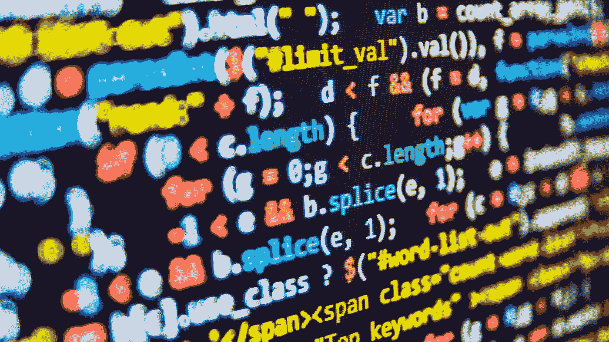
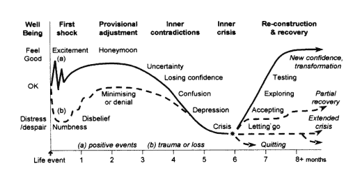

# 为什么我离开了世界上最好的工作

> 原文：<https://medium.com/swlh/why-i-left-the-best-job-in-the-world-3689a5a4649a>

今天是我在安德森·霍洛维茨的最后一天。

我感到非常幸运，能够与一些最聪明的技术人员一起工作，比如马克·安德森、本·霍洛维茨和克里斯·迪克森等人，并在帮助企业家实现梦想的 a16z 使命中从他们身上学到了很多东西。

那我为什么要离开？答案可能会让你吃惊:我已经决定成为一名软件工程师。

这不是像我这样背景的专业人士的典型选择。你可能会认为我疯了，甚至有点愚蠢。但在你妄下结论之前，让我解释一下为什么这是一个伟大的举动，并分享一些让我离开高级财务职位的记录，一头扎进工程界的内心旅程。

故事从处于我这个位置的人的“显而易见”的选择开始，以及我不想追求这些选择的原因:

# 商学院怎么样？

在与 HBS 大学和 GSB 大学的毕业生进行了多次交谈后，我清楚地认识到，商学院更注重的是建立一个强大的职业网络，而不是学习经历。就我而言，我已经足够幸运地拥有一个最好的网络:安德森·霍洛维茨。

即使事实并非如此，对我来说，商学院的主要问题是它通向的行业:咨询和金融。我知道我不想进入咨询行业，那么当我已经通过现实世界的经历获得了教育和人脉，我为什么还要花 20 万美元和 2 年时间去读 MBA 呢？

# a16z 投资组合公司的工作机会怎么样？

这个问题有点难解释。我在 a16z 工作期间有过一些非常有趣的机会，包括增长主管和业务开发/运营主管，但我都拒绝了。虽然他们是令人兴奋的角色，但我渴望做一些更技术性的工作。

事情是这样的，我毕业后涉足金融实际上是因为*我有机会加入高盛，尽管我的学位是工业&系统工程。*

进入投资银行不到一个月，我很快意识到我不想长期走这条职业道路。虽然很吸引人，但它并没有像大学期间的工程学那样吸引我。不管了，财务没那么容易放过我；a16z 的一个职位机会出现了，我*知道错过这个机会是一个错误。*

幸运的是，这一切让我走到了今天:在一次成功的金融经历结束后，我终于准备好回到工程领域。

# 研究生院怎么样？

我非常认真地考虑过读研，特别是考虑到斯坦福大学、加州大学伯克利分校和麻省理工学院等名校有许多计算机科学、数据科学和机器学习课程。

我在斯坦福大学、加州大学伯克利分校、麻省理工学院和其他大学对各种计算机科学项目做了大量研究。最终，我认为我没有耐心花几个月的时间学习 GRE，完成申请，然后再等两到四年才能拿到学位。我更愿意利用这段时间通过真实世界的经验来学习这些技术主题。我只是不相信学位是进入一个新领域的唯一途径。

# 软件工程的出现

现在，你可能想知道为什么我不继续我的专业，进入工业和系统工程，而不是进入计算机科学的全新领域。老实说，如果我在大学里知道得更多，我会尽快选择计算机科学专业。

我没有这么做的原因是，当我年轻的时候，我对软件工程师的想法完全是古怪的。我想象着昏暗的血汗工厂里挤满了不受欢迎的书呆子，在盯着屏幕写了一整天的代码后回到他们父母的地下室。我不认为软件工程是有创造力和热情的人的事情。简单地说，它不适合我。

连我妈妈都反对我从事软件工程。像每个典型的印度父母一样，她的梦想是让我成为一名医生。

到了大学，见到了真正的计算机科学学生，这完全改变了我对软件工程的设想。我通过选修一些 C++课程开始涉足计算机科学，令我惊讶的是，我真的很喜欢它们。但在大三的时候，我对转专业太紧张了，以至于不敢正面去追求它，不管怎样，我非常喜欢我的工业和系统工程课程，足以说服自己走“安全的道路”

# 硅谷达成协议

总之，我不是那种从小就摆弄电脑的程序员。我并非“注定”从事计算机科学——我的故事有点不同。

我的故事开始于大学毕业后，我搬到了世界科技之都硅谷，在那里，我发现自己周围都是业内最优秀的工程师。我开始了解他们从事的工作和解决的问题，这让我大吃一惊。我迷上了计算机科学主题，如机器学习、计算机视觉、人工智能、机器人和知识表示，并尽我所能阅读一切来了解它们。我联系了软件工程师、数据科学家和机器学习研究人员，向他们请教，了解他们的日常工作，我学到的东西都令人难以置信地兴奋，在这个过程中，我对他们给予了极大的尊重和钦佩。

很自然，不久我就想成为他们中的一员。

# 第一次尝试

计算机如何编译代码？一门编程语言最初是如何被创造出来的？你如何构建机器学习算法？是什么造就了一个“好”的系统设计和一个“坏”的系统设计？伟大的数字产品是如何打造出来的？我带着无数这样的问题开始了我的计算机科学之旅。伴随这些问题而来的是学习代码的需要。所以我去了。

我清楚地记得我第一次尝试“学习代码”那是 2013 年的冬天，我和父母兄弟姐妹在家过圣诞节。我的第一步是花一天时间研究从哪种语言开始。在跌跌撞撞地浏览了许多论坛和博客帖子后，我决定使用 Python。我拿起泽德·肖的《艰难地学习 Python》开始练习。可悲的是，这种经历只持续了两周。这很难，不舒服，令人沮丧，我放弃得太早了。

> “谁喜欢这种东西？”我心想。

整整一年后，我对学习编码的兴趣又出现了。我说服自己再试一次，这次我的决心持续了两倍的时间:一个月。不幸的是，我刚刚开始一份新工作，正在努力寻找一个合适的工作与生活的平衡。编程不像培养一种新的爱好，比如跳舞或瑜伽，可以随便获得。很少有人会说“我要去写代码，把我的注意力从工作上移开。”我还没有达到一个足够高的舒适水平，对编码的本质方面的基础知识还没有达到*的乐趣*。我再一次把它放在一边。

> “等以后我对工作更适应了，我会做的，”*我心想。*

# 自我怀疑

我不仅仅是在努力实现我的目标——我失败了。编码又被搁置了一年，而我在消极中挣扎，确信我唯一擅长的事情就是抑制我的自我憎恨。是的，自我憎恨。我很惭愧。如果这个世界上有 1800 万人([根据 IDC](http://www.infoq.com/news/2014/01/IDC-software-developers) )可以做到，我到底有什么问题？为什么我不能？人们总是说我很聪明，但我确信他们错了。

我开始嫉妒世界上的每一个程序员，嫉妒任何知道如何“说代码”的人。我甚至向男朋友哭诉我多么希望能帮他编写我们一起梦想的应用程序。这种情况一直持续到有一天，学习编码的欲望简直无法忍受。

# “你好，世界”

最终，我到达了情感的临界点，克服了之前击败我的最初障碍。那是凌晨 5 点，我已经在跑步机上跑了一个小时，脑子里在思考解决编码困境的新方法。突然我有了一个顿悟:对编码感到糟糕让我很痛苦，但对它感到内疚并没有改变任何事情。我只能要么做，要么忘了它。

我决定那天不上班，呆在家里看书。这一次，势头站稳了脚跟，经过一周不间断的辅导和在线课程，如 CodeSchool 和 TreeHouse，我用 HTML/CSS 创建了我的第一个网站。

接下来，我学习了 JavaScript 的基础知识，并开始了一个副业项目，将我在过去两周学到的一切融入到上下文中。又过了一周，我完成了我的第一个前端编码项目[的工作(但不完整)版本。](http://iam-peekay.github.io/SAAS-PROJECT/)

现在回过头来看，这个产品看起来很粗糙，很难维护和更新，代码也令人尴尬。我认识到，如果我今天从头开始重新构建它，它可以被写得更加模块化、可维护和更好地结构化(我确实计划将它作为我的一个周末项目来重写)。然而，重点不在于*我在那一周内造了什么*，甚至不在于*我造得有多好*。重点是*实际上使用代码做一些东西*。

我很喜欢。

在迷你项目热情的驱使下，我工作到深夜，面对意想不到的挑战，但它从未像“工作”一样我喜欢每一分钟——将项目分成几个块，思考如何设计项目，找出要使用的工具和库——最棒的是，我喜欢当我试图找出如何让代码按照我想要的方式工作时我的大脑会受伤。我终于明白了为什么人们对编码如此热衷。编程让你成为创造者，它既是一门科学，也是一门艺术。我一直以来都做错了——我把编程当成了我需要学习的东西和我需要拥有的技能，这让我觉得它像是一项任务。但是这个项目帮助我认识到编程不仅仅是知道如何编码，而是创造你关心的东西和你想让世界看到的东西。编程是解放和授权的，它使你能够创造。火花四溅，我被迷住了。

我在晚上和周末继续学习。很快，我唯一能想到的就是代码。其他一切都让我分心。我会抓住头天晚上困在脑子里的编码问题，并在白天探索它。然后我会下班赶回家，晚上再多写几个小时的代码。这持续了几个星期，最后我对自己说，

> “如果我可以整天这样做，会怎么样？”

# 我今天在哪里

正是在这一点上，我决定停止涉猎，全身心地投入到编码中，这是我做过的最艰难的决定。安德森霍洛维茨是一个令人难以置信的地方，我知道我留下了很多东西。

不用说，我妈是完全反对的。她认为我完全疯了，因为我放弃了一份很棒的工作，花光了我所有的积蓄去做一件我几乎没有具体经验的事情。我甚至有几个在这个行业更有经验的人告诉我，如果没有计算机科学学位，很难在谷歌或脸书找到工作。

当然，我没有斯坦福或麻省理工的计算机科学学位。当然，我可能不会在谷歌或脸书找到工作。但我能否进入脸书或谷歌并不是我想做这件事的原因。我的目标是真正地学习 T1。我心目中的路线图是这样的:

1.弄清楚我最喜欢在哪些方面进行开发:前端对后端，移动对 Web，以及我觉得最感兴趣的应用领域:机器学习，人工智能，机器人，计算机视觉等。

2.得到*真正擅长的*

3.用这些技能来改变世界。这可能意味着建立一个改变世界的公司或其他完全不同的东西。

所以，是的，我可能没有斯坦福大学的计算机科学学位，但我会尽我所能努力工作，通过获得构建真实产品的真实经验来补充我没有的学位。我意识到，当我开始工作时，一些招聘人员和招聘经理仍然会因为我没有计算机科学学位而忽视我，但这没关系。我相信，我会找到至少一个愿意信任我的人，给我一个证明自己的机会，幸运的是，在科技世界里，这往往是你所需要的。我愿意从最底层开始，一步步往上爬，就像我在金融领域所做的那样。

作为下一步，我选择在旧金山参加一个名为 Hack Reactor 的为期 12 周的编码训练营。这将加速我的学习，帮助我建立一个强大的基础，也让我能够获得一些项目，在这一点上，我会出去招聘一名开发人员。

我知道这将是一场艰苦的战斗。“学习编码”的蜜月期结束了。我正在深入研究像算法和数据结构这样的计算机科学课题，而且只会越来越难。当我学习新事物时碰壁是不舒服和令人沮丧的，我经常感到完全迷失。有时需要几个小时，有时几天，有时几周。我失去信心，质疑自己的能力。在下面的图表中，我正处于“内心矛盾”阶段的开始:

【http://www.eoslifework.co.uk/transprac.htm】来源:

*但是这一次，我喜欢所有这些感觉，因为它们意味着我在成长，在学习，在变得更强。只要有足够的毅力，我会更好地管理它们。我会厚着脸皮，学会更加享受奋斗。只要我继续推这些墙，它们最终会给我让路。毕竟，这不是火箭科学，即使有时感觉是这样。*

# *展望未来*

*所有这一切中最疯狂的部分是，我知道我有可能最终甚至不喜欢软件工程——或者我可能达不到我想要的高水平技能——或者更糟，我可能最终不喜欢它*并且*成为一个糟糕的软件工程师。老实说，我不认为这些结果是“失败的”在我看来，我只是在抓住人生的又一次机会，离改变世界更近了一步。*

*所以，让我们再一次抓住生命中的机会，追求更多。我不能向你保证我最终会成为最好的软件工程师，但是我*可以*向你保证我会学到很多东西，会比今天的我更好。我可以向你保证，我不会“失败”——我不会让这种事情发生。*

*现在轮到*你的*了。找到让你烦恼的事情，并迈出第一步。*

**

**发表于* **创业、旅游癖和生活黑客***

******

*-*