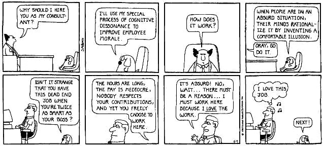
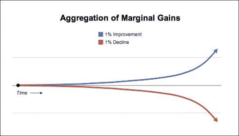
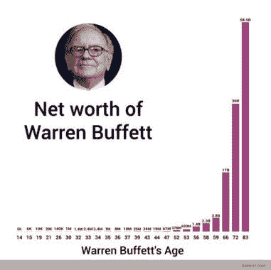

# 为什么我喜欢搞砸

> 原文：<https://medium.com/swlh/why-i-love-screwing-up-8cbf545dd924>

Photo by [averie woodard](https://unsplash.com/photos/Av_NirIguEc?utm_source=unsplash&utm_medium=referral&utm_content=creditCopyText) on [Unsplash](https://unsplash.com/search/photos/mistake?utm_source=unsplash&utm_medium=referral&utm_content=creditCopyText)

我年轻的时候，每次犯错都会被痛打一顿。

我很快认识到犯错误不是一件好事。

随着年龄的增长，我开始在金融业工作，我了解了一个叫乔治·索罗斯的人。

他是世界上最富有的人之一，仅在一个下午的交易中就赚了 10 亿美元…..

**乔治·索罗斯曾经说过:**

> 一旦我们认识到不完美的理解是人类的状况，犯错并不可耻，只有不改正错误才可耻。

我花了一段时间才把自己在成长过程中所学到的东西与乔治索罗斯所说的相一致。

**但是随着年龄的增长，我终于明白了允许自己犯错并承认犯错是你想做好任何事情的过程中的一部分的魔力。**

然而，逃避错误是很容易的。

假装它们从未发生过。

说出哪里出了问题，你本可以做得更好，这需要勇气。

很难承担责任。但你必须这么做。

**承认错误后，如果你足够勇敢…..**

**问自己这些问题:**

你什么时候做的？你如何预防它们？你能建立哪些系统？

# **为什么承认错误很难:**

这都归结为认知失调。

认知失调只是用一种复杂的方式来说，我们很难承认让我们不舒服或与我们的其他信念无关的事情。

我们没有重新审视我们的信念或试图重新解释这个世界，而是选择忽视我们周围的事实。

Scott Adams

我为此感到内疚。

当我开始投资时，一只股票会对我不利，我会嫁给这个位置。我的自我会和我的预测联系在一起。很快，当股票下跌时，我会开始证明证据的变化。

**认知失调的发生是因为我们宁愿认为我们做得很好(即使事情并不完美)，也不愿承认我们可能是错的。更容易说的是其他人就是不明白。**

别忘了理查德·费曼说过的最容易被愚弄的人。

> 第一个原则是你不能欺骗自己——而你是最容易被欺骗的人

# **如何从错误中学习:**

卡罗尔·德韦克教授在这方面已经做了几十年有价值的工作。

这就是德韦克教授对那些喜欢从错误中学习的人的发现——她称之为；一种[成长心态](https://www.amazon.co.uk/Mindset-How-Fulfil-Your-Potential/dp/1780332009)。

1.  他们只想学习——这是唯一的目标
2.  他们明白这是努力工作和付出努力的结果
3.  他们欢迎失败并处理自己的弱点

TED.com

根据德韦克教授的说法，以下是你有固定思维模式的迹象(如果这是你，不要担心，我们可以改变它):

*   你有没有想过在考试或测试中作弊？
*   你有没有试图找到比你做得更差的人来对你自己的结果或目标感觉更好？
*   你曾经试图将你的错误和失败归咎于他人吗？

**以下是获得成长心态的方法:**

1.  每当你失败或犯错时，对自己说“哇，这是一个成长的机会。我能从中学到什么？”
2.  关注获得的经验和过程，而不是结果
3.  每当你说你没做某事时，在它后面加一个“还”。“我不是合伙人……然而"
4.  寻求批评和反馈

# **你怎么用这个:**

查理·芒格说:

> 我从来不允许自己对任何我没有比他们更了解对方论点的事情发表意见

不幸的是，在华尔街，可以有很多未经深思熟虑的观点。

也许因为我们和数字打交道，或者因为人们得到多少报酬，所以很容易产生这种错误的准确性和安全感。

人们有时会对自己说:

> "我不会错，因为我足够聪明，可以因为我的观点得到一百万美元的报酬"。

我们就是这样自爆的。

**在每笔交易、每个项目、每个建议上——要知道你很可能是错的。试着找到持相反观点的人，试着想想你怎么会错。**

# **当心叙事谬误:**

大脑试图用简单的故事来解释世界。金融、华尔街、投资都非常复杂，但我们倾向于看到并相信简单的故事。

我们认为这些故事可以解释这个世界。
**风险来自于将这些故事或关于为什么要做某事的论文放在一起，然后相信故事而不是数据。**

这些故事你听起来熟悉吗？

*   美国房价从未下跌
*   世界正在耗尽石油
*   新兴市场比发达市场增长更快
*   中国将接管世界

这些都是在很长一段时间内定义市场的简单叙述。

我们知道这些故事的结局…

当心简单的叙述。

**你现在在给自己讲什么故事？**

# **使用边际收益:**

沃伦·巴菲特几十年前就发现了这个窍门。投资的时候叫复利，系统和流程的时候叫边际收益。

这个想法很简单:一天比一天进步。

每天都要想出如何在生活中最重要的领域做得更好 1%。如果你能做到，这就是你生活的样子:

问题是大多数人谈论成功就像它是一个事件。我们谈论升职、被聘用、获得巨额奖金，就好像它们是事件一样。

但事实是，你生活或职业生涯中大多数重要的事情并不是孤立的事件，而是当我们选择把事情做得更好或更坏时所有决定的总和。

将这些边际收益加在一起会产生很大的不同。

# **现在就做:**

**这里有一些想法供你在生活中尝试，我保证会让你更加成功。**

1.  回顾你最近的失败，你能从中学到什么？
2.  重新思考长期以来的假设——你为什么要这样做？有没有更好的办法？
3.  **为失败做计划**——意识到你可能会错，错了也没关系，所以相应地计划、调整、思考。
4.  **向后计划**——决定你想要什么，弄清楚需要什么。从你今天想做的事情开始倒退。创建一个计划来缩小差距。执行它。
5.  **实验** —你今天的生活中可以进行哪些实验或测试？
6.  **提高 1%**——每天找到一件你可以提高 1%的事情。

## 这个故事发表在 [The Startup](https://medium.com/swlh) 上，这是 Medium 最大的创业刊物，拥有 297，332+人关注。

## 在这里订阅接收[我们的头条新闻](http://growthsupply.com/the-startup-newsletter/)。

