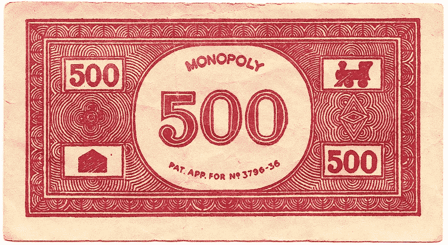

# 为什么我对拥有自己创业公司的 0%股份感到兴奋

> 原文：<https://medium.com/swlh/why-i-m-excited-to-own-0-of-my-startup-b9ffd8c92a97>

At the beginning of a startup, founder stock is worth as much as Monopoly money.

## 我对创始人授权的想法，以及为什么 Bliss 的创始人选择慢慢授权给我们的创始人股票。

授予创始人任期的做法很常见。然而，确切的术语是整个创业界正在进行的辩论。不过，基本原则仍然是:创始团队成员必须通过提供价值来获得他们在公司的股份。

在我看来，创业公司的最佳创始人授权条款包括两个要点:

**1)** [**四年的归属期**](http://www.quora.com/What-does-4-years-vesting-with-1-year-cliff-mean) **2)一年的悬崖**

虽然这些术语对员工来说很常见，但对创始人来说就不那么常见了。我认识的大多数创始人都试图实施比这更快的授权时间表。下面是一些我见过的创始人用来及时获得合法所有权的具体例子:

**回溯— (** 1)创始人要么谎报他们的开始日期，要么(2)创始人开始共同研究一个概念，随着时间的推移，这个概念完全变成了一个不同的想法，他们声称原始概念的开始日期，而不是实际上成为业务的新想法的开始日期！

**没有悬崖或更短的归属期—** 在这里，创始人没有耐心等待正常的四年。他们选择实施某种类似的授权计划，但更多的是为了发薪日，而不是长期愿景。

**没有背心—** 这件是大罪！创业初期最常见的问题之一是创始人之间的矛盾。如果股票没有授权期，一个创始人离开了，她会带着大量的股权离开，而不会赚到钱！随着你业务的增长，这部分丢失的资产会一次又一次地回来困扰你。

此外，对我来说，即使所有的创始人都留下来了，这仍然是文化上的一个危险信号——创始人试图以所有错误的理由进行优化。

## 第一手经验

幸运的是，在一起创办了一些创业公司(也投资/建议了一些)之后，伊恩和我之间的授权讨论变得简单明了。

尽管我们彼此信任，也享受了几年的合作，但我们绝不可能改变我们共同创办的任何新企业的创始人授权条款。

对于极乐世界，我们更进了一步。Jason Lemkin 在 SaaStr 上发表的这篇文章[启发了我们，我们的投资直到我们至少筹集到 50 万美元才开始！](http://www.saastr.com/a-simple-commitment-test-for-you-and-your-co-founders/)

screenshot from our founder stock purchase agreement

大约 2 个月前，我们开始为种子轮筹集资金，并取得了一些初步的势头，但考虑到潜在投资者的暑假计划，全部 50 万美元可能会很容易地滑至第四季度。

在上面提到的文章中，Jason 挑战 SaaS 创始人在 5 年内授权，并在种子轮结束后一年内开始悬崖。我们试图让我们的创始人授权条款更符合 Jason 的挑战，但我们的法律顾问鼓励我们遵守上述条款，主要是为了让事情变得简单，但我们实施了种子轮条款——这是 Ian 和我的新条款。

*“需要 7-10 年的时间来建造真实的东西”*

*“SaaS 没有龙卷风，也没有病毒爆发。不会有任何 Instagram 的 insta-hit。除非你至少建立了一个真正的企业，拥有真正的客户，否则在 SaaS 没有任何价值。”*

我们同意 Jason 的这些见解，并结合我们对创始人归属的一般信念，我们很高兴在我们从外部投资者那里获得第一笔 50 万美元之前，不会开始我们的 1 年悬崖。

因此，尽管 Bliss 最初是去年夏天在我们之前的公司开发的(作为一种内部工具)，并且我们在 2015 年全年全天候致力于这个想法，但如果 Ian 或我从今天起离开大约 14 个月，我们将一无所获！

尽管我们最初吸引了收入和客户，但我们意识到我们还有很长的路要走，现在试图优化所有权就像囤积垄断资金一样，毫无价值！

## 关键外卖

我们意识到，大多数创始人并没有像我们这样，一起创办第三家公司。股票/授权对话是一个困难的话题，但它必须发生。尽早将这些写在纸上可以消除不确定性，并确保创始团队走在同一条路上。此外，如果你和你的联合创始人不能通过这次讨论解决问题，这应该会对你的未来发出警告，因为接下来会有更多更困难的挑战和对话。

*发表于* **创业、旅游癖和生活黑客**

-