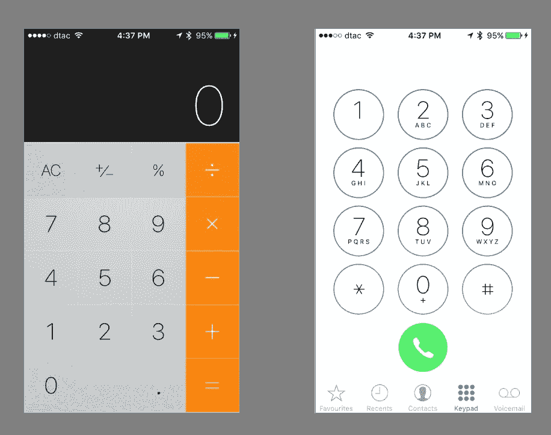
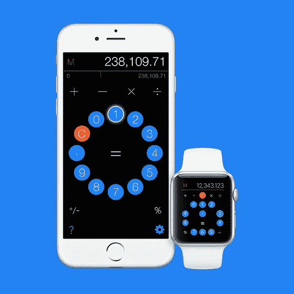
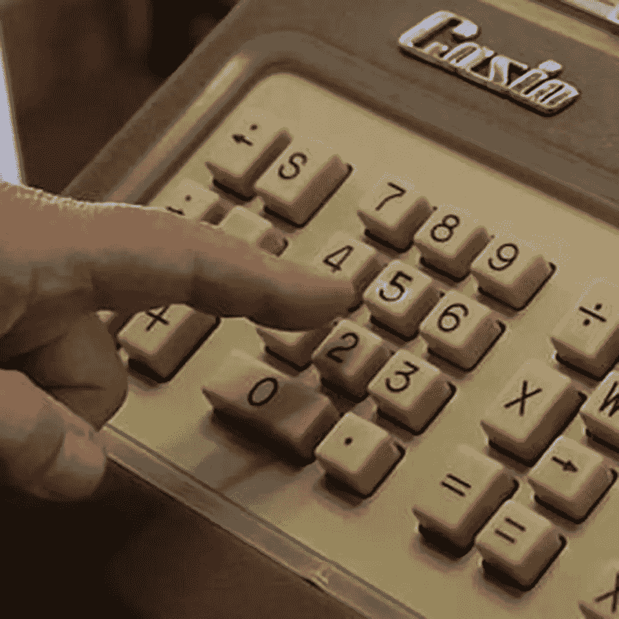
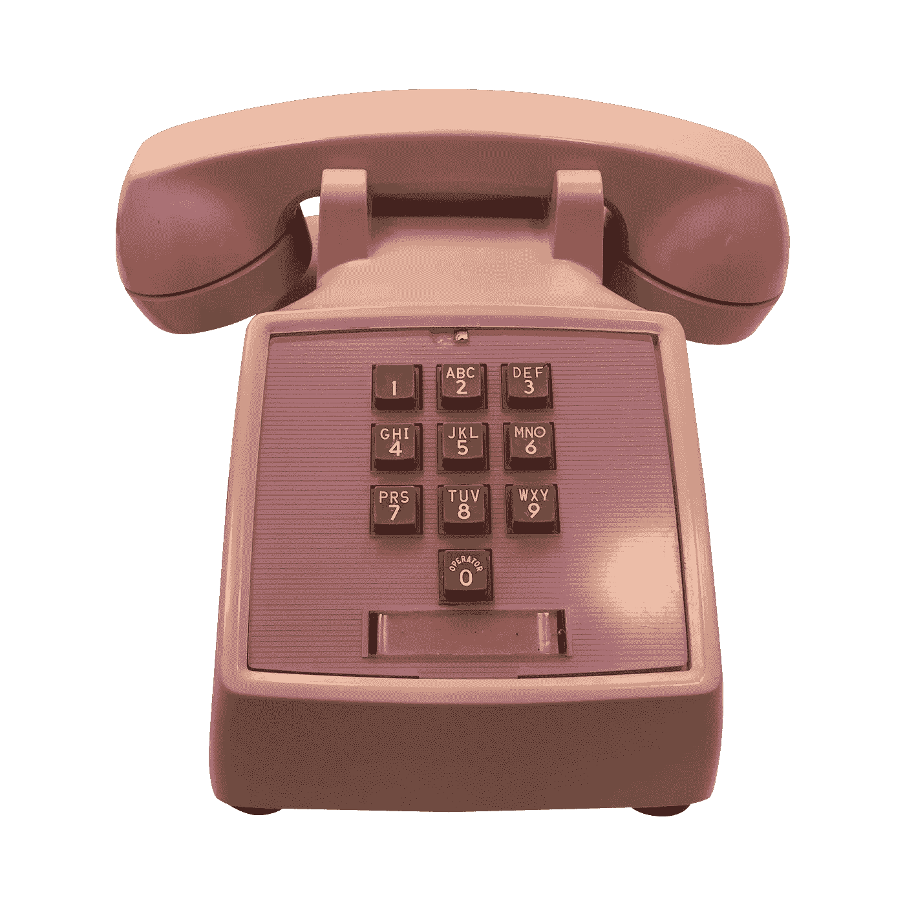
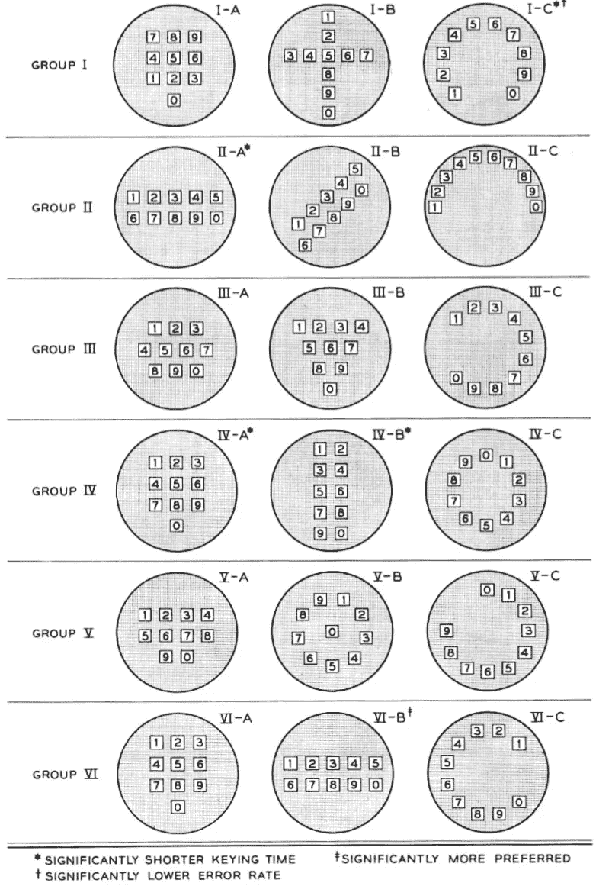

# 我是如何从正方形变成圆形的

> 原文：<https://medium.com/swlh/why-i-moved-from-a-square-to-a-circle-3882e6793b79>

*或者如何制作一个前所未见的计算器*

**看下面的两幅图**。注意到什么了吗？

*Most users do not even notice that the keypads of the calculator and phone are inversions of each other.*

D 虽然两个键盘底部都有零，但剩余的数字在计算器上是从下往上的，在手机上是从上往下的。

我很好奇。这两种设计在人体工程学上肯定是不一样的吧？谁决定这两款设备需要不同的键盘？为什么？为什么到目前为止没有人质疑这种安排？

更重要的是，我想知道这两种键盘是否与用户有关，这些用户用仅仅 10 年前无法想象的方式与他们的应用程序进行交互，使用滑动、触摸、点击和强制按压。随着苹果颠覆 skeuomorphism(让软件对象与现实生活中的对应对象相似的设计概念)，我觉得作为一名设计师和开发人员，是时候挑战数字键盘设计的正统观念，并提出一个未被提出的问题:为什么 2015 年的计算器键盘看起来、摸起来和工作起来都像 20 世纪 60 年代的卡西欧计算器？

这个问题的答案最终导致我彻底重新设计了我的应用程序中的计算器界面， [Calcuta](http://www.calcutapp.com) 。

*Though radial keypads, such as the one in Calcuta (above) was better rated by users, Bell Laboratories stayed with the standard square layout in its touchtone phones, perhaps to give users a familiar experience.*

**在设计过程的早期就很明显**没有逻辑或不言自明的方法在矩形空间内排列 10 个数字。字母表可以根据它们在 QWERTY 键盘上的使用频率来排列，但是数字没有这样的模式。在任何数字都有可能被按下的情况下，对于人类指尖来说，什么是最符合逻辑和人体工程学的排列？

将零隔离在它自己的行中允许剩余的 9 个数字排列成一个 3×3 的正方形。对卡西欧来说，从下到上排列剩余的数字似乎是合乎逻辑的。

1957 年，当卡西欧的创始人 Tadao Kashio 发布了世界上第一台机电台式计算器 Casio A-14 时，倒置的 10 键数字键盘首次出现。然而，10 位数字的布局显然是由 Kashio-san 随意决定的。当贝尔实验室(Bell Laboratories)在探索其首款按键式电话的键盘设计时，向卡西欧询问数字键盘背后的逻辑时，他们显然得到了“一个大大的耸肩”。

The 10-digit numeric keypad first appeared in Casio’s A-14 electromechanical calculator, released in 1957\. It is possible that the design was arbitrarily decided by the company’s founded Tadao Kashio.

几十年来，卡西欧的数字键盘从未受到质疑和挑战，出现在越来越时尚的计算器上，包括小型化的手表设备。

# 计算器是如何装上铃铛的

一九六三年十一月。贝尔实验室推出了世界上第一部按键式电话，即西方电动型号 WE 1500——其键盘垂直翻转了卡西欧的设计，尽管零仍在底部。这种设计上的改变显然来自阿尔丰·查帕尼斯博士和他的助手玛丽·C·卢茨在 20 世纪 50 年代进行的研究。查帕尼斯设计了一项测试，研究人们期望在哪里找到按键上的数字，并对 300 人进行了测试，这些人被分为三个年龄组，并根据他们在技术上是幼稚还是成熟进一步划分。测试了六种不同的按键排列。不出所料，绝大多数人更喜欢数字从左上到右下递增的排列方式。

*Bell Laboratories’ WE 1500, the world’s first touch tone telephone, launched in 1963, vertically flipped Casio’s numeric keypad design, though zero remained at the bottom.*

Numberphile 从 1960 年 7 月的*贝尔系统技术杂志*上翻出了一篇鲜为人知的研究论文，其中列出了他们的工程师已经实地测试过的 18 种不同的键盘设计。其中包括:“楼梯”(下图中的 II-B)、“十瓶”(III-B，让人想起保龄球瓶配置)、“彩虹”(II-C)，以及其他各种模仿现有拨号技术循环逻辑的版本:转盘。

获胜者 IV-A 可能是用户最熟悉的。但是它是最符合人体工程学和美学的吗？。

*Though the radial design scored higher in ease of use and error rate, Bell Laboratories went ahead with the square numeric keypad.*

Numberphile 的 Sarah Wiseman 指出，“他们确实比较了电话布局和计算器布局，他们发现计算器布局较慢。"

还有另一个更世俗的故事——贝尔实验室故意颠倒键盘，让用户不那么熟悉，让他们慢一点，刚好足以让机械开关交换跟上步伐。

# **如果它没坏，为什么要修理它？**

移动计算器的设计一直是我的烦恼。从设计的角度来看，它的设计显然有严重的缺陷。

1.  小键盘不是为今天手机的小矩形屏幕设计的。它从未因其与手势和用户与手机互动的现代模式的协同作用而受到评论。
2.  它几乎不向用户提供任何反馈。例如，如果她在计算过程中被打断，她就无法知道她最后输入的是什么。
3.  内存操作是不透明的。通常没有办法知道内存中存储了什么，或者改变内存内容的操作会如何影响它。
4.  虽然现在许多计算器都有删除键，但这只会增加混乱。滑动删除干净而直观，但苹果的原生计算器是少数几个拥有它的应用之一(尽管大多数人不知道这一点)。
5.  许多计算器包括纸带的概念——再次模仿一个早已消失的机械现实。作为一个用户，我希望我能很容易地改正错误。

# **加尔各答的进化**

calcuta——比*计算器*少一个音节——是一个设计过程的结果，该过程始于对贝尔实验室自己的 17 种键盘设计的仔细研究。我注意到最高评级的设计不是 IV-A，而是 III-C，这表明*的按键时间*明显更短，*的错误率*明显更低。III-C 是一个三分之二圆，从 1 到 9，最后是零。这是我的旋转转盘的起点，这是这个应用程序最意想不到的方面。

我的设计目标是—

1.  逻辑地划分屏幕区域:操作符在一起，数字在一起，显示区域不同。
2.  尽可能用手势代替按钮。
3.  建立持续的反馈。
4.  创建直观的 UX。

我很快就把笨重的方形键盘换成了干净的圆形转盘。其他功能包括——通过滑动删除输入；将整个页面滑动到一边以编辑历史记录；轻按并双击以在内存中增加和减少数字；用手指擦除记忆内容；在你打字的时候像圣诞树一样点亮按键和操作符，这样你就能时刻知道自己在哪里；和显示存储器内容的切换设置。

下面的视频展示了这些变化—

我从用户那里听到的最一致的词是*愉快。我相信辛勤工作的计算器是有用武之地的。*

我欢迎您的反馈——砖头比花束更受欢迎——这可能有助于将这个计算器提升到下一个水平。你可以从[苹果商店](https://itunes.apple.com/us/app/calcuta/id986616798?mt=8)购买 [pro 版](https://itunes.apple.com/us/app/calcuta/id986616798?mt=8)或者限量版[试用版](https://itunes.apple.com/us/app/calcuta-lite/id997559053?ls=1&mt=8)。我的愿景是将它开发成一个应用程序，向孩子们介绍数学并培养他们的计算能力。

据我所知，市场上没有计算器能做到这一点。

Android 版本即将推出，法语、孟加拉语、印地语、泰语和韩语的本地化版本也即将推出。请写信到 cygopi@gmail.com 告诉我你的意见。如果你碰巧喜欢某样东西，那么请花点时间在应用程序的应用商店主页留下评论。

如果你喜欢这篇文章，请点击心形图标表达你的爱。