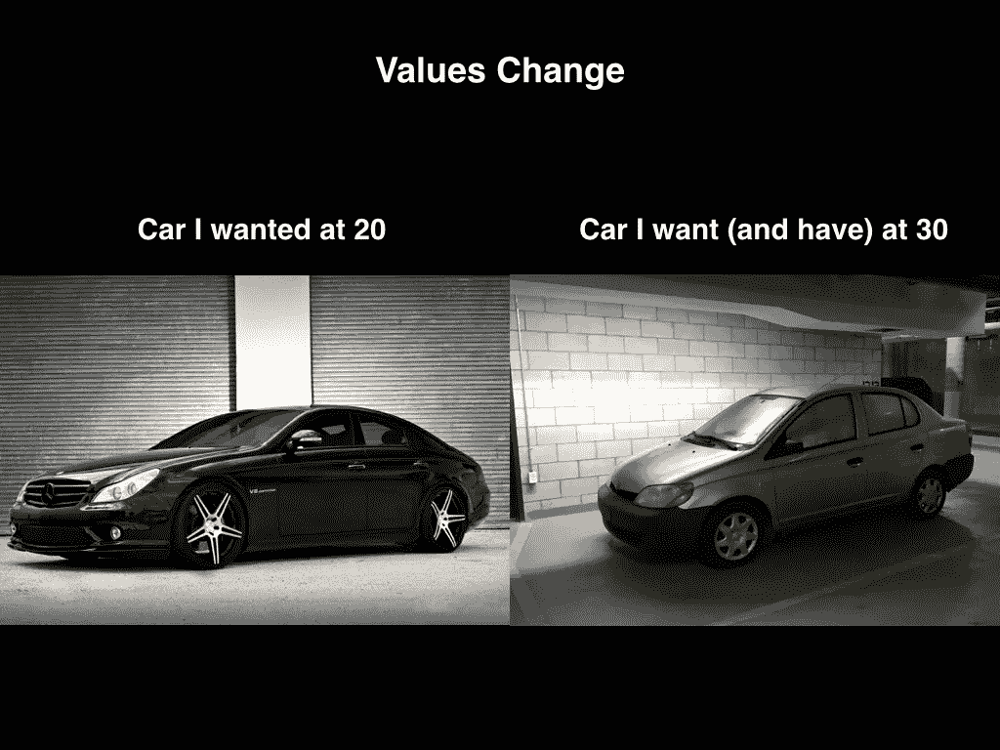

# 海报行动:为什么我没有写下我们公司的价值观

> 原文：<https://medium.com/swlh/why-i-never-wrote-down-our-company-values-8143520497e8>

我一直认为贴在墙上的公司价值观很俗气。

我一直不明白，为什么有些公司会在大厅里贴满“诚信”或“创新”等陈旧的公司词汇的带框海报。

除了这些陈词滥调之外，该公司的行为往往不符合这些价值观。

那么在公共场合展示它们有什么好处呢？

# 第一个问题:价值观在演变

另一件困扰我公开写下价值观的事情是它看起来太死板了。

根据定义，价值观是指导你行为的不可动摇的原则。他们是你所相信和捍卫的。

但是如果你的价值观改变了呢？

如果我公开写下我的价值观——写在广告牌、油画、保险杠贴纸或其他东西上——当我的世界观改变时会发生什么？如果我想改变我的价值观，我不想看起来像个骗子。然而，传播我的价值观，然后改变它们，看起来好像我要食言了。

我明白某些价值观可能比其他价值观更难改变。我今天相信的一些原则是我一生都相信的，我从来没有看到过改变。(例如，当我们创办 Crew 时，我们写下了一份[宣言](https://crew.co/manifesto)来表达我们的目标，这些原则今天仍然适用)。

但是，我今天相信了许多其他的事情，这些事情甚至在几年前我还不相信。

当我 20 岁的时候，我想要一辆好车，一栋大房子，和一个 MBA。

差不多十年后的今天，我和妻子的小弟弟共用一辆 200 美元的汽车，我有一个一居室，我不想去任何接近 MBA 的地方。

如果我强迫自己坚持十年前的价值观，也许我会有更好的房子、车和高薪工作。但是我也可能有一份不错的抵押贷款，学生贷款，做着我现在一半都不喜欢的工作。

我的价值观变得更有利于没有学生贷款，有一个我能负担得起的房子，和我喜欢的工作。

现在，对于一家公司来说，你正在围绕几个“核心价值观”召集一大群人，改变这些信念就更难了，即使你认为这是正确的做法。

我是人生游戏中的菜鸟。在商业游戏中我是一个新手。不管我认为我知道多少，我真的知道的不多。

事情变化太快了。一切都是相连的，信息在几秒钟内传播到任何地方的任何人。十年前，你今天所知道的可能足以让你在接下来的十年里继续比赛。今天，你将在两年内被淘汰。

如果我们对自己认为了解的东西过于自信，我们就会让自己失败。今天生存的唯一方法就是不断学习。这意味着不断进化。

# 如果你不坚持某些东西，你就会被所有东西绊倒:墙上的价值观应该做什么

当我创办一家公司时，我从创始人和投资者那里听到最多的一句话是，

“如果你不从第一天开始就写下你的价值观，你就完了。”

我明白了。拥有价值观对于建立一个持久健康的公司非常重要。正如[公司 2014 年年度公司](http://www.inc.com/magazine/201412/burt-helm/airbnb-company-of-the-year-2014.html)的首席执行官布莱恩·切斯基所说，

> "如果你破坏了文化，你就破坏了创造你产品的机器."

写下价值应该带来清晰。提醒你作为一家公司的信念，这样使你的公司成为现在这个样子的东西(如文化)就不会被搞乱。

正如广告界的一句老话所说，有人需要见你七次才能记住你并购买你的产品。尽管七次的具体次数一直在争论，但是有证据表明重复能够传递信息。

即使看到贴在墙上的价值观可能是一个很好的提醒，写下价值观对我来说仍然感觉很奇怪。

> 如果你不得不写下你的价值观，这可能意味着你没有很好地坚持你的价值观，或者有“经验”的人告诉你把它们写下来是个好主意。

如果你的行为与你所说的价值观不一致，你可能会寻找一个快速的解决方案来坚持下去。

我知道这一点，因为这是我做的。

我最近写下了我的个人价值观，因为我没有很好地遵循它们。我说我的价值观首先是家庭，然后是健康，然后是工作。

然而，我的行动并不一致。我的时间表被工作排得满满的，几乎没有给家人留下任何空间，也没有准备一顿健康的饭菜、进行体育锻炼或充足的睡眠。

因为我很难坚持我的价值观，所以我认为把它们写下来是我可以尝试重新编程我的大脑的事情。

我把我的价值观写在我的电脑上，我大部分时间都花在电脑上，提醒自己通过我的价值观的镜头来做每一个决定。

*家庭、健康、工作。*

*家庭、健康、工作。*

来吧大脑。

两个星期以来，我一直保留着那份价值观清单。最终，我开始根据这些价值观自动过滤我的决定。

如果我在去健身房和完成更多工作之间做出选择，我从眼角看到了我的价值观，我的决定变得显而易见。如果那天我没有做任何体育活动，我就去健身房了。

所以写下价值对我来说是一个有用的提醒。

但是写下价值观仍然需要我改变的动机和行动的支持。

# 行动比海报更重要

当我们开始我们的公司时，我不觉得我们需要把我们的价值观挂在墙上，甚至不需要说出它们是什么。

我们的行为表明了我们的价值观。我们作为一个四人团队工作了两年。数百个项目之后，我们对自己的价值观有了一种与生俱来的理解。我们不需要说它们是什么。

刚刚成功了。

一段时间。

现在，我们进入了第三年，我们的团队已经从四人发展到了二十五人。我开始理解为什么公司觉得有必要写下他们的价值观，即使这看起来很俗气。

要明确的是，我并不是说把价值观写在墙上就是解决方案。我是说我理解。

当你们四个人一起为每个项目工作时，更容易坚持价值观。但是当你有多个项目在运行时，就很难保证所有的事情都在相同的价值观下运行。

这是为什么呢？

你雇佣的人不应该在你的公司价值观范围内运作吗？

当然，我们的队友与我们的价值观产生共鸣。他们通过我们创造的东西和我们的行为来感受它们。这是我们最初互相吸引的原因。

就像在任何良好的关系中一样，吸引力只是维系关系的一部分。

坚持价值观的挑战来自于现实生活。当我们遇到最后期限和期望时，我们说我们相信的事情会发生什么？

写下或谈论一套价值观很容易，但面对行动时你如何坚持这些价值观是对你认为重要的东西的最大考验。正如传奇拳王迈克·泰森所说:

> "每个人都有一个计划，直到他们被打了一拳."

当有人和泰森站在拳击台上时，他们已经有了计划。他们带着这个计划训练了几个月。但是当这个计划遇到现实(也就是泰森的右勾拳)时，它就难以为继了。泰森在他的职业生涯中赢得了 56 场比赛中的 50 场——几乎淘汰了 10 个对手中的 8 个(所有这些对手可能都有一个很好的计划)。

写下价值观并说你相信它们是很容易的。但是一旦你进入拳击场，当你的脸被打了一拳时，跟踪他们就困难多了。

产品特写今晚就该到了。我知道我们说过质量很重要，但由于截止日期很紧，所以让我们现在就做好我们所拥有的，即使它不是最好的。

那封电子邮件活动将帮助我们成长，所以让我们把它发给每一个人，即使他们还没有说他们接受它。

根据你的价值观，这些决定可能适合你。如果你把成长和按时完成看得比什么都重要，那么这些行动对你来说是很重要的。

但是，如果你想要成长，想要项目按时交付，但是你也重视高标准的质量，并且你不认为给没有要求的人发电子邮件是正确的，那该怎么办呢？

这是一个更艰难的决定。但是很常见。

走廊上的巨大话语可能是一个有用的提醒，提醒你希望 T1 如何行动。但是在这种情况下，仅仅提醒还不足以做出正确的决定。

# 我们如何践行我们的价值观

有多少人或公司说他们重视你的意见，但你觉得他们实际上并不重视？

有多少人说家庭是他们的第一要务，但他们的行动却从来没有做到这一点？

到目前为止，你传达对你来说很重要的价值观的最好方式是通过你的行动。

# 从你开始

如果你是公司的创始人或领导，你做的每一个动作都在暗示你的队友公司的价值观是什么。

正如亚马逊 2013 年最佳书籍 [*的作者 Scott Berkun【无裤日】*](http://www.amazon.com/gp/product/1118660633/?tag=scottberkunco-20)[所说](http://scottberkun.com/2014/critique-dont-fuck-up-culture/)，

> “大多数人类文化依靠领导者来定义、修改和强化群体的行为和信仰。
> 
> 这意味着首席执行官或创始人在文化方面拥有巨大的权力。他们是唯一能够:
> 
> 解雇任何人
> 雇用任何人
> 决定如何/为什么奖励人们
> 决定如何/为什么惩罚人们
> 
> 最有能力搞乱文化的人就是最有权力的人。"

新队友将会寻求现有队友的帮助来定义价值观。而现有队友会把目光投向更久的现有队友。

因此，帮助团队理解价值观并按照价值观行事的最大责任落在了那些最有权力的人身上。

无论我喜欢与否，作为创始人兼首席执行官，我如何通过我采取的每一个行动来维护价值观，最终将对我们团队如何践行我们的价值观产生最大的影响。

如果你的价值观之一是“超越客户服务”,我需要在每次做事情时展示“超越”是什么样子。如果客户给我发邮件，我回复的速度向我的团队展示了“超越”的含义。如果我在几分钟内回复，那就意味着几分钟等于“超越客户服务”。如果我在几天后回复，当我的队友面临类似情况时，他们会认为这是正确的行为。

你所做的行动会比你在墙上写的任何话都更耀眼。

# 练习疼痛

一旦你的队友看到你如何在棘手的情况下坚持价值观，他们学习的最好方法就是感受到在艰难的权衡中做出决定的痛苦。

在不确定性的裂缝和边缘有痛苦。痛苦是难忘的。如果你想让价值观坚持下去，每个人都需要经历和你一样的艰难处境，并做出自己的选择。

不会出现每个人都立刻把每一个决策都钉得完美符合你公司价值观的情况。但是你的队友需要遇到和你一样的岔路口，为自己做决定。

如果他们选择了错误的方式，你可以帮助引导他们正确的方式。如果他们选择了正确的方式，很好。祝贺他们，并重复一百次。

# 作为提示发布的值:最后 10%

也许贴在墙上的价值观可以作为一种提醒。但我不相信这实际上会产生多大的影响。

理论上只能理解这么多。如果你参加商业 101 课程，你将不会知道如何建立一个成功的公司，相比之下，如果你自己创业。

做一件事比在书上或海报上读到它至少要有十倍的价值。

我亲眼看到提醒会有所帮助，但它本身不会起作用。

# 你有进化的权利

如果你决定展示你的价值观，那就表明它们是可以发展的。

更好的是，让不断学习成为你的价值观之一。

这并不是说一旦你处在一个很难坚持的情况下，你就应该立即放弃一个价值观。但是如果你已经决定有一个更好的方法，那么你应该能够毫无愧疚地进化。

但是不要在不清楚原因的情况下做出改变。这看起来像是浪费时间，但是让你的团队参与到修改一个值或者创建一个新值的决策中来，对每个人来说都是学习过程中重要的一部分。

公司会改变。通常，这种变化对于公司在不断发展的世界中继续走向成功是必要的。

正如 Berkun 指出的，

> “如今，没有哪家公司的文化与 10 年、20 年或 100 年前的相同。当文化从诞生，到不成熟的成功，再到完全成熟(当然，绝大多数公司甚至在青春期到来之前就已经死亡)时，它们往往会发生巨大的变化。研究一下惠普、福特、IBM、微软，甚至谷歌和脸书的历史，这个观察结果就显现出来了……问问离开一家成功公司的前十名员工，他们为什么离开，很多人会回答‘公司变了’。这很好:它可能需要改变才能继续成功。”

如果你把自己的价值观写在墙上，人们可能会看到，但不会完全理解。我的所作所为会影响我的联合创始人的所作所为，进而影响我们团队领导的所作所为，进而影响我们所有队友的所作所为。

对我的团队来说，没有什么比我始终如一地按照我认为的价值观行事更有帮助的了。

我可以把我们的价值观写下来作为一个提醒，但是如果没有行动，尤其是我的行动，这是没有用的。

**我们团队的更多帖子:**

[乔里·麦凯](https://medium.com/u/bf57aec93129?source=post_page-----8143520497e8--------------------------------)——*编辑*

 [## 你过去的经历蒙蔽了你的双眼

### 如何退一步不带偏见或判断地看待这个世界

medium.com](/p/bd3902b762e6) 

[米凯尔·乔](https://medium.com/u/300c728e7d24?source=post_page-----8143520497e8--------------------------------) — *首席执行官*

 [## 咖啡与啤酒:哪种饮料让你更有创造力？

### 我不知道我今天要写什么。

medium.com](/p/f7fcb3b786b1) 

[百吉饼男孩](https://medium.com/u/babef0a7f1f0?source=post_page-----8143520497e8--------------------------------) — *作家*

 [## 史努比狗狗营销

### 当我放弃“皮蒂·巴勃罗”、“神秘卡尔”或“杰梅因·杜普利”时，我想到了什么？如果你的答案是“没什么”，继续阅读。

medium.com](/p/b08fd5437a0b) 

[阿里梅氏](https://medium.com/u/d43c46db5b92?source=post_page-----8143520497e8--------------------------------) — *生长*

 [## 为了我的创业梦想而辞去公司工作是如何让我的生活一团糟的

### 还有五个问题，我希望一开始就问自己

medium.com](/p/3b6b3e29b318) 

形象信用:[穆罕默德·法伊兹](https://unsplash.com/muhammedfayiz)

*原为发表于*[*blog.crew.co*](http://blog.crew.co/company-values/)*。*