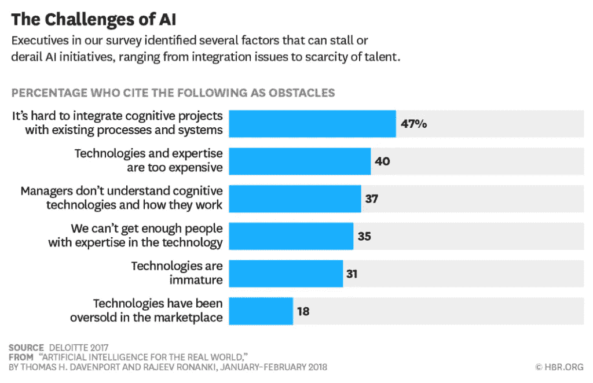
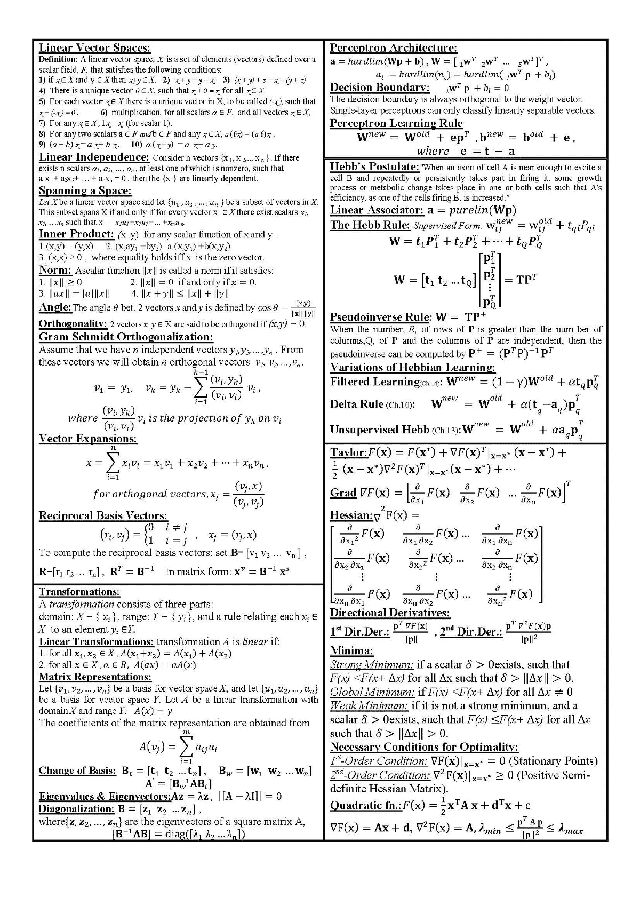

# 为什么我辞职去推动人工智能和机器学习的民主化

> 原文：<https://medium.com/swlh/why-i-quit-my-job-to-go-democratize-ai-and-machine-learning-196384546e9d>

当集成一个简单的功能需要一个月又一个月的时间时，我意识到当前机器学习的可用性有问题。我们使用云供应商的机器学习即服务(MLaaS)API 来执行一些简单的人脸识别。尽管 API 或多或少是简单明了的，但是它们的实际使用需要一些非常复杂的工作流程。我们做的实验越多，我们的云账单就越大。

当这不起作用时，我们四处寻找其他我们可能更有控制权的机器学习模型。我们发现的是几乎没有编译的代码，没有内置的可部署性或可伸缩性。此外，你不能训练他们或提高他们。与我们之前尝试与云提供商合作相比，我们需要做更多的工作来使它们集成和交付。

我很清楚，人工智能需要经历一轮民主化，才能真正改变世界。

作为软件领域的企业家，我知道能够快速交付产品的重要性。当你在构建一个应用、平台、网络服务、新功能(任何东西)时，你需要能够在相对较短的时间内交付一个解决问题的产品或解决方案。

快速对每个公司的意义各不相同，重要的是要指出快速并不意味着在质量上妥协。这意味着无论你交付什么样的解决方案，都只能解决一个问题(而不是所有问题)。

今天的开发人员正在完成非凡的事情，而且他们是以精益、吝啬、敏捷的方式完成的。他们的秘诀之一是尽可能避免重新发明轮子。他们能够做到这一点的原因是，许多超级强大的技术，如搜索引擎和消息队列，已经变得大众化。该技术的复杂部分已经被抽象掉，通常在一些 API 之后，开发人员可以专注于提供价值，而不是试图从头开始构建搜索引擎。

所以我辞职加入[机器盒子](https://goo.gl/f3apAU)做同样的机器学习。

## 为什么要让机器学习大众化？

机器学习可以做一些不可思议的事情；[帮助打击假新闻](https://towardsdatascience.com/i-trained-fake-news-detection-ai-with-95-accuracy-and-almost-went-crazy-d10589aa57c?source=user_profile---------21----------------)、[提供更便捷的设备认证方式](https://blog.machinebox.io/face-verify-js-monitoring-who-is-looking-at-a-website-for-additional-security-1d6025a8fedd?source=collection_home---4------4----------------)，节省搜索时间……不胜枚举。我们都从这些能力中受益，但机器学习仍然很难实现。

作为一名产品所有者、业务战略家和业余开发人员，我尝试过自己构建、培训、集成和部署机器学习(或领导开发团队做同样的事情)，以下是我所学到的。

[https://becominghuman.ai/cheat-sheets-for-ai-neural-networks-machine-learning-deep-learning-big-data-678c51b4b463](https://becominghuman.ai/cheat-sheets-for-ai-neural-networks-machine-learning-deep-learning-big-data-678c51b4b463)

为了在不使用现有工具的情况下成功地将人工智能集成到业务中，你需要知道 K 均值聚类算法和神经网络之间区别的专业人员。他们必须考虑精确度和召回率，了解不同机器学习算法的最新研究，并能够使用像 [Keras](https://keras.io/) 和 [Tensorflow](https://www.tensorflow.org/) 这样的工具。

假设他们知道这一点，那么他们就需要考虑训练数据，如何收集数据，如何清理数据，以及如何对数据进行实验。

训练是机器学习最难的部分。[我花了数百个小时令人沮丧地尝试和失败](https://towardsdatascience.com/i-trained-fake-news-detection-ai-with-95-accuracy-and-almost-went-crazy-d10589aa57c?source=user_profile---------21----------------)来开发有意义的数据集来训练模型(同时积累了大量的云账单)。

一旦分类完成，你就需要把它全部交给一个独立的专家小组，他们可以集成、部署和扩展模型。

这整个过程并没有让创新变得容易。想要让医生更容易找到你的相关病史的企业，或者试图清除 Twitter 机器人的初创公司，将不得不花费大量时间和金钱来解决所有这些基本问题。

我希望开发人员能够直接投入进来，用强大的工具解决问题，抽象出所有的复杂性，这样他们就不必回到学校去获得统计学硕士学位。我想让你在不倾家荡产的情况下，经历大量的反复试验，让训练集的收集过程尽可能顺利。当我们想要整合强大的搜索时，我们使用 [ElasticSearch](https://www.elastic.co/) 。当我们想要抓取新闻文章并嵌入特定元素时，我们使用[嵌入](http://embed.ly/)。当我们要处理来自世界各地的信用卡时，我们使用[条纹](https://stripe.com)。而现在，当我们想要使用机器学习时，我们使用[机器盒子](https://goo.gl/f3apAU)。

## 站在巨人的肩上

当今技术的总体进步是由抽象推动的。我们给自己越来越强大的工具来解决越来越复杂的问题。当 COBOL 在 1952 年被发明时，它抽象了机器代码，所以我们可以用文字而不是数字来编程。[操作系统](http://www.apple.com)抽象命令行接口， [Oracle](http://www.oracle.com) 抽象存储大量数据，等等。

抽象技术帮助我们构建下一次技术革命，然后反过来又被抽象以支持下一次革命。

机器学习只是这个逻辑进程的一部分。借助微软认知服务、谷歌视觉和亚马逊 Rekognition 等工具，开发人员可以开始与这些强大的功能进行交互。在 [Machine Box](https://goo.gl/f3apAU) ，我们更进一步，让您在自己的基础设施上管理和培训自己的模型，有效地赋予您所有的权力。最棒的是，你不需要了解任何关于机器学习的知识。你只需要理解你试图解决的问题(以及如何发布到一个 API)。

## 解决我自己的问题

今天，我有一些客户正在努力集成人工智能，因为它要么太贵，要么太难集成，或者两者兼而有之。他们告诉我，[机器箱](https://goo.gl/f3apAU)每月为他们节省数万美元，或者如果没有我们的工具，他们甚至无法起飞。这就是为什么我辞去工作，投身于初创公司的受虐世界是值得的。它让我每天早上起床，激励我坚持做我正在做的事情，并继续推动人工智能的民主化。

## 这个故事发表在[的创业](https://medium.com/swlh)上，这是 Medium 最大的创业刊物，有 308，471+人关注。

## 订阅接收[我们的头条新闻](http://growthsupply.com/the-startup-newsletter/)。

