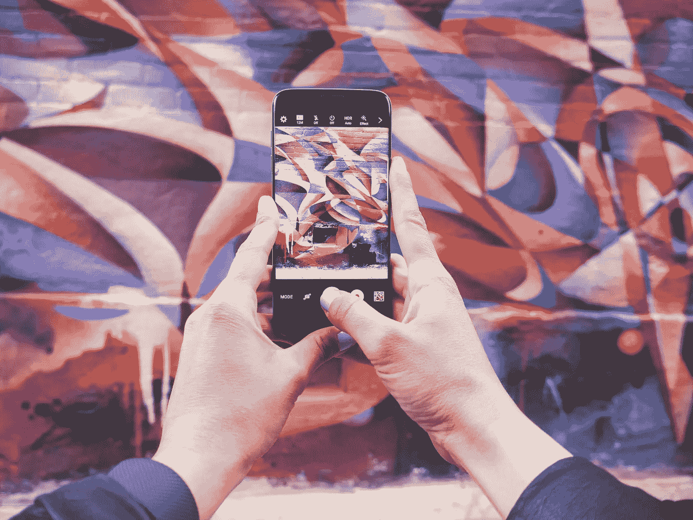
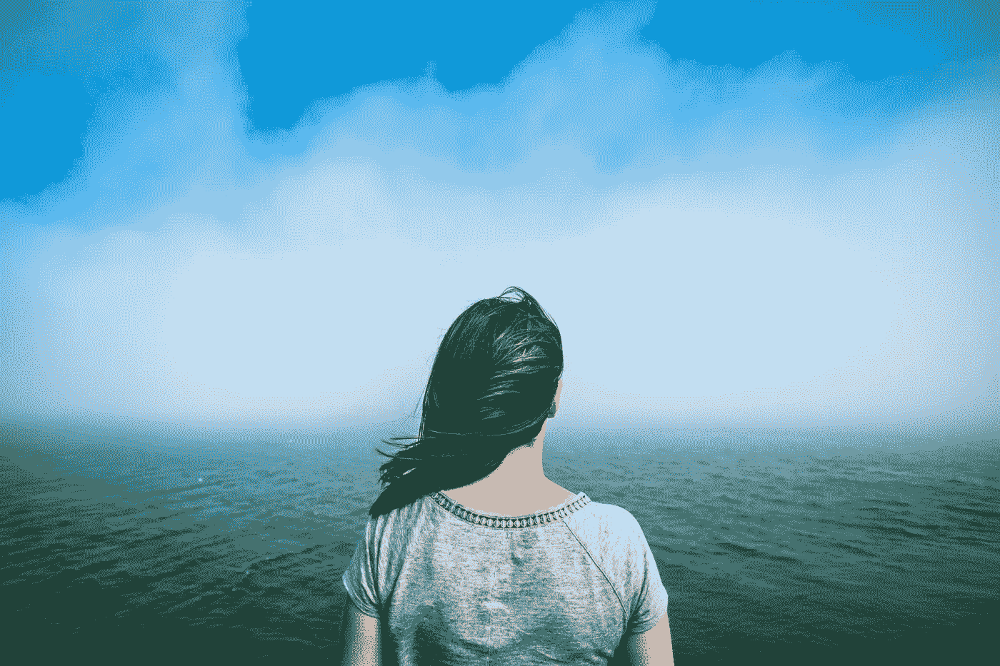
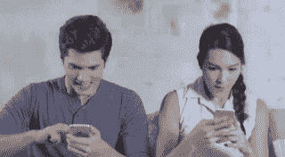

# 为什么我推荐 5 天社交媒体排毒

> 原文：<https://medium.com/swlh/why-i-recommend-a-5-day-social-media-detox-d84c991e4476>

Photo by [Patrick Tomasso](https://unsplash.com/photos/KGcLJwIYiac?utm_source=unsplash&utm_medium=referral&utm_content=creditCopyText) on [Unsplash](https://unsplash.com/?utm_source=unsplash&utm_medium=referral&utm_content=creditCopyText)

由于五天听起来并不像是一个极端的实验，我并不指望在此期间获得许多灵光乍现的时刻——但我错了。根据我自己的经验和最近关于压力的研究，我强烈建议偶尔离开社交媒体。

[这就是激励我尝试的原因](/inmehealth/giving-up-facebook-reduces-stress-a-new-study-says-challenge-accepted-d1659af06f4a)，以下是我 5 天社交媒体禁令的结果:

# 我更有效率了

离开社交媒体一段时间感觉像是在争取更多的时间。我有更多的时间和时间可以利用。

> 当我没有随便浏览和花时间的时候，我就把事情做完了。

这个实验中我最喜欢的一部分是我终于找到了更多的时间来阅读。我一直梦想着读更多的书，但我一直在努力为它腾出足够的时间。

忽视社交媒体达到了目的，因此我的书上的一层灰尘消失了。

# 我感觉压力减轻了

更少的干扰，更少的混乱，更少的自我观察[压力](/inmehealth/little-known-facts-about-stress-6a71f5b02ea5)。更多的内心平静，更多的宁静。

研究人员是对的，放弃脸书似乎可以减轻压力。

# 我拿起手机的时候是自动驾驶的

令我惊讶的是，我经常很自然地接触到我的手机，直到我已经在点击屏幕时才完全意识到。每次我发现自己在自动驾驶仪上抓起电话，我要么累了，要么精神上被工作困住了，需要从我的思想中休息一下。

**然而，考虑到工作效率，这并不是最好的休息方式。现在，当我觉得有点累的时候，我会打个盹或者呼吸点新鲜空气，而不是打电话。意识到自己的行为会更容易管理。**

# 我用社交媒体取代了寂静

我必须承认，“言出必行”在这个问题上并不完全正确。我写过[敲打你的手机，拥抱寂静](/inmehealth/5-tips-to-beat-your-phone-962980dc5039)，然而，我发现自己用手机的喧嚣打破了寂静！*哦，自我实现了。*

(再次)提醒自己:

> 让你的思想自由遨游。你不需要所有的杂物。

Photo by [Tim Foster](https://unsplash.com/photos/xyGfJ2cKCl4?utm_source=unsplash&utm_medium=referral&utm_content=creditCopyText) on [Unsplash](https://unsplash.com/?utm_source=unsplash&utm_medium=referral&utm_content=creditCopyText)

# 我更了解自己了

启发我做实验的研究在参与者身上发现了一个奇怪的结果:尽管他们的压力水平因脸书禁令而下降，但他们的生活满意度也下降了。他们觉得自己错过了什么。

即使我在怀疑，类似的事情也发生在我身上。第四天，我开始怀念社交媒体。我的心里嘀咕着，一定有什么有趣的事情在发生，而[我渴望着对通知的期待在大脑中产生的甜蜜的小多巴胺爆发。](https://www.psychologytoday.com/us/blog/brain-wise/201209/why-were-all-addicted-texts-twitter-and-google)

当你了解多巴胺时，它是一种非常迷人的荷尔蒙。当你兴奋地等待回复或通知时，你可以感觉到它在起作用。**有趣的是，与最终获得奖励相比，期待奖励期间的多巴胺水平甚至更高******。****

****

**这就是为什么看到应用程序图标上的数字可能比实际打开它并看到通知感觉更好！理解我们感觉背后的原因有助于我们管理它们。**

# **实验后我用得少了**

**排毒棒极了。**我现在对自己的行为更加自觉，我不再在没有完全意识到的情况下使用社交媒体，我学会了适度使用。事实上，在这个实验之前，我甚至没有意识到我在手机上浏览了多少。****

**现在已经一个多星期了，还能看到结果。多读书，提高效率，减轻压力。**

> **我可以控制自己的时间。**

**不要误会我的意思，我仍然喜欢社交媒体，我不会去任何地方。最好的情况下，它是灵感的源泉，是寻找激动人心的新闻和文章的平台，也是与朋友交流的方式。但是我更喜欢坐在驾驶座上。**

**你有没有尝试过休息一下？你觉得你能控制你的手机使用吗？听听你的经历会很有趣。**

> ****感谢阅读！****
> 
> **如果你喜欢读这篇文章，你会在[我的简介](/@henna.haapanen)和 [INME 健康刊物](https://medium.com/inmehealth)上找到更多关于健康和压力的文章。哦，几下掌声让我总是很开心！随意评论、讨论或反对——互动是学习发生的地方。**

**[**关于压力的鲜为人知的事实**](/inmehealth/little-known-facts-about-stress-6a71f5b02ea5)****往期******

******一项新的研究称，我所指的故事 **→** [**放弃脸书可以减轻压力。接受挑战！**](/inmehealth/giving-up-facebook-reduces-stress-a-new-study-says-challenge-accepted-d1659af06f4a)******

********

## ****这个故事发表在 [The Startup](https://medium.com/swlh) 上，这是 Medium 最大的创业刊物，拥有 317，238+人关注。****

## ****在这里订阅接收[我们的头条新闻](http://growthsupply.com/the-startup-newsletter/)。****

********