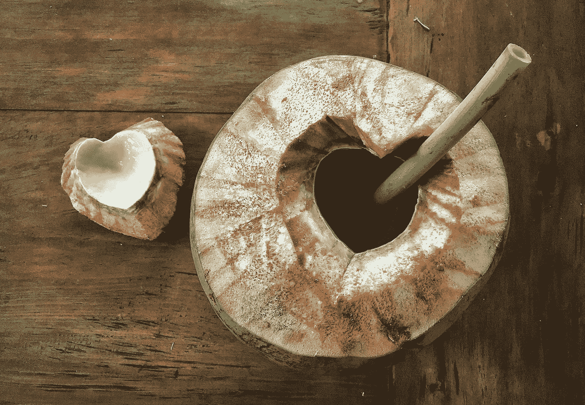
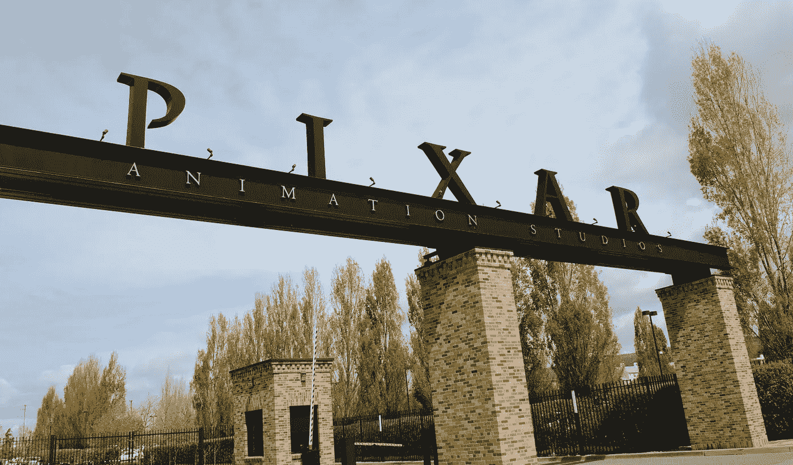
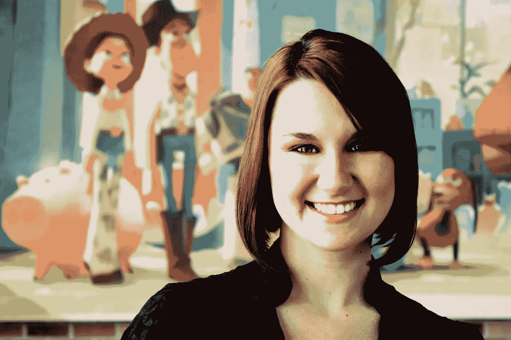
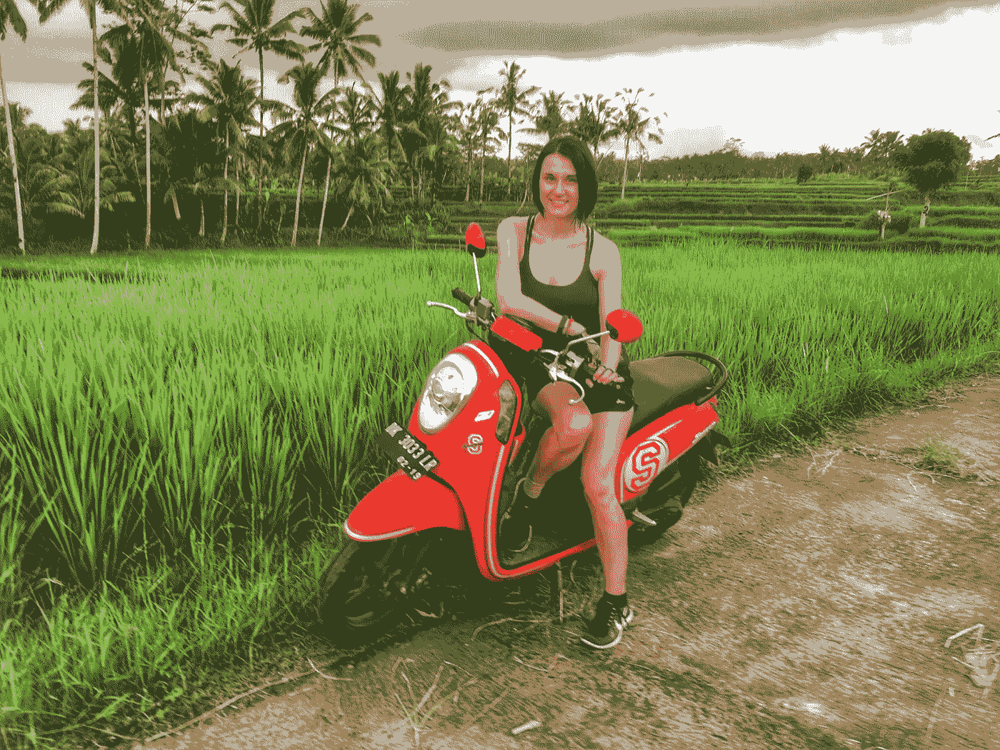
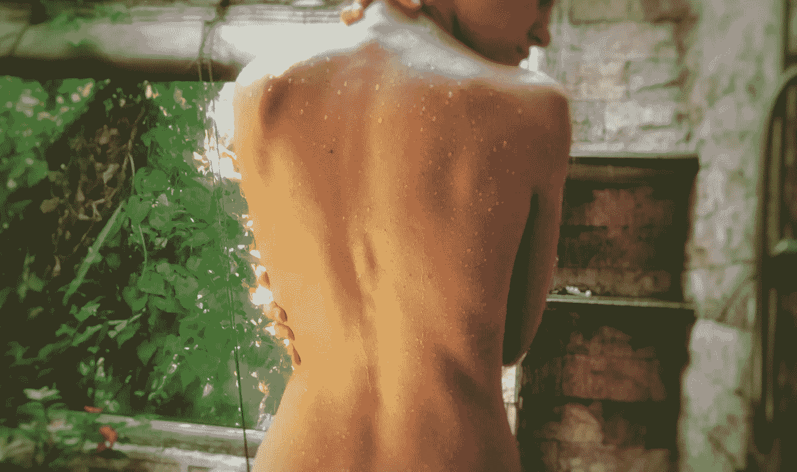

# 为什么我放弃了我的大事业去远行

> 原文：<https://medium.com/swlh/why-i-scrapped-my-big-career-for-the-long-journey-34ad670eecd9>

Fresh coconut, Yoga Barn, Ubud, Bali.

26 岁时，我在皮克斯公司找到了我梦想中的平面设计师工作。

该死的皮克斯。

拿着那封录取通知书，就像整个世界都在我的指尖，但那时我的手疼得发烫，几乎不能动弹。

十年前——那时我 15 岁，比夏天的阿巴拉契亚山还要绿——“理想工作”这个词意味着我在收拾老人的盘子时，可以得到额外的小费来忍受他们的猥亵评论。

我已经走了很长一段路。

自从我六岁时看了《小美人鱼》后，我就想从事动画工作——在我居住的宾夕法尼亚州西部小镇蓝领阶层，这个梦想通常会引起笑声和惊讶。但我还是听从了奶奶的建议。

“如果你努力工作，一切皆有可能，”她说。“在我那个时代，我们女孩子只有一个选择:结婚，成为家庭主妇，抚养孩子。但你可以做得更多——所以去争取吧。”

到高中毕业的时候，我已经换了很多尿布，唱了数百首露营歌曲，在无数的桌子上等待着，为我的大梦想填充我的银行账户。当我在一所昂贵的私立大学申请贷款并花光了我的第一笔学费支票时，镇上的人说我这辈子都会负债累累。

有那么几个瞬间，我觉得我不得不夹着尾巴拖着脚步回家，就像一只输给了拉布拉多的流浪狗。辍学并转到公立学校或当地的社区大学——我的大多数亲戚坚持认为我属于那里——将是一次没有人会忘记的人生失败。尤其是我。

不，这么严重的腹部撞击是不可能的。

因此，我一直在念叨奶奶的咒语，从不同的角度慢慢地削减我越来越多的学费账单，就像在县集市上雕刻木头一样。大一的时候，我打了四份工，还拿着课本小睡片刻，以保持干净利落的平均绩点。我寄出了大量的个人陈述文章，让自己在大学经济资助办公室里成为了家喻户晓的人物。

像一只在大便池中的鼩鼱一样的狗式划水。我设法让我的鼻子保持在水面上，直到大三的时候，我终于赶上了我的步伐。令我惊讶的是，我的校园邮箱里塞满了大量的录取通知书，当我这次计算所有的数字时，我意识到我获得的奖学金比我家的家庭收入还要多。

几年后，当我接到皮克斯招聘人员的电话时，我已经完成了四次实习，获得了两个学位，并建立了我所知道的最好的设计组合。

“我有个好消息——你被选中参加皮克斯暑期实习了！”她叽叽喳喳，这一次我失去了我的话。我已经撒了一张大网，现在要做一个艰难的选择。

考虑了几天后，我拒绝了迷你苹果公司 Target 总部的一个全职设计职位，转而与皮克斯公司合作。我的家人(又一次)对我的厚颜无耻感到不安，敦促我实际一点，拿稳稳当当的东西。我挂了电话，订了去旧金山的机票，开始收拾行李，前往遥远的异国星球加利福尼亚。

“谢谢你，但我不是来这里看桥的，”当出租车司机提出带我乘船游览金门大桥时，我对他说。“匹兹堡有超过 400 个。带我去皮克斯。”

“你在那里工作吗？”他问道，声音里带着不可否认的兴奋。

“还没有，”我说。周六下午，我站在路边，凝视着巨大的钢梁皮克斯欢迎门，享受着这个地方的宁静，司机耐心地等待着。然后，他带我沿着街道来到一个新的带家具的公寓，在一段时间里，我会用公司的钱把它叫做家。

Pixar front gate, Emeryville, CA.

在为期 10 周的实习期间，我周末溜进办公室，通宵工作，不顾一切地想说服 3D 动画之神留下我。这是我的机会，我不会错过的。

不为任何事。

到了九月，我的重要时刻终于到来了:我被邀请加入皮克斯大家庭。

Pixar headshot, 2010.

但那天离开老板办公室时，我没有跳交谊舞庆祝，而是深吸一口气，穿过校园去见护士。

在整个实习期间，奇怪的刺痛感觉一直贯穿我的上半身。但是现在疼痛持续不断，我不能再忽视它。

“看起来你得了重复性劳损，”护士给我检查后说。

“那是什么意思？”

她用自己的话为我总结了这种神秘的状况，但这里是互联网更正式地描述它的方式:

> 重复性应力损伤描述了上身经历的任何肌肉骨骼慢性疼痛疾病(如腕管综合征或肌腱炎)。这种情况通常是由于在工作场所长时间、高强度地重复使用电脑造成的。

“那我怎么才能让它消失呢？”我问，抑制住喉咙里的恐惧。

“有些人会调整工作习惯，接受治疗并康复，但对其他人来说，这是永久性的。你应该为这两种结果做好准备。”

在接下来的五年里，我向电影界一些最优秀的艺术家和故事讲述者学习，做了许多我引以为豪的工作，在看了五部令人惊叹的故事片后，我的名字出现在了大银幕上。

但是每天都在痛苦中开始和结束。

在一周紧张的工作之后，我的症状经常会突然发作，忽视它就像住在一家夜总会楼上试图睡觉一样。刺痛穿过我的手掌、前臂、肩膀、背部和颈部肌肉，就像偏头痛的激光刺痛。

然后是灼烧感，这类似于我们女性在经期最糟糕的一天的感觉，但内部疼痛的强度可能是五倍，并辐射到你的整个身体。在我情绪最糟糕的时候，即使是最简单的任务——比如起床或穿过房间——也会感觉像是一项巨大的成就。

我看到十几个从业者从西方和东方攻击我的问题。我定期会见皮克斯的人体工程学专家，他为我建造了工作室有史以来最精致的定制工作站之一。我用药物和麻醉贴片减轻疼痛，用夹板固定手腕。我工作时间有限，并攒钱休长时间的无薪假。

对同事和脸书的朋友来说，我是一个成功、快乐的职业女性。但是我最亲近的人看到我喝完一瓶酒，能感觉到我又经历了一个痛苦的不眠之夜——这是常有的事。

28 岁时，负责我工伤赔偿的医生告诉我，我将终身残疾。对此我友好地说，“我不同意。”

在接下来的两年里，我一直在寻找不在保险范围内的替代疗法，所有这些疗法最初都取得了很好的效果，但最终都不可避免地停滞不前。

所以在 31 岁的时候，我决定放弃我梦想中的工作。

“是的，妈妈。你没听错，我要离开皮克斯。”

那天下午，我困惑的母亲带着舌头上的牙印离开了我们的谈话。

我真的不能责怪她。我那个暴躁的 15 岁的自己会指责我因为离开如此轻松的工作而神经不正常。六岁的我会哭的。

与一家被许多人视为动画圣杯的公司分手并不容易。这就像取消了和一个连你坚强的祖母都喜欢的人的订婚。

但最终，我满怀希望地认为，离开老巢(在设计界的地位更高)可能会让我的日子少一些执行，多一些开发大创意，这对我的创造力和身体都有好处。

在接下来的几年里，我在一家很棒的公司担任首席设计师，为一些世界上最知名的品牌设计有趣的创意挑战。但是我的身体状况比以前更差了。2015 年大半年，我卧病在床，而我的新雇主耐心地试图解决我多次缺勤的问题。

所以在 32 岁的时候——在经历了 7 年的痛苦之后——我最终决定放弃我竭尽全力创造的事业。我彻底缩小了规模，把我剩下的生活塞进了一个储藏室，最近开始了环球治愈之旅(最终目的地未知)。

在这里——在开阔的游牧路上——像我这样的故事在亚洲就像劣质摩托车一样常见。

但从全局来看，我仍然是幸运的一员。能够负担得起长期旅行是这个星球上很少有人能够理解的奢侈。虽然我所对抗的疾病威胁到了我的生活，但它并没有威胁到我的生命。

所有这些我都很感激。

在某种程度上，我甚至感激把我从职场高速公路上拉下来的痛苦(只是请不要告诉我以前的雇主或我可怜的母亲我这么说过)。

是的，说我为皮克斯、可口可乐、维萨、谷歌、三星和亚马逊这样的公司工作，会有一种地位和可信度。我在做这些事情的时候学到了很多。但事实是，长时间、高强度地使用这台机器——都是为了一些大公司的利益——让我们许多人感到孤立、不满和崩溃。

Traditional Balinese outdoor shower, Ubud, Bali.

现在，我很感激能够将我的身体健康置于我的职业健康之上。重新定义“理想工作”这个词，意思是除了致力于我的康复之外，没有任何工作可做。

当我踏上环球之旅时，我的使命是休息、重置，给我的身体一个真正的机会去恢复。寻求国际治疗师和教师的智慧和专业知识。最终走上一条更健康、更可持续的职业道路(不管它看起来像什么)和一个新的家。

不像 20 多岁的我，目标导向，A 型喷火，卡珊德拉 3.2 不知道接下来会发生什么。

我没有五年计划。我甚至不能告诉你五个月后我会在哪里。或者五天后。令我母亲极度不安的是，我不能告诉你我要离开多久，也不能告诉你我要去哪里。

但我确定它看起来一点也不像我去过的地方。

**shit-crick: Pittsburghese 指一条据称含有污水径流的小溪或溪流。*

*匹兹堡方言:匹兹堡和宾夕法尼亚西部周围部分地区的许多居民所说的方言。*

更多关于漫长旅程的信息即将发布:

Instagram: @cassandra.smolcic

方形空间:https://cassandra-smolcic.squarespace.com