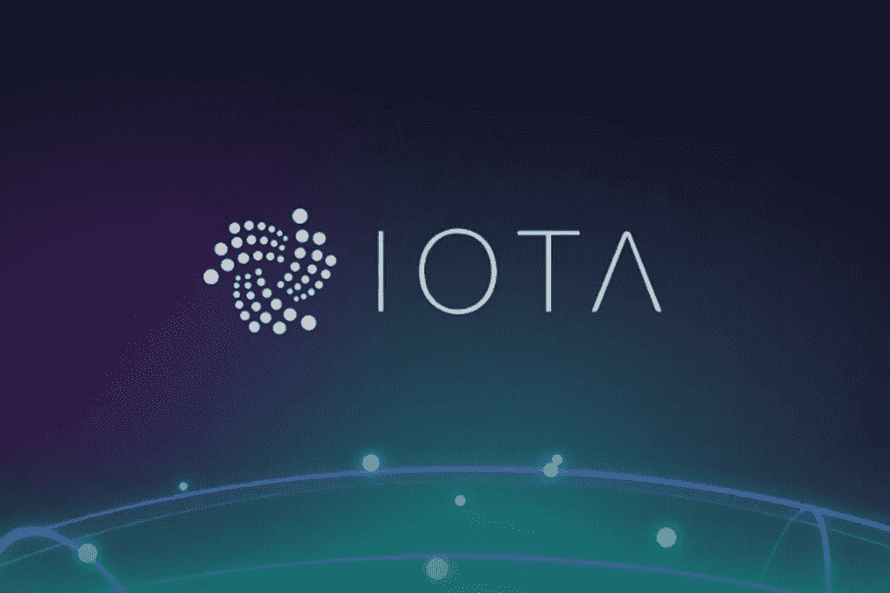
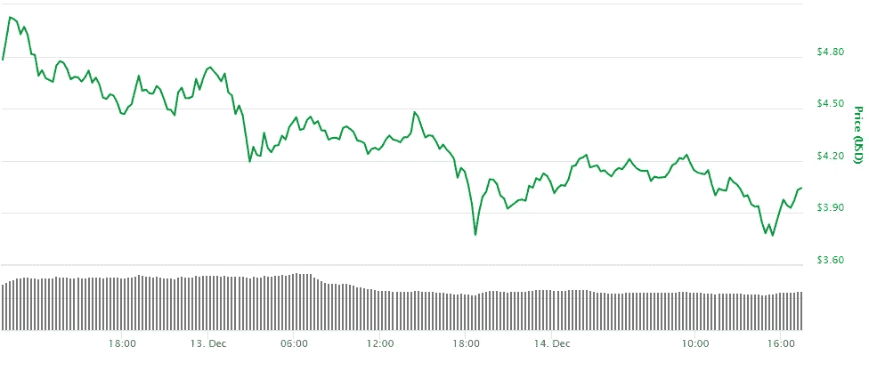
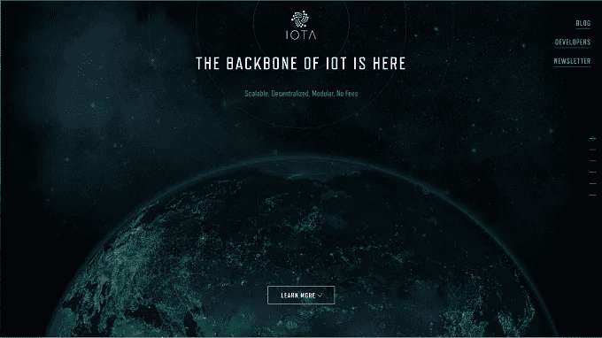
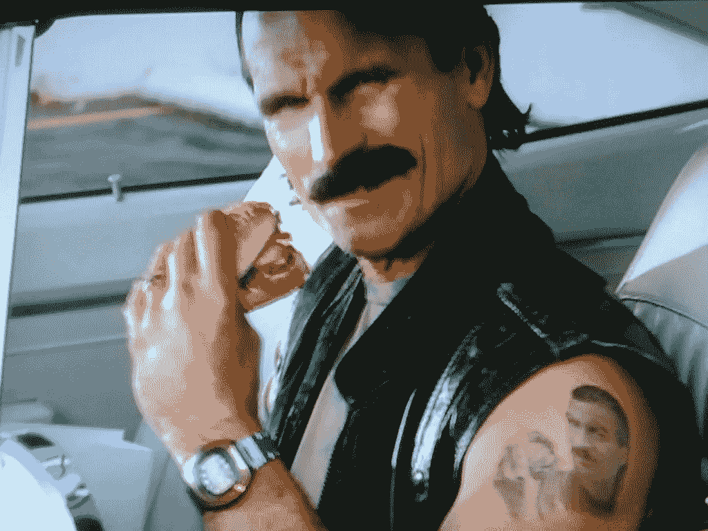
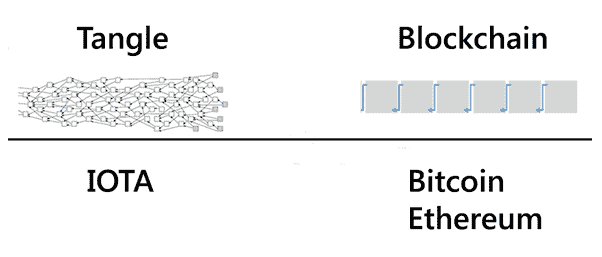
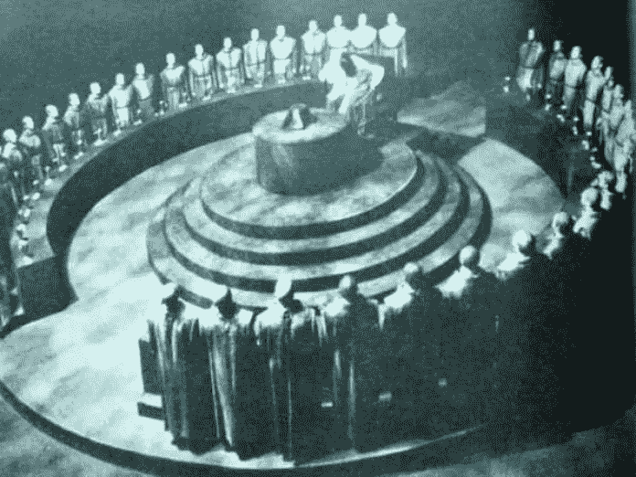
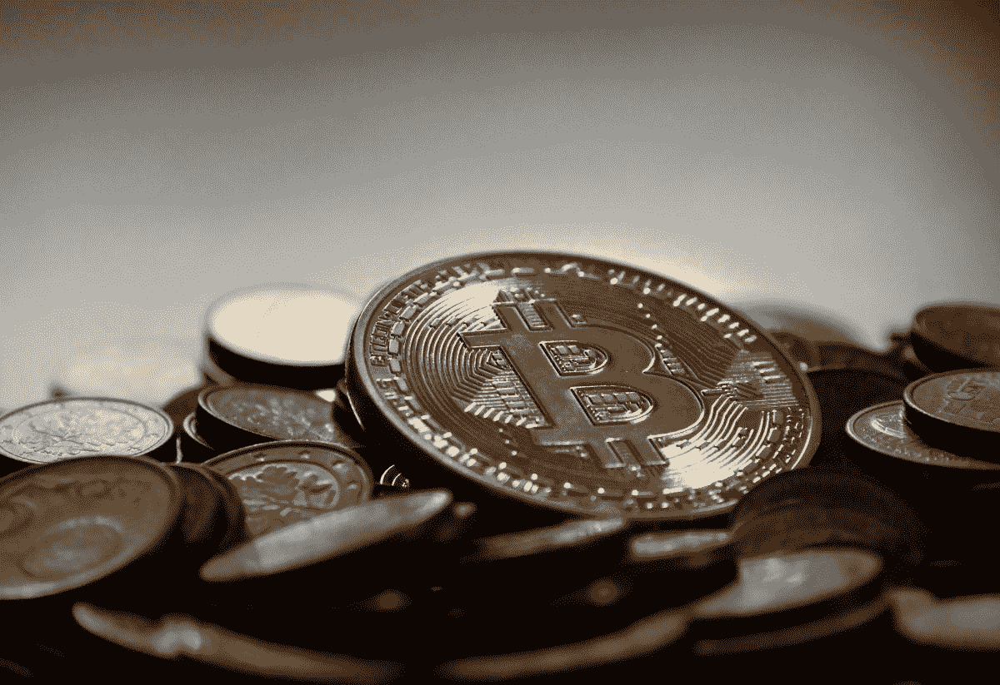

# 为什么我为了 IOTA 卖掉了我所有的比特币？！

> 原文：<https://medium.com/swlh/why-i-sold-all-my-bitcoins-for-iota-ad37aed8e752>

**免责声明**:我不为 IOTA 工作，不过标题挺啰嗦的。

**TL；博士**:我认为 IOTA 是未来，市场营销做得不好，但好的技术是我所指望的。

目前，IOTA 正大幅下滑，可能是因为[微软对所谓的与 IOTA 基金会的“合作关系”的澄清](https://www.cryptocoinsnews.com/iota-price-drops-co-founder-admits-microsoft-not-partner-participant/)——你可能会问，我为什么要购买更多的这种东西？！—我会尽力解释。

This dip doesn’t look so good, does it?

这一切开始于大约 5 个月前，当时我在 coinmarketcap.com 注意到了 IOTA。夜深了，我已经打开了 20 多个标签，寻找“下一件”大事。

这是我看到的:

WOW, such buzzwords, very IOT

我立刻表示怀疑。作为一名开发人员，我厌倦了流行词，我说，“哦，又一个想用流行词偷我钱的该死的硬币，太好了。不错，每个新硬币都有一个很酷的网页设计(我倾向于跑题)…”

就在那里，我和 IOTA 的关系结束了 3 个月。

大约 2 个月前，我和一些朋友去了当地的加密货币聚会，我决定在自动取款机上买一些 BTC。当我站在那里的时候，我遇到了一个人，每个人都称他为酷 IOTA。我很好奇，也许这个人可以解释，我想。

“Cool guy” — [https://www.flickr.com/photos/extra_chrisb/4224090684](https://www.flickr.com/photos/extra_chrisb/4224090684)

原来这个人是 IOTA 的开发者之一。他介绍自己是团队中的开发人员。我想，好吧，也许这个家伙在这方面很投入，所以这可能有一些优点，因为他确实很酷。我问他这是怎么回事，得到了一些像样的答案。在最初快速浏览硬币时，我忽略了一件事，那就是它不收费，也不使用区块链。请注意，费用看起来很糟糕——与 BTC 的一笔小交易收费 7 美元(我知道现在更糟了，但还是很恶心)。

他告诉我，他们正在寻求更多的开发帮助，我应该去看看，于是我就去了。

读了一点相关资料后，我决定买一些，等着看事情的进展。当价格超过 1 美元时，我说，“太好了！是时候做更多的研究了”。我开始阅读关于[的纠结](https://en.wikipedia.org/wiki/IOTA_(technology)#The_Tangle)，IOT 将如何在未来扮演一个角色，以及 IOTA 如何看待自己的未来。我又买了一些。我现在很开心，即使有些地方会有低谷。现在让我解释一下我所学到的。

# 纠结 vs 区块链

**TL；博士**:比特币就像 web 1.0，以太坊就像 web 2.0，而 Tangle 就是 web 3.0，创新的解决方案正等着我们去把握。

在你继续之前，我建议你看看这个关于区块链的视频。

我想以一个大胆的声明开始。它是这样的:**比特币是集中的，IOTA 不是**(同样多，在从协调者过渡之后**)

哇，等一下，伙计！我读到的所有东西都指出，比特币是集中的**德**，你到底为什么这么说？

问得好，区块链利用矿工来维持运转。每一笔交易都需要被验证，而这目前是由大型计算机群来完成的，因为在区块链中施加了[难度](https://en.bitcoin.it/wiki/Difficulty)。这意味着现在有 **6-7 个矿工**(一起工作的矿工群体)持有超过 [**78%的矿权**](https://blockchain.info/pools) (!).

比方说，如果一个最大的资金池决定通过增加交易费用来扰乱网络，从而降低价格，会发生什么？嗯，这有点破坏系统，看看[这个](/@ed_resende/why-are-bitcoin-transaction-fees-so-high-f6dea69e7db7)和[这个](https://www.cryptocoinsnews.com/bitcoin-cash-hashrate-plunges-as-price-mining-profitability-wane/)就知道了。

据说，一些巨大的矿池正在转向比特币现金——可能是因为“现金”分叉的变化对矿商更有利。移动后，比特币网络立即开始变慢，并增加交易费用(需要引文)。对不起，但这让我尖叫:“集中！”

一些大玩家支配网络，这是集权的本质，的确，7 个大玩家比一个银行好，但是，我们可以做得更好。

另一方面，IOTA(具体是 Tangle，IOTA 后面的系统)使用了我认为更好的方法。对于您发送的每笔交易，作为网络参与者的您必须验证 2 笔过去的交易，因此消除了对传统矿工的需要，因为参与网络的每个人基本上都是“矿工”自己。)，均匀分布采矿负载。因为你在帮助网络，你的回报是在发送你自己的交易时不收取**费用**，这多酷啊？！

想了解更多关于纠结的内容吗？

*   [纠结白皮书](https://iota.org/IOTA_Whitepaper.pdf)
*   [初学者的纠结](/@jj1385jeff850527/iota-tangle-introductory-overview-of-white-paper-for-beginners-df9b14882b64)

正如一些人提到的，毫无疑问，目前网络是集中的，但它所支持的技术和未来是分散的(当网络变得足够强大时，没有协调器)。TL；DR“the coordinator”:只是一种临时的安全措施，用于在网络初期保护网络。

# 我们只需要谈论市值

taken from [https://pxhere.com/en/photo/1196883](https://pxhere.com/en/photo/1196883)

在撰写本文时，IOTA 的市值为 109 亿美元，比特币的市值为 2957 亿美元。在我们计算之前，提醒一下:

硬币市值=(硬币价格)X(流通硬币供应量)

这意味着，如果 IOTA 与比特币交换位置，比如说在 2 年内，cryptos 的总市值保持不变(如果你是 crypto 的信徒，它应该会上升)，它应该至少值:

295.7B 美元 10.9B 美元*(IOTA)= 27.12 *[$ 3.92](https://coinmarketcap.com/currencies/iota/#markets)= $**106**(！)

想一想，也许它会达到三分之一，35 美元仍然非常好，特别是如果你现在投资(在 [$3.92](https://coinmarketcap.com/currencies/iota/#markets) )。

顺便说一下，如果你认为比特币将达到 100k 美元，这意味着它的市值将是目前市值的 5 倍左右，大约为:300B * 5 = 1500B。只是为了比较一下纳斯达克上市的最大公司和它们各自的市值——现在这将帮助你做出更好的决定，至少在我看来是这样。

# 我认为需要做出改变

请不要杀我，o'mighty IOTA 创始人/社区，试着思想开放一点:

*   **营销**，看在上帝的份上！我一开始认为这是一枚狗屎硬币的原因之一。这个 IOT 流行语就像流行音乐会上的沙滩球一样被抛来抛去。**更加注重技术**——你有一个成功的产品，为什么不展示出来？无费用，可扩展，**无区块链，**量子耐。这将会吸引人们的注意力，比现在的 IOT 主题网站更吸引人。然后添加关于通过 IOTA 连接 IOT 世界的愿景。但是主要的用例不应该是，**你在限制合伙关系的货币**，首先使它成为第一个可用的硬币。不要误会，IOT 应该是一个核心功能和愿景，这是真棒！我只是不认为这应该是硬币营销的本质。这应该取代比特币的家伙，来吧，让自己更容易。(我知道我要吃屎了，但我就是想帮忙。我与之交谈的大多数人都重复着同样的想法，在我看来，稍微改变一下营销就能创造奇迹)
*   **更好的钱包**，嘘，刚听说他们在搞新的(可能是[这个](/iota-ucl/wallet-refresh-the-case-for-a-desktop-app-8aebaf19520a)？)
*   **智能合约**——我知道在混乱中如何实现这一点存在问题(关于计时？)但这肯定会改变游戏规则！
*   **更好的网络处理**——目前它相当慢而且有问题。
*   **更多交流**
*   **更好的公关—** 听说创始人们都在让自己的日子更难过，看在上帝的份上，请努力成为冷静的家伙，你有一个成功的产品，集中精力，不要在 Reddit trolls 上浪费时间。没有更多的狗屎推特炒作游戏，我们只是想要相关的更新，人们和公司都应该看到项目在一个健康的角度来看它的成功。仅仅押注于技术，即使它很棒，也只能让你走到那一步。**编辑:** [来自 IOTA](https://blog.iota.org/iotas-data-marketplace-setting-the-record-straight-576fbf0b4513) 的回复——对于一个改变来说是相当不错的。
*   尽快离开协调人，按照承诺保持权力下放。**(编辑)**

# 我可能出错的原因

*   也许这种纠结有一些不可修复的内在弱点，因此会导致系统崩溃。
*   营销停滞不前(比如过分强调 IOT？)而人们并没有意识到其中的潜力，直到一枚类似的硬币加入了 Tangle idea 列车并加以利用，抢占了所有的市场。
*   更多的虚假(误导性)新闻，比如微软的合作关系，侵蚀了对团队和硬币的信心。

# 现在怎么办？

嗯，正如我在下面的免责声明中指出的，如果你想投资，你需要自己决定。我只是分享我的想法，而不是建议你买任何东西。

我认为我做了一个好的决定，但正如我指出的，我可能是错的。请注意，现在是时候持有我的硬币至少一年了，因为 IOTA 仍处于测试阶段。我想给它一个发光的机会，让我们希望我在一年后从未来回来时有一个积极的更新！

**免责声明#2** :这是我自己的观点，我不是理财顾问，所以任何投资都要自担风险。我也不隶属于 IOTA 基金会/ IOTA。

**免责声明#3** :由于所有信息都是我自己收集的，我可能会有一些错误的事实，任何更正都将不胜感激。

**更新#1:** [对 IOTA 的误解](/@mistywind/iota-fud-answered-by-a-non-techie-enthusiast-2312325fddb6)

**更新#2:** 与微软的合作并不是完全的合作关系，而是 IOTA 市场的一部分。在这里阅读更多。

**更新#3** :修复了一些错别字和语法。

**更新# 4**:[https://www.media.mit.edu/posts/iota-response/](https://www.media.mit.edu/posts/iota-response/)

**更新#5** : [精彩视频](https://www.youtube.com/watch?v=B37UbzPlSzw)解说 IOTA。

**更新#6** : [精彩阅读 IOTA 背后的系统](https://blog.iota.org/equilibria-in-the-tangle-let-me-try-to-explain-b22ad6f00c13)。协调器今天被关闭了，以显示一切正常，现在又恢复了。

**更新#7** :我的新文章可能对这里的任何初学者有所帮助——[给你奶奶的比特币](/@agammore/bitcoin-for-your-grandmother-446d417b4120)。

*你可以[运行 IOTA 的完整节点](https://iotasupport.com/knowledgebase_gui.shtml)来帮助或尝试在 [github](https://github.com/iotaledger) 中帮助他们。

** " *协调器由 Iota 基金会运营，其主要目的是保护网络，直到它变得足够强大，能够抵御大规模攻击"——https://medium.com/@ercwl/iota-is-centralized-6289246e7b4d*T2

*如果你喜欢这篇文章，请订阅/鼓掌，这会让我开心一天！*

## 这篇文章发表在 [The Startup](https://medium.com/swlh) 上，这是 Medium 最大的创业刊物，有 280，345+人关注。

## 订阅接收[我们的头条新闻](http://growthsupply.com/the-startup-newsletter/)。

