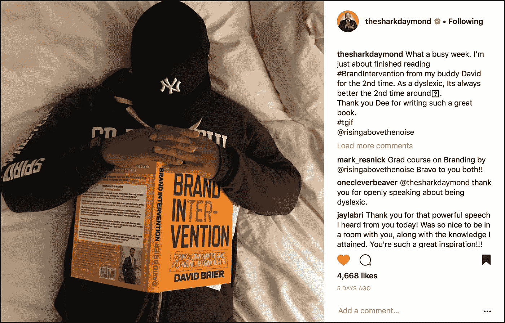

# 为什么我花了两年时间写这本书

> 原文：<https://medium.com/swlh/why-i-spent-2-years-writing-brand-intervention-87827bee68eb>

## 它不是为了吸引眼球，提供只适用于财大气粗的公司或某个精英读者的理论，或者揭露没有直接价值的新行话。不。我是为我们这些准备好要在这个世界上做一些令人惊奇的事情的人写的。

> “你是一场等待发生的革命。这些工具可以让你的品牌被人看到、听到，并准备好改变世界。”大卫·布赖尔

在从事品牌和设计行业 30 多年后，我发现有一些特定的点需要反复与客户沟通。无论是初创企业还是有 115 年历史的公司。没关系。

这些讨论不是为了让他们了解我的“品牌意识”或“设计美学”，而是为了给*提供一个合适的框架*来真正成功地帮助他们定义(或重新定义)他们的品牌。

***毕竟世事多变。***

我的客户需要了解原因。怎么会。以及何时采取行动。

## 没有绒毛。不废话。没有脂肪。

于是，我没有用通常的 12 点字体，而是把我要说的写了出来，没有任何多余的文字。然后为了使它更容易(是的，更美观)，我使用了 36 号字体，这种字体容易阅读，也符合我写作风格的直接性。

反响令人难以置信。

两天之内，它成为亚马逊的畅销书，迄今为止获得了大量的评论，从“**”到“即时经典”，到“ [**关于这个主题的最佳书籍，以及快速阅读的**](https://www.amazon.com/Brand-Intervention-Steps-Transform-Have/product-reviews/0999529706/ref=cm_cr_dp_d_ttl?ie=UTF8&reviewerType=all_reviews&sortBy=recent#R1Q6SZPILSYWRR)**“****”**[**对品牌塑造最有帮助的书籍**](https://www.amazon.com/gp/customer-reviews/R1050ZBGTFUWSD/ref=cm_cr_dp_d_rvw_ttl?ie=UTF8&ASIN=0999529706) **。****

**而年纪较大的读者则兴奋地说“这本书我终于可以不用看‘作弊者’了！”—年轻一代欢迎在页面上看到几个句子，有宾至如归的感觉，因为社交媒体已经训练他们习惯于移动设备上的短句和片段。**

## **一本。四层。**

**[本书](http://a.co/35fs0LV)由四层组成:**

*   ***章节内容***
*   ***贯穿全书的“悬挂海报”系列为读者突出了重要的概念***
*   ***一个精心策划的、文化上流行的铭文集(人们在一本书或一章开始时看到的简短引语)，包括从约翰·列侬到加里·维纳查克到尤达的所有人***
*   ***剧本(书的最后 50 页，展示了我为客户使用的概念。坦率地说，我已经受够了一些高知名度的书籍阐述理论，然后引用其他人的工作作为例子来扩大他们的理论。)***

## **这本书**

**下面是一些跨页，给人一种感觉的内容和风格的书，以及它如何成为一个“声音和风格”和谐的例子。**

****************************************

**除了最终为大大小小的客户提供了 30 多年来所有成功见解的单行本外，Daymond John(他写了前言)在他的 Instagram 账户上分享了这些见解:**

****

**如果你买了一本，我感谢你，我知道你会有新的工具来提升你的品牌。如果你还没有，并想增强你的品牌和你的团队，我邀请你采取行动，并获得这些副本[现在](http://a.co/35fs0LV)。**

**不管怎样，让品牌再次变得伟大吧。**

****

## **这篇文章发表在 [The Startup](https://medium.com/swlh) 上，这是 Medium 最大的创业刊物，拥有 294，522+人关注。**

## **在此订阅接收[我们的头条新闻](http://growthsupply.com/the-startup-newsletter/)。**

****