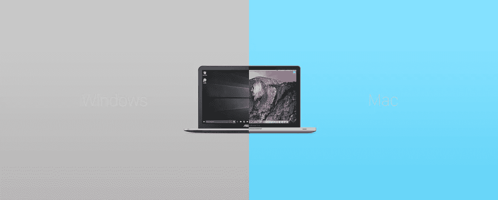
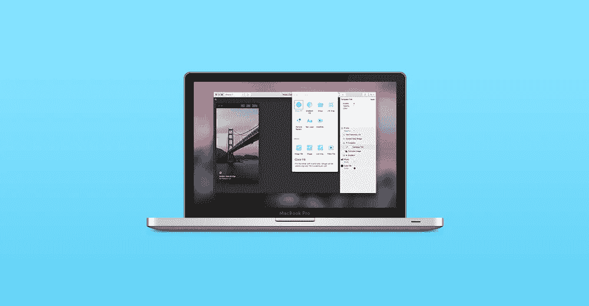
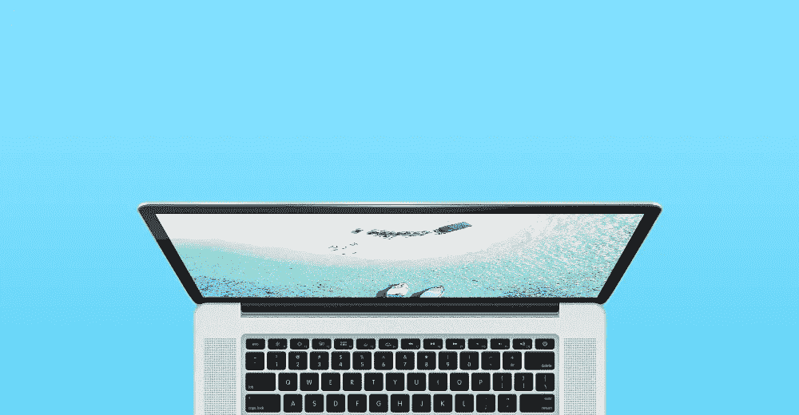
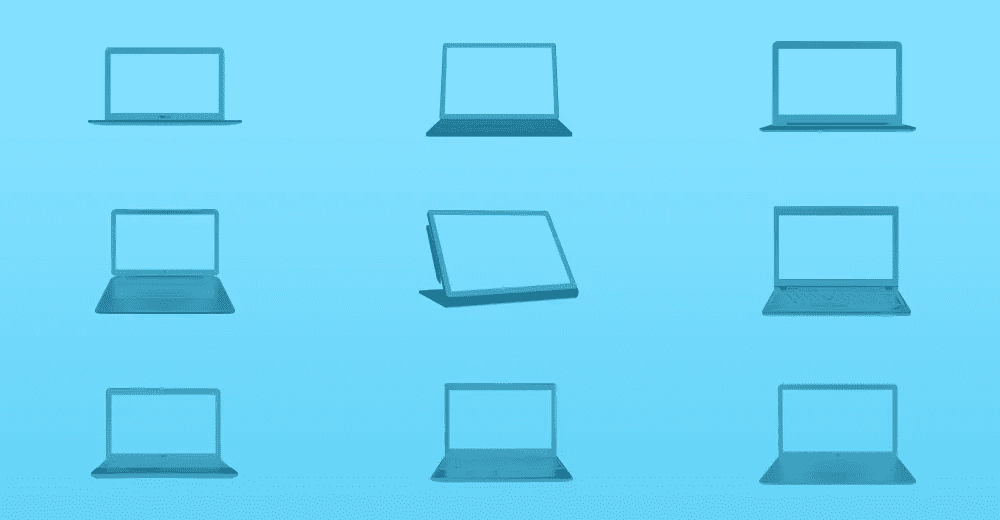
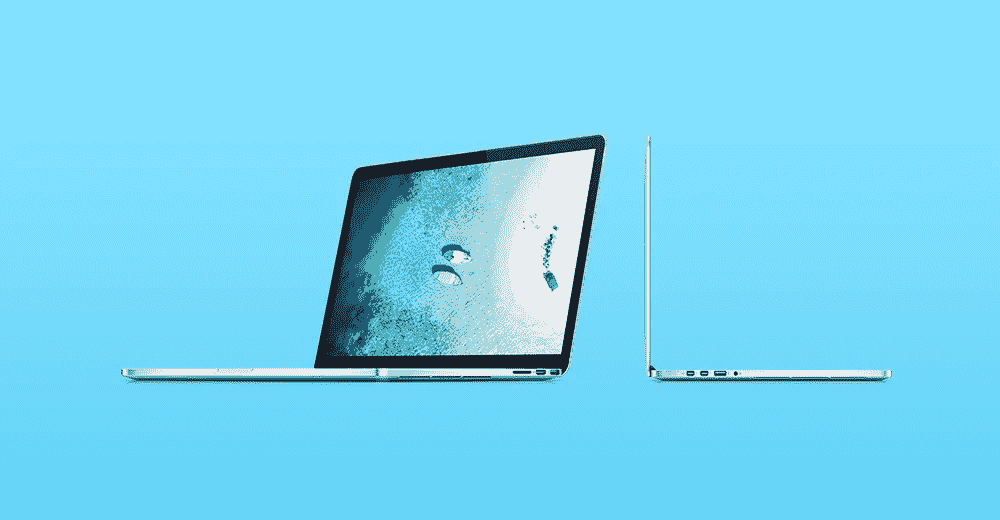

# 为什么我从 Windows 转到 Mac 做 UI/UX 设计？

> 原文：<https://medium.com/swlh/why-i-switched-from-windows-to-mac-for-ui-ux-design-3c4ea6e0e5e6>

## —寻找完美的工作站

Windows vs Mac 一直是技术人员争论的热门话题。或许，这篇文章不是关于比较这两个平台，而是陈述了我为什么从 Windows 转到 Mac 来做我的 UI/UX 设计工作的五个简单原因。

设计空间充满了许多令人敬畏的图形设计工具。这些工具有无限的可能性，给设计者很大的灵活性。Photoshop、Illustrator、Corel Draw、After Effects 等是少数几个经典的名字。但是到了这个行业，生产力就成了最重要的因素。大多数经典工具尽管用途广泛，但可能效率不高。可以参考这篇[文章](/@sharmabhinav021/designing-your-first-android-app-3-things-not-to-do-554e7ecc7fc4)了解一下原因。

大多数新时代的工具，特别是用于 UI/UX 设计的工具，像 Sketch App，Adobe XD，Principle 等都是为提高生产力而设计的。它们可能不像经典的那样非常通用，但是它们可以非常有效地执行预期的任务。但是嘿！大部分都是 mac 专属。windows 版本要么是为将来计划的，要么可能不会开发。

这对我来说是个问题，我想开发这些工具，但是平台成了问题。经过很多考虑后，我最终决定改用 mac。以下是五个主要原因——至少对我来说——支持 mac 作为 UI/UX 设计的更好的工作站。

# 1.访问 Mac 专属应用程序

曾经有一段时间，mac store 的应用程序数量远远少于 windows。但是随着 mac 用户(尤其是设计师)数量的增加，开发者开始比 windows 更积极地支持 macOS。因此，为了访问新的用户界面/UX 设计工具，如草图应用程序，折纸，原则，框架等，你需要有一个 macOS。

# 2.漂亮的视网膜显示器

设计师花了大部分时间盯着屏幕，调整颜色或使文本从背景图像中突出出来。mac 上的 retina 显示屏无疑是市场上最好的显示屏之一。所以它永远是设计师的完美选择。

# 3.设置的可移植性

MacBook 可能不是最强大的机器，但除非你在玩图形密集型游戏或生成 3D 图像组合，否则这种能力毫无用处。我有非常合理的使用案例，13 英寸 MacBook Pro 提供的功能对我来说已经足够了。但是它提供的便携性是值得称赞的。高品质的 retina 显示屏，取代了对额外显示器和高灵敏度跟踪板的需求，取代了对鼠标的需求。他们还有一些市场上最好的备用电池。

# 4.可供选择的电脑太多了

我的笔记本电脑真的越来越旧，过时了，我真的想要一台新的机器。但是购买个人电脑的选择数量几乎是无限的，随着选择数量的增加，决策时间也会增加(希克斯定律)。但苹果电脑的选择几乎是有限的，如果你像我一样预算不足，选择会变得更少😛。我唯一的困境是从 MacBook Pro 13 英寸 2016 款和 2015 款中选择。我选择了 2015 款，因为价格差异明显。

# 5.视觉刺激

苹果产品无疑是设计最精美的。设计师喜欢视觉刺激，喜欢被美丽的事物包围。那也是我买 MacBook 的动力之一。

最后 MacBook Pro (13 英寸，型号 2015)成了我的主要工作站，现在我已经用了六个多月了。对于这台机器，我确实有一些喜欢和不喜欢的地方。我喜欢的是待机模式，图形性能，手势和跟踪板的准确性，多桌面功能，便携性，屏幕清晰度等。我真正讨厌的事情是缺乏与其他设备的兼容性，Finder 应用程序，存储问题等。

当然，完美的工作站仍然不存在。你只能从可用的选项中做出选择。我找到了 MacBook Pro，更接近我要找的东西。

## 有任何意见或想分享你的经验？

请在下面写下答案。

## 这篇文章发表在 [The Startup](https://medium.com/swlh) 上，这是 Medium 最大的创业刊物，有 281，454+人关注。

## 订阅接收[我们的头条新闻](http://growthsupply.com/the-startup-newsletter/)。

