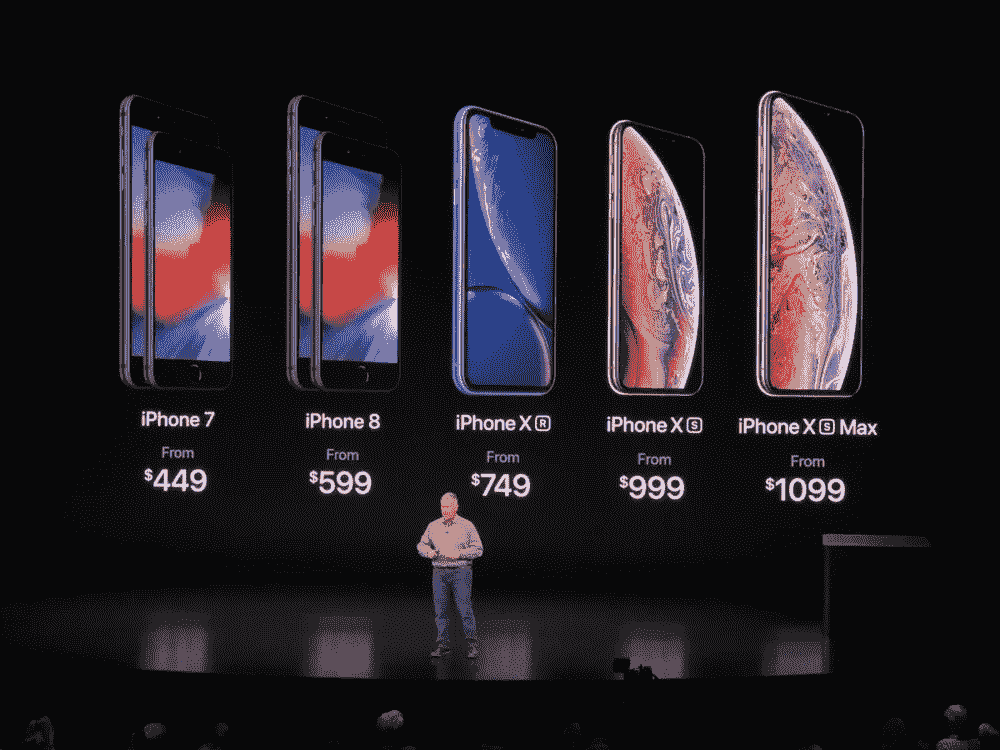
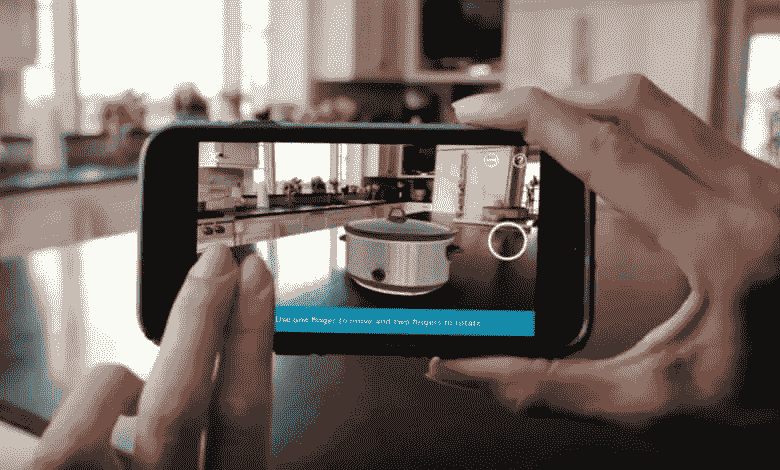

# 为什么我认为苹果的 iPhone 游戏计划是大师级的

> 原文：<https://medium.com/swlh/why-i-think-apples-iphone-game-plan-is-masterful-50668eec89aa>

苹果最新的主题演讲和新系列 iPhones 的发布引起了不同的反应。我们听到了一些常见的东西，如快 x 倍的处理器，好 x 倍的摄像头和更好、更大的屏幕。从最终用户的角度来看，所有这些微小的改进并不新鲜，也不令人兴奋。这也是为什么今年的比赛结果令人失望的主要原因之一。

曾经有一段时间，手机市场经历了快速增长，苹果事件只是令人兴奋。我们从较小的手机过渡到更大更好的屏幕、语音助手、改进的摄像头、3D 触摸等。现在，我们正处于这些重大胜利已经过去的阶段。苹果的 iPhone 业务目前正处于创新的 [S 型曲线](http://www.stratoserve.com/2014/07/the-s-curves-of-radical-and-incremental-innovation.html)的后期阶段，他们表现得相当不错。直截了当地说，他们在做能赚钱的事情。下面是我为什么这么想。

如果我们看看苹果公司最近的收益报告，有一个明显的迹象表明，iPhone 的销售已经开始进入[的平稳期](https://www.slashgear.com/iphone-and-ipad-unit-sales-plateau-again-in-apple-q3-2018-31539624/)。随着 iPhone 价格上涨到大约 750 美元以上，在我看来，苹果正在巧妙地将自己定位为一个奢侈品牌，其硬件和操作系统针对计算密集型 AR 和 AI 应用进行了优化，这些应用'*刚刚好'*。

但是，苹果如何从这里发展 iPhone 业务呢？认为苹果应该为印度和亚洲等发展中市场生产低成本手机是愚蠢的，在这些市场，智能手机的平均价格为 150 美元。这是因为，苹果的核心[市场](https://www.forbes.com/sites/toddhixon/2014/04/10/what-kind-of-person-prefers-an-iphone/#8da398cd1b06)细分市场是那些愿意为更好的质量支付溢价的市场。试图制造低成本手机将是他们商业模式的彻底转变，在一个充斥着安卓低成本手机供应商的市场中执行是很困难的。但是，如果你看看苹果的收益报告，就会发现一些有趣的事情，那就是应用商店的收入。

2018 年第一季度，App store 的收入达到了 [$34B](https://sensortower.com/blog/app-revenue-and-downloads-1h-2018) n。年增长率约为 26%。苹果向其应用程序开发者支付应用程序收入的 70%,这使得苹果从应用程序商店的利润达到 120 亿美元。所有移动平台的全球应用程序市场价值约 800 亿美元，预计到 2020 年将达到 1800 亿美元。虽然 Google play 在下载量上远远超过 App store，但 App store 的消费者支出份额 [(~66%)](https://techcrunch.com/2018/05/31/ios-app-store-has-seen-over-170b-downloads-over-130b-in-revenue-since-july-2010/) 更高。这清楚地表明 iPhone 用户喜欢在 App store 上消费。按照这种增长速度，预计到 2021 年，App store 的收入将达到 600 亿美元。苹果目前的营收约为 2300 亿美元，苹果的估值约为 1 万亿美元(5 倍)。以 5 倍为因素，到 2021 年，App store 作为一项独立业务对苹果来说将价值约 3000 亿美元。

看了这些数字后，难怪苹果试图用其新 iPhones 的高级硬件和芯片组来突破界限。有两个因素将对苹果应用商店业务的成功做出重大贡献。[增强现实](https://www.techradar.com/news/apples-tim-cook-ar-has-the-ability-to-amplify-human-performance)和 AI/ML 应用，这显然是应用开发方面的下一场大革命，以及当前从基于广告的收入模式向基于[订阅的收入模式的转变](https://hbr.org/2017/12/subscription-businesses-are-booming-heres-how-to-value-them)(网飞和 Tinder 是目前票房最高的非游戏应用)。

Photo: Amazon. ARKit injection turns Amazon app into virtual showroom

实现 AR 应用程序的最佳用户体验需要顶级质量的摄像头、显示屏和[操作系统](https://clearbridgemobile.com/ios-11-is-transforming-ar-mobile-app-development-tenfold/)进行优化，并加载用于构建这些应用程序的功能。凭借 A12 仿生处理器、改进的可调节景深的 1200 万像素摄像头、更大的有机发光二极管屏幕和改进的 arkit 2，苹果显然以激光为中心。

苹果是一家长期公司，沿着自己的道路构建积木。一个很好的例子是它如何建立 Apple pay。它始于[钥匙链](https://support.apple.com/en-ca/HT204085)的推出，然后我们被介绍到指纹解锁，然后组合转向 Apple pay。这不是一夜之间的创新，而是前 n 年更小的构建模块的总和。苹果在硬件和操作系统方面的 AR 应用革命和渐进进展很可能成为未来 T2 AR 眼镜的支点。

苹果事件可能令人失望，但它对应用商店生态系统的关注可能是其 iPhone 业务的一大亮点。

## 这篇文章发表在[《创业](https://medium.com/swlh)》上，这是 Medium 最大的创业刊物，有+418，678 人关注。

## 在这里订阅接收[我们的头条新闻](http://growthsupply.com/the-startup-newsletter/)。

