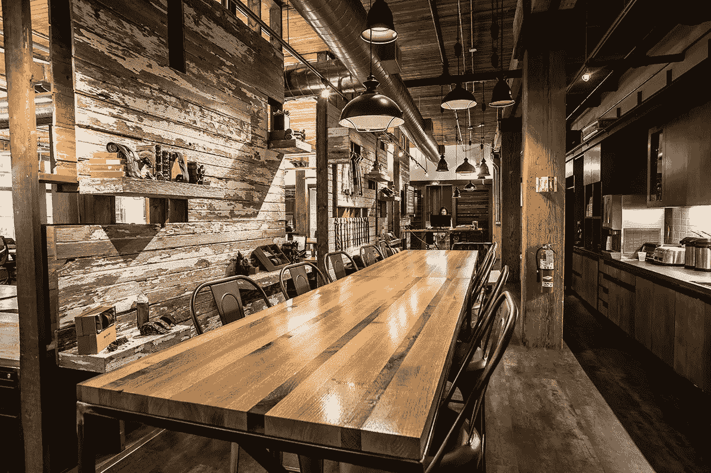

# 为什么我认为每个人都应该有一个博客

> 原文：<https://medium.com/swlh/why-i-think-everyone-should-have-a-blog-7521bd2d53b4>

博客就像一个脸书网页。它基本上是一个扩展的 twitter 帐户。在某种程度上，它也是一个 Instagram 账户。

Chicagobusiness.com

我喜欢照片和经历。当我看到有人旅行并在 Instagram 上发布照片时，我往往会为这个人感到非常高兴。我喜欢人们和我分享他们的生活。