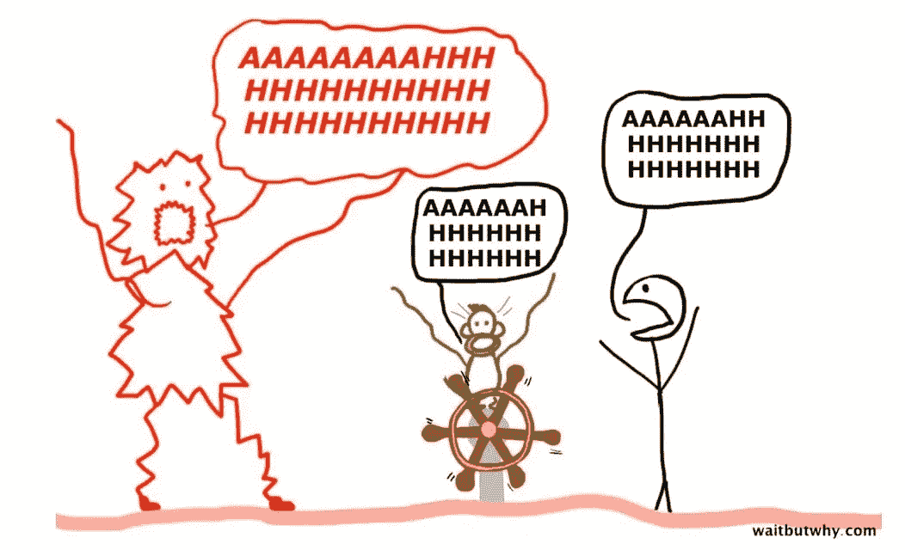

# 为什么我永远不会停止拖延

> 原文：<https://medium.com/swlh/why-i-will-never-stop-procrastinating-9b8642af0b69>

Photo by [Jack Reacher](https://unsplash.com/photos/BXOXnQ26B7o?utm_source=unsplash&utm_medium=referral&utm_content=creditCopyText) on [Unsplash](https://unsplash.com/search/photos/procrastinating?utm_source=unsplash&utm_medium=referral&utm_content=creditCopyText)

"别浪费时间了，赶快行动吧！"

如果每次我听到我的大脑对我说这句话的时候，我都能得到一块钱，那么我会变得非常富有，就像我的朋友史高治·麦克老鸭一样。

我希望我现在就能告诉你，我已经学会了如何控制和战胜我的拖延症，但坏消息是…我在这里告诉你的恰恰相反，我永远不会停止拖延。

肯定有很多关于如何停止拖延的文章，虽然他们有很好的建议和技巧，但有时我的大脑就是拒绝听他们的建议，不管有多好。

我拖延的原因有几个:

1.  西装，布鲁克林 99，瑞恩·高斯林的电影
2.  YouTube 上的 Ellen 剪辑。我也喜欢吉米·基梅尔的小品:)
3.  我还需要一条裤子、一件衬衫或一双鞋，这完全证明了下一个小时的网上购物是值得的
4.  我喜欢跑步——嘿，这是为了我的健康！
5.  看博客和书算不算研究？我会说好的…

显然，它们不是真正的原因，它们只是我选择的拖延工具。

我有两个“浪费”时间的真正原因:

**数字 1——恐惧**

**第二——我可以做，但不想做**

所以让我们来谈谈它们。

# 害怕

*   我不知道我在做什么
*   我会看起来像个白痴
*   我永远不会成功，所以有什么意义呢

讽刺的是，我不想浪费时间去做一些(恐怕)可能不会成功的事情。

所以我拖延。我尽可能地避免恐惧和不适。

因为我害怕。

我永远不会停止拖延，因为我总是害怕一些东西，我总是想回到让我感到安全的地方，想要安全并没有什么内在的错误。

但最终(通常是在《布鲁克林九九》三集之后)，我会站起来做出选择:

我是想要安全感还是想要成功？

理想情况下，我可以两者都做，但我的大脑很少相信这是事实。

走出我的舒适区是一个巨大的危险信号，我的大脑通常会试图关闭它。但是在我的大脑开始变得一团糟之前，我只能看这么多电视。通常在 3 集之后，我会尝试成功之路，不管那对我来说意味着什么。关键是试着不要让恐惧占据你的头脑。

如果那天我没有实现我的愿望，我明天会再试一次；可能只是那天我特别害怕。

# 我可以做，但我不想做！

生活中有很多我不想做的事情:

*   真空处理
*   我不是一个好厨师，我宁愿洗碗
*   转到网络活动
*   把…编入预算
*   赋税

当我推迟我不想做的事情时，它通常会告诉我两件事情中的一件:

1.  我可能做得很差
2.  任务本身很糟糕

## 如果我做得不好:

我做不好某件事并不意味着我做不了。如果它足够重要，我会采取措施提高自己，直到我可以勉强完成任务。但我知道这不是我的强项。

网络、税收、建立一个看起来不错的网站的后勤工作——这些我都不擅长。但是我已经学到了足够的东西，我可以完成它。

老实说，我会在很多事情上表现糟糕。关键是无论如何都要去做。我们做得越多，我们对自己就越有信心，但是我们越是在头脑中建立起我们吸收了多少，它就越会成为现实。

一旦我们开始，我们往往会意识到它实际上并没有那么糟糕，我们可能最终会喜欢它，或者我们可能仍然讨厌它，并推迟它，直到“恐慌怪物”出现，但至少我们知道我们可以做到这一点。

[The Washington Post](https://www.washingtonpost.com/news/wonk/wp/2016/04/27/why-you-cant-help-read-this-article-about-procrastination-instead-of-doing-your-job/?noredirect=on&utm_term=.0a2e9cc77568)

## 如果任务很糟糕:

如果任务很糟糕，而我知道如何去做，也许这是我不应该再做的事情。

不，说真的。

我们都有想要完成的目标。但是，这些目标是我们自己想要的，还是对我们的期望？如果这些任务对我们的成长、成功或基本生活质量来说不是必不可少的，难道我们不应该帮自己一个忙，重新审视它们的重要性吗？

如果我们认为它们很重要，但是做它们的想法仍然让你说“啊”，有三个选择:

a)如有可能，委派代表；
b)把任务分成更小的、不那么令人畏惧的任务；我通常的选择是
c)忍气吞声，在你的日历上设定一个严格的截止日期，完成它，然后犒劳一下自己

要么完成它，要么摆脱它。你决定吧。

拖延症并不全是坏事。拖延症让我的大脑休息，重新专注于我的优先事项；**它让我的思想进入一个创造性的空间，而不是让恐惧占据它的位置。**

我们都有拖延的理由，我们都需要花时间重新校准、重新聚焦、重新安排优先顺序。所以做你需要做的，然后开始工作。

PS。如果你喜欢这篇文章(即使你不喜欢，我也希望收到你的来信。一个掌声或评论对我来说意味着整个世界。

PPS。注册我的免费简讯，获取更多关于 www.possiblepursuits.com 的类似文章。

*爱丽丝*

## 这篇文章发表在 [The Startup](https://medium.com/swlh) 上，这是 Medium 最大的创业刊物，有 319，931+人关注。

## 在此订阅接收[我们的头条新闻](http://growthsupply.com/the-startup-newsletter/)。

