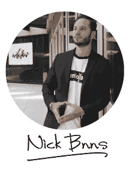

# 为什么我不接受每日一帖的挑战

> 原文：<https://medium.com/swlh/why-i-wont-take-the-one-post-a-day-challenge-13b8abaf9e6b>

[Credit](https://unsplash.com/@rawpixel?utm_source=medium&utm_medium=referral)

## 以及为什么这可能是个错误

我身边的博主都在做。

一篇文章，每天一篇，持续一个月。

从理论上讲，这是非常有利可图的。意思，如果做得好，会给你带来很多，很大的受众，巨大的流量。

在一个消费主义的世界里，你需要养活你的观众。

每天一个帖子是扩大你的粉丝的最好方法。

作为作家受到尊重。

**那么，为什么我不去做呢？**

嗯，首先，我不会假装自己是个作家。至少现在还没有。

我当然希望写我自己的书(实际上正在进行中)。

但与其说我是个作家，不如说我是个空谈家。真正了解我的人可以为此作证。

事实上，我不久前开了一个[主播](https://anchor.fm/nick-bnns)的账户，我真的需要继续工作。然而，就目前而言，和我的手机通话并没有让我感到兴奋。

这是我的第二点:

我喜欢的社交媒体太多了，比如[脸书](https://www.facebook.com/nickbnns)和 [Instagram](https://www.instagram.com/nickbnns/) 。

我想开发一些社交媒体，比如 Anchor 和 LinkedIn。

还有媒体，我以前从未想过的社交媒体(感谢托马斯·德斯潘和萨丕尔·拉拉对我的推动)。

我不想撒谎，我真的觉得这很有趣，很容易上瘾。

这就引出了我的第三点，也许是最重要的一点:

我不是来和你闲聊的。

为此我有了 Snapchat。

不，我真的想使用媒体作为一种方式来联系有趣的人(我很快就有了)并分享有价值的内容。

我的观点是，有这么多东西要写，但是每天都写显然会降低作品的质量。

如果你一天发一次帖子。

我完全钦佩你。

我认识到承诺的挑战。

只是不适合我。

今年九月，在我的第一个月，我挑战自己每周写三篇文章。

效果很好，我在这里的前 100 份出版物中有 2 份发表了文章。

My first month on Medium in numbers

我现在可能一周推一两次。

有些故事会更个人化，有些是你可以利用的小贴士。

无论哪种方式，**内容充实。**

所以让我们保持联系。

## 三二一…开拍！

[CONTACT ME HERE](https://nickbnns.com)

 [## 我学到的东西在 5 个月内实现 50 万欧元的销售额(部分。2)

### 为什么我停止了直运？

theascent.pub](https://theascent.pub/things-ive-learned-making-half-millions-euros-in-sales-within-5-months-part-2-eba2add04f3f)  [## 我从严肃嘲笑我的朋友那里学到的教训

### 你是否也觉得人们不把你当回事？

medium.com](/swlh/lessons-i-learned-from-my-friends-seriously-laughing-at-me-10dd5313de6a)  [## 被疯狂解雇如何让我的生活变得最好

### 一个你可以利用的人生教训。

theascent.pub](https://theascent.pub/why-being-fired-might-be-the-best-thing-that-ever-happened-to-you-360e028d2dec)  [## 我在管理我的六位数业务时学到的重要经验

### 领导和管理是成功的关键

medium.com](/swlh/delegating-is-the-most-important-part-of-a-viable-business-48e2f17baf63)  [## 不要把自己藏在动机后面

### 你实际上不需要

theascent.pub](https://theascent.pub/dont-bullshit-yourself-with-motivation-f38d1dd4b61e)  [## 你将如何用神经科学提升你的自信和自尊

### 这实际上比你想象的要容易

medium.com](/swlh/boost-your-confidence-and-self-esteem-using-neuroscience-techniques-3ea06ee36c43)  [## 我学到的 5 件事在 5 个月内实现 50 万欧元的销售额

### 这是一个直运反馈

medium.com](/@nicolasserial/5-things-ive-learned-making-half-millions-euros-in-sales-4a451567f6ef)  [## 癌症杀死了我爸爸

### 我怎么能原谅它呢？

medium.com](/@nicolasserial/have-you-lost-a-close-one-to-cancer-too-df46fe67557c)  [## 你相信奇迹吗？

### 什么是奇迹？

medium.com](/@nicolasserial/do-you-believe-in-miracles-a08c7842ee11)  [## 为什么我会免费蔻驰你？

### 当正常价格是 1497 美元。

medium.com](/@nicolasserial/why-do-i-coach-for-free-2073574d383d)  [## 世界在扼杀你的野心？

### 这篇文章可能会帮助你

medium.com](/@nicolasserial/the-world-is-killing-your-ambition-6d68a36eb9c0)  [## 从服务员到赢家

### 我的第一篇媒体文章，献给某个特别的人

medium.com](/@nicolasserial/from-waiter-to-winner-d9d14a7b125f)  [## 变得更快乐的 5 个步骤

### 说到底，幸福是你做出的选择。

theascent.pub](https://theascent.pub/5-steps-to-become-more-happy-f31328b0ef47)  [## 为什么要成为一个成功的企业家需要冒险？

### 做一个梦想家很好，但做一个规划者和工作者更好。

theascent.pub](https://theascent.pub/why-do-you-need-to-take-risks-to-be-a-successful-entrepreneur-7b62d26bcc6e) 

## 这篇文章发表在 [The Startup](https://medium.com/swlh) 上，这是 Medium 最大的创业刊物，有+ 378，529 人关注。

## 订阅接收[我们的头条新闻](http://growthsupply.com/the-startup-newsletter/)。

