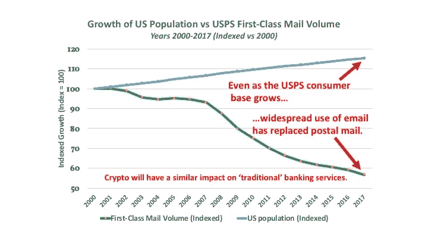
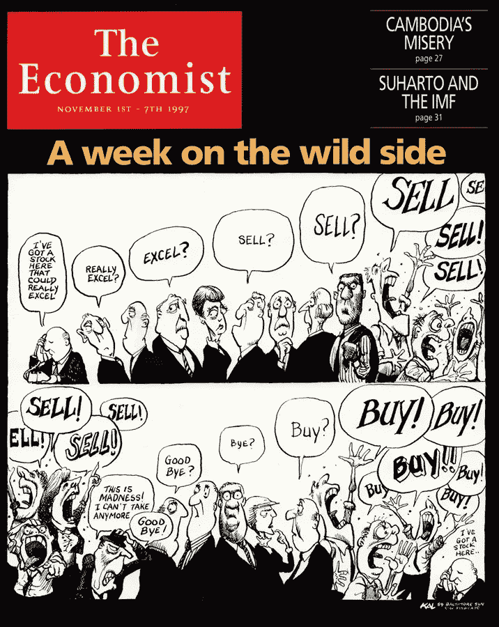

# 为什么我在密码部门工作

> 原文：<https://medium.com/swlh/why-i-work-in-crypto-ae922de774a9>

我是一家初创对冲基金的合伙人，该基金于今年早些时候成立。即使在最好的情况下，这也是一种冒险的尝试。毕竟，每年有超过 10%的对冲基金失败——而整个行业的基金平均寿命约为 5 年。

现在考虑这个新基金是专门为了交易数字资产而成立的(很多人用‘加密货币’这个术语)；我们更喜欢前一个术语，因为“加密”的整个范围包括许多超出我们认为是货币的使用案例，如公用令牌、证券或价值储存。

你可能会问，为什么值得你花宝贵的时间来阅读我决定进入一个新领域的消息？这个新领域通常被受人尊敬的媒体斥为骗局，一些世界上最成功的投资者嘲笑为“人类历史上最大的泡沫”和/或“老鼠药平方”？

恕我直言，答案是，我过去六年的发现之旅可能会帮助你更好地理解这一新兴资产类别中正在发生的事情的意义。每天，我都会与一些人交谈，他们开始意识到数字资产市场中的不对称机会，并希望了解更多信息。如果您还没有开始您的加密之旅，那么我相信您会在这里找到一些有用的观点。

A generally accurate depiction of sensations felt while navigating Crypto Twitter.

**首先，坏消息…**

为了呈现一个客观的观点，让我们从一些严酷的事实开始。

*   大多数数字资产基金(比如我的基金)专门交易加密资产。这是一个成立不到十年的资产类别，绝大多数专业投资者都没有涉足。事实上，调查显示，拥有这些资产的美国散户投资者的比例处于较低的单一 digits⁴.
*   流动性和市场稳定性是有问题的，即使是像比特币这样最大的数字资产。年化波动率超过 50 %,我们目前正处于 70%的下降深度，这一下降持续了不到 6 个月的时间。
*   我是否提到过这一资产类别的市值只有 2300 亿美元？相比之下，公司债券市场(9 万亿美元)或美国股票(30 万亿美元)。事实上，75 家最大的机构资产管理公司各自控制的资本超过了我所在的“小”区域的总和。⁵

既然我涵盖了所有的负面因素，我还应该指出，我和我的搭档曾在华尔街两家最大的银行担任过显赫的职位。现在，我们不是在金丝雀码头或公园大道的交易大厅里写这篇文章，而是在一家餐厅正上方的一间两居室的办公室里，那里只有勉强可以忍受的空调。

到现在为止，我推测你正在经历一种徘徊在怜悯和摇头之间的感觉“他在想什么？”难以置信。

但现在我们已经涵盖了下行风险，让我来解释一下为什么一个头脑清醒的四十岁左右的人会选择将此作为他一生的工作。

# **这个发现**

让我们把这个故事带回到开始——那是在 2012 年末，用密码术语来说，那是古老的历史。

我不太记得第一次听说比特币是什么时候，或者是从谁那里。当时，我在一家投资前沿和新兴市场的对冲基金工作。我在经历了多次金融危机的国家呆了很长时间，这些国家的公民因通货膨胀和资本管制而陷入贫困。我认识的大多数新兴市场投资者随着时间的推移已经养成了强烈的自由主义倾向——这是看到整个国家因政府公然腐败和无能而变得贫困的自然反应。

很自然，当我偶然发现比特币时，我很快就被吸引住了。这是一个让资本管制变得无关紧要的金融体系。一旦到达安全的目的地，任何人都可以带着自己的资产越过边境，只需携带一个 12 个字的密码就可以访问他们的在线钱包。

如果你正在洛杉矶或伦敦阅读这篇文章，那么这听起来可能不是一个重要的特征。*另一方面，如果你住在加拉加斯、尼科西亚或上海，那么你就会知道，这是一种真正革命性的方式来保护你家人的资产，甚至他们的幸福。*

突然间，向任何地方的任何人寄钱就像发电子邮件一样简单了。这项新技术在各方面都优于我们的全球银行系统——该系统自 1973 年以来一直在陈旧的 SWIFT 网络上运行。

为了把握比特币的优越程度，请考虑以下几点:

*   对你来说，通过 Whatsapp 或 Facetime 与朋友和家人沟通——更不用说电子邮件了——比你写一封信、贴上邮票并投入最近的邮箱要容易多少？
*   接下来，回顾下面的图表，该图表将美国人口增长与 21 世纪第一类邮件的投递量进行了比较。**请注意，尽管人口增长了 15%以上，但美国邮政服务的邮件量同期却下降了 43%以上。**
*   最后，用“核心银行收入”取代“邮件递送”，你将开始理解数字资产在未来二十年对全球大型银行的影响。

Sources: U.S. Census Bureau (2018); U.S. Postal Service (2018)

在接下来的几个月里，我阅读了所有我能找到的相关文章。在我的职业或个人网络中，没有人听说过比特币或任何其他数字资产。我越来越兴奋地试图描述比特币开采的复杂性，却遭到了目光呆滞的凝视和惊讶。当我终于找到一个熟悉比特币的业务熟人时，他劝我远离比特币。

**钻入兔子洞**

我终于在 2013 年 6 月买了我的第一个比特币。我每人付了 85 美元。几周后，有人向我介绍了一个人，他在 2011 年以每只 5 美元的价格购买了 1000 只 BTC。我经常想他今天在哪里。

我希望我能告诉你，我仍然拥有那些比特币。然而，到那年年底，BTC 已飙升至 1000 美元，获利的诱惑太大，任何稍有头脑的人都无法抗拒。我在市场上保留了足够的 BTC 来支付我的成本，然后卖掉了剩下的。

在那一年比特币价格上涨 10 倍的过程中，一场真正的狂热开始席卷全球。美国消费者新闻与商业频道主播开始谈论加密。《时代》杂志发表了一篇关于它的封面故事。政府官员出现在有线电视新闻上，就匿名货币的种种弊端进行指手画脚的演讲。(具有讽刺意味的是，美元无可争议地扮演着终极匿名货币的角色，是巴勃罗·埃斯科巴等国的首选支付方式，但他们显然没有意识到这一点。)

与所有市场泡沫一样，加密价格不可避免地在 2014 年 1 月崩盘。比特币从 1000 美元以上的高点下跌至 200 美元，并且在未来三年内不会再创市场新高。大多数市场的后来者——那些在最后疯狂上涨到 1000 美元时购买比特币的人——损失了高达 80%的投资，并在厌恶中离开。大多数媒体认为比特币是一种时尚，或者是一种骗局。“体面的”金融机构禁止其员工拥有加密资产，理由是法律和监管风险。

在接下来的三年里，crypto 是一个相对安静的地方。媒体基本上忘记了比特币，普通大众也是如此。最大的密码交易所的交易量蒸发了。世界在前进。毕竟，S&P 正处于一场史诗般的反弹之中，希腊正在内爆，而硅谷正以惊人的速度产出“独角兽”。谁有时间买比特币？

# **这有什么关系？**

让我们回到现在。

我已经见证了两个完整的“繁荣-萧条”加密市场周期——第一次是在 2013-2014 年，最近一次是在 2017-2018 年。这比这个领域的大多数人多一个周期，尽管没有真正的早期采用者多。

在我看来，这些周期之间的相似之处是不会错的:

*   在每一个例子中，早期采用者实现了巨大的收益，随后是投机资金的浪潮，将市场推向了以前不可想象的新高度。
*   与 2017 年波多黎各的“秘密乌托邦”等大型活动和运动相比，2013 年新加坡会议相对像节日的性质黯然失色。
*   狂热加剧，直到价格达到不可持续的水平，利润像出现时一样迅速蒸发。
*   2017 年 12 月的狂热市场之后是 2018 年 1 月同样重大的崩盘。
*   晚进入者在 2014 年 1 月和 2018 年 1 月损失了高达 80%的初始投资。

Just another day on Reddit.

与此同时，新项目在每个周期都筹集了大量资金。2013 年推出的大多数项目的成功都被 2017 年 ICO 市场的狂热所掩盖。最终，2013 年的大部分项目都被搁置或失败了；少数幸存下来，今天价值数十亿美元。今天的 ICO 项目正在进行的调整将同样令人痛苦。当下一轮牛市周期不可避免地开始时，少数赢家将从灰烬中出现，并被推上新的高度。

正是这种创造性破坏的循环，使得数字资产市场成为一个不可抗拒的工作场所。最佳加密项目的创新本质是这一资产类别与简单的投机性追求的区别。我从来没有遇到过像今天领先的加密项目中发生的创新这样令人着迷或如此快速的事情。

今天在这个领域正在建设的项目将会以我们还无法理解的方式永远改变我们的世界。数据存储、供应链管理、贸易金融、法律——这些仅仅是将被新兴加密技术颠覆，甚至在某些情况下被摧毁的行业的一部分。Hashgraph、Tezos 和 Zilliqa 等公司正在开发新的技术和流程，这些技术和流程将极大地改善今天的区块链，甚至可能使整个区块链概念过时。

那么下一步是什么？

在这一点上，一个愤世嫉俗的读者(我希望那是你，至少在阅读投资通讯的时候！)可能会说，这听起来很有趣，也很有前途，但究竟为什么有人会把钱投到这样一个早期的投机性技术上——更不用说围绕它建立职业生涯了？

毕竟，对加密资产的普遍批评是，它们只是投机工具，没有真正的效用。最近，《经济学人》用了整整一个章节来讨论加密资产，这在很大程度上是一个热门话题，其核心前提是加密是“一项失败的九年老技术”，“正在寻找一个问题来解决”。⁶

我坚决不同意。

领先的加密资产比特币拥有终极用例。

作为价值储存手段和交换手段，它优于人类创造的任何货币或货币单位。

比特币还未过十岁生日，其安全性、可转让性和对政治操纵的抵抗力已经优于我们现有全球金融体系中的任何产品。套用一句我最喜欢的台词，来自被大大低估的电影*战犬*，“任何不同意这种说法的人要么是在行骗，要么是愚蠢的。”

与此同时，现在正在建设的公司和项目在技术上甚至优于比特币。现在上线的用例是惊人的。

**最终想法**

在我进入加密之旅的早期，我会去伦敦东区的可疑酒吧参加比特币见面会，在那里，我见过的最聪明的人都在舞台上和人群中。这些人不是骗子，也不是梦想家。他们是聪明的人，记得十年前的这个月，处于全球金融灾难的边缘，并决定我们的金融体系必须有一个更好的运作方式。

然后他们开始建造它。

这些人正在建设我们金融市场的未来。我很高兴能和你一起去。

========================================

**我在**[**Kosmos Capital Management**](http://www.kosmoscap.com)**工作，该公司积极交易新兴类别的数字资产。在 Twitter 上关注我** [**@kvirgil**](http://twitter.com/kvirgil)

========================================

**免责声明:本专栏中的任何内容都不是投资建议，您绝对不应该这样理解。做投资决定时，不要依赖我的建议，也不要依赖任何人的建议。做自己的研究是在任何市场成功的关键。**

========================================

**尾注**

1《纽约客》，2014 年 8 月。约翰·兰彻斯特《金钱万能》。

这是努里埃尔·鲁比尼在 2018 年 5 月赠送的宝石，正如潘迪拉资本公司的丹·莫尔黑德指出的那样，他已经预见了过去两次金融危机中的 12 次。他还很有帮助地将比特币称为“bullsh-t ”,将其投资者称为“傻瓜”。

3 感谢查理·芒格，他也是在 2018 年 5 月[提供了](https://money.cnn.com/video/investing/2018/05/08/qmb-buffett-munger-bitcoin-rat-poison-trading-turds.cnnmoney/index.html)这个坦率的观察。在他看来，购买比特币类似于“交易粪便”。没有人透露 crypto 的成功最终会如何影响他在美国运通、美国银行和富国银行的巨额投资——截至伯克希尔哈撒韦公司最新的 13-F 文件，超过 560 亿美元。

4 区块链资本调查，2017 年 11 月。[调查.区块链.资本](http://survey.blockchain.capital)

5 威利斯韬睿惠悦调查，2017 年 10 月。“全球 500 家最大的资产管理公司”

6《经济学人》，《技术季刊》2018 年 8 月 30 日。“如何利用加密货币和区块链。”

## 这篇文章发表在 [The Startup](https://medium.com/swlh) 上，这是 Medium 最大的创业刊物，拥有+368，052 读者。

## 在这里订阅接收[我们的头条新闻](http://growthsupply.com/the-startup-newsletter/)。

