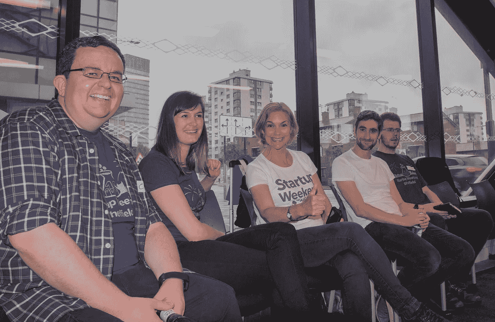
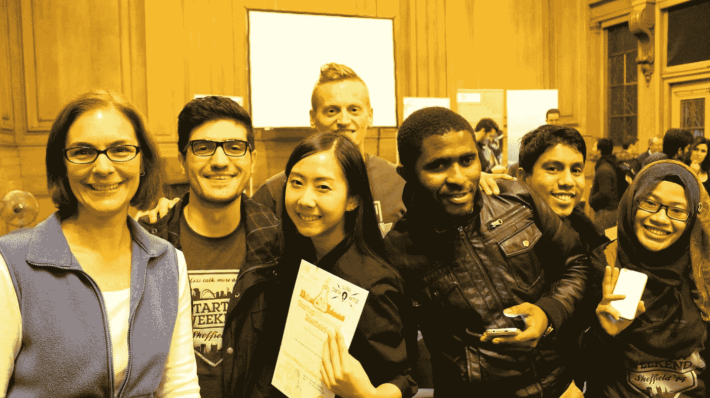

# 为什么我要参加我的第十个创业周末

> 原文：<https://medium.com/swlh/why-im-about-to-participate-in-my-10th-startup-weekend-12a0a8bfee89>

Being a part of Startup Weekend keeps me motivated and excited about being an entrepreneur! (Photo credit: @ryanbibby)

## 为什么我建议每个企业家至少应该做一件事！

再过几天，我将参加四年来的第十个创业周末。

我参加了其中的两个项目，并在另外 8 个项目中做了一些志愿者或指导工作。我甚至在加沙的[创业周末做导师。](http://startupliz.tumblr.com/post/131018408430/what-is-a-startup-weekend-in-gaza-like-like-a)

这个周末，我将帮助球队完善球场艺术。

像我四年前一样，很多人都没听说过创业周末。那时候我甚至不知道什么是创业。我只有一个模糊的想法，在公共部门工作了 20 年后，我想成为一名企业家。有人建议这可能是一个学习做这件事的好方法。[的确如此！](/@eshassere/you-must-get-in-the-game-things-happen-when-you-get-in-the-game-65529d77525a)

听说过它们的人通常认为这是技术人员的某种黑客马拉松。作为一个在我参加的前两次比赛中获得第一名的非技术人员，我可以向你保证事实并非如此。

这是一个有趣、艰难、54 小时的学习成为企业家的六件重要事情的机会:

## 1.球场的艺术

当你不得不足够仔细地思考你的商业想法，以至于你可以说服某人为你投票，或者投资，或者仅仅是在五分钟或更短的时间内同意这是一个伟大的想法，你已经朝着验证它前进了一大步。你可以用一句话来陈述你正在解决的问题，以及你将如何用你的解决方案赚钱。

老实说，推销的艺术不仅有利于赢得创业周末或获得投资者的支持，它还是说服几乎任何人的一项好技能！

## 2.组建一个稳固团队的重要性

在一个创业周末，我们有一个三人小组，在周五晚上突然失去了他们的开发人员。不可思议的是，一个新的参与者在周六早上出现并加入了这个团队。他们不仅能够重整旗鼓度过周末，并在周日晚上投球，而且还赢得了第一名。

对我来说，这是一个好团队的明确标志，也是一个强有力的团队领导者。他们没有失去勇气，他们能够让新的团队成员快速达到要求，并保持专注。

## 3.如果你想玩游戏，去玩游戏的地方，想办法进去。当你进入游戏，事情就会发生。—贾马尔·爱德华兹

进入创业周末“游戏”不仅仅是一个练习和学习一些经验教训的地方，你会遇到各种各样的人。这些人可能是你的下一个联合创始人，或者有你理想中的想法，或者你可能在哪里找到你最新项目的完美设计师。

当你出现并参与时，事情就发生了。你永远不知道那会是什么。

## 4.不要放弃，或者屈服。坚持你的信念并实现它。

当你完成了你的家庭作业并测试了你的想法(这是一个完美的创业周末！)你将处于一个强有力的位置，知道你是否有一个“goer”。

你会遇到反对者、怀疑者和挖掘者。但是，如果你真的做了背景工作，并通过一些好的过程实现了你的想法，比如[Mom 测试、](http://momtestbook.com/)中所描述的，那么坚持你的观点。

信心危机是企业失败的最常见原因之一，或者更确切地说，是根本无法起步。让它发生。

## 5.没有一个完美的问题/解决方案，世界上所有的高科技都救不了你

创业周末不是技术黑客马拉松。如果你能证明有一个相当大的市场有你的想法解决的问题，你就能赢。它不是关于无人见过的最神奇、最独特的技术。**这是关于缓解许多人都有的一个痛点，一个紧要关头，用一个可行的解决方案，有很好的财务意义。**

## 6.经验会带来很多好处；如果你的创业公司没有，那就找一个有这个能力的人

好的创业周末有新手和更有经验的人的良好组合，他们要么熟悉某个行业，要么以前开过自己的公司。

Me and my much younger, highly-skilled teammates

当我参加并赢得我的头两个周末时，我已经在卫生和地方政府工作了 20 年。我带来了这些部门面临的最棘手问题的详细知识。凭借我年轻得多的队友的技能和创造力，我们能够设计出我见过的两个最大问题的解决方案。我们确信我们的产品有市场。

只有经验或技能可能意味着缺少什么。它可能会阻止你的想法获得实际应用或竞争优势所需的创新。

M 在过去的几年里，我采访过的所有成功的企业家都说，如果他们知道他们将不得不经历什么，以及他们将不得不付出多大的努力来实现这些，他们就永远不会开始创业。

这就是为什么在我看来，双脚投入比赛是如此重要。创业周末是一个没有风险的好地方。这是一个很好的学习新东西的方式，可以认识一些志同道合的人，甚至可能找到一个联合创始人。观看[这个空间](http://global.startupweekend.org/)，了解您附近的创业周末活动的新闻。谁知道呢，你可能会喜欢它！

你可以在这里[注册](https://tinyletter.com/eshassere)来接收我的第一本书发布的消息，*成为一个无畏的领导者:一个控制和建立快乐、高效、高绩效团队的简单指南*。我将很快与在这里注册的每个人分享免费资料。

我写了我是如何成为一家科技创业公司的创始人的，当时我是一名 40 多岁的女性，没有创业经验，也不是技术人员(这一切都是因为一个创业周末！)，以及我一路走来学到的一切。你可以在这里看到更多:[https://medium.com/@eshassere](/@eshassere)*如果你认为这可能对其他人的创业之旅有所帮助，请推荐并分享。*

## 这篇文章发表在 [The Startup](https://medium.com/swlh) 上，有 258，400 多人聚集在一起阅读 Medium 关于创业的主要报道。

## 在此订阅接收[我们的头条新闻](http://growthsupply.com/the-startup-newsletter/)。

