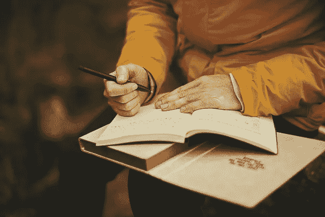

# 为什么我痴迷于个人发展，为什么你也应该如此

> 原文：<https://medium.com/swlh/why-im-obsessed-with-personal-development-and-why-you-should-too-a95b45901553>

[Pexels/pixabay](https://pixabay.com/en/adult-blur-book-business-color-1850177/)

我们人类拥有神奇的硬件，但却拥有过时的、被弃用的软件。我们的软件进化于一个与我们现在生活的时代完全不同的时代。

当我们的软件进化时，食物是稀缺的。它不可能保存很长时间。这意味着我们必须沉溺于食物，一旦找到食物就尽可能多的消费。

食物的匮乏也意味着我们必须尽可能地节约能源。这意味着我们必须尽可能少地移动。

婴儿死亡率很高。这意味着我们必须抓住一切机会做爱，以最大限度地将我们的基因传递给下一代。

我们没有任何安全保障。我们每天都面临着生命威胁。这意味着我们必须在最微小的威胁感知中被触发，要么逃跑，要么反击。

我们 100%依靠我们的部落生存。这意味着我们必须遵从我们部落的文化，不管它有多不合理。

这只是我们在进化过程中形成的本能的一小部分。我们每次繁殖都会把这些本能传递给下一代。

> 那些过时的节目不再为我们服务了。相反，他们伤害了我们。它们阻碍我们发挥全部潜力。他们让我们恶心。

当你不得不在观众面前做演讲，而你的直觉认为这是一种威胁时，你的表现就会受到影响。

如果你沉溺于高热量的食物，并且尽可能少运动，你的健康就会受损。如果你沉迷于网上华而不实的内容，你的工作效率会受到影响。如果你让酒精或毒品劫持了你的神经系统，你的整个生活和你所爱的人都会遭殃。

> **这些只是冰山一角。在表面之下还有更多。我们需要意识到我们心灵的缺点，并学会应对它们的策略。**

随着我们放弃那些过时的、废弃的程序，我们头脑中释放出越来越多的容量。尽管我们的软件大多过时了，但我们的硬件是一流的。随着我们开发和安装高级软件，我们的表现越来越好。

对我来说，个人发展就是发现和卸载那些过时的、被否决的程序，并安装新的、更好的程序来帮助我们实现我们的全部潜力。

这就是为什么我痴迷于个人发展，这就是为什么你也应该痴迷于个人发展。

[***注册我的电子邮件简讯***](https://ideavisionaction.com/email-newsletter/) ***每周都会收到我关于个人发展和生活经验的最新帖子。***

## 这篇文章发表在《初创企业》杂志上，这是 Medium 最大的创业刊物，有 332，253 人关注。

## 订阅接收[我们的头条](http://growthsupply.com/the-startup-newsletter/)。

