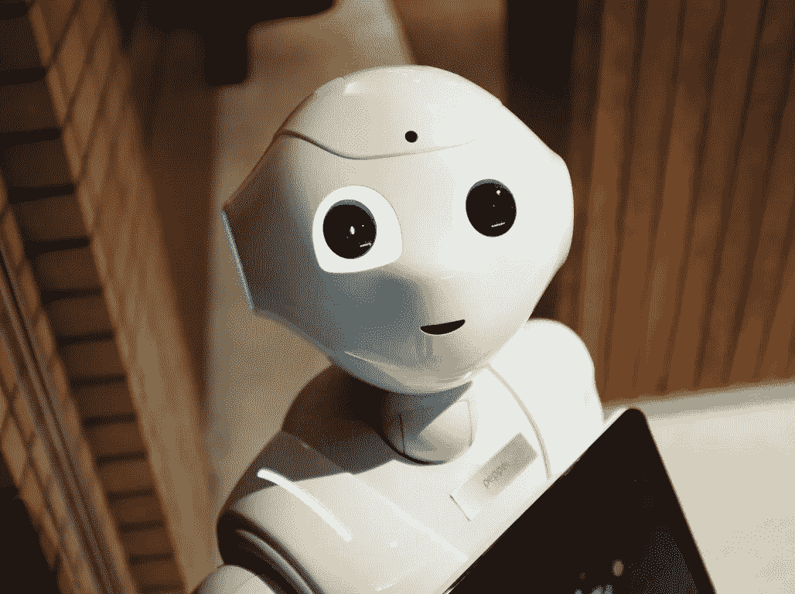
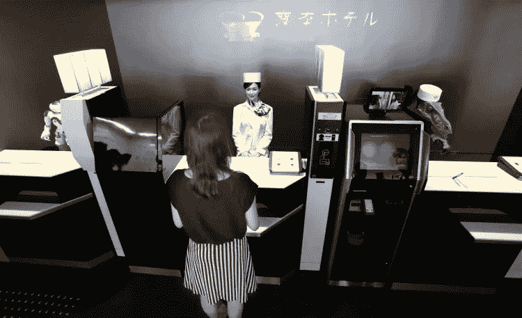

# 为什么人工智能在酒店中如此重要？

> 原文：<https://medium.com/swlh/why-is-artificial-intelligence-so-important-in-hotels-ecd3a4aa2dfb>

人工智能是一种为社会带来解决方案的技术。这个术语代表计算机或机器智能行为的表现。本质上，我们可以说它是关于计算机、机器人或机器执行传统上需要认知功能来执行的任务。它与自动化和大数据相关联。

所以，首先请允许我说，这对我们的酒店业来说是一个充满机遇的世界！。我们生活在一个消费者充斥着信息和选择的世界里。酒店必须找到新的方法来获得和建立客户忠诚度。旅行者的期望值现在更高了，包括在旅行的每一步都非常个性化。今天毫无疑问；与生活的其他方面相比，客人希望在酒店体验同样的自助服务选择。因此，人工智能可以帮助我们不断改善客户在酒店的体验。

人工智能也是关于大数据的。它是关于找出消费者的一切，并使用全面的数据管理系统和程序来满足客户的梦想。

我坚信这是机器人、学习机和聊天机器人的时代。所有这些都是复制人类行为的方式。例如在酒店，我们在大门或接待处使用机器人迎宾。酒店也可以把它们作为礼宾服务。这是希尔顿酒店的例子，创造了“康妮”。它是一个机器人，为与之互动的顾客提供旅游信息。这件事发生在去年。康妮能够与人互动，向人学习，适应个人的要求和需要。这意味着，它对人类说得越多，它就能更好地完成工作。这是酒店第一次用机器人做实验。

已经有其他自助服务酒店解决方案，如预订、入住、结账和支付流程。我迫不及待想看到的另一样东西是酒店钥匙。因为万豪移动应用程序已经允许客人跳过酒店前台协议进入他们的房间。有些酒店允许客人在他们的房间里对一切进行编程和个性化。含义、温度、音乐、灯光、颜色、叫醒电话或清洁时间。此外，还有集成了语音指挥技术的酒店。智能语音工具也成为提供服务的个人助理。

人工智能将允许酒店实施更好的流程，预测需求，解决问题，并了解要选择的旅行者模式。酒店现在应该有一个联网的系统来获取、处理和分析客人数据。将其转化为可预测和可操作的见解，创造更好的顾客体验。酒店应该绘制整个游客旅程。也就是说，我们所有酒店经营者都希望在每一次入住期间为每位顾客提供个性化服务。

我毫不怀疑酒店业在过去十年里经历了巨大的变化。整合新技术和计划，慢慢重塑客户体验。我认为这在某种程度上是由数字旅行者的形象决定的。以及替代住宿模式(Airbnb、house trips 等)等新商业模式的进入。…)正在改变消费者对传统酒店的看法。但现在是时候采用其他行业已经集成的技术，创造更好的酒店体验了。

我们处于一个以客户为中心的行业。所以，知道人工智能正在让酒店做不可思议的事情。我想知道酒店经营者将如何接近人工智能，并最终在业务上具有破坏性，而不是进化性的？

我坚信这是机器人、学习机和聊天机器人的时代。所有这些都是复制人类行为的方式。例如在酒店，我们在大门或接待处使用机器人迎宾。酒店也可以把它们作为礼宾服务。这是希尔顿酒店的例子，创造了“康妮”。它是一个机器人，为与之互动的顾客提供旅游信息。这件事发生在去年。康妮能够与人互动，向人学习，适应个人的要求和需要。这意味着，它对人类说得越多，它就能更好地完成工作。这是酒店第一次用机器人做实验。

已经有其他自助服务酒店解决方案，如预订、入住、结账和支付流程。我迫不及待想看到的另一样东西是酒店钥匙。因为万豪移动应用程序已经允许客人跳过酒店前台协议进入他们的房间。有些酒店允许客人在他们的房间里对一切进行编程和个性化。含义、温度、音乐、灯光、颜色、叫醒电话或清洁时间。此外，还有集成了语音指挥技术的酒店。智能语音工具也成为提供服务的个人助理。

人工智能将允许酒店实施更好的流程，预测需求，解决问题，并了解要选择的旅行者模式。酒店现在应该有一个联网的系统来获取、处理和分析客人数据。将其转化为可预测和可操作的见解，创造更好的顾客体验。酒店应该绘制整个游客旅程。也就是说，我们所有酒店经营者都希望在每一次入住期间为每位顾客提供个性化服务。

我毫不怀疑酒店业在过去十年里经历了巨大的变化。整合新技术和计划，慢慢重塑客户体验。我认为这在某种程度上是由数字旅行者的形象决定的。以及替代住宿模式(Airbnb、house trips 等)等新商业模式的进入。…)正在改变消费者对传统酒店的看法。但现在是时候采用其他行业已经整合的技术，创造更好的酒店体验了。

我们处于一个以客户为中心的行业。所以，知道人工智能正在让酒店做不可思议的事情。我想知道酒店经营者将如何接近人工智能，并最终在业务上具有破坏性，而不是进化性的？

## 这个故事发表在 [The Startup](https://medium.com/swlh) 上，这是 Medium 最大的创业刊物，有 273，384+人关注。

## 订阅接收[我们的头条新闻](http://growthsupply.com/the-startup-newsletter/)。

