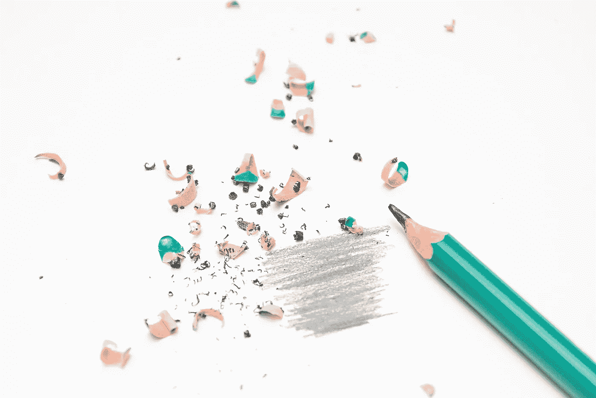

# 为什么设计对 SaaS 产品的成功如此重要？

> 原文：<https://medium.com/swlh/why-is-design-so-important-to-the-success-of-your-saas-product-2f22b25f47b1>

Why is design so important to the success of your SaaS product?

创造性的设计是你的软件即服务(SaaS)产品与竞争对手提供的产品和服务的唯一区别。仅仅因为你的 SaaS 产品漂亮并不意味着它有用。伟大的设计平衡了伟大的用户体验(UX)和好看的用户界面(UI ),创造出整体的产品体验，让你的客户惊叹，并把他们变成你最大的拥护者。你的用户界面定义了你产品的外观*，你的 UX 定义了你产品的工作方式*。两者都很重要，但是 SaaS 的产品所有者经常犯一个致命的错误，他们只关注外观和感觉，而不是同等重视可用性和美观性。

当您构建和增强您的 SaaS 产品时，您会收到来自当前和潜在客户的竞争性功能请求。对于您添加的每个新功能，您的 SaaS 产品会变得无限复杂。将很少使用的功能隐藏在设置屏幕中，但是要注意如何合并新的核心产品功能。两个客户可能希望以两种不同的方式实现相同的功能。您的工作是考虑不同客户希望使用某项功能的不同方式，并创建一个优雅的 UX，让首次用户无需查阅用户手册或知识库就能了解该功能的工作原理。

当您的 SaaS 产品跨多个平台工作时，您还需要考虑 UI 和 UX。为移动设备设计不同于为网络设计，所以确保你和一个了解 iOS 和 Android 最佳实践的设计师一起工作。您的移动应用程序支持的功能应该是人们将在移动设备上实际使用的网络功能的子集。随着时间的推移，您可以根据客户的要求为您的移动应用添加更多功能。

# SaaS 产品的设计是如何演变的？

Salesforce 和许多其他第一代 SaaS 公司专注于通过订阅业务模式使小型企业能够访问功能丰富的企业软件。

今天，许多采用软件即服务(SaaS)模式的公司都意识到了优秀设计的重要性。从长远来看，你的许多竞争对手都非常小心地设计他们的网站。他们关注好的设计仅仅是为了脱颖而出吗？如果我的应用程序很好地服务于它的目的，即使没有一个优秀的设计，我不会留住用户吗？有这么多选择，什么能让我的申请引人注目呢？本文收集了我们一路走来获得的见解，将帮助您找到您正在寻找的大部分答案。让我们试着理解是什么让他们如此重视设计。

# 这是什么逻辑？

如今，我们到处都在说网站的“用户界面”很棒，或者产品的“UX”很差。对于那些还不熟悉这些术语的人来说，UX 指的是用户体验设计，而 UI 指的是用户界面设计。它们两者齐头并进，但是它们迎合了设计学科的两个不同部分。UX 设计更具技术性，用户界面很像平面设计。你可以这样想，UX 更像是在舞台后面，就像你身体的不同器官为不同的目的而设计，而用户界面是你看起来的样子，是展示。这两者对你的产品的成功起着巨大的作用。

在用户界面设计的每一步，你如何平衡功能、效率、效用和价值将决定你的用户体验。简洁的设计拥有实用的图标、动态的界面、可用性以及美学上吸引人的设计，这是判断你的设计有多好不可或缺的一部分。

# 伟大的 SaaS 产品做什么？

我们大多数人仍然在激烈的竞争中奔跑，以同样的方式开始我们的一天。我们醒来，检查我们的信息，也许还会浏览我们的邮件。如果你在上班的路上堵车了，你会反复检查你的邮件，即使你已经检查过了。当你收到一份新文件或电子书时，你会毫不犹豫地扔进 Dropbox。这些是大多数用户的典型反应模式，是不自觉的。这些应用程序不再是一个深思熟虑的行动。这是一种习惯。你希望你的应用成为一种习惯。

相比之下，有目的驱动的行为。例如，当你在一个新的城市搜索一个好的本地语言翻译应用程序，或者为你的文档搜索一个编辑应用程序，一旦目的达到，你可能会卸载它。我们所有人最初开发一个应用程序都是为了实现一个特定的目的。现在的目标应该是将用户的目的性行为转化为一种习惯。

# 你为什么要设计一个习惯形成的产品体验？

每个产品的用户界面设计通常集中在目标驱动行为的设计上。您首先要为您的软件识别和开发一组功能，以满足您的用户和业务目标。优秀的设计师会确保你的用户界面设计能让你的用户很容易地使用这个功能。

现在，棘手的部分来了，你如何让你的用户在蜜月期后保持着迷？大多数情况下，客户注册，过一段时间后，当他们找到更好的应用程序时，就会离开。目标驱动的 UI 设计在一段时间后会失去价值，而习惯形成的设计会增加它们的价值。

一个习惯形成的 SaaS 用户界面是根深蒂固的，令人上瘾的，放弃是不舒服的。考虑一下从 Slack 转到脸书的工作场所。两者的目的是一样的，但是如果你尝试改变，你会意识到这需要有意识的努力。使得更容易坚持松弛。坚持懈怠代表了你想为你的 SaaS 产品建立的那种习惯。你的 SaaS 应用应该是你的用户在需要从事相关工作时，甚至不需要的时候，毫不犹豫地求助的对象。你的客户使用你的产品越多，这些习惯形成的机会就越多，他们就越重视它，你留住和发展有效客户的机会就越高。

# 构建 SaaS 应用程序时面临的常见设计问题是什么？

# 布局:

在用户界面上，你可以使用尽可能多的你认为谨慎和必要的元素来讲述你的故事。你如何安排这些元素来讲述你的故事，是我们考虑你的布局。这种布局对于良好的用户体验至关重要。

# 可访问性:

你的布局可能看起来很漂亮，但是它对你的用户有多大的直观意义呢？你日复一日地工作在你的应用程序上，所以这对你来说似乎是显而易见的，也许你的用户没有同样的感觉？你的用户能在不需要指南的情况下足够容易地访问你的应用程序的特性吗？

# 视觉设计:

今天，拥有一个能很好地完成工作的应用程序是不够的。它必须抓住用户的眼球。它必须吸引他们。但是不要走极端，记住新习惯是建立在旧习惯之上的。原创和极富创造力可能并不总是适合你。

# 数据库:

没有出路了。创建数据库时，表单是不可避免的。你的 UX 设计师必须让它更容易吞下，也就是说，让你的用户更容易填充它们。

# 创造一个伟大的设计需要什么？

# 第一印象:

你的主页就是你的登陆页，第一印象。在当今时代，用户的注意力持续时间越来越短，这可能是你产生影响的唯一机会。花很多心思在你的主页上你想要什么元素，这就是布局。记住，在你的设计中要留有足够的空间，这样最重要的功能才能迅速抓住用户的眼球。少即是多。

# 简单注册:

尽可能的无摩擦和快速。还可以简化入职流程。尽量不要保留试用注册所需的信用卡信息。

# 把这一切联系起来:

不要让你的用户为每一个次要任务都选择一个单独的屏幕。确保这种体验是坚定不移的，或者是尽可能直线的。可用性测试:我相信你已经在进行一些基本的可用性测试了。在每次更改后进行广泛的可用性测试是一个很好的实践。如果你正在通过你的员工或同事运行它们，确保他们不是那些已经在产品上工作过的人。不偏不倚的意见毕竟是目的。

# 奖励:

习惯是一次又一次的行为，应该通过反复的奖励在你的用户中根深蒂固。个性化这些奖励。例如，如果你的应用程序是一个社交媒体应用程序，某个用户倾向于在查看消息之前打开他的通知，那么下次他打开你的应用程序时，让它直接打开通知页面，而不是主页。让这些奖励稍微变得不可预测。它会让你的用户不断感到惊讶，并帮助你在早期建立势头。

# 让你的用户工作一会儿:

这听起来可能有点奇怪，但是给他们机会在每一步定制你的 SaaS 产品。你的用户越觉得他们在定制你的产品上投入了越多，他们就会留下来。如果你的应用程序已经积累了很多他们的联系人或歌曲等。他们就越有可能留下来，因为现在比他们从头开始的时候更有价值。

# 采用用户友好的导航:

设计的目的是确保你的产品能有效地吸引用户。导航是他们参与的方式，或者说是与你的产品进行对话的方式。让你的产品设备友好是必要的。考虑一下智能手机从标签导航到底部导航的转变。

# 享受表单带来的乐趣:

我明白了，很无聊。有什么好玩的？首先，抛弃标准的浏览器元素。定制它，使用微妙的视觉提示，多步式表单设计，个性化的感谢信，让你的用户更容易使用。巨大的下拉列表需要大量的输入，没有自动格式，不验证错误，盲目地遵循惯例，这些都是常见的容易补救的问题。

# 行动号召:

通常情况下，大多数行动号召按钮都试图让用户注册。在这里要有创造性，但是要确保你不会为了创造性而失去清晰。进行一些测试，看看什么对你的客户最有吸引力。图片:大多数严肃的用户喜欢在图片旁边附上小的描述，但是对于那些快速浏览的人来说，图片也可以。图像是必不可少的，因为它们会留下更持久的印象。

# 吸引人的内容:

这是不言自明的，也是显而易见的一点。不过，不要用内容塞满你的页面，图片效果更好。不管是哪种方式，都要适度使用，无论你做什么内容都要清晰易记。

# 演示和免费试用:

大多数用户不会马上注册。演示版和免费试用版是将他们转化为全职用户的更简单的方法。确保你的用户从一开始就知道这是一个选项，一个简单的方法就是让这些选项在登陆页面上可见。

> 这也不会伤害到对参与项目的团队的一瞥，让它对你的用户来说更加个人化。添加评价、轻松找到联系信息、产品评论，以及通过分享您为保护客户或用户信息而采取的安全措施来让他们放心，这些都是打造卓越用户体验的众多细节的一部分。

# 结论:

这一定很难理解，但归根结底是你的设计有多干净和连贯。它是将所有这些微小的细节拼凑在一起，记住习惯形成 UI 的设计规则。如今，SaaS 变得如此重要，是因为企业发现了将会计、销售、内容管理、企业资源规划和客户关系管理(CRM)连接到云中的价值。这种模型的受欢迎程度一定会持续增长，并且有很多东西会被用于构建这种模型的应用程序。即便如此，当被问及这种模式时，用户只谈论他们的用户体验，因为最终，它定义了他们与你的产品的关系。不要低估设计对于 SaaS 应用程序的重要性。

*原载于产品洞察博客来自*[***cognitive clouds***](https://www.cognitiveclouds.com)*:Top*[***SaaS 发展公司***](https://www.cognitiveclouds.com/custom-software-development-services/saas-application-development-company)

## 这个故事发表在 [The Startup](https://medium.com/swlh) 上，这是 Medium 最大的企业家出版物，拥有 298，432+人。

## 在这里订阅接收[我们的头条新闻](http://growthsupply.com/the-startup-newsletter/)。

