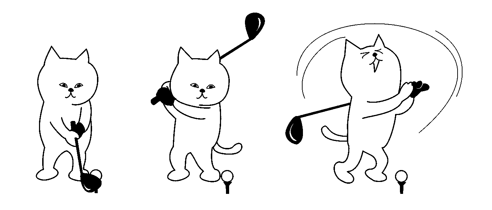

# 为什么有一个脸书网页对你的业务来说还不够！

> 原文：<https://medium.com/swlh/why-is-having-a-facebook-page-for-your-business-not-enough-58603e274a88>

Having a page on Facebook is not enough for your business.

我们希望越来越多的人知道我们的品牌和我们提供的服务。还有什么地方比社交媒体更能树立品牌意识呢！社交媒体的力量不可否认；你不仅可以传播你的品牌，还可以从头开始发展品牌形象。

话虽如此，**脸书是最大的应用，月活跃用户总数为 22.7 亿。**很明显，你应该为自己的企业创建一个脸书页面。你可能会。**但是仅有一个脸书页面是不够的。你需要一些东西来利用你的脸书页面去接触更多的人。**

这就是 Facebook Messenger 聊天机器人的用武之地！品牌越来越多地使用信使机器人来推送内容，通过投票/活动吸引受众，为他们提供个性化体验，并获得更多合格的线索。

拥有一个 Facebook Messenger 聊天机器人越来越成为你企业的一种营销需求，而不是一种选择。以下是你的营销策略应该包含 Facebook Messenger 聊天机器人的 5 个理由:

## 1.每个人都在脸书

> 如果脸书是一个国家，它将比人口最多的国家中国大得多。

由于脸书的用户群是所有应用程序中最大的，企业接触脸书的客户群是很自然的事情。

人们更有可能在他们已经使用的平台上打开信息，而不是安装新的应用程序。Facebook Messenger 发送的消息的打开率为 90%，高于大多数其他消息应用。因此，您有更好的机会通过 Facebook Messenger 获得关于您的服务/业务的回复。

## 2.不需要编码

Facebook 信使机器人仍然是一种未充分利用的资源，主要是因为企业害怕部署信使机器人的复杂性。部署信使机器人根本不需要看起来像一项艰巨的任务。

你不需要编码印章让机器人在你的页面上运行。通过简单的拖放操作，您可以通过 chatbot builder 的简单平台[获得您的 Messenger chatbot。](http://www.wotnot.io)

## 3.超越新闻提要算法的范围

你的脸书新闻订阅上的帖子是由各种算法控制的。所以，如果你认为仅仅依靠正常的脸书就足够了，请三思！

**算法更新大大降低了脸书帖子的有机可及性。**

Facebook Messenger 广告超越了常规算法更新的麻烦。通过点击至 messenger 广告和赞助消息，您可以轻松地充分利用 Facebook Messenger 来接触您的潜在用户。

## **4。当机器人跌倒时跳起来**

当涉及到客户查询时，聊天机器人通过回答一般的常见问题和消除人工持续监控的需要，最大限度地减少了等待时间。

然而，如果你觉得 Messenger 聊天机器人将无法处理复杂的查询，那么你没有什么可担心的。一个在线代理能够在需要的时候[加入对话](https://wotnot.io/human-handover/)来解决复杂的问题。不需要持续监控。

> **这是两全其美的做法:自动化你的客户服务，同时保持人性化。**

## 5.群发消息 Messenger 联系人

使用 Facebook Messenger 聊天机器人，您可以通过向受众群发消息来提高品牌知名度。

Facebook Messenger 聊天机器人发送的消息比电子邮件消息、付费广告和有机消息的打开率更高。这就是为什么选择 Facebook Messenger 聊天机器人对你的生意有好处。

> Facebook Messenger 机器人正在稳步变革企业开展客户服务、营销和销售的方式。

除了作为客户和他们的问题之间的直接沟通渠道，这些自动化的信使机器人为客户提供了他们所期待的东西——**自助服务和个人接触**。

使用自动化机器人，企业可以与客户实时互动，回答他们的查询，同时收集他们的偏好信息，以便他们可以提供个性化的体验，同时在这个过程中节省时间和金钱。

随着许多品牌意识到聊天机器人的重要性，创建一个聊天机器人变得比以往任何时候都容易。WotNot 允许你立刻为你的网站创建一个聊天机器人。**使用 Wotnot，只需使用 Google Sheets 就可以修改聊天机器人的对话。**你没听错！今天在 [WotNot](https://wotnot.io/) 测试一下。

## 这篇文章发表在 [The Startup](https://medium.com/swlh) 上，这是 Medium 最大的创业刊物，拥有+403，714 名读者。

## 在此订阅接收[我们的头条新闻](http://growthsupply.com/the-startup-newsletter/)。

