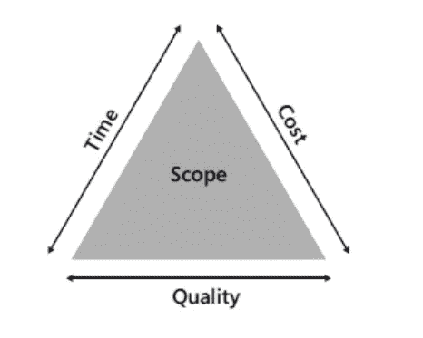

# 为什么我们的软件项目晚了？你应该问的 10 个问题

> 原文：<https://medium.com/swlh/why-is-our-software-project-late-and-10-questions-you-should-be-asking-instead-94b38325d497>

我决定写这篇文章，因为我听到了这个问题“我们迟到了吗？”在我的最后一个项目和我们的 MVP 一起投入生产的前几周。这让我反思这样一个事实:我见过的大多数项目迟早都会有一天，有人会问‘我们领先了吗？’，‘我们迟到了吗？’或者简单地说“我们为什么迟到了？”。

这是一个我非常热衷的话题，我可以谈论几个小时，但几乎每次第一个问题都会跃入我的脑海:**“你说的迟到是什么意思？”**

《牛津词典》将“迟到”定义为:*在预期的、适当的或通常的时间之后做某事或发生。*

这让我想到了下一组问题:

*   什么是**东西？**
*   **预计时间是多少？**

不幸的是，在许多软件项目中,“某些东西”仍然是预定义特性的列表。由风险承担者预定义，风险承担者也为团队预定义了截止日期。许多公司都这样做，他们可能不会意识到为什么这是错误的，它如何伤害团队，或者他们可以做些什么来改善。

大多数时候都是到了最后期限。

[‘deadline’](http://www.todayifoundout.com/index.php/2014/01/origin-deadline/)的起源来自美国内战期间在战俘营中的使用，当时它指的是囚犯被射杀的物理线或边界。

虽然今天的结果没有那么引人注目，但这个学期仍然存在很多紧张气氛。

在向前迈进并开始释放紧张情绪并解释为什么项目“迟到”或者为什么这个问题可能不是应该问的正确问题之前，让我们首先尝试理解为什么在软件项目中定义截止日期，以及人们问“为什么我们迟到了”的原因是什么。

**1。软件或功能发布需要在固定日期前交付**

例如，您的产品可能在公开发布活动或行业活动之前有一个发布截止日期。这是一个合理的理由，但并不总是正确的。让我们以过去的一个事件为例，那就是著名的史泼尼克 2 号太空发射。

在 1957 年 10 月成功发射第一颗人造卫星后，苏联领导人赫鲁晓夫想要在 1957 年 11 月 7 日，T2 十月革命 40 周年纪念日发射一艘宇宙飞船。这一“太空奇观”将重现苏联人造卫星 1 号的胜利，用苏联的威力震惊世界。一颗更复杂的卫星已经开始建造，但要到 12 月份才能准备好。

满足 11 月的最后期限意味着在很短的时间内建造另一艘全新的飞船。新飞船在要求的日期发射，并且是太空中第一只动物[莱卡](https://en.wikipedia.org/wiki/Laika)的主人。

不幸的是，遵守最后期限没有给工程师足够的时间来建造足够坚固的卫星，发射后几小时内一个主引擎出现故障，导致莱卡因过热而死亡。莫斯科建造了一座纪念碑来纪念这位著名的悲剧宇航员。如果卫星发射没有受到十月革命纪念日这一紧迫期限的限制，我们永远不会知道莱卡的命运会如何。

**2。截止日期促使我们现在就把事情做完**

设定最后期限会激励和推动团队完成所有事情。根据[帕金森定律](https://en.wikipedia.org/wiki/Parkinson%27s_law)，工作膨胀是为了填满完成工作的时间。因为我们不能无限期地等待发布一个特性或产品，所以在日期前加上前缀(大多数情况下是范围)将最终使团队完成所有事情。

我见过这种思维方式在很多项目中的应用。在我参与的最后一个软件项目中，利益相关者投资了一个大型的发布活动，以使产品广为人知并产生吸引力。该活动定于 3 月 27 日举行，团队有 3 个月的时间来交付一长串功能。团队不知道为什么或如何创建这个列表，因为涉众创建它时没有询问团队它在三个月内是否可行。

对团队来说，所需的功能列表似乎完全是虚构的，他们试图倡导一种更“敏捷”的产品开发管理方式，但随着日期的临近，团队越来越多地受到利益相关者的压力，他们不得不回答诸如“你为什么迟到了？”之类的问题。

所以开发人员开始工作更长的时间和周末…整整 3 个月。他们还开始制造技术债务，使得新功能的交付越来越不可预测。这开始将软件转化为一个定时炸弹，它会爆炸并在未来对产品产生重大影响。

但是随着日期的临近，压力越来越大。团队变得越来越累，但他们继续努力工作，而且…你猜怎么着？他们没有交付定义的列表。他们完全失去了动力，因为他们觉得过去的三个月是失败的。整整三个月，他们基本上每天都工作到很晚，很多个晚上都工作到很晚。在著名的发布会后，他们都休了一个月的假。这个月没有完成任何工作，几个月后，生产力和动力根本就没有了。

在这种情况下，简单的解决方案归结为“时间-范围-质量”三角形。如果我们不能调整范围，让我们给团队时间来交付适当的质量水平。另一方面，如果日期是必须的，让我们调整范围，看看我们如何在我们拥有的时间内提供最大的价值。如果我们不遵循这一点，我们将削弱我们团队在未来持续交付的能力，我们将继续努力达到任何有意义的里程碑。

不要忘记团队的快乐应该是产品健康的一个持续的衡量标准。在我的例子中，团队在著名的发布会之前和之后的 6 个多月里都是不开心和没有成果的。一些团队成员甚至很快就离开了团队。这对产品产生了直接而巨大的负面影响。

**3** 。**估计让高级经理和高管们高兴**

您的利益相关者对状态更新和报告感兴趣，以便获得可交付成果和后续步骤的可见性，并了解这些如何融入公司的战略。

虽然固定日期场景可能具有潜在的商业价值，但为了让高管满意而固定截止日期只会给个人带来价值，而不一定会给整个企业带来价值。

建设性的透明度通常是处理棘手交付的最佳方式。如果你只是为了让你的管理层高兴而试图说或接受不切实际的事情，那么一定要小心。人们往往更喜欢听虔诚的谎言而不是真话，但这迟早会适得其反。

**4。设定截止日期有助于计算基于时间的生产率，并允许根据速度进行规划**

这里的坏消息是，估计值(无论是衡量复杂性、时间还是难度)和速度都是主观的，并且不是统计确定的。

速度有时被用作度量标准，并用于跟踪团队的有效性。产品经理或利益相关者会看着它从一个迭代到下一个迭代。如果速度提高了一周，这意味着团队更有生产力。如果它在下一周下降，团队显然是懈怠的，应该受到严厉的批评。事实上，这两者都不是真正发生的事情。

即使积压工作在故事、杂务和 bug 之间得到了很好的平衡，每周仍然会有所不同。此外，我们无法 100%准确地预测未来。我们可以更好地估计，但不可预测的事情确实出现了，我们需要学会如何适应和有效地处理它。

此外，速度取决于项目的阶段。在第一周，速度是不稳定的，这是正常的。有时在项目的后期，速度也会波动，这没关系，只要你知道为什么。如果你不能解释你的速度波动的原因，这很好地表明你仍然没有真正理解你的团队面临什么样的挑战。

真正要避免的是将速度视为真理的一般来源，或者更糟糕的是，比较项目之间的速度。归根结底，速度是由什么组成的:估计值。

估计点数是另一个经常被误用的指标。

一个特性对于一个团队来说可以估计为 2 分，对于另一个团队来说可以估计为 1 分。然而，它是具有相同值的相同特征，并且两个估计都可以被认为是正确的，并且将被用作下一个估计的比较点。这并不意味着交付 2 点故事的团队比交付 1 点故事的团队工作得更好或更快。这确实意味着一个团队可能更了解这个领域，能够在上周准备好故事，或者任何其他数量的因素可以导致他们觉得故事不那么费力。

在与团队或利益相关者的对话中，我会非常小心地提及速度和评估。当我这样做的时候，我会把故事点作为衡量复杂性而不是努力的标准。

在那些努力推进估算、衡量工作和按时完成的公司里，我看到一些开发团队将他们的估算翻倍，然后在此基础上增加一些额外的时间，只是为了确保他们不会“迟到”。那有多大用处？他们怎么能相信自己的估计呢？他们怎么能相信他们所做的是正确的呢？

我假设你已经开始怀疑“为什么我们迟到了”是不是一个正确的问题。我建议试着列出 10 个你应该问的问题:

1.  更快对你来说意味着什么？
2.  你想优化什么？
3.  你愿意在未来走得更慢，还是现在走得更快？
4.  我们如何更快地发布这些特性，以便我们可以看到团队已经交付的价值？
5.  我们用户最大的痛苦是什么？
6.  我们为用户提供的价值是什么，如何提供？我们独特的价值主张是什么？
7.  是否有竞争对手能够做到这一点，或者目前已经做到了？我们只是在玩叙旧吗？
8.  人们使用我们产品的潜在收入是多少？
9.  我们如何扩展我们的产品和团队？
10.  产品团队快乐有凝聚力吗？我们相信他们快乐的时候会创作出最好的作品吗？

## 这个故事发表在 [The Startup](https://medium.com/swlh) 上，这是 Medium 最大的企业家出版物，拥有 289，682+人。

## 订阅接收[我们的头条](http://growthsupply.com/the-startup-newsletter/)。

