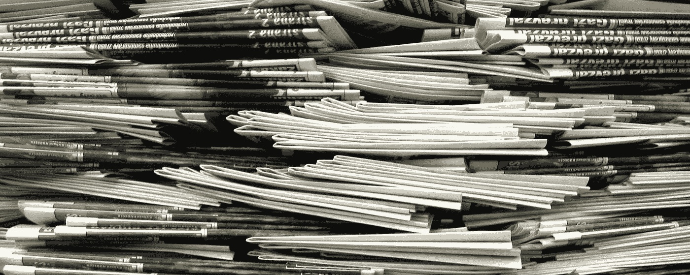
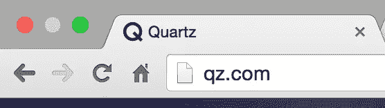
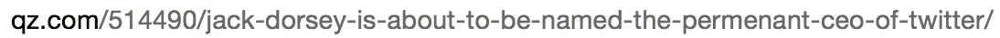
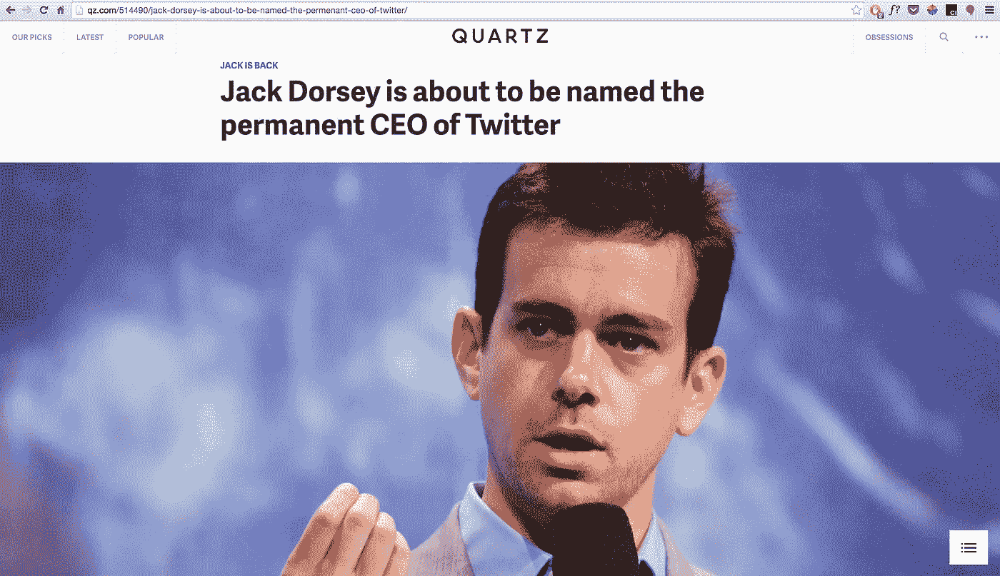
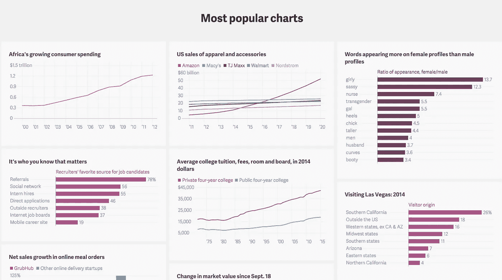
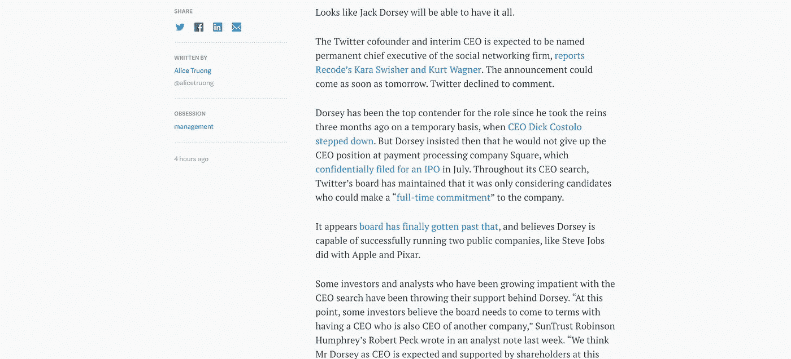
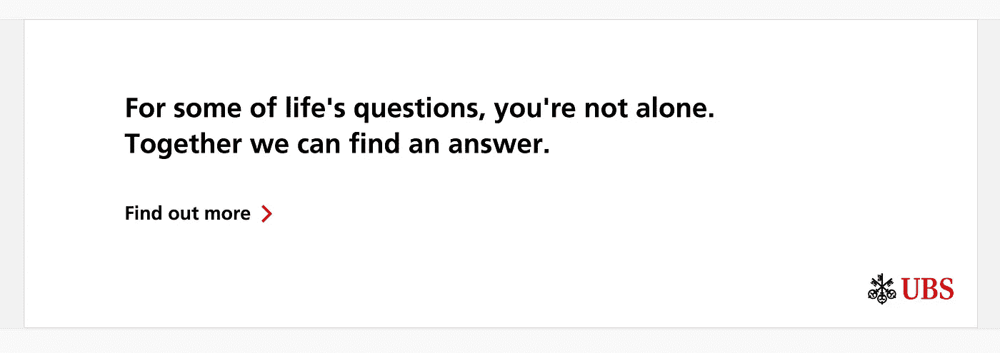
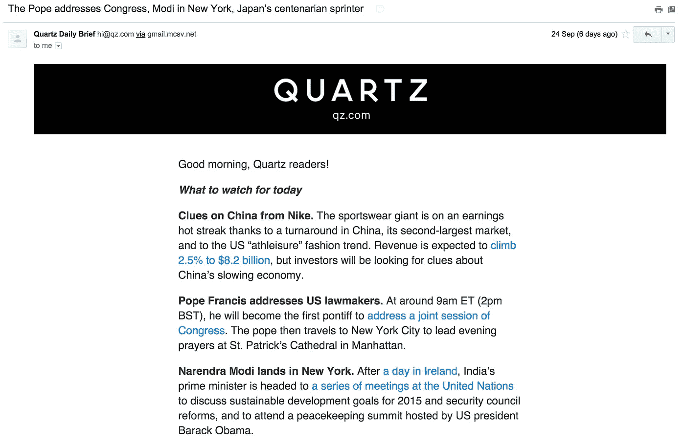

# 石英为什么这么好？

> 原文：<https://medium.com/swlh/why-is-quartz-so-good-eb6a9a0a31bb>

石英是一个令人印象深刻的现代答案，以不断变化的景观是新闻消费。

作为从大西洋媒体(Atlantic Media)剥离出来的一家新企业，该平台自 2012 年成立以来一直在快速增长。

Quartz 的优势在于三个主要领域——设计、内容和交付。

# 设计

## 去杂乱

该网站对向页面添加按钮、容器和图像等功能持极其保守的观点。相反，添加新组件似乎是经过深思熟虑的，只添加那些能为用户体验增加价值的组件。

The perfect domain name: short, memorable and different

Article URLs

URL 在参数中结合了一个简单的数字引用和一个较长的标题。聪明的是，文章可以用数字参数来引用。扩展的 URL 非常有效，可以作为标题。

An ultra minimalist logo sums up the brand

Mobile first design

1.  *当你在手机上访问网站时，固定在页面底部的链接给人一种熟悉的应用感觉。*
2.  *按钮的大小经过精心设计，以平衡手机有限的空间和功能。*
3.  字体经过精心挑选，在图片的映衬下显得格外醒目。
4.  字体权重巧妙地强调了每个区域的重要性。

## 不动产

该网站的简单性可以归因于对移动优先方法的设计重点。

# 内容

Article titles

1.  *每篇文章的标题通常比其他新闻来源的标题略长。这使得它们更容易理解，是对整篇文章的简洁总结。*
2.  *可选的蓝色副标题为文章类型提供了背景信息。*

High quality full width images are used at the beginning of every article. These help to set the scene

*Quartz 是最早采用无边距全幅图像方法的公司之一，现在这已经成为许多新闻网站的常规功能。*

Care in the quality of design goes so far that Quartz will redesign data extracted from other sources purely for increased clarity in an article

Side margins are predominantly kept clear, focusing readers on the article

A typical advert on Quartz

虽然广告是不幸的必需品，但对于网站上的人来说，质量比数量更重要。

一般来说，广告接近匹配整体页面设计。这可能会提高商业广告在抵制观众方面的成功率。

# 交付

Homepage links

*突出包含像“我们的选择”这样的选项有助于使网站感觉更加个性化。“痴迷”是另一个很好的例子。*

The Quartz daily brief

Quartz daily brief 是一个很好的例子，它展示了内容交付的完美之处。电子邮件是一个很难标记的地方，但对用户来说，这是一个强大的工具。

每日简短的电子邮件将通常复杂的新闻故事完美地总结成读者不费吹灰之力就能读懂的内容。同样，可以从粗体文本中提取一个概述，随后是更详细的摘要。链接被智能地用于提供对信息的进一步访问。

*发表于*[**【SWLH】**](https://medium.com/swlh)**(***《创业》、《流浪癖》、《生活黑客》* **)**

-