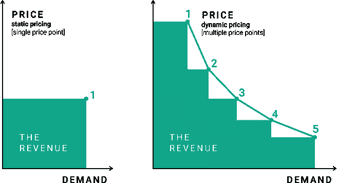
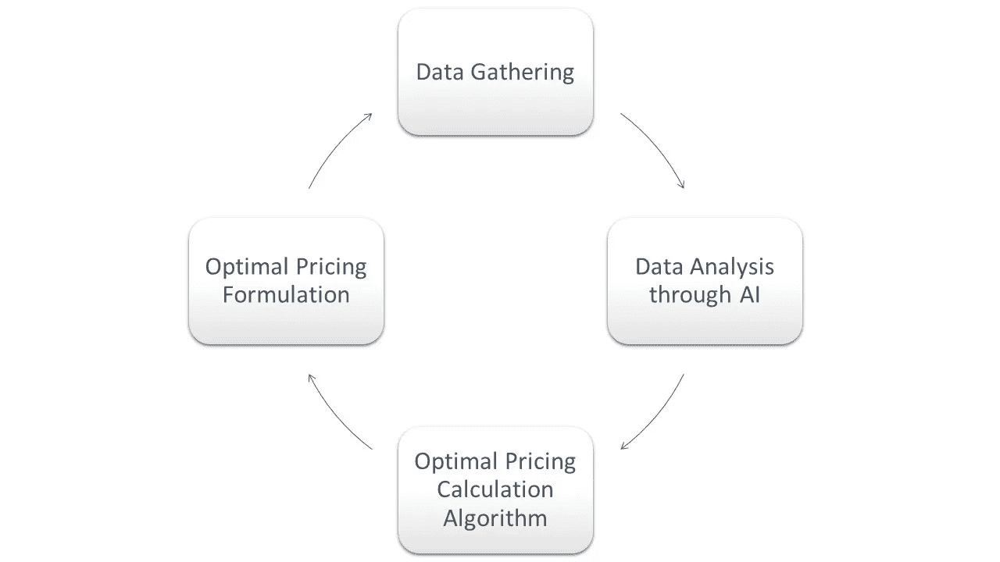
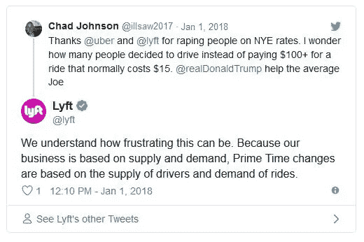

# 为什么优步向我收取的费用比我朋友高？人工智能和动态定价

> 原文：<https://medium.com/swlh/why-is-your-friend-getting-a-cheaper-uber-fare-than-you-ai-and-the-new-frontier-in-dynamic-pricing-2b7d908deed0>

正如 FICO Decision Management 的总经理 Bill Waid 所说，“动态定价是由美国航空公司(American Airlines)于 20 世纪 80 年代开始的一种做法，现已成为许多公司常用的营销技巧。从酒店、航空公司和娱乐活动到可能是最知名的电子零售商亚马逊，这些公司一直在使用动态定价来提高相对于供需快速变化的盈利能力。然而，大多数动态定价模型假设一个公司随着时间的推移向其客户群销售相同的产品。即使是考虑到产品差异的模型，通常也会假设卖家提供数量可控的不同产品。([来源](https://www.forbes.com/sites/forbestechcouncil/2018/07/09/ai-enabled-personalization-the-new-frontier-in-dynamic-pricing/#2ff251ce6c1b)

**TechTarget 的执行编辑 Don Fluckinger 表示，“新的是人工智能辅助的动态定价算法硬连接到 CRM 平台，让用户能够根据市场需求、当地事件、客户数据等自动进行实时定价。”** ( [来源](https://searchcrm.techtarget.com/podcast/How-enterprises-use-dynamic-pricing-algorithms-with-AI-CRM))

这一领域的增长主要与在线商务的增长有关。事实上，在 Kantify.com 上发表的一篇文章中，我们意识到“在线零售满足了算法定价的两个基本需求:

1.大量的数据，允许定价专家创建强大的客户行为统计模型。
2。快速有效地改变价格的能力。

随着在线零售的普及，算法定价也在发展。有鉴于此，许多主要的零售商和市场已经收购了专门从事算法定价的公司，以使他们获得超过竞争对手的优势。"([来源](https://www.kantify.com/article/3))

# 什么是算法定价

定价算法是一个数学公式，其中给定的价格是根据几个变量计算出来的。定价算法的一个简化示例可能是这样的:在线杂货店中苹果的价格可能是同一商店中香蕉(替代品)价格、竞争商店中苹果价格以及苹果需求是否很大(通过查看该产品相对于其他产品的点击数)的函数。这些公式通常试图最大化或最小化一个结果:公司的收入，未售出产品的数量等。

[Source](https://competitoor.com/dynamic-pricing-how-works/)

# 它是如何工作的？

[Ted gau Bert](https://www.linkedin.com/in/tedgaubert/),***Noodle Analytics 的联合创始人& CTO，帮助我们了解如何不断收集关于您的客户行为的数据，例如:
(以下文字摘自本文***)****

*   ***你看的是什么类型的商品？***
*   ***你在每个网页上花了多长时间？***
*   ***你购买了什么物品？***
*   ***你在篮子里放了什么东西？？***
*   ***你是哪里人？***

***所有这些数据和更多数据都被输入到一个人工智能引擎中，该引擎将你的行为转化为一个角色，并试图预测你的事情，其中一项是估计你愿意支付的“最高价格”。***

******

***然而,“支付意愿”可以用来决定你以当前市场价格购买一件商品的可能性。这种可能性被**微细分**纳入需求预测，并最终纳入价格预测。因此，人工智能引擎可以通过知道以什么价格卖多少来控制销售。此外，人工智能可以从其他传统来源收集数据。例如，人工智能可以了解全球范围内实时发生的本地事件，这比一群人所能做到的要经济得多。这使得公司能够利用人工智能收集不对称信息，从而实现更好的需求预测和战略定价决策。***

***Don Fluckinger 提醒我们，“今天，运行在云平台上的 CRM 软件，加上人工智能工具，采用动态定价算法，并将其与最先进的销售自动化相结合。人工智能动态定价已经完全融入了更复杂的销售战略，并可以使用越来越多的可用数据。”***

> ***价格每天甚至每隔几分钟都会变化。***

# ***优步的例子***

***DataRoot Labs 首席技术官兼联合创始人伊万·迪杜尔(Ivan Didur)表示，“例如，像优步这样的打车服务公司，可能会决定在城市的一个富人区和另一个富人区之间收取更多费用。或者，你可能需要为去一个更穷的社区支付更多的费用，因为公司的司机可能不愿意去那里。优步广泛依赖机器学习来建立一个强大而可靠的动态定价系统。在机器学习的帮助下，优步能够结合一个对外部因素非常敏感的系统，对市场的多种情况做出**未来感知预测**，例如全球新闻事件、天气、历史数据、假期、当地事件、时间、交通等。”***

******

***[Source](https://datarootlabs.com/uber-lift-gett-surge-pricing-algorithms/)***

***然后他们可以相应地调整他们的定价策略。因此，举例来说，如果你的网上历史行为表明你不喜欢在城市的某些地方逗留，当你决定偶尔去那里时，他们可能会向你收取更高的费用。同样，在线零售商开始使用他们收集的数据来确定人们对特价商品的反应。这种情况对行业来说是一个真正的游戏规则改变者。***

> ***一个人需要坐在屏幕前几个小时，根据市场研究的信息来决定价格的日子已经一去不复返了。***

## ***适应竞争价格和成本的能力***

***Crealytics 发表的一篇文章称,“根据【】Ask Your Target Market 的调查, 79%的消费者表示他们认为自己是便宜货购物者。78%的人表示，他们在购买之前会从多个来源比较价格。在网络环境中，调整价格以保持竞争力至关重要，因为竞争研究只需客户几秒钟/点击次数。***

***在基于 feed 的广告中尤其如此，在这种广告中，所有产品都是并排呈现给购物者的。**事实上，** [**谷歌购物实际上是通过在广告列表中给予价格没有竞争力的**](https://crealytics.com/blog/2017/06/30/get-product-price-right-google-shopping/) **产品较低的位置来惩罚它们，而不管 CPC 如何。*****

***主要由于自动化，动态定价在电子商务和市场中变得至关重要。在商店里，员工必须亲自修改数千种商品的价格，而在网上，商品的价格可以动态调整，而不会给企业带来太多成本。**[(来源)](https://crealytics.com/blog/dynamic-pricing-important/)*****

*****人工智能动态定价最大限度地提高利润，转换，市场份额或任何其他所需的商业关键绩效指标。即时定价建议缩短了手动定制定价决策的漫长准备时间，使员工能够专注于面向客户的高价值活动。Ted Gaubert 说，“所有复杂算法相互作用的结果决定了我们的报价、我们看到的广告以及我们购物时找到的产品组合”([来源](https://www.kdnuggets.com/2017/12/how-ai-learns-different-prices.html)*****

# *****有关更多信息:*****

*****-[https://www . Forbes . com/sites/forbestechcouncil/2018/07/09/AI-enabled-personalization-the-new-frontier-in-dynamic-pricing/# 2ff 251 ce 6 C1 b](https://www.forbes.com/sites/forbestechcouncil/2018/07/09/ai-enabled-personalization-the-new-frontier-in-dynamic-pricing/#2ff251ce6c1b)
-[https://search CRM . tech target . com/podcast/How-enterprises-use-dynamic-pricing-algorithms-with-AI-CRM](https://searchcrm.techtarget.com/podcast/How-enterprises-use-dynamic-pricing-algorithms-with-AI-CRM)
-[https://www.kantify.com/article/3](https://www.kantify.com/article/3)
-[https://competitoor.com/dynamic-pricing-how-works/](https://competitoor.com/dynamic-pricing-how-works/)*****

## *****感谢阅读。如果你喜欢这篇文章，请随意点击那个按钮👏帮助其他人找到它。*****

**********

## *****这篇文章发表在 [The Startup](https://medium.com/swlh) 上，这是 Medium 最大的创业刊物，拥有+388，456 名读者。*****

## *****在这里订阅接收[我们的头条新闻](http://growthsupply.com/the-startup-newsletter/)。*****

**********