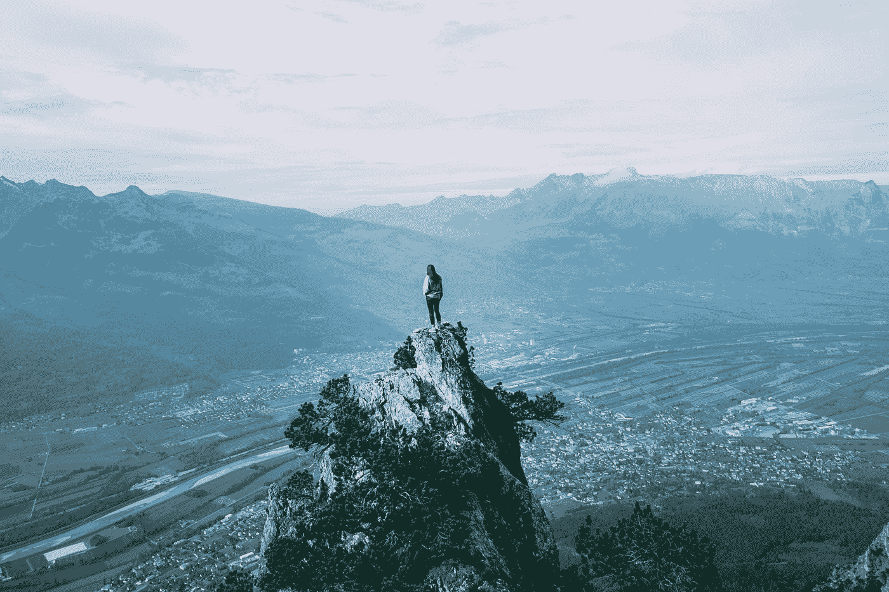
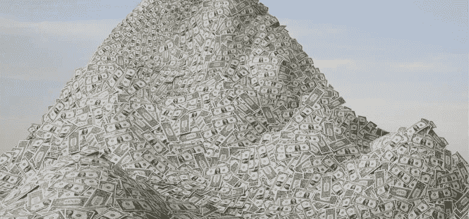
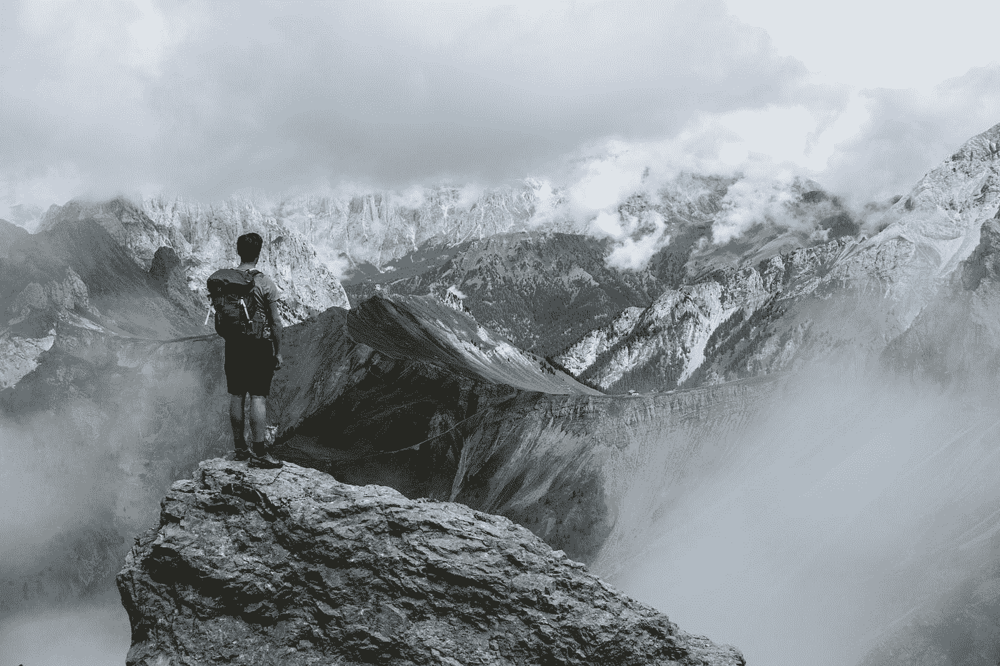

# 为什么爬山时很难看到顶峰

> 原文：<https://medium.com/swlh/why-its-hard-to-see-the-summit-when-you-climb-a-mountain-bf7c3bfb7237>

## 我爬错了山

## 你爬过山吗？

你当然有。

当你走近并从远处看到一座山时，你会惊叹它看起来是多么的巨大和美丽。当你徒步或驾车上山向顶峰进发时，你会充满兴奋。你迫不及待地想要登顶。

但是**当你开始攀登的时候，你再也看不到顶峰**。你太近了。你只能看到前面的曲线，其他什么也看不到。
你不知道你已经走了多远，所以你开始猜测。
我进行到一半了吗？直到我从山顶欣赏壮丽的景色还有很长的路要走吗？

# 堆积如山的钱

Picture: treasurers.org / john lund

我们周围有许多不同类型的山。
其中之一就是**钱山**。

金钱是我们世界的引擎。它在我们生活中的重要性改变了我们的行为。虽然我们都在背诵“钱不是最重要的”这句话，但我们的行为却不像它。在内心深处的某个地方，我们会无休止地渴望它。我们要么羡慕，要么在那些“30 岁以下的百万富翁”(好吧，现在是亿万富翁。一百万不算什么，加油！我们有这样一种观念，钱越多越好。但是哪方面更好呢？我们都说我们想要快乐。我们都说金钱买不到幸福。然而，我们大部分时间都在思考、赚钱或渴望金钱。

我记得当我第一次走近这座名为金钱的山时——它看起来很漂亮，闪闪发光。这看起来很可怕，但我无法停止幻想那个辉煌的山顶。我迫不及待地想去那里欣赏我久闻其名的美景。我听说有人完成了那段旅程。高潮应该是惊人的。这是一切变得更容易的地方。它鼓励我继续前进。

但是和我爬过的其他山一样，我一上坡就看不见峰顶了。所以我在脑海中保留了它的形象来激励我。我不知道我已经爬了多远，但我继续前进。在某个时刻，我担心我永远也到不了那里。我想:“也许不是每个人都能到达山顶。”我觉得累了。我失去了动力。看起来峰会离我越来越远了。好像长高了。

> “我们征服的不是高山，而是我们自己。”
> ~埃德蒙·希拉里

我读了另一本指南。我试了一条捷径。我绕道走了。什么都没用。但是我一直在上坡。我没打算放弃。我已经走了这么远了。当我迈着又小又累的步子往上爬时，我渐渐忘记了当初为什么要这么做。似乎每个人都在爬那座山，所以我不再怀疑自己。“无论如何，我都不会退缩，”我对自己说。

我注意到有人在我身后几步远的地方。我不可能让他通过。我也看到前面有一些人。我想叙叙旧。我不得不加快步伐。但是无论我的速度有多快，我都觉得这是一条永无止境的路。这条路很陡。我变得沮丧。我觉得很痛苦。
正当我怀疑自己是否在转圈时，令人惊奇的事情发生了。我终于到达山顶了！**我深深吸了口气**。“多美的景色啊，”我心想。我周围的人似乎并不高兴。就在那时，我意识到我实际上并不在峰顶。显然，我还有很长的路要走。

# 满足感之山

幸运的是，我的父母总是鼓励我攀登我的成功之山。他们说:*“找一座你想爬的山，我们无条件支持你。”* 他们就这样做了。
长久以来，我一直在攀登这座圆满之山。
是我自己的山。我们都有自己要攀登的山峰。我的这座山很高。比珠穆朗玛峰还高。
其实我都不知道有多高。我从未见过它的顶峰。
但有一点和喜马拉雅山很像——**有很多山峰。每征服一个人，一种特殊的感觉就会传遍全身。这是迄今为止我感受到的最有力量的感觉。我会在每个山峰停留一段时间来欣赏它。我在继续攀爬前会充电。我永远不会忘记标出我征服的每座山峰。这样我就可以一直带着欣赏的心情回顾它。**

有时候我缺乏能量，所以我停止攀登。我觉得我的山太陡了。但是我总是得到爱我的人的支持。它们让我想起那些我已经插上的旗帜是如何骄傲地在风中飘扬。这给了我继续前进的动力。

> "每座山上都有一条小路，尽管从山谷里可能看不到."~西奥多·罗特克

最近，我开始感觉到，随着时间的推移，峰顶越来越高。我吓坏了。我这辈子都不可能爬到顶峰。
但当我意识到时，令人惊讶的事情发生了——我感到如释重负。
事实上，我感到高兴。这个启示帮助我塑造了爬山的方式。我没有期待幸福的顶峰，而是表现得好像顶峰并不存在。因为事实并非如此。
是看不见的。云层之外的某个地方。如果没有办法到达那里，也许我就不该去。我可以专注于我的旅程。我采取的步骤。我不在乎还要走多久。我不是在寻找捷径，也没有拿自己和别人比较。我享受我迈出的每一步。我总是处于最佳状态。

> 如果你觉得那是你想做的，就一起鼓掌👏

# 感谢阅读！欢迎[关注我](/@saaroron):

 [## 萨尔·oron⁦⁦👈-中等

### 阅读萨尔·oron⁦⁦写的最新故事👈在介质上。我是萨尔。大多对音乐和人充满热情。在…

medium.com](https://medium.com/@saaroron/latest) 

**阅读更多:**

 [## 这就是我如何发现我的超能力的

### 以及如何找到你自己的！

medium.com](/swlh/this-is-how-i-discovered-my-superpower-b2f1a67fb100)  [## 为什么“努力工作”并不总是答案

### 我们从小就被教育努力工作的重要性。我们必须努力学习，在学校取得好成绩，并且…

medium.com](/@saaroron/why-hard-work-is-not-always-the-answer-dee67accde1a) 

## 这个故事发表在 [The Startup](https://medium.com/swlh) 上，这是 Medium 最大的创业刊物，拥有 319，931+人关注。

## 在这里订阅接收[我们的头条新闻](http://growthsupply.com/the-startup-newsletter/)。

