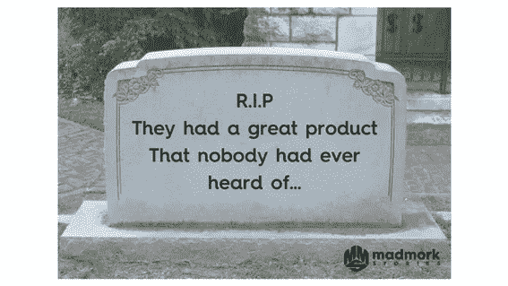

# 为什么关注品牌永远不会太早

> 原文：<https://medium.com/swlh/why-its-never-too-early-to-focus-on-branding-49006d3e4395>

风投和企业家经常问我，什么时候是开始为他们的公司打造品牌的合适时机。我总是得到同一个答案:为什么你还没有开始？

科技界普遍存在一种误解，认为打造品牌是一种奢侈。当你筹集了 B 轮融资，拥有强大的产品渠道，每年 2000 万至 3000 万美元的运营成本，拥有 3 至 4 年的品牌推广经验和预算时，你通常会开始做这类事情。那是胡说。

我不会去探究品牌是什么，为什么它如此重要。如果你好奇，我有一整篇文章，你可以在这里查看 [**。**简短的版本是这样的:](https://www.madmork.com/single-post/2017/05/16/Tech-Companies-Need-a-Little-More-Viking-in-them)

[1。强势品牌提供定价能力(即更高的定价与竞争)](https://www.madmork.com/single-post/2017/05/16/Tech-Companies-Need-a-Little-More-Viking-in-them)

[2。降低客户流失率](https://www.madmork.com/single-post/2017/05/16/Tech-Companies-Need-a-Little-More-Viking-in-them)

[3。更低的广告成本(由于更高的品牌召回率/保留率和信任度)](https://www.madmork.com/single-post/2017/05/16/Tech-Companies-Need-a-Little-More-Viking-in-them)

[4。强大的品牌激励员工(并帮助他们留下)和潜在的新员工。](https://www.madmork.com/single-post/2017/05/16/Tech-Companies-Need-a-Little-More-Viking-in-them)

那么，你为什么要从现在开始打造自己的品牌呢？

1.**单数方向和目的**。当你建立了你的品牌圣经(见我的帖子 [**这里**](https://www.madmork.com/single-post/2017/05/11/Why-every-startup-needs-a-Brand-Bible) 了解它是什么和它包括什么)你会对你的愿景、使命、品牌故事、信息、目标受众和存在的理由有一个清晰的定义。这是一份活生生的文件，帮助指导公司的其他人应该做什么，不应该做什么。

2.使许多决定变得更容易。当你有非常清晰的愿景和使命时，产品会议会变得容易得多。当你有一个清晰的品牌使命、受众和信息时，添加或删除某个功能就简单多了。当你有疑问时，你可以参考品牌圣经，问“这是品牌的新产品特征吗？”或者“这种新的客户服务流程符合我们的品牌价值观吗？”一个经过深思熟虑的品牌圣经让你公司各个部门的决策变得更加简单。

3.**更容易招聘:**证据摆在那里:千禧一代 [**希望为有强烈目标感和强大品牌的公司工作**](https://www.fastcompany.com/3041738/millennials-want-to-work-at-organizations-that-focus-on-purpose-not-just-p) 。因为你马上就要开始招聘了，所以你有能力清楚地表达你和你的品牌所代表的东西会(或不会)激励和鼓舞潜在的雇员。你想尽快找到优秀的员工，对吗？给他们讲一个伟大的故事。

4.**这需要时间。即使在移动、社交媒体和在线视频的时代，建立一个品牌也需要时间。金钱当然可以加速这一过程，但建立你的品牌价值、制定媒体策略、开发引人注目的内容以及简单地将所有这些凝聚在一起都需要时间。如果你的产品很复杂，需要你去教育用户和市场，那就更是如此。以内容为例，从你开始创建伟大的内容(无论是博客、视频、信息图表或其他)开始，可能需要长达 4-6 个月的时间，你的材料才会真正开始出现在基于你想要关联的标签和关键词的搜索结果中。**

5.如果你不这样做，你的竞争对手就会这样做。科技的墓地里散落着许多人，他们认为“我只要在产品上再多花一点时间；还没完全准备好。”或者“哦，那只是我还真的买不起的东西。”你听说过 [**懈怠**](http://www.slack.com/) 吗？大概是的。你听说过霍尔吗？大概不会。Hall 是一款在 Slack 之前就已经发布的企业消息应用。他们有一个非常合理的产品，良好的功能和坚实的资金。但他们从未准备好开始营销。他们总是想调整和改进产品多一点点。最后，Slack 的人进来了，在执行和营销上胜过了他们。“先行者”能赢吗？是的，他们可以。但是“快速跟随者”也可以通过从你的错误中学习，制造更好的产品，或者通过更好的品牌来说服客户他们有更好的产品来赢得胜利。可悲的是，它甚至不一定是完全正确的。成为先行者并不能保证成功。

创建一家公司和一款顾客喜爱的产品是你能做的最难的事情之一。不要让这成为你所有工作的证明:

那么你能做什么呢？

好消息是你可以从今天开始。下一个好消息是，你不需要从 [Accel](http://www.accel.com/) 或 [Kleiner](https://www.google.com/url?sa=t&rct=j&q=&esrc=s&source=web&cd=1&ved=0ahUKEwj7k8Hzz8DUAhVX9WMKHXaiBdIQFggmMAA&url=http%3A%2F%2Fwww.kpcb.com%2Fteams&usg=AFQjCNHo_U6lUrsDloRdGsezXmAl9nTKIg) 那里筹集 2000 万美元来做这件事。这里有 5 个简单的步骤，你可以开始认真对待你的品牌:

1.**开发你的品牌圣经**。这只是需要你和你的合伙人付出时间和努力，但如果做得好，会有很大帮助。这里有一个 [**帖子**](https://www.madmork.com/single-post/2017/05/11/Why-every-startup-needs-a-Brand-Bible) 解释了包含的内容和好处。

2.**开发强有力的标识和视觉形象**。同样，你不需要很多钱来做这件事。可以找一个好的设计师在 [**99designs**](http://www.99designs.com/) 上开发一个很强的 logo。或者花 400 美元买下 [**visual.ly**](http://www.visual.ly/) 所以，投入时间，好好做吧。

3.在你做的每一件事上都坚持不懈地使用你的商标！你的网站、手机应用、名片、内容营销、电子邮件。我是说一切。以同样的方式应用它，使用同样的比例，并对它持教条主义态度。

4.**尽早确立你的愿景、使命和品牌价值**(你会将此作为你品牌圣经的一部分)，并在每个人面前重复这些内容。你重复得越多，你的员工就越能理解，这将成为你文化的一部分。这样，品牌上有什么，没有什么就变得显而易见了。

5.开发一个引人注目的故事。人们不买产品或功能，他们买的是好处。当他们购买你的产品时，他们购买的是一个关于“为什么”你做你所做的事情以及这如何使他们成为一个更好的人的故事。帮助他们做到这一点，开发一个真正令人信服的叙述，说明你为什么做你正在做的事情，以及这对他们有什么好处。

品牌不是短跑。这是一场马拉松。它需要速度、耐力、耐心、专注和一致性。所以早点开始，保持专注。

希望有所帮助，祝品牌愉快。一如既往，请随意点赞、分享或评论，不要忘记订阅我们的邮件列表。如果您对帖子或视频有任何特殊要求，请告诉我，祝您品牌推广愉快！

帕特里克·疯子·默克

首席说书人

## 这个故事发表在 [The Startup](https://medium.com/swlh) 上，这是 Medium 最大的创业刊物，有 290，182+人关注。

## 订阅接收[我们的头条](http://growthsupply.com/the-startup-newsletter/)。

