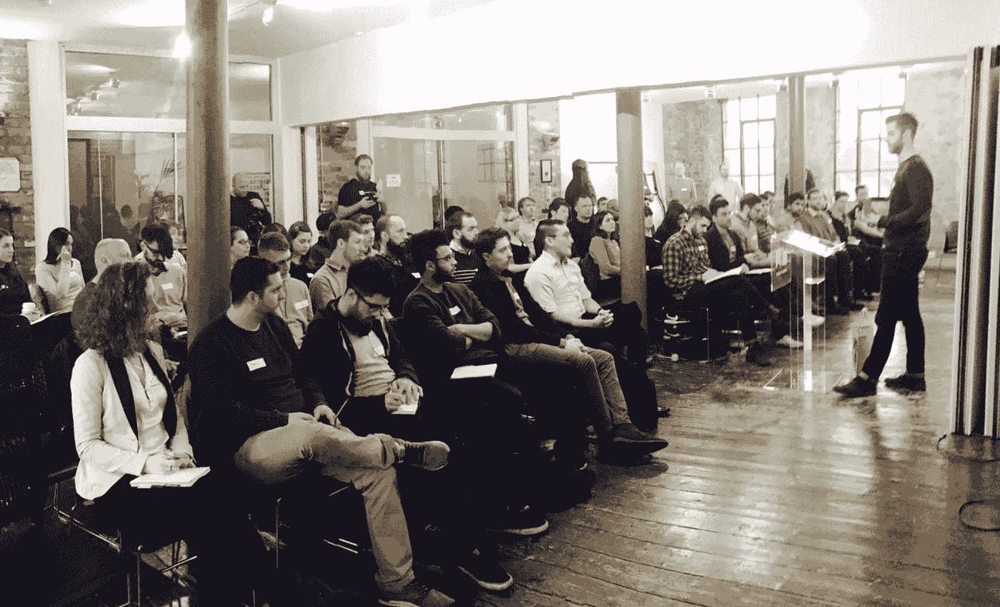
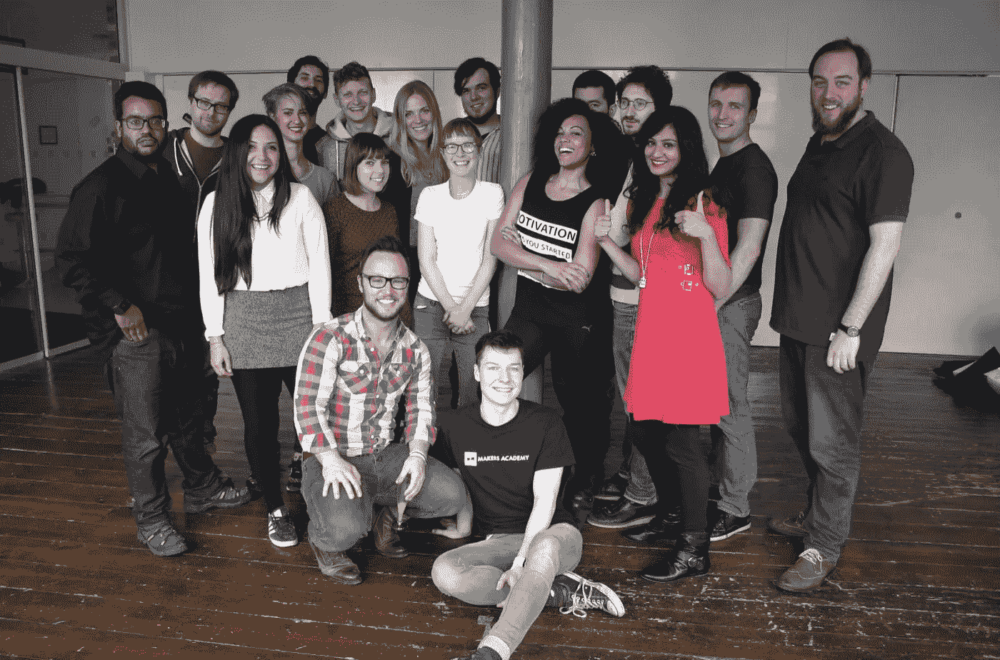
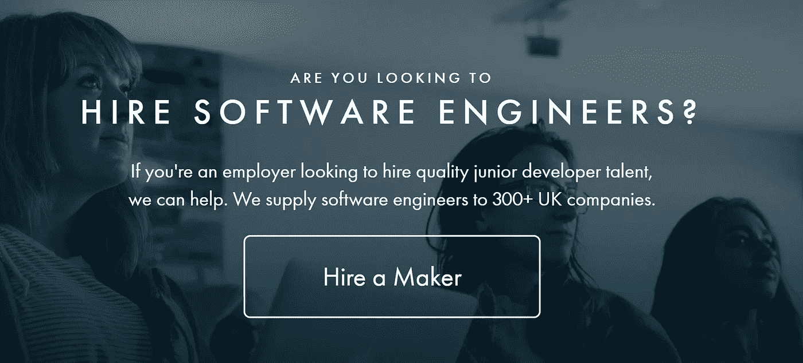

# 为什么让你的员工自己选择薪水？

> 原文：<https://medium.com/swlh/why-let-your-employees-choose-their-own-salaries-35588fe53014>

像 Semco、Buffer、Squaremouth、SumAll 和 WholeFoods 这样的公司已经表明，向员工提供以前保密的信息，如工资，可以反直觉地提高参与度，并对公司文化产生积极影响。以下是对 Markers Academy 首席执行官兼联合创始人 Evgeny Shadchnev 的深度采访，内容涉及如何、做什么和为什么。

创客学院是一个真正令人着迷的初创企业。欧洲领先的 Web 开发人员训练营，不仅教授“软件工艺原理”，还支持学生获得他们的第一份编程工作，这就是我所说的文化第一公司。创客学院是 Evgeny Shadchnev 和 Rob Johnson 在 Forward Labs 相遇时创建的。他们两人之间关于学习编程的一次谈话让他们意识到，尽管计算机科学项目擅长用理论训练学生，但他们正在训练人们成为计算机科学教授，而不是程序员，因此必须采取一些措施。于是创客学院诞生了。

**亮点:**

**公司里的每个人都给自己定了工资。**

**他们不面试候选人，而是让潜在雇员面试他们*****。***

*作为面试过程的一部分，创客学院会付钱让应聘者来公司工作一天。*

*做出雇用新团队成员的最终决定是团队的责任，而不是 CEO 的责任。*

***他们在销售团队中不使用目标，也不支付销售佣金或奖金。***

**

*‍*

*我们以讨论一个令我着迷的差异领域开始了我们的采访——从首席执行官开始，所有员工都决定自己的薪水。我第一次看到员工给自己定工资是在阅读里卡多·塞姆勒的杰出著作《七天周末:改变工作方式》的时候。从那以后，一些公司如 Buffer，Squaremouth，SumAll 和 WholeFoods 已经表明这是激进的，但它是有效的。*

***叶夫根尼在一篇关于此事的公司** [**博客**](https://blog.makersacademy.com/how-to-self-set-your-salary-6f4819361335) **帖子:***

*传统上，工资和随后的加薪是由员工和公司代表协商决定的，或者是根据一个预先设定好的公式来决定的，没有多少协商的余地。*

*这个过程本质上是对抗性的。它基于这样一种假设，即员工以自私的方式行事，试图以公司为代价最大化自己的个人利益。*

*在大多数情况下，这种设置鼓励员工争取尽可能高的薪水，同时鼓励经理在他们预期员工会提高他们的薪水期望值时进行反击。在大多数公司，工资谈判并不鼓励任何一方特别开放和诚实，而这是同事之间建立信任的基础。*

**因此，在创客学院，我们决定自己设定薪水。我们认为，每个人都最有资格对自己的薪酬做出合理的决定。**

*‍ **你自己设定工资的流程在实践中是如何运作的？***

*我们一直在重复这个过程。一开始，我们与整个团队就个人薪酬进行了完全公开的讨论。我们意识到这不是一种理想的形式，所以我们决定将这一过程改为私下进行初始对话，个人将与团队的其他成员就他们的工资进行一对一的对话，然后与整个团队分享最终结果。过程如下:你需要写一篇文章，描述你的角色，过去一年你在做什么，你做得好和不好的地方。你概述了你希望薪酬发生的任何变化及其原因，与外部市场相比如何(这是关键数据点之一)，以及你提议的薪酬与你在公司的任何股权有何关联。每个团队成员都应该每年这样做，大约在他们加入我们的周年纪念日。如果你和同事之间，或者你和市场之间存在薪资差距，你应该反思一下原因，如果你想加薪，就提出理由。自我设定薪酬并不是征求许可；这是关于获得反馈。目标不是让别人认可你的薪水，而是获得对你所做工作的反馈，它所产生的影响，以及了解你和你的工作如何被你的同事所认知。公司每个人都这么做，包括我。*

*对于新加入者来说，它是如何工作的？*

*我们以通常的方式进行谈判，我们从一开始就对我们可能提出的报价(或工资范围)持开放态度。有时会有正常的来回谈判，但其范围通常是有限的，因为工资是内部公开的。与未来的同事坦率地讨论他们的角色和薪水通常是这个过程的一部分。*

**

*‍*

***作为一家公司，你做了什么来定义你的公司价值观？***

*去年 9 月，我认为请外部顾问来帮助我们制作公司手册是个好主意，虽然它是在预算内按时制作的，虽然顾问 T2 和团队谈过，但结果是团队没有深入参与这个过程，最终产品也不是我们想要的。我们回到绘图板，从头开始重新设计项目，将团队中的一个人放在过程的驾驶座上。她的工作是确保我们最终得到一份连贯的手册草案。*

*为了完成这份草稿，她通过写作、获得团队反馈、编辑和重写的连续过程，在个人访谈和小组研讨会中与团队中的每个人交谈。我们不期望每个人都为流程的每个部分做出贡献，但同时我们希望避免在没有他们的投入的情况下向团队展示成品，所以我们正在以协作的方式创建成品。*

*我们认为手册是一份活的文件，从这个意义上说，它永远不会完成。我们现在所做的是一个非常坚实的草案，我们希望在 2018 年春天之前上线——尽管我们没有承诺一个严格的截止日期，因为质量比满足一个任意的日期更重要。*

*该手册由两部分组成:首先，我们的理念，我们将公布于众，其次是关于如何处理实际问题的信息，如如何给公司开发票或入职流程。公开分享其中一些是有意义的，因为当我们问求职者为什么他们申请与我们一起工作时，他们通常会引用我们的文化。当我们问他们是如何了解到这一点的时候，他们会指向我们的博客帖子，在那里我们会解释一些事情，比如自我设定工资或其他公司流程。*

*对我来说，定义和烘培公司价值观不是一蹴而就的。我希望我们的价值观会随着公司的发展而不断变化。当我们是一个五人团队时，我们拥有的价值观与我们 25 岁时的价值观是不同的。我们希望从我们的工作实践中获得更具体的价值观和如何实施这些价值观的实际例子，这些将需要随着公司的发展而更新，否则这些价值观及其对公司的意义将变得陈旧。*

**

***你如何通过面试来确保文化契合？***

*无论职位如何，我每次面试都会问的第一个问题是“你为什么想加入创客学院？”这个问题经常成为面试过程中最重要的一个问题，因为我试图了解这个人如何看待他们自己、他们的世界、他们的目标以及对他们来说什么是重要的——关键是这与我们的价值观和目标有什么联系。我的主要关注点是努力确保公司和候选人在价值观层面上保持一致，因为如果出现不匹配，那么无论候选人多么有才华或聪明，都很难甚至不可能适应我们的文化。换句话说，在我们让*和*开始讨论技能组合之前，我们试图确保他们和我们在为什么做我们在创客学院做的事情很重要的问题上是一致的。*

***你能给我举一个最近你的价值观在公司内部实施的例子吗？***

*我将以我们职业团队的招聘为例，结合我们真正关心的价值观之一，即我们为学生提供的体验质量。我们的职业团队负责在学生完成创客学院课程后为他们安排工作。通常情况下，在其他公司，职业团队的角色会非常关注目标和收入。正如我提到的，我们非常关心学生体验的质量，所以我们的主要目标是让我们所有的开发人员都投入到他们真正热爱的工作中。因此，一个适合我们职业团队的人应该更关心如何为我们的开发人员找到一份好工作，而不是最大化我们的收入和他们的潜在佣金。举一个已经发生过很多次的例子，课程中的一个开发者想在我们的招聘伙伴网络之外的公司找一份工作。我们将投入时间帮助他们准备面试并获得工作，即使我们不会为此获得报酬。从短期来看，创客学院将会失去收入，但从长期来看，我们为学生做了正确的事情，他们可能会继续向他们的朋友和网络推荐我们。*

*更进一步，为了能够专注于为我们的学生提供优质体验，我们作为一个团队决定不通过佣金来激励我们的销售人员。这让每个人都有了相同的目标，这让我们为学生做了正确的事情，并且我们相信，从长远来看，对企业也是如此。这实际上使职业团队的招聘变得更加容易。如果在招聘过程中，我们遇到一个受金钱驱动的潜在销售候选人，我们知道他们可能不会在创客学院茁壮成长。我们雇佣的销售人员关心的不是销售佣金，而是赚钱，这是他们的首要目标。*

***你是如何做到的？***

*我们真的试图确定在面试过程中人们最感兴趣的是什么——他们对让开发人员从事有回报、有成就感的工作并能对他人的生活产生重大影响的想法感到兴奋吗？或者他们更感兴趣的是在季度末获得某种形式的财务奖励？不要误解我的意思:佣金结构或受金钱激励没有任何问题，我也不是说我们做事的方式比其他方式更好。我只是想确保我们在首先需要做的工作上是一致的，以及*为什么*一个候选人可能想要做那份工作。这意味着我们职业团队中的大多数人都没有传统的销售背景。他们几乎总是有相关的经验，例如帮助人们获得令人惊叹的工作，或者帮助人们获得成功，或者帮助公司雇用令人惊叹的人才。*

***这有什么样的连锁反应？***

*这使我们有别于市场上的其他公司。当我们与招聘伙伴谈论他们为什么与我们合作时，他们告诉我们，“你是人才的来源，但你不是招聘人员。你不是来卖给我的。你是来解决我的问题的。当我们的职业团队去见我们的招聘伙伴时，他们非常自豪地告诉他们，“看，我们不是在接受佣金，我们不是销售人员，我们不是想尽快完成交易。”。我们希望解决问题，如果我们做得好，我们将帮助您，帮助我们的开发人员，并建立长期的合作关系。我们的招聘伙伴面临的销售压力要小得多。我们不做爆炸式的报价，我们不打电话，一天打几百个电话。我们努力在解决他们的问题上做得真正好，我们的招聘伙伴非常欣赏这一点。*

***深切关心学生的成功是一种价值观。还有哪些例子可以分享？***

*我们的另一个核心价值观是信任。我们雇佣员工，并相信他们会做任何他们认为正确的事情来推动业务发展。实际上，这意味着他们可以控制自己的日常实践、工作时间、做什么、怎么做等等。我们相信我们的团队成员会想出正确的方法来完成他们的工作，他们被聘用时所依据的工作规范实际上是对我们很重要的一系列事情。我们的期望是，我们雇佣的人会找到实现这一目标的最佳方式。*

*这方面的一个例子是，在难民危机最严重的时候，我们与一个慈善组织合作。我们找到了一种方法，资助一名来自埃及的难民学习我们的一门课程，然后为他们在英国一家顶级公司找到了一份工作。对那个人来说，这是一个真正改变人生的故事，它的发生不是因为我们在任何一年都有做这种事情的配额，而是因为这是一个与我们的价值观一致的机会。这项倡议来自团队，而不是来自我或高级管理层。我们相信并期望他们以这种方式工作。正如这个例子所展示的，我们的价值观意味着合作、伙伴关系和项目通常始于基层，而不是董事会层面。我们不会坐下来，试图从战略上解决问题，然后期望团队去实施——相反，当我们的团队发现机会时，我们会让事情浮出水面。例如，在英国政府引入学徒制之后，我们正在推出一门学徒制课程。职业团队的人意识到，我们可以在不收费的情况下培训员工；参加课程的人会在这个过程中得到报酬，而且基本上保证他们在培训后的第一天就能找到工作。这听起来像是一个惊人的机会，也是我们想要参与的事情，所以我们开始探索它。在我们甚至在董事会层面上讨论它或开始将其整合到我们的战略中之前，职业团队已经进行了数月的探索。*

**

***告诉我创客学院的招聘方法。***

*我们试着慢慢招人，慢慢炒人。毫无疑问，如果有人不锻炼，我们不会容忍他六个月或一年。但是，因为我们非常谨慎地选择员工，并花费大量时间来引进合适的人才，所以我们会竭尽全力确保员工的成功。这与快速招聘和知道一半的新员工不会看到试用期结束是完全不同的。我们想给申请人这样的信息，在他们加入我们之前，我们会有一个相当长的深入的谈话，在谈话中，他们问我们，我们问他们大量的问题，以确保我们在同一页上。如果我们雇用他们，这意味着在可预见的未来，我们将如我们期望的那样，致力于实现真正成功的合作。*

*我们从与招聘负责人或该职位的直线经理的电话面试开始，如果进展顺利，我们将进行第一次面对面的面试。在这个阶段，事情更具探索性。我们邀请候选人向我们提问，而不是反过来。当我面试时，我从他们的问题中获得的信息和我从他们的回答中获得的信息一样多，所以从某种意义上说，我并不介意第一次面试时的谈话内容。我关心的是，我们涵盖了我们需要涵盖的领域的数量，但谁在推动对话对我来说不太相关。*

*下一个阶段是更深入的面试，我们试着关注候选人。通常，这是通过让他们尽可能多地参与到他们在团队中所做的实际工作中来实现的。例如，在招聘职业团队的某个职位时，可能需要参加真实的客户会议，或者，如果我们不能及时安排客户会议，我们将安排一个与真实客户会议非常相似的角色扮演。如果一个候选人通过了电话面试和第一次面试，这意味着他们足够好，可以满足我们的客户之一，我们希望他们参与会议。会后，我们将与候选人一起回顾，讨论哪些是好的，哪些是不好的，哪些可以做得不一样——这种对话通常会告诉我们很多关于候选人的信息，特别是他们接受和提供反馈的意愿。面试过程的这一部分通常需要半天到一整天，如果确实需要一整天，我们会支付他们的时间。*

*我们招聘的每个角色的流程看起来都不一样。最近，我们带来了一位负责人，我们邀请她与团队共度一天。她在一整天的一对一和小组谈话中会见了大约八个人。这不仅是团队与候选人见面的机会，也是她与她将密切合作的团队直接互动的机会。一天结束时，每个人都给出了相同的反馈——我们绝对需要雇用她。作为一个团队，我们并不是通过传统的正式面试过程来提问和回答问题的，相反，她花了一天时间在办公室里进行互动——问我们的人什么可行，什么不可行，以及可以采取什么不同的方式。*

*一年前，当我们聘用我们的财务总监时，办公室里的一天包括入围候选人做一个小型财务审计。我让每位候选人对我们的账户进行只读访问，并要求他们就我们做得好的地方、做得不好的地方以及我们应该采取的不同做法写一份报告。对我来说，从不同的角度了解公司非常有用，对他们来说也非常有用，因为他们不仅从团队中获得公司的信息，还通过查看实际数字来获得信息。一位求职者告诉我，当他们加入前一家公司时，他们直到签了雇佣合同才意识到这家公司的财务状况，如果他们知道真相，他们就不会加入。*

**

*做出招聘决定是一项团队责任——作为一家普通初创公司的首席执行官，你将如何做出最终的招聘决定？*

*雇用或不雇用的决定是那些将与候选人密切合作的人。作为首席执行官，我会见每一个加入公司的人，但我的意见只是输入之一，而不是最终决定。例如，上周我去面试一名候选人，离开后我告诉团队，我不知道那个人是如何进入这个渠道的，因为我非常怀疑他们是否是我们的合适人选。团队听取了我的反馈，离开去讨论，然后回来说，虽然他们看到了我是如何得出这个结论的，但他们认为我可能是不正确的。他们认为我错过了一些东西，并问我对安排另一次采访的想法，以更深入地了解我所关注的一些领域。*

*团队向候选人传达了反馈，包括我提出的一些相当困难的问题，候选人对此反应很好，并就他们为什么会遇到这种情况提出了自己的观点。在这种情况下，我没有阻止说这是一个明确的是或不是。*

*一般来说，参与这一过程的每个人都有权否决一名候选人，但我们并不真的这样使用它。我质疑而不是否决，只有在极少数情况下才会否决一项聘用。事实上，我想不出有哪种情况下我不得不这么做。如果我真的很担心，通常会有一个合理的解释。*

***你是如何接纳新人的？***

*到目前为止，我们做得非常糟糕，因为除了新员工的直接团队领导之外，我们没有任何人负责此事，而这个人通常没有运行该流程的经验。我们已经意识到，好的入职不会偶然发生，也不会一蹴而就。我的错误在于，我认为人们会自动想出如何接纳新员工。人们太忙了，他们认为新加入的人会明白的——也许是通过潜移默化！我们的新人事主管将负责构建入职流程。*

*我看到的一个现象是，人们把自己的自由支配的精力给了文化氛围浓厚的公司。*

*我们也看到了这一点——我们从员工那里获得了很好的想法和创意，而这些想法和创意通常来自于工作环境之外的能量消耗。无论是在家里还是在工作中，创客学院都有很大的实验和创新自由，我们的员工生活和呼吸着这种文化和使命，这就是为什么当新人加入时，我们努力确保他们在目标层面上保持一致。*

*不过，这也有不好的一面。很容易建立一种文化，在这种文化中，这种行为导致持续的过度工作，人们永远处于过度工作状态。月复一月，年复一年，在对我们正在做的事情感到兴奋和以可持续的速度工作之间保持平衡并不容易。精神上在下午 6 点准时下班并不好，但同时如果你总是想着工作，不能保持健康的生活方式，这对任何人都没有好处*

*在我们的文化中，对大多数人来说，鞭策自己比我们鞭策他们更容易，因为我们创造了一种高度自我激励的文化，在这种文化中，一直鞭策自己是正常的。有时这是合适的，但有时真的不合适。如果你在一个团队中，而你的团队领导因为过于努力地鞭策自己而经常疲劳和生病，他们就不是一个好的榜样。你想要来工作，并且知道你正在以稳定可持续的速度实现你的目标并朝着正确的方向前进。这在我们这样的环境中很难实现，这也是我一直在思考的事情。*

***在建立这个企业的过程中，什么让你感到惊讶？***

*我自己经验不足。令我吃惊的是，这比我想象的要困难得多。这很可能充分说明了我实际上是多么缺乏经验，因为我认为良好的意愿让你走了三分之二的路。我明白了，虽然良好的意愿是第一步，但你需要大量的经验、执行力和努力。建立一种文化和工作环境是困难的，永无止境的工作。它从未停止。*

***在文化方面，你犯过的最大的错误是什么？***

*我认为我犯的最大的错误是假设我知道的比我实际知道的多。这导致我没有更多地了解文化，了解它是如何运作的，也没有向更有经验的人学习，因此我犯了很多本来可以避免的错误。所以，我的傲慢是我最大的错误之一…我希望我已经解决了它！*

*你还有什么要补充的吗？*

*是的，我要补充的一点是，我所说的一切都是可以改变的。我们并不狂热地致力于这些。我们的工作是建立一个成功的公司和一个高效的工作环境。如果一些实践有帮助，我们就去做。如果他们中的一些人不这样做，我们将停止他们。比如自定薪酬，我们已经做了两年多，但这也不是我们的一部分。我们不会因为现在做就继续做 50 年。我们可能会聚在一起，决定改变它。没有什么是一成不变的。*

**

# *[文化甲板解码](https://www.culturegene.ai/books)将于 2018 年第四季度出版，现在注册以获得第一章的预览，并在该书出版时得到通知。*

**

*了解更多关于创客学院的信息，请访问他们的网站:【http://www.makersacademy.com/ 。*

*你可以在这里阅读更多关于人们如何自我设定薪水的信息:[https://blog . makersacademy . com/how-to-self-set-your-salary-6f 4819361335](https://blog.makersacademy.com/how-to-self-set-your-salary-6f4819361335)*

*你可以在 [www.culturegene.ai](http://www.culturegene.ai/blog) 阅读更多我的创始人访谈*

**

## *这篇文章发表在 [The Startup](https://medium.com/swlh) 上，这是 Medium 最大的创业刊物，有 331，853+人关注。*

## *在此订阅接收[我们的头条新闻](http://growthsupply.com/the-startup-newsletter/)。*

**