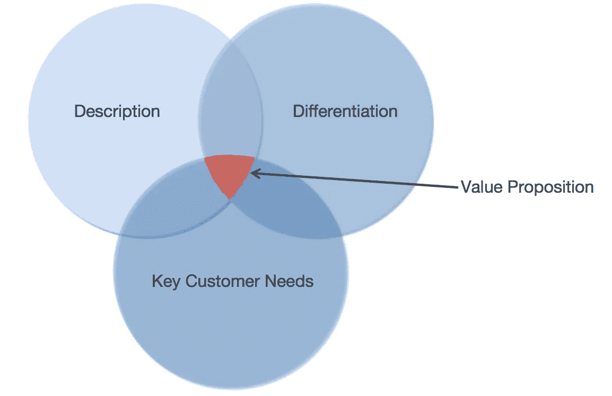

# 为什么信息传递对推动公司发展至关重要

> 原文：<https://medium.com/swlh/why-messaging-is-critical-to-igniting-company-growth-305310413505>

Photo by [Nine Köpfer](https://unsplash.com/photos/JslgAU6LXs8?utm_source=unsplash&utm_medium=referral&utm_content=creditCopyText) on [Unsplash](https://unsplash.com/search/photos/sparkler?utm_source=unsplash&utm_medium=referral&utm_content=creditCopyText)

公司的信息是任何走向市场计划的基础。如果做对了，你会很快锁定那些需要你的产品并且了解它能为他们做什么的合格的潜在客户。这使您能够通过营销计划和销售团队推广这一信息，快速扩大规模并加速增长。如果传达的信息有误，潜在客户会感到困惑或不感兴趣，接下来是漫长而曲折的销售周期。随着营销和销售资源因转化率低和牵引力有限而陷入困境，扩大糟糕信息的规模只会加剧痛苦。

是的，公司信息传递非常重要。但是许多公司都弄错了，因为他们犯了一个根本性的错误。

什么是“消息传递”？信息传递是一个框架，它包括关键的差异化、客户利益、价值主张、公司使命，最重要的是公司品牌形象。B2B 公司应该从价值主张开始，因为如果你没有价值主张，其他什么都不重要。

在过去 10 年中，市场营销变得令人难以置信地具有分析性，首先是线索管理、线索评分和营销自动化，最近是新的数据分析和人工智能解决方案。这些新系统自动化了评估和确认潜在客户的繁琐过程，并通过漏斗对其进行管理。但如果你用错误的信息瞄准潜在客户，数据和自动化帮不了你。他们只能加速向潜在客户传递错误的价值主张。

许多公司在信息传递方面举步维艰，因为他们关注的是错误的视角。首先关注我们自己的个人观点是人类的天性。因此，当试图描述一个产品为什么独特或有趣时，许多创始人和产品营销团队会回答他们认为这个产品有趣和独特的地方。你通常得到的是高度技术性的产品描述，或者是由工程团队辛苦定义和开发的一长串特性。这种对产品所有功能的丰富描述通常会遭到潜在客户的白眼，他们可能不太关心这些。

公司信息传递的关键是从客户的角度看问题。

设身处地为客户着想，理解他们的观点。他们有他们正在努力解决的问题。在 B2B 世界中，他们有公司计划和公司目标，这将决定他们的宝贵资源将如何分配和优先化。如果你的产品可以帮助他们实现其中的一些目标，那么你可能会有一个潜在的客户。关键是要理解这些目标，不仅仅是一个潜在客户，而是成百上千个潜在客户。如果你能满足他们的所有需求，那么你就可能拥有一家快速增长的公司。

您的信息需要使用客户的语言，而不是您的语言。解决这一问题的唯一方法是与许多客户谈论他们在这一领域遇到的问题，以及他们正在寻找什么样的解决方案来应对这些挑战。

大多数信息传递失败是因为它过度描述了产品。

许多人认为，如果我们只是描述我们的产品能做什么，潜在客户就会看到它明显的价值。你确实需要描述产品能做什么。但是许多公司都没有拿出令人信服的差异化优势。差异化是你与众不同的地方，最好是比其他人都强。公司在这一点上失败了，因为竞争优势是你的关键特征的子集，但它们是让你与众不同的特征。它们可能不是你认为最酷、最重要或最具技术创新性的功能。记住这是客户的观点，而不是你的。

我认为产品描述是牛排，差异化是卖点，也就是顾客最感兴趣的东西。你需要牛排，因为它是这顿饭的核心，包括你的产品所做的所有平凡但必要的事情。但是很多公司都有牛排。正是这种咝咝声引起了顾客的兴趣，尽管它只是食物中很小的一部分。它代表了一个关键的部分。你需要定义这种激情，并向你的潜在客户推广它。

当您将产品描述和关键竞争优势应用于客户需求时，现在您就有了价值主张的基础。如图 1 所示，如果您将产品描述、关键竞争优势和客户需求视为 3 个环环相扣的圆圈，其中所有 3 个部分都是您的价值主张。它是独一无二的、描述性的，它解决了关键的客户需求。

Figure 1

品牌呢？

关键竞争优势和客户优势融入价值主张，是对产品如何满足关键消费者或业务需求的最基本描述。一个公司的使命和品牌填补了图片的其余部分，定义了你是谁，你为什么在这里。这对发展与客户的持续联系非常重要。如果你没有价值主张，那么品牌并不重要，因为你没有解决任何人的问题或解决任何人的需求。如果你有一个令人信服的价值主张，但没有品牌标识，那么你很容易被另一家可能与客户群有更好品牌联系的公司收购。

人们经常把公司的品牌和它的价值主张混淆起来，在 B2C 的世界里，品牌通常是优先考虑的，尤其是当你在销售像水、肥皂或牙膏这样的商品时。如果你不能区分产品，那么你所拥有的就是信息和品牌，因为从根本上来说，所有的瓶装水解决的是同一个问题。

但在 B2B 世界，尤其是在产品通常有更多差异化空间的技术领域，公司的品牌和价值主张仍然相关，但价值主张的重要性有所提升，因为如果你不能解决公司的问题，那么你的品牌就无关紧要了。许多科技公司都在努力弄清楚他们的品牌和他们想成为什么样的人，但这其实并不重要，除非你能真正解决一家公司的问题，给他们一个关心你品牌的理由。

*阿尔·坎帕是* [*火箭秤*](http://www.rocketscale.net) *的创始人，该公司就如何通过强大的上市引擎加速收入向公司提供建议。他可以通过***联系到 www.rocketscale.net。**

**

## *这个故事发表在 [The Startup](https://medium.com/swlh) 上，这是 Medium 最大的创业刊物，拥有 330，853+人关注。*

## *在这里订阅接收[我们的头条新闻](http://growthsupply.com/the-startup-newsletter/)。*

**