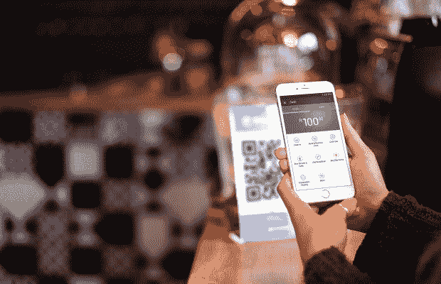
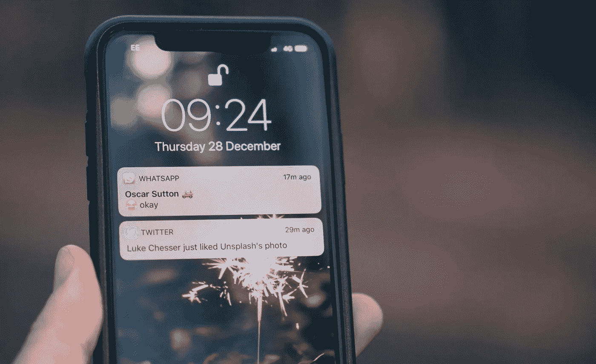
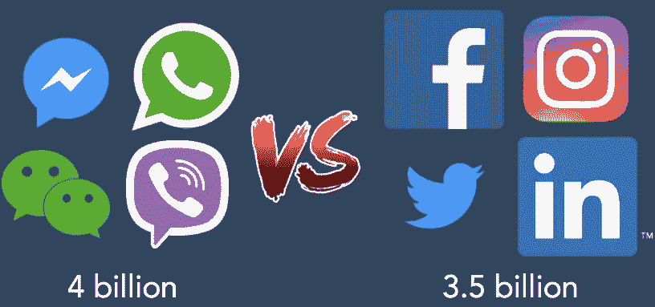
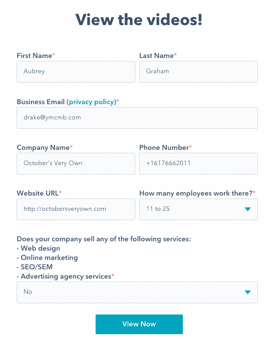
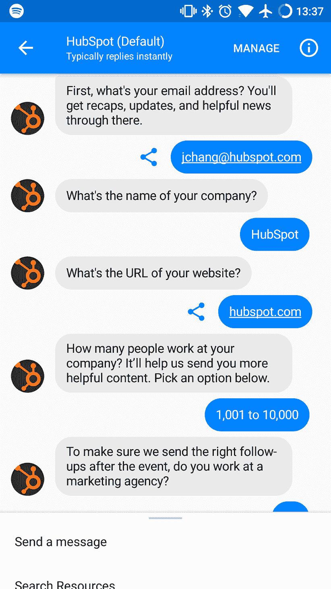
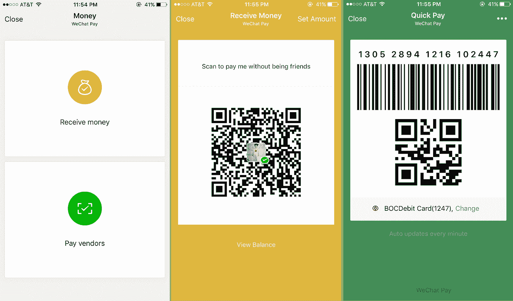

# 为什么信息应该是你的 B2B 或 B2C 营销策略的一部分

> 原文：<https://medium.com/swlh/why-messaging-should-be-part-of-your-b2b-or-b2c-marketing-strategy-b7b15ad2b11b>

那是上海一个闷热的日子，我在等着买百吉饼。队伍很长。每个人都渴望他们的碳水化合物修复。

最后，我走到柜台，拿出一张崭新的 50 元钞票。收银员的脸沉了下来。他数给我的零钱时皱起了眉头。

当我抓起早餐转身离开时，我身后的女人哼了一声。几乎每个人都带着轻蔑和恼怒的混合表情盯着我。

我做错了什么？

然后我突然想到。

没有其他人用现金支付，甚至没有信用卡或借记卡。他们都在手机上用了[微信支付](https://pay.weixin.qq.com/index.php/public/wechatpay)。我的老派交易让队伍延迟了——哪怕是几秒钟。我看起来像一个天真的游客试图数出公共汽车上的硬币。

这是五年前的事了。

我不仅学到了重要的文化课，而且这次经历激发了我对消息传递技术的兴趣。

我向朋友和同事询问了微信，并开始探索消息应用程序可以为 B2B 和 B2C 组织做些什么。

虽然中国(以及整个亚洲)处于信息技术和用户采用的前沿，但这是一个日益增长的全球趋势。消息平台将会一直存在，而且只会越来越重要。

企业是时候认真对待使用消息平台与客户和潜在客户联系了。

# 在线交流的演变

在企业涉足消息领域之前，理解这些应用为何代表如此重要的行为转变是很重要的。

我们都知道互联网是从电子邮件和网站开始的。信息从屏幕流向用户。指向并点击。你可以回复一封电子邮件或者提交一个网络表单，但是在请求信息和收到回复之间通常会有延迟。

手机变得越来越智能，突然间，我们口袋里都有了一台超级电脑。我们可以在旅途中访问数据，并使用 SMS(短信)更快地联系到人们。

手机也加速了社交媒体的采用。刷卡时代开始了。我们可以阅读、评论、点赞和分享，但交流并不总是实时的。

Facebook Messenger、WhatsApp、Line 和 Slack 等即时通讯应用现在都提供即时通讯。网络中的每个人都是实时相连的。您可以立即与使用相同平台的任何人进行交互(并接受连接)。

**从短信到即时通讯的转变**看起来似乎无关紧要，但对于任何想要进行真正对话的人来说，这是一个关键的变化。

例如，想象一下从您的电信提供商那里收到一条短信促销。突然，你收到一条关于 iPhone X 销售的短信。你可能会立即删除它，因为 SMS 消息是一种单向通信体验。

一个信息平台可以把单行道变成真正的对话。收件人可以问问题，或者告诉发件人(这可能是一个自动程序)只分享 Android 的促销活动。以前的单向爆炸变成了一个机会，以了解更多的个人客户偏好。

# 社交信息征服地球

既然人们已经体验到了信息传递的力量，这项技术正在传播到地球的每一个角落。我们来看看数字。

截至 2017 年 8 月，排名前四的社交媒体平台是:脸书、推特、Instagram 和 LinkedIn。

全球用户总数:35 亿

排名前四的社交消息平台是:Viber、微信、Facebook Messenger 和 WhatsApp。

全球用户总数:40 亿

这意味着地球上 53%的人使用前四大消息应用之一。仅 Facebook Messenger 就有 13 亿用户。WhatsApp 活跃在 107 个不同的国家。

# 使用聊天和信息来取悦您的客户

在过去的一两年里，你可能访问过一个弹出聊天窗口的网站。你正在滚动，这时出现了一个窗口，上面有一个问题:“今天我能为你做些什么？”

那是一个机器人，或者说是一个设计用来模拟与人类用户对话的自动化计算机程序。机器人是驱动消息平台的引擎。

弹出窗口不仅仅是简单的站点复制。我们的目标是为用户、访问者和潜在客户提供一种与我们互动的即时方式。他们可以立即获得常见问题的答案，或者与真正的人类支持团队成员联系。

即时性很重要，因为客户行为已经经历了巨大的范式转变。人们再也不想提交表格或电子邮件了。绝大多数情况下，他们更喜欢与机器人或人类实时互动。

许多科技公司已经采用了基本的网站信息，甚至零售品牌也开始使用聊天弹出窗口。杰出的组织利用这些机器人来增强客户的旅程。那么，你如何开始这个过程呢？

无论你是 B2B 还是 B2C，考虑使用消息传递来提供更愉快的用户体验。想象一下，以一种让人们认为“这真的很简单”或“节省了很多时间”的方式实施技术，或者甚至更好:“我现在感觉与这个品牌联系更紧密了。”

# 面向 B2B 组织的消息传递

有些人认为消息应用不适合商业或 B2B。我不认为这是真的，我可以分享一个最近的 HubSpot 实验来支持我。

我们想为即将到来的网上研讨会创造商机，所以我们购买了点击进入注册表单的脸书广告。我们还使用基于 Facebook Messenger 的广告与潜在客户直接沟通，他们在应用程序中完成了快速注册过程。

最终，与新闻订阅广告相比，我们在每条线索上的花费减少了 70%,并且我们通过聊天收到了更多的注册。人们甚至分享了网上研讨会广告，并鼓励他们的朋友查看 Messenger 注册互动。

这什么时候发生过？为什么人们如此高兴？

除了新奇因素，交谈是收集信息的一种自然方式。对用户来说感觉不那么麻烦。这是一种体验，而不是完成另一项令人恼火的任务，尤其是如果你做得好的话。我不是说我们做到了，但我想强调的是，通过更深入地思考你的客户想要如何互动，你可以脱颖而出，提供一些特别的东西。

# 那么，我应该从哪里开始聊天呢？

最好的新产品和服务提供商将与广泛的消息应用无缝集成。你只需要为你的信息冒险选择正确的游戏场地。例如，我们正在构建新的 [GrowthBot](https://growthbot.org/) 来与十几个系统和 API 以及 LinkedIn 和 Slack 等平台一起工作。

今天，微信甚至比我五年前经历的更加嵌入中国人的生活。人们使用该应用程序与朋友交谈，分摊餐馆账单，购买机票或火车票，以及安排送货。甚至一个卖*尖兵*的路边摊都接受微信支付。在中国不使用微信是不可能成为一个功能齐全的成年人的。

北美就不是这样了。不需要 Facebook Messenger 或其他平台，就可以轻松完成日常任务。很少有人会嘲笑你用现金支付。但是，脸书仍然是主导者，尤其是如果你是一个 B2C 公司。在这种情况下，Messenger 是一个显而易见的平台。

也许你正试图瞄准科技公司或创新设计、媒体和创意组织。在这种情况下，Slack 可能是更好的选择。它在典型的工作时间有大量的流量，参与度通常比 Messenger 高。

# 挖掘你已经开始的对话

匆忙采用新技术会让人感觉像一场军备竞赛。对于许多创始人和营销人员来说，有一种感觉，你需要先到达那里——你只需要以任何形式建立一个存在。我明白。我知道先发优势是真实的，但我也建议人们要有战略眼光。

您希望通过消息传递提供什么样的体验？考虑客户已经存在的问题、疑问和摩擦点:

他们经常问你的客户支持团队什么？

他们抱怨什么？

他们称赞你什么？

在购买、研究或注册过程中，他们被卡在了哪里？

他们需要你做什么——比如衣服尺寸、包装选择、技术升级、送货或附加产品的细节？

确定人们*已经通过旧技术*与你分享的问题和信息，比如电子邮件、网络表单和电话支持。如果你正在考虑开设一个消息通道或建立一个机器人，这是一个很好的起点。

# 不要忘记你已经知道的东西

关于消息传递技术的最后一点是:虽然机制可能是新的并且在发展，但是人类的需求却不是。当然，我们的偏好可能会改变(比如更喜欢聊天而不是电子邮件支持)，但驱动我们的核心感觉是一样的。

例如，人们下载软件来解决战术和情感需求。他们使用 Slack 与同事进行即时交流，保持项目进展，并快速共享文件。它服务于一个实际的目的，可以简化团队合作。

在情感层面上，我认为 Slack 让人感觉到联系。在平台上分享猫视频的团队正在强化他们独特的文化。我们都有一种与生俱来的归属感，松散沟通(或任何其他有效的信息平台)的非正式、对话性质将这个群体结合在一起。

任何好的产品或服务都满足情感和实际需求。这不是新信息。但是，企业、销售团队和营销人员在探索新技术时很容易忘记这些需求。

无论你是开始涉足消息传递，还是深陷机器人制造的 T2，都要把目光放在人类的需求上。让生活更容易、更简单、更吸引人、更令人满意。帮助人们实现最好的自我。

或者，让买百吉饼变得更容易。

【blog.growthbot.org】最初发表于**。**

*感谢阅读。*

> *如果你喜欢这篇文章，请随意点击那个按钮👏帮助其他人找到它。*

*.*