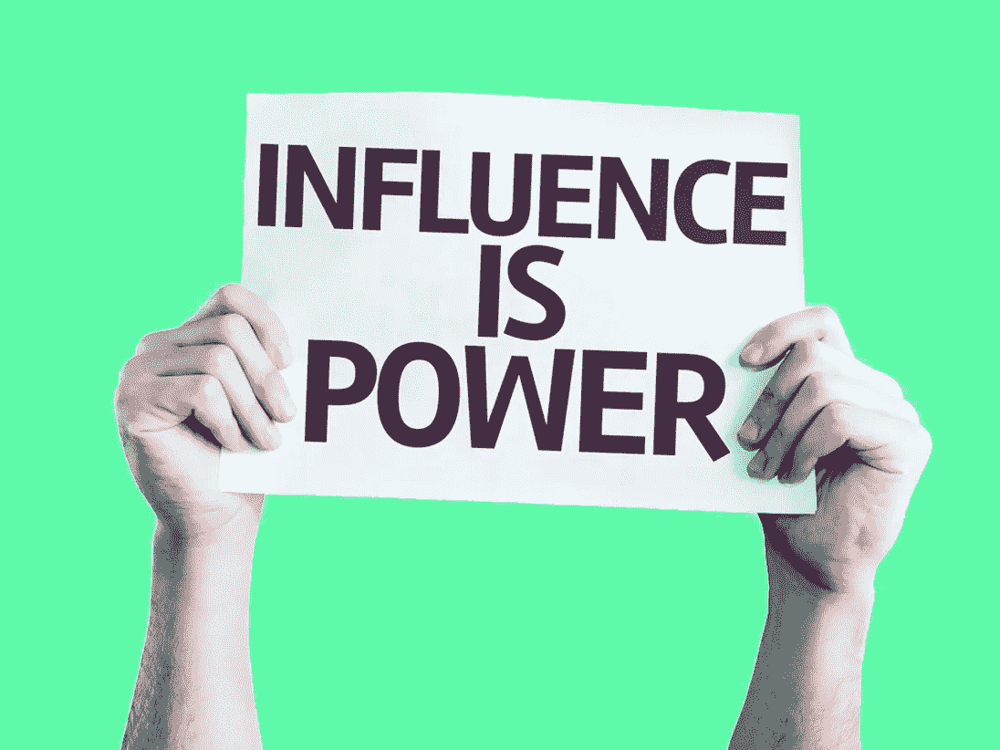
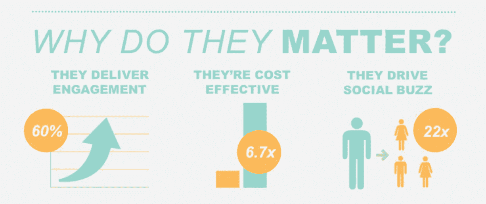
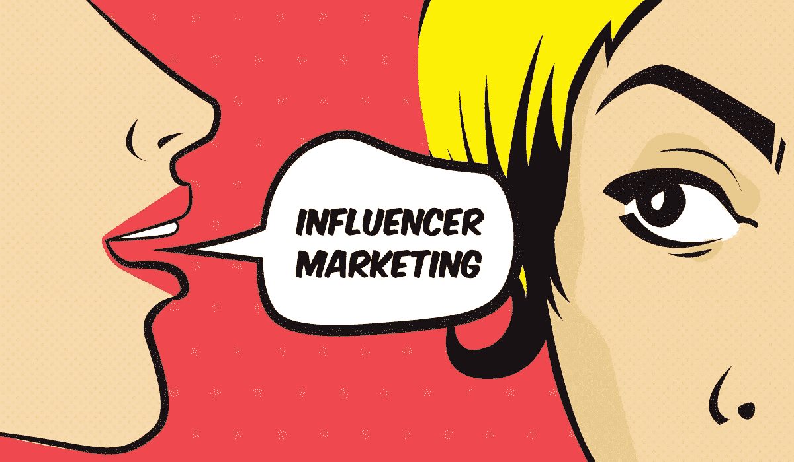

# 为什么微影响者营销仍然是 2019 年的‘游戏’。

> 原文：<https://medium.com/swlh/why-micro-influencer-marketing-is-the-game-in-2018-fdeda0993c36>

## Instagram 上的影响者营销现已超过 10 亿美元的产业。

Photo by [JESHOOTS.COM](https://unsplash.com/photos/fzOITuS1DIQ?utm_source=unsplash&utm_medium=referral&utm_content=creditCopyText) on [Unsplash](https://unsplash.com/search/photos/game?utm_source=unsplash&utm_medium=referral&utm_content=creditCopyText)

**2019 年 1 月 4 日新闻来袭:** Instagram 有望在 2020 年底超过脸书。2012 年，脸书以 10 亿美元收购了 Instagram。现在，Instagram 的用户数量将在 2020 年底超过脸书。

是的，这是你应该理解影响者营销的另一个原因，尤其是微影响者被低估的影响力！

随着每月有超过 8 亿人浏览他们的食物，价格已经创下新高。据《福布斯》 报道，一个拥有超过 100 万粉丝的账户可以从一篇赞助帖子中获得超过 5 万美元的收入(取决于其参与度)。

然而，营销人员注意到，一旦一个账户超过一定规模，就很少有人会费心去质疑数百万粉丝大军的价值。当一个账户有大约 1000 名关注者时，喜欢和评论与关注者的比率[达到峰值](http://markerly.com/blog/instagram-marketing-does-influencer-size-matter/)。获得超过 10 万的关注者，参与度开始变平；用户只是不太热衷于与名人互动，而是与他们关系更密切的人互动。

自从 Instagram、脸书、Twitter 和 YouTube 等社交媒体渠道变得越来越受欢迎以来，一种新兴趋势进入了电子商务营销领域。*微影响者，*已经成功地在传统上由卡戴珊家族统治的世界中安顿下来，并最终为营销人员获得了更多的价值。

> 两年前被《纽约时报》收购的 HelloSociety 发现,“微”影响者，或拥有 3 万或更少追随者的账户，更有利于营销人员的合作。

## 为什么微观影响者很重要？

尽管微影响者的用户数量远少于百万以上的同行，但让他们参与网上商店的推广可能更有利可图。事实证明，与受众的信任和密切关系对于购买决策至关重要。那么，到底是什么让电子商务公司选择了微影响者？

## 三个简单的统计数据:

*   敬业度提高 60%
*   定价过低(每次项目的成本效益提高 6.7 倍)
*   每周通话时间比普通消费者多 22.2%。

60 微小影响者推动了活动参与率的提高；这些活动的每次参与效率是拥有大量追随者的影响者的 6.7 倍，这使它们更具成本效益；微影响者每周促成的对话是普通消费者的 22.2 倍。

> 因为他们个人投资于他们的手艺，微影响者是追随者值得信赖的推荐来源。

仅仅因为一个影响者有几十万或几百万的追随者，并不意味着特定的活动会比一个营销人员或品牌与一个追随者较少的影响者合作更有效。

> “游戏”不仅仅是吸引眼球；但是得到关注的眼球！

## 利用微影响力成功推广你的业务

1.  **把微影响力的粉丝变成拥护者。**

最好的影响者是那些已经是你品牌粉丝的人。当他们推广你品牌的产品或服务时，这更值得信赖，因为他们的追随者知道影响者已经喜欢你的产品了。最棒的是，你不必花太多力气去说服他们成为你的品牌拥护者。

**2。让有影响力的人讲一个故事。**

如果你真的想通过微影响者来推广你的品牌，一张简单的以你的产品为背景的照片是不够的。你不能指望人们会喜欢这篇文章，会注意到你的产品，会仅仅从植入式广告的照片中研究你的品牌。为了让内容真正触及目标受众并引起他们的共鸣，影响者需要围绕品牌或产品讲述一个故事。

**3。开展持续的活动。**

一次性活动可能足以促进即将到来的产品发布或推动更多销售。但是当目标是推广你的品牌时，你将需要一个长期活动的微影响者。这是至关重要的，因为持续的活动将确保你的目标受众尽可能多地消费关于你的品牌的内容。

## 微影响者营销的挑战，以及如何解决它们。

正如每一种促销技巧一样，微影响力营销活动可能会失败。在利益的诱惑下，营销人员可能会忘记对可能的陷阱给予应有的关注。

首先，(相关的)微观影响者更难找到。随着越来越多的人在社交媒体中创建和扩大他们的受众，为电子商务公司找到合适的影响者变得至关重要。查看具有所需受众规模的多个帐户需要大量时间。以下是几种方便搜索的方法:

[https://www.billysixes.com/](https://www.billysixes.com/)

1.  **从你的商业账户**的关注者开始。选择了解在线公司并习惯于购买的有影响力的人是最好的策略。博客作者将更有动力建立合作关系，而营销人员将节省大量精力来传达商业理念。 [**比利·西克斯**](https://www.billysixes.com/) ，一家澳大利亚在线服装和太阳镜零售商，以这种方式发起了一场微影响者运动。在研究了 Instagram 上的粉丝后，这家新成立的公司确定了那些拥有所需粉丝的人，并通过他们的个人账户让他们拍摄照片和展示产品。
2.  使用标签。人们使用标签来方便搜索。为什么营销人员不利用这一特点，找到有影响力的相关内容的候选人呢？为了让 hashtag 研究更有效，应该缩小搜索参数。例如，*#素食*而不是更一般的*#食物*将把列表浓缩成最适合素食电子商店的候选者。
3.  **寻找当地有影响力的人**。如果一个电子商务公司服务于一个特定的领域(例如，一个食品配送服务)，它将通过本地博客或本地标签(如#downtownLA)进行推广
4.  **自动搜索**。做手工研究可能很耗时。像 [BuzzSumo](https://app.buzzsumo.com/amplification/influencers) 、 [Klear](https://klear.com/free-tools/find-instagram-influencers) 和 [Ninja Outreach](https://ninjaoutreach.com/) 这样的工具为第一阶段提供了便利，并给营销人员留下了一份现成的潜在微观影响者名单。

## 微小影响者更难共事。

一次在社交媒体上的提及可能不足以形成一次有效的营销活动。为了增加曝光率，企业需要吸引多个微观影响者。这需要投入更多的工作时间来寻找相关的倡导者，与他们进行个人交流并评估结果。例如，与十个微观影响者一起工作比与一个宏观影响者一起工作要多花十倍的时间和精力。

与这些与你的品牌相关的“倡导者”建立长期、真诚的关系有很多好处。尽管微影响者在创建广告帖子时更容易获得自由，但针对品牌和活动目标制定的指导方针可以让营销人员快速传递促销理念，并找到与博客作者的共同语言。

# 我想做的是…

***……就是写值得你花时间，能给你带来价值的东西。如果你喜欢阅读，请点击💚这样其他人也会看到它(你最多可以点击 50 次)！！***

** *也意味着世界，如果你能* [***DM 我在这里***](http://instagram.com/iblamesid) *并且说‘嘿！’→照做，我会发给你一些简单的指导，告诉你“如何为你的个人品牌和/或企业撰写完美的 Instagram 简历！”:)或者点击* [***这里***](https://app.clickfunnels.com/pages/25113648/editor_v2?optin=true) ***！❤***

## 西德尼

## 这个故事发表在 [The Startup](https://medium.com/swlh) 上，这是 Medium 最大的企业家出版物，拥有 285，454+人。

## 在这里订阅接收[我们的头条新闻](http://growthsupply.com/the-startup-newsletter/)。

