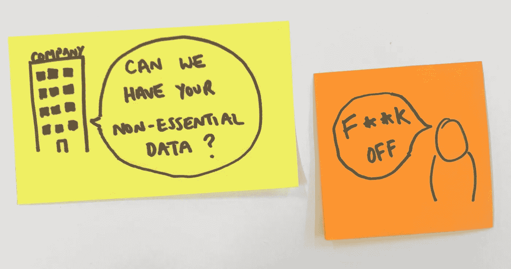
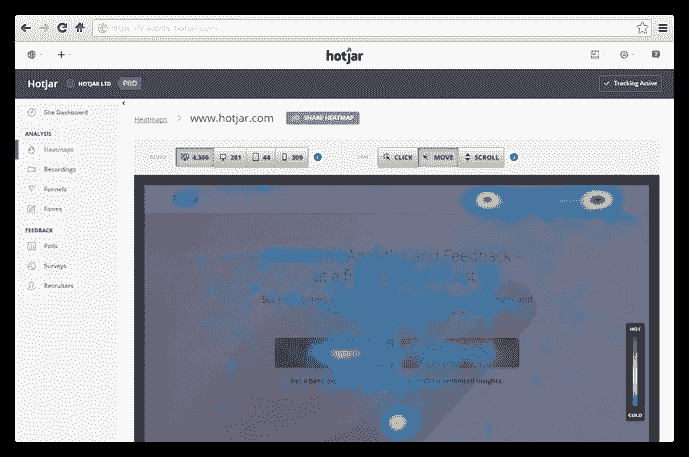

# 为什么 microcopy 对您的 GDPR 战略至关重要

> 原文：<https://medium.com/swlh/why-microcopy-is-massive-for-your-gdpr-strategy-4688a5e9587d>

2018 年 5 月 25 日将是一个非常重要的日子，一个叫做 GDPR 的小东西开始生效了。它的主要目标是让公民重新控制他们的个人数据，将权力的天平从公司转移到用户身上。你现在可能只是担心合规性，然而， ***投资 microcopy 可以帮助你在这个不确定的时代打造竞争优势。***

# 缩微复制的快速定义

Microcopy 指的是通过界面引导用户的文字。它在按钮、表格、cookie 信息和任何其他帮助你完成任务的副本上。要了解更多信息，你可以点击这里阅读我的 microcopy 六点快速指南[。](/swlh/my-6-point-microcopy-checklist-for-non-ux-writers-634eb52b29c9)

 [## 我为非 UX 作家准备的 6 点缩微拷贝清单

### 半生不熟的显微镜是半生不熟的设计，半生不熟的产品

medium.com](/swlh/my-6-point-microcopy-checklist-for-non-ux-writers-634eb52b29c9) 

# 这和 GDPR 有什么关系？

关于 GDPR 有很多可以读的东西，但底线是，公司现在必须公开他们收集的个人数据，解释他们为什么想要这些数据，并获得获取这些数据的许可。不遵守将导致巨额的可怕罚款。

这意味着重新考虑 cookie 信息，营销选择加入和任何其他形式的数据输入。在 GDPR 逼迫下，成功获取数据取决于你使用的词汇。

# GDPR 在饼干罐上盖上了盖子

你会记得访问一个网站，被告知“*继续浏览表示你同意我们的 cookie 政策*”。这在后 GDPR 时代是行不通的。用户现在可以选择退出非必要的 cookies，如 Google analytics 和 Hotjar，这将直接影响你的业务成功。

虽然对用户来说不是必需的，但这些 cookies 可以让您的设计和营销团队快速访问大量丰富的数据，他们可以使用这些数据来指导关键的优化决策。

因此，当你不能依赖默示同意时，你的缩微拷贝需要额外努力才能获得它。文字是你赢得用户信任和随之而来的数据的最好的设计工具。

好的显微照片的基础是清晰。它必须清晰有用。但是对于数据来说，这还不够。这张缩微拷贝需要出售。它需要将用户转化为交出他们的数据。而这样真的会把微文案和那些只是填文案的人区分开来。

你需要公开而有说服力地权衡利弊，以利益为导向。如果你失败了，用户不会接受这些 cookies，你将被迫在黑暗中设计。

# **了解你的用户是关键**

像 Google Analytics 和 Hotjar 这样的工具很神奇，因为它们揭示了用户是谁，他们在网站上的行为，他们离开的地方以及其他各种各样的宝贵信息。但是请你站在用户的角度想想…

> “让我直说吧，你将跟踪我的鼠标在屏幕上的移动，当我使用这个网站时，你将能够看到我屏幕上的一段视频？哈，没机会了。”

Image courtesy of hotjar.com

对用户来说，这只是简单的打扰，可能有点可怕，所以你需要真正公开你的意图。为了消除他们的恐惧，甚至鼓励他们，你应该向他们解释这样做的好处，你将如何处理他们的数据，以及你将如何保护这些数据的安全——所有这些都要以清晰和人性化的方式进行(就像所有好的 microcopy 一样)。

他们需要知道，通过移交他们的数据，这将有助于改善他们未来的产品体验。但是如果可以的话，再深入挖掘一下。产品具体会提高什么？这是否意味着他们喜欢的东西会变得更好，或者是修复已经引起挫折的东西？如果你有一个 UX 作家花时间去了解你的用户，他们的恐惧和动机，你已经处于优势。

# 利用 microcopy 让 GDPR 成为一个机会

你现在可能需要付出努力，但是**竞争优势是巨大的**。通过比你的竞争对手在 microcopy 上投入更多，你将与你的用户建立信任，而不是让他们质疑你的意图。另外，你会让更多的用户接受这些“非必要”的 cookies。这将限制 GDPR 对您的数据导向优化的影响，同时它对其他人造成严重破坏。

这真的只是冰山一角。GDPR 将导致更强的数据意识，这意味着你需要更加小心地设计你使用的词语。现在这两者的联系更加紧密:没有数据你就不能有效地设计，没有好的设计你就不能成功地收集数据。

因此，现在就投资您的 microcopy，不要只为合规性而设计。旨在让数据成为您最大的优势。

## 这篇文章发表在《T4》杂志《创业》(The Startup)上，这是 Medium 最大的创业刊物，有 306072 人关注。

## 在这里订阅接收[我们的头条新闻](http://growthsupply.com/the-startup-newsletter/)。

