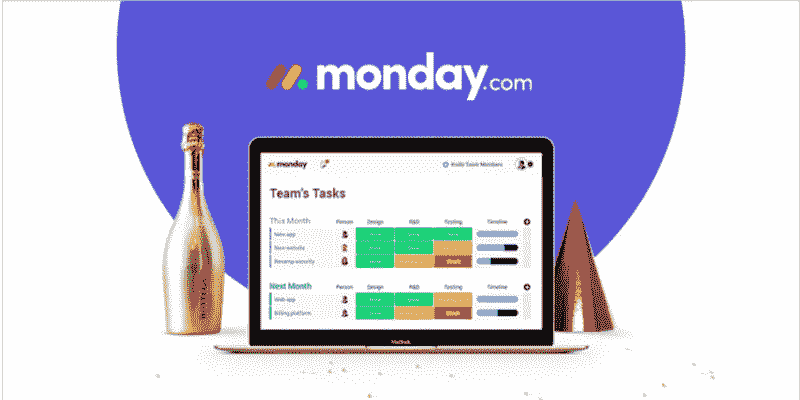

# 为什么周一 B2C 对 B2B 产品的态度有利于商业

> 原文：<https://medium.com/swlh/why-mondays-b2c-attitude-to-a-b2b-product-is-good-for-business-660b11fe81ce>

几个月前，我们有幸接受了周一(前 DaPulse)产品经理 Shirley Baumer 的邀请，讨论他们如何维持一款客户参与度如此之高的产品。我们的发现非常简单，他们对 B2B 产品有一种 B2C 的态度。

对于那些不熟悉周一的人来说，周一创造了一个帮助人们在项目上合作的产品，许多不同类型的项目。周一的创始人很早就意识到了一些重要的事情——人们在与其他人合作时有着共同的目标和挑战。通过提供简单直观的协作工具，70%的非技术客户高度参与其中。

Image Credit: Monday

# 每个人都和顾客交谈

周一是一家有着非常独特文化的公司，每个人都在和客户交谈。

**这种独特的文化是如何形成的？**

**雪莉:**驱动公司每个人的是我们的产品如何满足人们的需求。在其他公司，开发人员通常会被代码的先进性或使用一种很酷的新技术所激励。在周一，驱动开发人员的根本不是什么，驱动他们的是真正帮助客户的快速胜利。我们在 CS、产品、设计和开发之间有着惊人的合作。

**你如何促进这种合作？**

雪莉:使用星期一:)这有很大的影响，因为每个人都使用相同的透明系统。我们也坐在一起——我右边是开发人员，左边是设计师。我们拥有最少的个人所有权，作为一家公司，我们相信团队中的每个人都应该对我们所做的一切负责。这就是为什么我们都与客户交谈。

**说真的，你们都跟客户谈过吗？**

雪莉:基本上是的，我们在脸书有一个名为“星期一上瘾者”的组织，有两万多名顾客。这里没有社交经理，我们所有人都参与讨论。这是我在开始开发新功能之前去的第一个地方，所有的新功能都首先发布给周一迷。开发人员自己宣布功能发布，并立即获得客户反馈。

**你觉得自己有语气吗？**

雪莉:我们最近将语调指南定义为我们风格指南的一部分。我们的客户也积极参与了这一过程。它有各种各样的指导方针，但指导我们的基本原则是，我们是为人们制造产品的人。你可以在我们的视频、我们的文案、微型文案以及我们为客户举办的现场问答环节中看到这一点。谦虚和在同一水平上说话并不是我真正需要的指导，这是我作为一个人如何沟通。

# 自下而上的产品采用

**你的用户如何发现星期一？**

**雪莉:**我们是一家 B2B 公司，但我们的行为很像 B2C，直到现在我们的广告都只在脸书。我们对广告采取了自下而上的方法——信息是针对个人的。并不总是首席执行官在公司中采用新产品，它通常来自于需要特定工具来更好地完成工作的团队。我们在这种类型的广告上投入了大量的资金，并产生了许多可以试用的线索。

**你如何从还没有上瘾的顾客那里获得反馈？**

雪莉:我们还有另一个脸书小组，叫做周一一对一，为我们的跟踪用户服务。我们真的很积极，鼓励我们的跟踪用户联系我们，这样我们可以帮助他们在周一建立他们的工作流程。我们还有“大大脑”，这是我们内部开发的分析工具。例如，我用它将用户分为付费用户和尾随用户，并直接联系尾随用户。

**你考虑过免费增值吗？**

雪莉:我们决定不提供免费增值服务，这实际上是一个产品决定。如果你为一个产品付费，这意味着你关心它，我们不希望被那些对产品不感兴趣的用户的功能需求所淹没。

# 与一张纸竞争

**你认为你面临的最大挑战是什么？**

雪莉:我们的客户包括咨询公司、银行、大公司、大学、纹身店、设计工作室、自行车商店等等。我们基本上有成千上万的产品版本，因为每个客户对它都有不同的理解。我们 70%的客户都不是技术人员，所以我们的竞争对手是 Excel 电子表格或一张纸。

挑战在于我们没有一个清晰的角色，这使得我们很难创建正确的营销信息，建立入职体验，对功能进行优先排序。由于用例如此不同，我们必须使用相似的基本事物进行交流——人们如何与其他人合作。需要同步、协作、被倾听和被欣赏。

此外，我们知道，在一些较大的公司中，只有一两个团队与周一一起工作，因此有巨大的潜力，但我们需要找出如何使产品在公司内传播。

# 可用性欢乐时光

当我们与真正以客户为中心的公司的人聊天时，我们的最后一个问题总是:

对于那些希望更加以客户为中心的公司，你有什么建议吗？
这次的答案是纯金。

**雪莉:**和你的客户交谈，如果可能的话和他们见面，尽可能多地了解他们在做什么。

在我周一加入之前，我在医疗领域有一家初创公司，我们花了几个小时坐在 Ichilov 医院的理疗部。我们在看治疗，看理疗师如何归档、录入数据并向医生报告。我们真的在那里发现了黄金，光看数据是看不出来的。

与客户交谈，不要问他们想要什么，问他们想要什么，为什么，然后一遍又一遍地问为什么，然后你就会明白他们需要什么。

我周一刚开始的一个项目就是一个很好的例子，我们称之为“可用性快乐时光”。我们在入职时遇到了问题，我们尝试了大量的方法，但没有成功。我们的首席执行官罗伊(Roy)与他的岳父会面，请他试用这款产品。他的岳父很难接受，他很痛苦。Roy 和我想了想，决定了一个行动方案——我们在入职时进行了可用性测试，我把这些会议编辑成了电影。所有的利益相关者坐在一起，我做爆米花，我们看着用户受苦。
如果你在数据中看到这一点并不重要，当你看到只有一个人使用你的产品并感受到它的巨大影响时。一天结束时，我们拿出了一份按优先顺序排列的测试列表，这真的震动了这里的一切，因为人们已经对入职感到绝望。

可用性欢乐时光(由我们的 CTO 提出)的一个想法是模板，为不同的用例制作大量的模板。我们的新用户只是无法理解他们可以定制工具，并在两个小时内使它符合他们的确切需求，但一旦他们看到该工具做了一百万种不同的事情，他们就明白了。这将转换率提高了 30%，这是一个游戏规则的改变者。

就是这样，伙计们，我们要感谢雪莉花时间与我们交谈，分享这些惊人的见解。如果你在 B2B 公司工作，我们鼓励你多想想 B2C，你会对结果感到惊讶。

*本文原载于*[*RetentionDesign.com*](https://retentiondesign.com/)

## 这个故事发表在 [The Startup](https://medium.com/swlh) 上，这是 Medium 最大的企业家出版物，拥有 343，876+人。

## 在这里订阅接收[我们的头条新闻](http://growthsupply.com/the-startup-newsletter/)。

