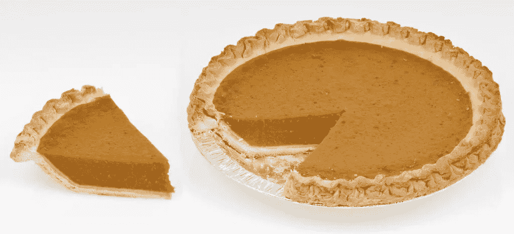

# 你的创业公司价值多少？？为什么大多数创业者不懂估值

> 原文：<https://medium.com/swlh/why-most-entrepreneurs-dont-understand-valuation-ac907fa1e49>

*他们在问自己错误的问题*

我记得有一位企业家，在种子期一年半后，他需要筹集更多资金，他向我解释了为什么他的公司应该价值“两倍”。

假设他的创业公司在种子期获得了 300 万美元的前期投资。当时，他已经:

*   没有申请专利，
*   没有 MVP(最低可行产品)，
*   没有收入或测试客户。

在这段时间里，他现在至少有一项专利，一个 MVP，至少一个客户，还有一系列大企业。

什么是“算是”顾客？你知道那种人——是朋友的朋友，帮你试用你的产品，可能会也可能不会付钱。

"看看*我们取得的所有进步！"他得意洋洋地说，为估值翻倍辩护。*

他是对的吗？

> 大多数企业家认为，融资轮中的估值意味着“公司在那一刻的价值”以及他们“放弃”了多少公司股份。
> 
> 因此，如果公司在另一个时间点取得了“更多 xxxx”(即更多产品、更多客户、更多前景、更多用户)的进展，那么公司的价值自然应该比上一轮“更多”。

## 你的投资者期望什么？

不幸的是，估值不仅仅是一家公司的价值。

> 更确切地说，融资轮中的估值实际上是基于公司当前的状态和轨迹，对公司未来表现的一系列预期。

在这个特殊的案例中，人们期望他在第一年就能制造出产品，并在下一轮之前让*拥有至少*5-10 个付费客户。

这一套预期从何而来？因为他向投资者推销这个。此外，人们的期望是，当他不得不筹集下一轮资金时，商业模式和产品已经证明了自己，从而降低了风险，使其更容易获得更多资金。

在这种情况下，他的公司没有达到预期。产品、技术和商业模式仍然有许多未解决的问题。从投资者的角度来看，风险仍然存在。那么公司应该以什么来估值呢？

答案没那么简单。

Entrepreneurs Think: How Much of the Current Pie Do I Want to Give Up?

## 创业公司的估值到底是什么？

例如，在硅谷和科技界，仅仅根据一份商业计划，同一家公司就有可能获得 200 万、400 万或 700 万美元的估值。例如:

*   如果你在种子期筹集了 100 万美元，风投可能会给你估值 200 万美元(200 万美元+100 万美元= 300 万美元，因此投资者将获得公司 33%的股份)。
*   另一方面，如果你要融资 200 万美元，同一家公司可能会在投资前估值 400 万美元(或 400 万美元+200 万美元= 600 万美元，因此投资者也将拥有 33%的股份)
*   另一方面(是的，我知道这暗示着一个三只手的外星人！)，如果你有一个非常有经验的管理团队，并以高价出售了你的上一家公司，你可能会在投资前获得 600 万美元的估值，并在投资后获得 300 万美元(900 万美元)——而且投资者仍然拥有该公司三分之一的股份，你猜对了！).

假设公司的客观状态是一样的(一个没有产品、客户或收入的商业计划)，那么同一个公司怎么可能价值 200 万美元、400 万美元或 600 万美元，而投资者却得到了公司的 1/3，不管他们投入的是 100 万美元、200 万美元还是 300 万美元？？

答案是，估值并不是公司的价值，而是投资者对公司价值的预期。如果你筹集到更多的资金，人们的预期是公司会发展得更快，仅此一点就可以证明更高的估值是合理的。如果是一个有经验的团队，这个想法是公司可以更快地发展壮大，避免一些新手的错误，更快地达到更高的估值。

事实是，大多数风投都在追逐公司的百分比，并不真的在乎前期的实际估值是多少(大多数情况下)。他们开始关心估值是否过高，他们得到的百分比比通常得到的要少(对于种子期、A 轮和 B 轮，通常范围是每轮 20%-40%)。

## 我们看看上市公司学点什么？

要了解价格与预期的关系，让我们看看上市公司是如何运作的。

假设上市公司 Hooligiggle 的股票定价为 20 美元。

现在，让我们假设该公司发布了一份关于他们刚刚签署的一笔大交易的公告(假设是与微软)。你可以合理地预期(如果这是一笔*好的*交易)投资者可能会推高股价，甚至可能在宣布的当天达到 30 美元。

该公司的潜在价值真的在一天内上涨了 50%吗？在公开市场的情况下，你可以说它有，因为股票是流动的，你可以在当天卖出。然而，股价飙升的真正原因是 T4 对未来收益的预期。

现在，如果与微软的交易破裂或对收益没有影响，会发生什么？当预期没有实现时，上市公司的股价就会下跌。当然，对于上市公司来说，估值通常是基于股票收益的预期，这就是为什么你总是看到“甲骨文超出预期每股 0.12 美元 2 美分，等等。”

## 创业公司是相似的，但是不同的

对于私营公司和初创公司，预期并不那么明确，因为往往没有季度收益报告。

对创业公司的期望与市场和里程碑(收入、客户等)有关。)公司有理由预期在未来 1-2 年内(即在下一轮融资之前)完成。

但一个很大的区别是，私营公司通常缺乏流动性，企业家拥有普通股，所以你不能说，因为风投以 600 万美元的估值买入优先股，你的股票价值就相同。

例如，我曾经有一家公司，我们在下一轮融资中获得了 20%的折扣，估值上限为 1200 万美元。由于筹集的资金总额约为 300 万美元，这意味着后期资金将为 1500 万美元(或者我是这样认为的)，或者我们是这样认为的。

1200 万美元的种子前期资金是非常高的，它带来了非常高的期望，但我们很快就没有达到。经过多次谈判，风险投资公司以 900 万澳元的价格兑换了他们的票据，比我们预期的要少得多！

**下一轮一点也不好玩**

任何经历过创业低谷的企业家都会告诉你，这并不好玩。

从技术上讲，你可以说最后一个例子不是下跌，因为前一轮是可转换债券，本身不是定价轮。然而，在我们看来，这绝对让*感觉*像是一次失败，因为我们放弃了比我们想象的更多的公司。

下跌相当于你的股票下跌。基本上就是估值比上一轮少了，经常触发反稀释等不愉快的条款。更重要的是，这通常表明对管理团队缺乏信心，通常伴随着更换首席执行官，并开始对公司抱有新的期望。

但是大多数企业家不会承认，甚至对他们自己也不会承认的是，下跌是前一轮估值*定得太高*的非常具体的危险。正如我之前所说，估值是一系列预期，如果你没有达到这些预期，就像上市公司一样，创业公司会有后果。

在我上面的例子中，所有权的差别并不是很大(20%对 25%的投资者所有权)。然而，在某些情况下，投资者会要求重新封顶，这是一轮猛烈的下跌。我记得有一个案例，投资者拿走了所有的普通股(据说是公司的 60%)并重新封顶，这样所有现有的普通股股东得到了公司的 8%，而新的首席执行官和管理层得到了另外的 10-20%，优先股股东(他们已经有了优先权)得到了其余的股份。

为什么创始人会同意这样做？通常情况下，公司已经花光了钱，没有外部投资者愿意进来。通常别无选择，只能让公司破产或接受重新封顶。

## 真正的问题:你想跳多高？

大多数企业家认为筹集资金的经验法则是:

> 取你能得到的最高估价。

为什么？因为你将放弃最少的股票，保留更多的公司所有权。

但这不是考虑估值的最佳方式。

How High Do You Want to Jump?

思考估值的另一种方式是，它是一个你必须跳过的障碍。现在，如果我问你，你希望这个门槛有多高，能让你在未来一两年内跳过？你会有什么反应？

最有可能的是，你会希望门槛尽可能低，这样你就可以毫无问题地跳过它。当然，太低的问题是，你看起来没有能力取得太多成就。

但当被问及你希望你的公司获得什么样的估值时，大多数企业家认为:我希望尽可能高的估值。我宁愿接受 1000 万美元的估值，也不愿接受 500 万美元的估值，因为这意味着我的股票价值翻了一倍，而我放弃了一半。他们没有意识到的是，他们正在为自己设置两倍高的门槛来跳过！

当然，进行特定估值有许多不同的原因，这些原因与你打交道的投资者有关:个人化学反应、金钱以外的价值、战略伙伴关系。

然而，谈到估值，真正的经验法则应该是:

> 我能得到的最高估价是多少，期望我能合理地超越？

当这是你在风投轮中问自己的问题时，你的下一轮融资是向上的，而不是向下的机会要高得多。

低迷会引发公司的恶性循环。创始人最终持有的股票减少了，他们的积极性降低了，更多的外部经理被请来“修复”公司，现有投资者不怎么和他们的同事谈论公司，这开始被视为一种失败。众所周知，初创公司是不可修复的，所以不能保证引入更有经验的 CEO 或管理团队真的会增加公司成功的机会。因此，大多数处于低谷的创业公司都以失败告终，或者被甩卖。

另一方面，融资可以为初创企业开启良性循环。当初创公司达到甚至超过预期时，就会出现上升。投资者向他们的朋友谈论公司的表现如何，从而引发投资者对下一轮投资的兴趣。当人们看到股价在上涨，所以想尽早进入时，招聘就容易多了。不管是真是假，至少在硅谷，人们看到公司是“健康”的。

所以，下次你为你的公司谈判估价时，一定要问正确的问题:

> 我想跳多高？

## 这个故事发表在[的创业](https://medium.com/swlh)上，这是 Medium 最大的创业刊物，有 307，871+人关注。

## 订阅接收[我们的头条新闻](http://growthsupply.com/the-startup-newsletter/)。

