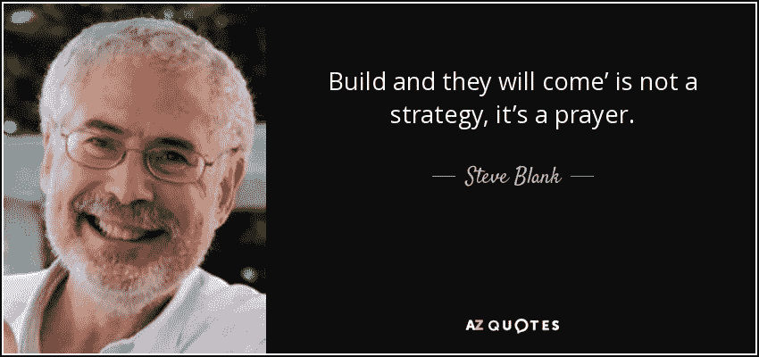
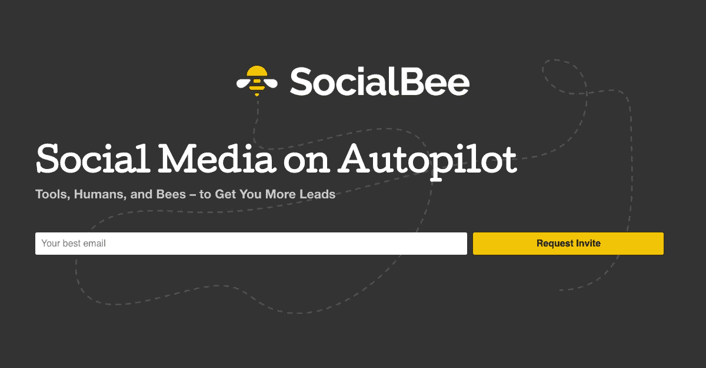
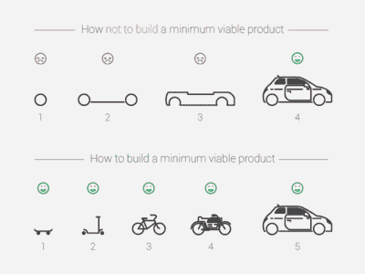

# 为什么大多数企业家无法建立一个成功的企业，你可以做些什么来取得成功

> 原文：<https://medium.com/swlh/why-most-entrepreneurs-fail-to-build-a-successful-business-a848de109936>

大多数企业家都失败了。

这不是他们的错。这是流行文化、硅谷(该系列)和企业家杂志标题教给我们的。

他们没有告诉我们的是，这些成功的故事是如何成为局外人的。异常点。那 0.01%。

你的初创企业可能不会像脸书那样大；你不会像史蒂夫·乔布斯一样出名；你也不会是第一个殖民火星的人。

尽管如此，企业家们还是冒了他们在拉斯维加斯永远不会冒的风险，赌上了他们的梦想、积蓄和生命中美好的几年。

当然，你不能听天由命。你付出了你的血汗和眼泪。读所有的商业书籍。但是 95%企业仍然失败。而如果你押红色或黑色，你有一半的机会。

但是不要害怕。**销售→服务→规模化，替代创业方法**就在这里！

继续阅读，了解如何在争取我们都渴望的本垒打的同时，大幅降低企业失败的几率。

失败的企业家都会犯同样的 3 个错误。让我们了解它们是什么，以便您可以避免它们！

# **1。错误的假设你会“建造它，他们会来”**

大多数企业家——尤其是科技初创公司的创始人——首先关注的是产品的制造，并认为盈利会自然而然地随之而来。

有些人甚至认为他们不必为自己推销，顾客会自己找到他们。这些人中的大部分人甚至在没有任何市场验证的情况下就产生了这种错觉。

然而，他们没有意识到，如果他们不生产合适的产品，他们就不能提供足够的实际价值，反过来，他们也就不能产生可观的收入。

他们也觉得他们不能要钱，除非他们有(他们认为的)成品。

这绝不是事实。

## **事实上，早期定义的货币化显示了真实业务的证据。在你拥有理想产品的最终版本之前，你可以很好地销售结果。**

对你的创业公司最好的认可就是付钱给顾客(最好是回头客)。

你可以在你现有的网络中找到第一批客户，推荐，或者使用 [SocialBee](https://socialbee.io) 。

这不仅能让你获得最初的、至关重要的(尤其是对一个白手起家的企业家来说)销售，还能帮助你验证你的产品或服务，引导你创造出市场真正需要的优秀产品或服务。

> **你必须先卖了它，以后再做。**

当我们开始[掘金](http://www.getnugget.co)时，我们只是专注于创造一个伟大的产品，以及如何让人们使用它。我们说过，我们不必马上考虑货币化，因为这将在以后自行解决。

人们下载了我们的应用，告诉我们它有多棒，他们有多爱它，但是用户回头率并不支持他们的积极反馈。

我们有一个很酷的想法，我们认为这可以解决很多人想要解决的问题。我们没有意识到我们的应用是维生素，而不是止痛药。维生素是有益的。止痛药是必需品。

这使得掘金成为一个[好产品，但却是一个糟糕的生意](https://www.linkedin.com/pulse/nugget-dead-long-live-socialbee-ovi-negrean/)。

随着我们的自助储蓄逐渐耗尽，我们不能在 [SocialBee](https://socialbee.io) 上犯同样的错误。

SocialBee.io — Social Media on Autopilot

所以我们翻转了模型，从第一天起就开始销售愿景和所有期望的结果。

**我们不是通过电子邮件订阅者或页面浏览量来寻求认可，而是通过确保我们提供足够的价值，让我们的客户愿意为那些甚至不是制造出来的产品付费，但仍能交付预期的结果。**

一旦我们看到许多与我们交谈的潜在客户掏出了他们的信用卡，即使我们没有一个漂亮的网站或真正的产品，我们也不再担心我们的运营率，并知道我们正在做一些事情。

# 2.**他们被流行的 MVP 方法弄得措手不及，因为他们本可以从服务开始**

当大多数企业家开始自己的生意时，他们开始研究完全可扩展的技术，这可能要花很长时间才能建立起来，结果却发现客户不愿意为此买单。

或者他们属于另一个极端，他们自己做所有的事情，完全为每个客户定制，他们没有创建一个简单的、可扩展的系统来提供一致的结果。

建立企业的第一步是一个可扩展的模型来服务你的客户，即使没有你的参与。否则，你就没有生意。你只是有份光荣的工作。

即使在创建技术来扩展您的业务之前，您也可以创建 sop(标准操作程序),这将使您创建一种统一的任务处理方式，并使您了解哪些任务可以通过技术轻松扩展。

大多数创业公司从 MVP(最小可行产品)开始，但他们忘记了在开始研究技术之前还有另一个步骤——门房 MVP 。

> 先外包，后内包。这就是礼宾最有价值球员。

当我们开始 [SocialBee](https://socialbee.io) 的时候，我们脑海中一直有一个可扩展的模型。我们只同意做部分工作，如果我们认为有一种方法可以通过技术或程序来扩大规模。否则，我们会向潜在客户推荐其他工具或解决方案。

从一开始，因为这个团队只有我和我的共同创始人，我们就开始制定标准的操作程序。这确保了我们可以在服务客户时互相帮助，并且一旦我们有了足够的客户，我们的工作量超过了我们的可用时间，我们就可以很容易地雇佣到可以快速投入运营的人。

随着我们业务的发展，这些程序已经得到了改进。但是从第一天起，拥有它们就迫使我们以一种系统的、可扩展的方式思考，这为我们的成熟打下了坚实的基础。

拥有一个可扩展的系统来服务我们的客户，也让我们在招聘新员工和确保我们实现承诺的结果时可以安心。

***你是怎么把它系统化外包给别人的？这感觉很辛苦！***

大多数人花很多时间做 10 分钟的工作。普通的小企业做 10 分钟的工作上百次。为了能够茁壮成长，你需要学会将自己从这个过程中系统化出来。对我们来说，这些程序是我们成长的关键。

你可能还会认为利用技术只需要几天时间就可以扩展特定的部分，但在早期，有太多的东西需要通过技术来扩展，你可能没有时间或预算来完成这几天的工作。

**因此，利用其他现有产品、API 和程序，让您能够无缝地为客户服务。**

# 3.**他们不知道如何将手工流程转化为自动化流程**

现在最难的部分来了。一旦你创造了一个可复制的系统，来扩大业务。

大多数成功创建文档化系统的人都无法进入下一步——利用技术真正扩大业务规模并大幅提高利润。

这是因为大多数考虑创建系统和过程的人这样做是因为他们没有技术背景。大多数有技术背景的人开始构建产品的技术层面，却发现没人愿意为他们构建的东西买单。

*当拥有一位技术联合创始人变得非常重要时，产品的规模化就变得非常重要。*

在没有首席技术官的情况下，你可以试着让一个伟大的首席技术官加入进来，并强迫自己思考如何用技术来取代某些东西。

现在，您已经有了合适的系统和程序，您的技术变得更加强大和可扩展，现在也是您应该扩展销售和营销工作的时候了。

从广告到社交媒体，从内容营销到合作伙伴关系，你必须找到哪种渠道组合能给你带来最大的吸引力，并加倍努力。并确保您将 [SocialBee](https://socialbee.io) 添加到该组合中；-)

我们现在被数百万辆汽车包围着。很快我们甚至可能会有会飞的汽车。我们只是认为汽车是理所当然的。但是，当然，它并不总是这样。

在 19 世纪末和 20 世纪初，每辆车都是由一小群工匠手工制作的。这种**服务**使得每辆车都要花很长时间来制造；它需要训练有素的技工，而且花费不菲。

1908 年，亨利·福特开始制造福特 t 型车。这是第一辆在装配线上生产的汽车，也是第一辆平价汽车。

凭借 T 型车，福特**扩展了**汽车行业，从那以后道路就不一样了。

尺度是你从爬行和行走到现在奔跑的瞬间。或者在福特的情况下…开车。

有了 [SocialBee](https://socialbee.io) ，我们通过挂接许多其他现有的 API 创建了我们的初始系统，主要是通过 Zapier 集成、带有深思熟虑公式的 Google sheets 和一些手工工作。

尽管这确实有效，并帮助我们向客户交付结果，但这是一个笨拙且容易出错的方法。我们可以在内部使用它来交付我们的服务，但我们的客户自己却不容易使用它。

扩展步骤是当我们开始替换我们通过拼凑第三方技术创建的系统，并将其构建到我们的核心产品中。

在销售和服务步骤中，报价仍然有点不稳定，因为你仍然试图了解大多数客户想要什么样的功能和好处。当您达到“扩展”阶段时，这一点应该很清楚，这样您就可以围绕您的主要优势制定具体的信息和营销行动。

# **结论**

所以你看，**大多数企业家无法建立一个成功的企业，因为他们从头开始。**这是他们预想的结果——不一定是市场想要或需要的。

但现在你更清楚了。

现在你知道，为了大幅提高你的成功机会，你必须首先**销售结果**，这样你就可以得到现实生活的验证，然后**服务客户**真正了解问题并调整你的产品，只有这样**才能扩大业务**，一旦你知道你的努力不会白费。

> 销售→服务→规模

好消息是**有了替代的创业方法，你也可以开始一个成功的生意**，不需要广泛的技术背景和大笔投资。

如果你已经有了一个想法，你想通过**销售→服务→规模**，替代创业方法开始，或者如果你有一个苦苦挣扎的业务，你想改善并需要一些反馈，请随时 [**安排与我的免费通话**](https://socialbee.io/ovi/) 。

如果你想了解更多关于这种另类创业模式和我的计划，请点击订阅我的时事通讯。我很想知道你对另一种创业方法的看法。随时[联系我](http://www.ovi.co/contact/)。

如果你想让你的**社交媒体自动运行**，关注增长和参与度，请确保查看 [**SocialBee.io**](https://socialbee.io)

## 这个故事发表在 [The Startup](https://medium.com/swlh) 上，这是 Medium 最大的企业家出版物，拥有 270，416+人。

## 在这里订阅接收[我们的头条新闻](http://growthsupply.com/the-startup-newsletter/)。

