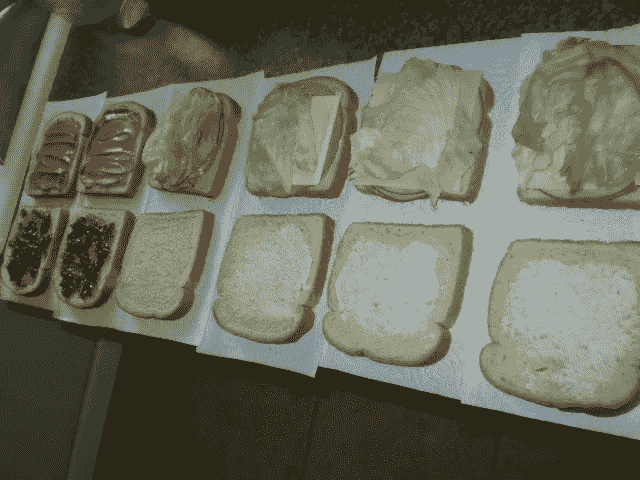

# 为什么大多数人不同意流程，以及如何处理流程

> 原文：<https://medium.com/swlh/why-most-people-disagree-about-process-and-what-to-do-about-it-99f1f66ee8ab>

过程是一个两极分化的主题。

有些人喜欢过程，有些人讨厌过程。你一般不会发现很多人在中间。

取决于你的听众，“我们应该对此进行形式化的处理，”可能会受到欢呼，或者，老实说，是一种“啊啊啊”的声音。(像我这样没有流程的人，有时甚至无法努力说出完整的单词)

# 为什么人们对过程的看法如此不同？

你做过迈尔斯-布里格斯性格类型测试吗？在测试的最后，你会得到基于四个关键属性的性格类型。

我不会深入探讨这个问题，但是测试给你的人格的最后一个方面是你是在感知还是在判断。

这是最能影响你对过程看法的方面。在高层次上，判断价值的人进行过程和决策，而感知价值的人有他们的选择。

这个世界并不完全非黑即白，但它的核心是帮助你理解为什么有些人比其他人更重视过程。

# 如果有人讨厌过程，有人喜欢过程，我们怎么办？

我是一个善于感知的人，但我热爱过程。

我们需要过程。

没有过程，什么也做不成。

过程不是问题。真正的问题是流程太多或太少。

感知类型的人重视开放他们的选择，但我们也高度重视自主性。结构的想法感觉就像是在挑战自主性，这就是为什么我们会有这样的问题。事实是，我们可能是最需要过程的人。

另一方面，评判人倾向于喜欢有一个系统和过程，因为他们是以任务为导向的人。为这些人创建和遵循过程往往是自然而然的，但是他们也有增加不必要的过程的倾向。

# 过程的金凤花法则

过程不能过度，也不能不足。它需要恰到好处的数量。

下面就来说说如何达到适量的过程。

首先要明白的是，越复杂的公司(或者家庭情况)，越有可能需要更复杂的流程。一个单身汉比一个五口之家需要更少的过程，而谷歌比一家初创公司需要更多的过程。

了解自己所处的位置是第一步。

当你很小的时候，你只能围绕最重要的事情来创造过程。当你更大的时候就不是这样了。

这确实是你需要理解的整个过程的关键部分。对小公司来说，过度加工会让你很快丧命，但加工不足也会。你需要明白什么是适合你的舞台的。

# 较小的公司应该有什么样的流程？

你已经有了流程，只是你可能不知道，因为它们不正式。

每个人每两周发一次工资吗？

大家都在中午左右去吃午饭吗？

每个星期五，当客户成功公司的鲍勃试图从办公室的一边向另一边打一杆进洞时，大家都会聚在一起吗？

这些都是流程的形式，但大多数是非正式的。与有机过程相反，正式过程往往需要被创建。

最好的过程类型是那些帮助每个人交流的过程。这方面的例子有:

确保有人记录并在会议结束时发出谁负责外卖

确保每个团队都明白他们的核心 KPI 是什么，以及他们如何对此负责

谁是关键项目的决策者

在这个阶段，重要的是过程要有助于沟通和提供清晰性，同时仍然允许团队拥有自主权。小公司需要有创造力和灵活性。过程应该帮助您维护这些元素。

这个阶段更多的是指导方针，而不是复杂的过程。

# 大公司应该有什么样的流程？

如果你在一家大公司，你可能需要帮助减少流程，而不是增加流程。

添加更容易，因为它通常围绕一个痛点。

去除是困难的，因为这个过程感觉像工作，即使是浪费时间。

这里最好的衡量标准是，如果我们去掉这个，会有什么变化？沟通会不会更差？

如果你不喜欢它，试着减少这个过程。

# 如何创建新流程

这听起来可能违反直觉，但是最擅长创建过程的人是最讨厌过程的人。

(不知道那个人是谁？找找乱七八糟的桌子)

原因是他们默认创建尽可能少的过程，这才是真正的目标。

创建更少的流程并在以后添加总比创建太多要好。

任何过于复杂的东西都会扼杀自主性，会让人们纠结于领养。

默认为简单。

一旦你有了一个简单的过程，那么是时候让以判断/过程为导向的人来戳它的漏洞了。

当这里提出建议时，要多问为什么。了解在有意义的地方添加这些内容是否足够有用。

嘣。现在你有了一个全新的流程。恭喜你！🎆🎇🎆

工作没有完成，现在你必须重新评估这是否有帮助。

我已经谈到了这一点，但这是一个重要而被低估的步骤。永远不要把过程看作是永久的。

一旦流程到位，人们就害怕拆除它，这是你可能做的最糟糕的事情。

它的存在并不意味着它需要存在。这是一个更深入的对话，值得单独发表。

又及:你现在渴望开始一个新的过程吗？这里有一个很好的，点击我的每一个帖子的掌声按钮。简单，不要过度加工，你会让我感觉很好😀

**P.P.S .如有任何反馈，请在** [**Twitter**](https://www.twitter.com/briancarl) **或**[**LinkedIn**](https://www.linkedin.com/in/briancarl)**上告知或在下方留言评论。**

图片来源:EvelynGiggles 的《三明治流水线》由 2.0 在 CC 下授权

## 这个故事发表在 [The Startup](https://medium.com/swlh) 上，这是 Medium 最大的创业刊物，拥有 290，182+人关注。

## 在这里订阅接收[我们的头条新闻](http://growthsupply.com/the-startup-newsletter/)。

