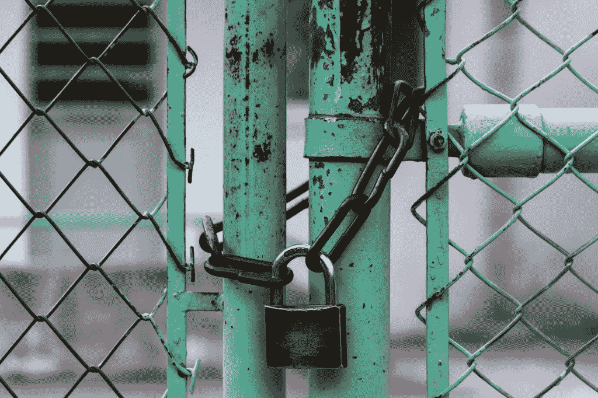
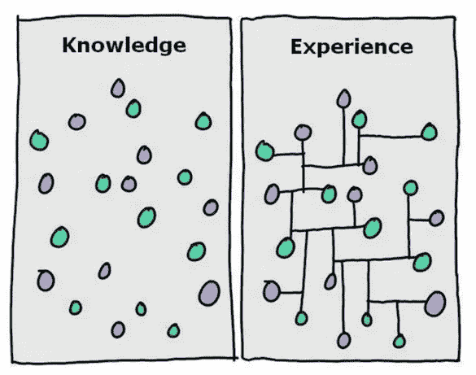
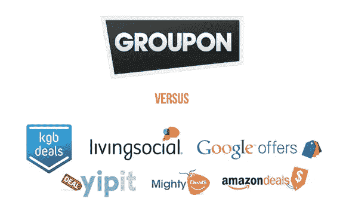
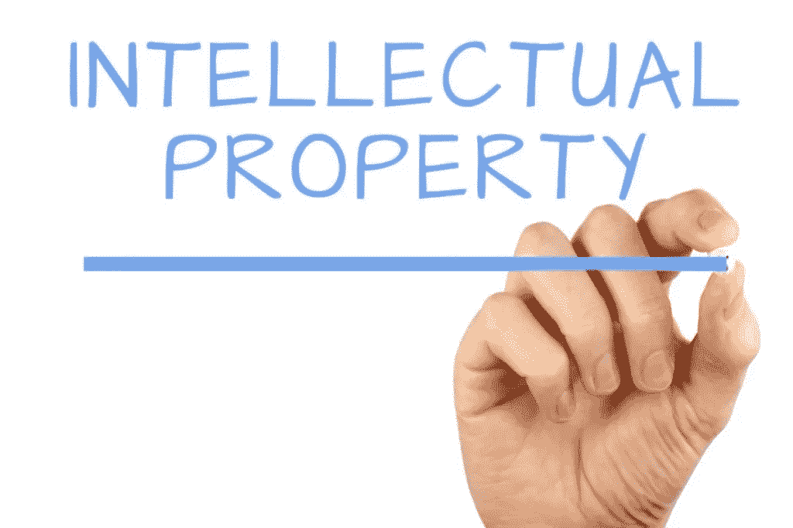

# 为什么新创公司不需要专利

> 原文：<https://medium.com/swlh/why-new-startups-dont-need-patents-a9e83e688510>

Originally published on [http://www.appsterhq.com](http://www.appsterhq.com/?utm_source=CP&utm_medium=Medium)

在 Appster 我们经常会遇到这样的企业家，他们明确认为获得专利是启动他们的创业的先决条件。然而，在大多数情况下，早期阶段的初创企业实际上应该*避免*整个专利申请过程。

在这篇文章中，我将试图解释为什么新的创业公司通常不需要专利，我将揭示你可以并且应该采取的合理措施，以保护你的知识产权。

# 什么是专利？

最终，像这样的商业想法不能被保护。相反，它是可以申请专利的思想的具体体现。

但是，到底什么是“专利”？

A 根据 [Investopedia](http://www.investopedia.com/terms/p/patent.asp) 的说法，**专利**是“一种政府许可，授予持有者在指定时期内对某项工艺、设计或新发明的专有权。”美国的专利权通常授予 20 年。

[BusinessDictionary](http://www.businessdictionary.com/definition/patent.html) 提供了更全面的定义，指出了以下几点:

> “专利是授予个人或公司制造、使用和销售其发明并禁止他人这样做的有限合法垄断权。如果一项发明具有新颖性、实用性和非显而易见性，它就可以获得专利……专利申请必须披露该发明的所有细节，以便其他人可以利用它通过新的发明来进一步推进技术。”

专利的基本目的或功能是什么？

“通过授予生产新产品的权利而不用担心竞争，专利激励公司或个人继续开发创新的新产品或服务”([来源](http://www.investopedia.com/terms/p/patent.asp))。

好的，专利允许个人或公司对其开发的东西拥有某种垄断，从而鼓励它(和其他发明者)继续创造创新的东西，并知道它们不会被他人窃取/复制。

在这种情况下，如果你要推出一家新的初创企业，而你认为它将是下一个上市的大产品，比如一款移动应用，那么你难道不想为它申请专利吗？

如果你的应用真的会如此成功，难道别人不会试图窃取它吗？

# 不，你不应该申请专利

尽管这可能看起来违背直觉或非常危险，但在绝大多数情况下，我们建议创业者在他们的初创企业仍处于起步阶段时，跳过整个专利申请过程。

有三个基本因素支持这样的说法，即试图获得专利来保护新公司的知识产权(IP)既不必要也不明智:

1.  成本和时间的花费，以及持续变化的现实
2.  需要尽可能快地执行
3.  保护知识产权的其他手段的可用性

让我们依次考虑一下这些问题。

# 1.专利:太贵、太费时、限制太多

专利需要很多钱*和*大量的时间来准备和成功申请。当然，不能保证仅仅通过专利申请程序就意味着你最终会被授予专利。

很难准确地说出一项美国专利的“平均价格”，因为有太多不同的因素会影响最终成本，从直接的申请费到持续的律师费到检索费和上诉费，等等。

H aving 说，ipwatchwatchdog.com[的 Gene Quinn 建议](http://www.ipwatchdog.com/2015/04/04/the-cost-of-obtaining-a-patent-in-the-us/id=56485/)一个“极其简单”的专利申请往往至少要花费 6000 美元，而 blueironip.com[的 Russ Krajec 报道](http://www.blueironip.com/what-do-patents-actually-cost/)大部分专利的整个准备和起诉过程可能总计接近 60000 美元！

即使你设法拿出现金来支付专利费用，专利本身也获得了批准，但有一点需要牢记:

> “统计数据显示，高达 97%的专利产生的收入少于获得专利的成本”([来源](http://www.invents.com/how-much-does-a-patent-cost/))。

专利不仅从经济角度来看是昂贵的，而且从时间角度来看也是昂贵的。

一般来说，许多消息来源称，基本的专利申请可能需要 2.5 到 5 年才能完成。

2016 年，美国专利商标局(USPTO) [表示](https://ipspotlight.com/2016/12/31/how-long-does-it-take-for-the-uspto-to-issue-a-patent-or-register-a-trademark-2016-edition/)专利申请和首次官方行动之间的平均等待时间为 16 个月，而专利的总未决期平均约为 25 个月。

所以，在得知你的申请是否被接受和批准之前，你基本上至少要看 2 年。

如果像许多专利申请一样需要 5 年时间，那么当你的专利被批准时，你的产品完全有可能已经退出市场(因为你已经进入了一个新的企业)。

说到赞同，实际赞同率是多少？大约在[年，56%的专利申请被批准](http://digitalcommons.law.yale.edu/cgi/viewcontent.cgi?article=1113&context=yjolt)；其余 44%被拒绝。

如果你的专利包含了以前专利项目的组合，那么你的专利被接受的机会就会大大降低。

这一切的重点是:

**专利申请过程耗费大量金钱和时间:作为一家新创企业，你应该把你的现金和时间花在其他能让你的企业成长并盈利的事情上。当你第一次开始经历复杂和不必要的专利申请折磨时，你根本没有资源。**

除了你的重点需要放在尽快创造收入的可靠产品上，避免寻求专利的另一个原因是*你的想法将不可避免地改变*。

风险投资家、Y Combinator 的联合创始人保罗·格拉厄姆[指出](http://paulgraham.com/notnot.html)70%到 100%的新创企业在前三个月的运营结束时，在他们的业务核心都有一个**不同的**核心理念。

为什么会这样？

因为经验教会你一些你根本无法提前知道的事情。只有通过实际测试你的想法并收集真实世界的反馈(尤其是来自真实消费者的反馈),你才能获得调整你的产品和改善你的初创企业运营所需的洞察力。

很明显，在运营公司的头几个月里，你很可能会放弃(或做出重大改变)一个想法，而为这个想法申请专利并不是一个好主意。

真正的创新发生在*执行*你的想法的过程中:

# 2.快速执行胜过专利

今天，大多数最成功的初创企业不是基于将全新的东西引入世界的新颖发明，而是基于通过成功应对可货币化的消费者痛苦而有效占领市场份额的产品。

当谷歌、脸书、苹果和 Airbnb 等公司作为初创企业起步时，它们并没有公开痴迷于确保他人不窃取它们的创意。

事实上，在谷歌出现之前，现有的搜索引擎有十几个；iPhone 出现之前就有 PDAs 沙发表面在 Airbnb 之前就存在了；诸如此类。

只有在收入开始涌入之后*，这些公司*和*才开始专注于为他们不同的产品申请专利。*

[超受欢迎的电子商务市场 Groupon](http://www.appsterhq.com/blog/groupon.com) 是一个有趣的例子。

Groupon 已经被成千上万的其他公司克隆，包括谷歌、亚马逊和脸书。然而，至今仍在运营的 Groupon 在 2011 年进行了首次公开募股(IPO ),并有数百万人定期使用。

最终，与你的创业成功相关的最重要的因素是 [**执行**](http://www.appsterhq.com/blog/startup-execution-ounce-action-worth-ton-theory) :你越早进入市场并测试你的产品来执行你的想法，你就越有可能赢得市场份额，从而开始创造利润。

正如我们在上面看到的，考虑到大多数新创企业一旦开始尝试创造有形产品，就会改变他们的核心商业理念，执行就变得更加重要。

美国画家兼摄影师查克·克洛斯[说得好](https://www.brainpickings.org/index.php/2012/12/27/chuck-close-on-creativity/):

> “灵感是给业余爱好者的；我们其余的人只是出现并开始工作…所有最好的想法都来自这个过程；它们来自作品本身。”

对于每一个谷歌或脸书来说，都有成千上万不成功的初创企业将有限的资金和时间投入到错误的事情上——比如申请不必要的专利——从而在有机会找到如何获得成功之前就失去了成功的机会。

[不用担心别人窃取你的创意](http://www.appsterhq.com/blog/best-million-dollar-app-ideas)；相反，开始工作，进入市场，获得真实世界的反馈，并开始执行你的想法。

# 3.你不需要专利来保护你的知识产权

尽管我建议早期初创企业应该避免整个专利申请过程，但我并不是说新公司不应该在保护知识产权方面采取任何预防措施。

如果您有知识产权预算，那么您应该重点保护以下内容:

*   **域名:**可靠的域名是重要的数字资产。理想情况下，你应该找到一个以。这代表了你的品牌(你可以在我的上一篇文章中读到更多关于寻找一个有利可图的创业公司名字[)。我给你的一点建议是，尽早购买你喜欢的域名，也就是说，在你的公司成功之前购买*——否则，如果域名抢注者认识到你的商业运作越来越有价值，他们肯定会抬高你想要的域名的价格。*](http://www.appsterhq.com/blog/market-driven-guide-choosing-profitable-start-name)
*   用户名:同样的原则也适用于此:在 Twitter、脸书和 Instagram 等社交媒体网站上保护你的用户名，以免被他人窃取。
*   **商标:**只要您的公司使用，您就可以将公司名称、产品、服务、标语、口号等注册为商标。搜索 USPTO 的商标数据库[这里](https://www.uspto.gov/trademarks-application-process/search-trademark-database)确定你的哪些商标需要注册，然后正式注册。

# 摘要

综上所述，你不需要*专利来创造一个成功的初创企业。*

是的，也有例外，初创企业开发了一项突破性技术，因此肯定会从寻求和获得专利中受益。

然而，在大多数情况下，初创企业的创新是微不足道的(这并不意味着该公司没有向市场提供急需的产品或服务！).

专注于执行你的想法，即进入市场，赢得市场份额，并创造利润— *然后*专注于建立知识产权组合，如果这是你的主要目标之一*和*如果这对你的业务有意义。

> 最初发表于[http://www.appsterhq.com/](http://www.appsterhq.com/?utm_source=CP&utm_medium=Medium)

