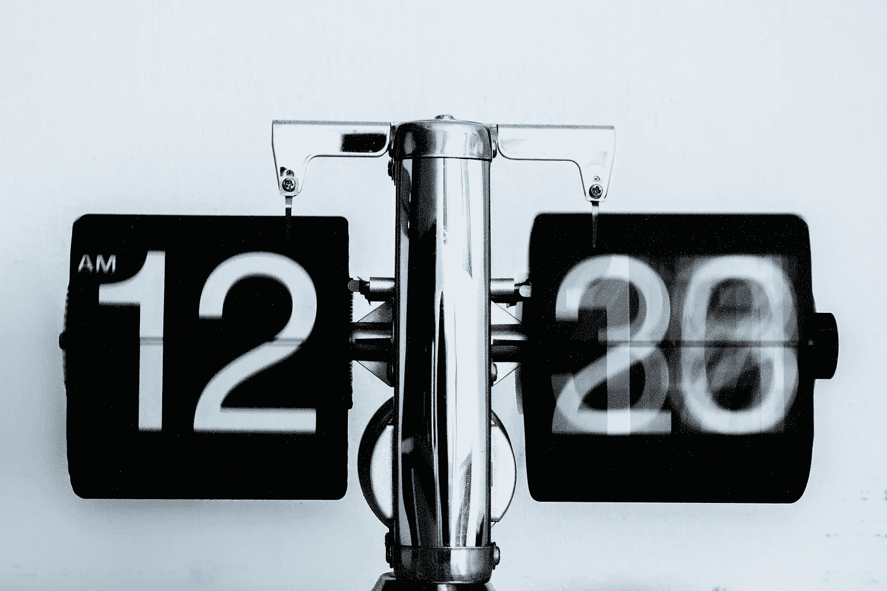
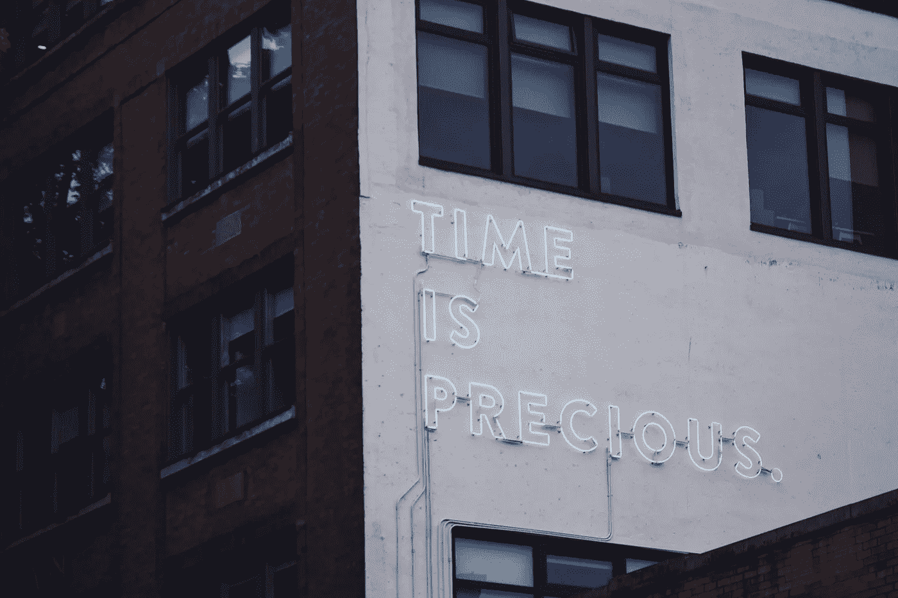

# 为什么没有足够的时间从来不是借口

> 原文：<https://medium.com/swlh/why-not-having-enough-time-is-never-an-excuse-5bb0b0d9804e>

你的问题不是缺少时间，而是缺少清晰度。

Photo by [Loic Djim](https://unsplash.com/@loic) on [Unsplash](https://unsplash.com)

我是一个有创造力的人，每天没有足够的时间。至少我以前是这么想的。在过去的 10 年里，我在任何时候都在做大约 5 到 6 个不同的项目。潜入每个项目的研究和有趣的部分，我已经“开始”了很多。可悲的是，它们都没有完成。

这听起来熟悉吗:

“我打算开一家做 x 的公司，但首先我需要时间做 ABC 和研究 XYZ。”

如果是这样的话，你就会知道当你开始一千个项目，却只能勉强完成少数几个时，是多么令人讨厌。

> 人们很容易把没有完成项目归咎于时间不够。因为感觉有些人比其他人能从一天中挤出更多的时间。

为什么我觉得自己时间不够用，而其他人似乎有很多时间？

在我的项目从未启动的情况下，[瑞安·哈乐黛](https://ryanholiday.net)、[蒂姆·费里斯](https://tim.blog)和[玛利亚·波波娃](https://www.brainpickings.org)是如何创造出如此多的作品的？

我曾经被这个问题弄得有点沮丧。我记得在我 15 岁的时候，我对我爸爸说我不能学乐器，因为我没有时间。他耐心地向我解释说，真正的问题不是我没有时间。而是我选择把钱花在其他事情上。

每次我决定放学后呆在公园里骑自行车，我都是在选择不学乐器。每次我选择玩电子游戏，我就选择不练习乐器。你明白了。

我爸爸不会开始批评我十几岁时是如何度过空闲时间的。但他在哄我认识到:如果你非常想要某样东西，你会找到时间让它在你的生活中发生。

> “问题在于缺乏方向，而不是缺乏时间。我们每天都有 24 小时。”——金克拉

我们每天都有相同的时间去实现我们想要的东西。我们中的一些人只是比其他人更专注。

例证:在过去的几个月里，我一直在努力多读书。这并不总是容易的。我不是最快的读者，我也没有花一天的时间来阅读。所以有几天晚上 10 点的时候，我一页也没看。我开始思考这一天有多忙，我有多累。

但之后我又会听到爸爸的话。我会想:现在是晚上 10 点，再熬半个小时，看看你需要做什么。

Photo by [Harry Sandhu](https://unsplash.com/@harryxsandhu) on [Unsplash](https://unsplash.com)

我们经常说我们想要某样东西，但事实是我们只是爱上了这个想法。投入时间去实现它永远不会发生，因为我们不够渴望它。

> “最主要的是保持主要的东西是主要的东西。”—斯蒂芬·R·科维

在过去的几年里，我不得不几次重新调整我的抱负。当我不断告诉自己我想要某样东西，但从来不愿意花时间去实现它。我对生活有一千种兴趣，所以这是一个强有力的教训。

随着每个人的不断接触，很容易让社交媒体让我们觉得我们错过了什么。我想像他一样参加铁人三项。我想花一年时间像她一样旅行。我想像他们一样住在纽约。但我真的有吗？有时候答案是肯定的，但大多数时候实际上是否定的。

对于你想做的事情，你要非常诚实地面对自己。因为在我有限的经验中，你越能集中注意力，你就有越多的时间。你拥有的时间越多，你能实现的就越多。

## 这个故事发表在 [The Startup](https://medium.com/swlh) 上，这是 Medium 最大的创业刊物，有 292，582+人关注。

## 订阅接收[我们的头条](http://growthsupply.com/the-startup-newsletter/)。

