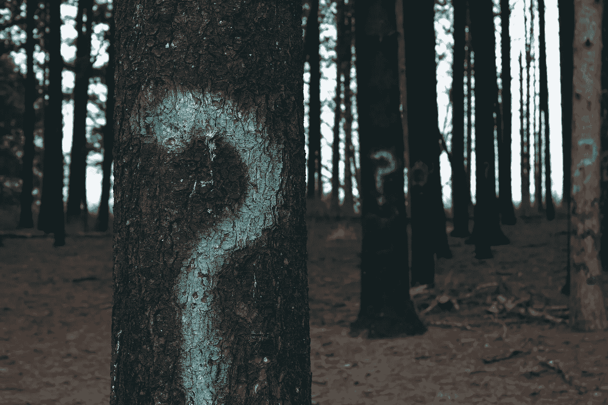

# “为什么？”或者“为什么不呢？”

> 原文：<https://medium.com/swlh/why-or-why-not-fda87bfdb708>

Choosing the right questions is sometimes more important for our path than finding the right answers. (Photo by [Evan Dennis](https://unsplash.com/photos/i--IN3cvEjg?utm_source=unsplash&utm_medium=referral&utm_content=creditCopyText) on [Unsplash](https://unsplash.com/search/photos/why%3F-why-not%3F?utm_source=unsplash&utm_medium=referral&utm_content=creditCopyText)).

## 对后悔的审视。

昨晚，我目睹了一场令人抓狂的对话，这场对话仅仅是关于举证责任的分歧。

> “为什么不呢？”我以前的一个学生说。
> 
> “嗯……”她的同伴回答，“为什么？”