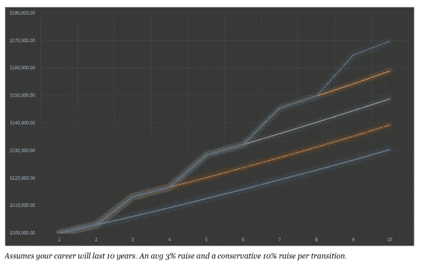

# 为什么其他科技人才的工资比你高

> 原文：<https://medium.com/swlh/why-other-tech-talent-gets-paid-more-than-you-eac74808f3c8>

你能想象和一个职位相同，工作经验少 3 年，薪水比你高的同事交谈吗？我在想你的一天马上就会被毁了。

事实是，这是许多人的现实。更好的程序员或设计师并不总是有更高的薪水。那么，你如何确保你得到的报酬与你的价值相符呢？

这里有 7 种方法可以提高你的薪水。

# 1)利用候选市场。

这是一张来自《哈佛商业评论》的图表

利用这些信息来影响你的薪资谈判。这不是你可以向未来的雇主展示的东西，然后说“嘿，看，这是一个候选市场！多付我钱！”。

这对于你来说更有用，因为你知道当你谈判薪酬时，你有比你通常预期的更多的回旋余地。如果你真的很擅长你所做的事情，那么你可以稍微努力一点去争取你应得的东西，而不要期望太多的回报。

目前需求远远高于供给。

# 2)利用美国 50 万个技术岗位

[50 万个技术岗位空缺](http://www.washingtonexaminer.com/obama-aims-to-fill-500000-open-tech-jobs/article/2561232)是一个巨大的数字。

它不仅是一个候选市场，还有大量的技术职位空缺。这意味着一些专业人士正在利用市场条件，离开他们的工作，寻找新的高薪工作。

尽管这一统计数据仅针对美国市场，但我只能想象类似的趋势正在全球范围内发生。

# 3)事实证明，离开目前的工作会获得更高的薪水

没有比这个[对福布斯](http://www.forbes.com/sites/cameronkeng/2014/06/22/employees-that-stay-in-companies-longer-than-2-years-get-paid-50-less/)的深入分析更好的了。以下是文章中一些有趣的数据:

*   在公司工作超过两年的员工工资会少 50%。
*   2014 年，员工预期的平均加薪幅度为 3%。

下面是来自同一篇文章的另一个强大的图表。很明显，找一份新工作是提高薪水最简单的方法。

# 4)避免问“你目前的工资是多少？”像瘟疫一样。

当与招聘人员或招聘经理交谈时，你经常会被问到“你目前的薪酬是多少？”

如果你说你目前的薪水比他们预期的要低很多，你的加薪可能不会像预期的那么高。现在，一些招聘人员最感兴趣的是让你拿到最高的薪水，但是你不能总是假设参与这个过程的每个人都是这样。

我认为最有效的方法是要么拒绝回答这个问题，要么提供你想要的报酬。

谈到想要的推荐，总是从高端开始，不要谦虚。

# 5)定期公开分享你的作品

对于程序员来说，GitHub 和其他开源平台使得展示你的工作比以往任何时候都更容易。显然，你不能分享你为当前公司所做的工作，但是分享你创造的副业和激情会让你领先一步。

设计师和营销人员也是如此。招聘经理和招聘人员希望公开看到你的工作。令人印象深刻的公开工作往往会让招聘经理和招聘人员更加努力地追求你，因为全世界都看到了你的工作，他们相信你非常适合这份工作。

# 6)找到最好的技术招聘人员，他们有兴趣让你拿到更高的薪水

是的，伟大的招聘者确实存在。

6 月日[，我们的任务是从糟糕的招聘者中筛选出优秀的招聘者。](http://joinjune.com/)

我们让技术候选人给招聘人员打分。这使得其他技术候选人可以看到哪些招聘人员是最好的，并让招聘人员承担责任。

# 7)知道自己的价值，精确到一分钱

只有一种方法可以知道你的价值，那就是得到一份工作。有很多网站会根据你的职位和地理位置给出你应该挣多少钱的范围，但是没有什么比在你的薪水旁边看到你的名字更好的了。你想知道你的价值，而不是你的职位在某个特定的地方的价值。

我的经验法则是，即使我工作愉快，每年也至少面试 3 次。如果我非常高兴，我只会面试两次。

如果你对你面试的人很挑剔，并想确保这是值得花时间的，六月会让你和招聘人员交谈获得报酬。你定好价格，如果招聘人员认为你适合这份工作，他们会联系你，你的时间会得到补偿。

*   ***如果你喜欢这个话题，请点击下面的心形按钮推荐这个话题**

*发表于* **创业、旅游癖和生活黑客**

-