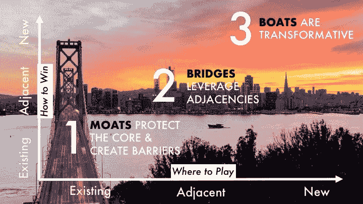
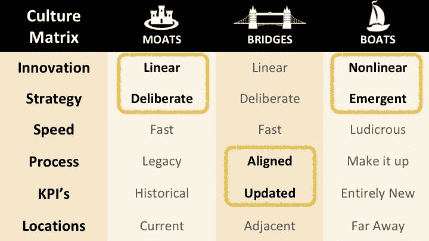
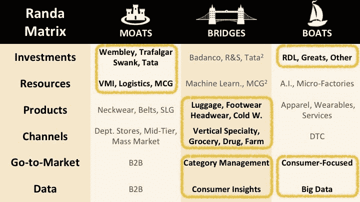
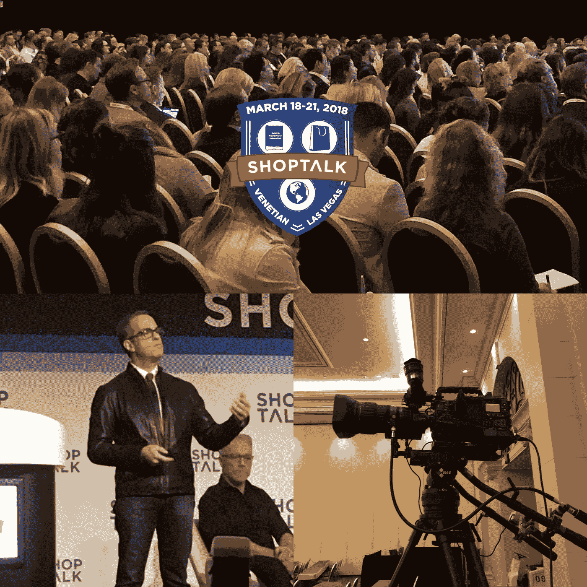

# 为什么我们的皮带、领带和钱包公司投资人工智能(真的)

> 原文：<https://medium.com/swlh/why-our-belt-tie-and-wallet-company-is-investing-in-artificial-intelligence-really-3ad951c76db6>

© Shutterstock

如今，随着这家科技巨头将其触角伸向越来越多的行业(最近是医疗保健)，似乎每家公司都在某种程度上与亚马逊竞争。这种扩张是由亚马逊强大的技术基础设施推动的，这给了它一个平台，可以在它进入的任何领域快速扩张。

人们普遍认为，这些领域的大型传统公司将无法跟上这种颠覆。然而，在本文中，我们将利用我们公司的历史来证明，对于传统公司来说，应对变化并不像许多人想象的那样困难。

我们将讨论 Randa Accessories 如何构建其数据能力并实现其技术后端的现代化，以实现亚马逊般的精度和效率，并在此过程中发展其核心业务。

并且，我们将分享我们对当今男士打领带的动机的发现——答案并不是你所想的那样。

首先，简单介绍一下兰达。您可能不知道我们的名字，但您知道并拥有我们的产品。我们的时尚和服装配饰涵盖 50 个品牌(包括 Ralph Lauren、Levi's、Columbia Sportswear 和汤米·席尔菲格)，在 20，000 多个销售点和数百万个数字接触点销售。

我们是世界上最大的男士配饰公司。我们卖领带，皮带，钱包，包，帽子，拖鞋和行李。

Randa 是完全垂直的，企业对企业，直接面向消费者，有 4，000 名员工在 23 个全球办事处工作。

我们的文化强调增长和效率，并引领我们在收入、利润、渗透率和市场份额方面取得成功。

例如，我们是诺德斯特龙、沃尔玛、梅西百货、美国柯尔百货公司、亚马逊、罗斯商店、哈德逊湾、利物浦、巴黎春天百货、埃尔科尔特斯英格尔斯、大卫·琼斯、约翰路易斯和好市多的皮带供应商。

我们花费了 5000 多万美元，以确保当消费者走进零售店购买裤子时，他们会立即看到附近有我们的皮带。礼服衬衫？这是我们的纽带…

然后，我们碰壁了。

宏观经济趋势的转变、消费者购买途径的改变、价格压缩、零售格局的瓦解…

突然间，走进商店的顾客越来越少。

在网上，当你购买李维斯牛仔裤时，你看到的是其他牛仔裤的选择，而不是我们的李维斯皮带。

所以，我们求助于我们强大的企业文化。我们在挑战中投入了资源、现金和人才…但我们仍然碰壁了。

## 事实证明，我们的传统文化是我们最有价值的资产，直到有一天它不再是。

我们认识到，我们不能用昨天的地图来描绘明天的风景。所以，我们画了一张新地图。

有了这个路线图，我们的公司从 2 亿美元增长到近 10 亿美元。

我们称我们的路线图**“护城河，船&桥。”**

**护城河**保护核心，建立竞争进入壁垒。

**桥梁**利用相邻的机会——相邻的客户群、分销渠道以及相邻的产品和服务。

**船**是改造型的。

成功的传统公司的“护城河”文化是线性的*。一件事导致另一件事。效率和优化受到高度重视。而创新战略是*深思熟虑的*。每个人都知道公司去过哪里，现在在哪里，将走向哪里，以及到达那里的计划。*

*“桥”文化倾向于与“壕沟”文化保持一致…包括新的但相邻的业务。*

*初创企业所青睐的“船”文化是*非线性*。它重视新奇。船文化在开始时常常是低效的。策略是从各个方向涌现出来的。*

*LinkedIn 的创始人雷德·霍夫曼曾经说过，*

> *创业创新需要你把自己从悬崖上扔下去……然后在下落的过程中造出飞机。*

*对于在职者来说，你越大，你倒下得越快。*

## *一个常见的误解是，传统的“护城河”文化无法识别非线性创新，他们被困在“旧”的做事方式中。*

*根据我们的经验，这是完全错误的。*

*真正的问题是，大多数非线性创新并不服务于当前的客户，它扰乱了传统流程——这是销售和现金流的主要驱动力——而且它通常会极大地分散人们的注意力，而收效甚微。*

*相反，*创业文化是由颠覆激发的*。这些团队通常没有其他文化所面临的销售和利润增加的阻碍。*

*遗产和创业文化，“护城河”和“船”，激烈争夺有限的资源——A 级人才、资本和技术。他们在沙盒里玩得不太好。*

*我们的解决方案是，创造一个三种文化都能繁荣发展的环境…并分离对立的力量。*

*让我们来看看我们在 Randa 是如何做到这一点的:*

**

*在我们的“护城河”世界里，我们利用并扩展了我们最擅长的领域。我们垂直深入。*

*我们投资了现在世界上最大的皮带工厂:危地马拉的塔塔。*

*我们专门建造了超过 100 万平方英尺的 Randa 自有配送中心。*

*我们收购了目前美国最大的店内商品销售公司 MCG，该公司拥有 3000 名员工，他们确保我们的固定装置被填满，我们的消费者参与进来，并实时提供消费者洞察。*

*我们创建了一个非凡的供应商管理库存系统，该系统具有增强的机器学习功能，允许我们每周在 20，000 家商店中的每一家放置准确的库存。*

*“桥梁”我们增加了相邻的类别:箱包，鞋类，头饰，寒冷天气配件。*

*此外，利用我们从概念到消费者的供应链，我们渗透到邻近的分销渠道:垂直专业(Old Navy、Lands' End、Gap)、Aldi 超市、药店和“农场和牧场”商店，包括拖拉机供应。*

*同样重要的是，随着我们在几个类别的市场份额从 25%增长到 50%，我们开始管理整个配件部门。我们消除了零售合作伙伴的风险，提高了部门绩效和客户满意度。*

*我们将大部分营销预算从以企业对企业为中心转向消费者洞察和刺激消费者行为。*

*我们建造了“船”*

*我们创建了 Randa Digital Labs，并把他们从我们的总部转移到他们自己的工厂，我们为他们提供自己的 A 级人才，自己的资源，并允许他们根据新兴的商业模式创建自己的绩效指标。*

*Randa Digital Labs 采用的创业战略包括快速原型法、快速失效法、快速测量法和快速优化法。*

*此外，兰达热衷于收购、投资和合作。*

*除了在自有品牌、基础设施和供应链方面的重大投资，我们最近还投资了几家处于早期阶段的企业对消费者公司，包括时尚运动鞋的“Greats”品牌、一家以数字为先的定制服装企业和一家箱包初创企业(即将推出)。另外，敬请关注，我们还有一些大惊喜等着您。*

*我们的“船”文化是消费者至上的，我们进行持续的定性、定量和购买途径研究。我们已经收集了超过 40 亿点的消费者数据。*

## *这让我们明白了为什么 Randa，一家生产皮带、钱包和领带的公司，现在投资于数据科学家和人工智能。*

*我们的增长不能再依赖于市场份额的增加，我们已经发展得太大了，这已经不再是持续增长的主要来源。我们需要增加我们类别的总消费支出，我们在顾客“钱包”中的份额。为此，我们必须掌握自己的命运。我们需要理解和激励我们不断发展的消费者，取悦他们，满足他们的需求，他们的“工作要做”。*

*我们正在使用人工智能和机器学习来实施数字工具，以识别客户的生活方式和偏好，然后提供有针对性的定制配件体验。数据是我们的燃料，人工智能对于我们为客户提供非凡价值至关重要。*

*我们已经发现了男人买领带的原因——不是因为着装要求、舒适度，也不是因为领带与礼服衬衫相配(给你一个提示，你不能戴上个月婚礼上戴的那条领带——因为那条领带在 Instagram 上太显眼了。)而且，我们正在发现男人买腰带的令人惊讶的原因(不是为了撑住他们的裤子……)。*

*到目前为止，这个路线图对我们公司很有帮助。我希望你也能如此。*

**2018，大卫·j·卡茨**

*[点击](http://www.randa.net)了解更多关于[兰达配件的信息](http://www.randa.net)。*

*— — — — — — — — —*

**正如作者在 2018 年 3 月 18 日的 ShopTalk 上所呈现的:“全球最大的零售和电子商务会议”**

**

*As presented at ShopTalk 2018: The World’s Largest Conference on Retail & Ecommerce*

*#创新#零售#电子商务#时尚#技术#创业#数据#人工智能*

*   *[启动](/tag/startup?source=post)*
*   *[人工智能](/tag/artificial-intelligence?source=post)*
*   *[零售](/tag/retail?source=post)*
*   *[创新](/tag/innovation?source=post)*
*   *[技术](/tag/technology?source=post)*

**

## *这篇文章发表在 [The Startup](https://medium.com/swlh) 上，这是 Medium 最大的创业刊物，有 317，238+人关注。*

## *在这里订阅接收[我们的头条新闻](http://growthsupply.com/the-startup-newsletter/)。*

**