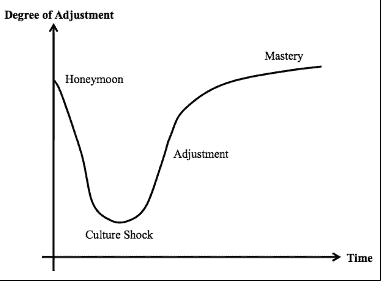

# 为什么人们在数字游牧生活方式中失败

> 原文：<https://medium.com/swlh/why-people-fail-in-the-digital-nomad-lifestyle-abef959d4dc9>

位置独立之旅中常见的绊脚石

Disconnect — Photo by [Campbell Boulanger](https://unsplash.com/photos/hCqXi7ENGPo?utm_source=unsplash&utm_medium=referral&utm_content=creditCopyText) on [Unsplash](https://unsplash.com/?utm_source=unsplash&utm_medium=referral&utm_content=creditCopyText)

数字游牧生活方式当然有很多可以想象的东西。当生活美好的时候，它会是例外的。当你在巴厘岛的海滩上工作时，你的太阳镜很容易染上一点玫瑰色。什么会出错？

但重要的是要指出，虽然许多人可能会尝试，但没有多少人像数字游牧民那样长期坚持。如果你不小心的话，有一些常见的事情会成为你前进道路上的绊脚石。由于数字游牧生活方式的完整表达仍然如此新鲜，这些往往会让人们措手不及。

# 重要的事情先来

2018 年及以后的技术进步带来了一系列机遇和挑战——无论你是过着传统生活还是游牧生活。现实是，现代生活的许多方面与我们人类的 DNA 不一致。

仅发达国家的药品处方量就表明，人类正在与以下相关疾病进行广泛斗争:

*   焦虑和抑郁
*   无法集中注意力
*   爱和维持关系
*   心理健康
*   肥胖和体重增加
*   缺乏活力
*   睡眠和失眠
*   办公室引发的问题，如背痛、眼疾和腕管综合症
*   糖尿病、癌症、心脏病等绝症。

这些问题中的许多都与久坐不动的生活方式、工作场所的压力以及应对现代生活压力的普遍无能有关。

Mondaze — Photo by [Nathan Dumlao](https://unsplash.com/photos/aZ9X3L1Va2Y?utm_source=unsplash&utm_medium=referral&utm_content=creditCopyText) on [Unsplash](https://unsplash.com/?utm_source=unsplash&utm_medium=referral&utm_content=creditCopyText)

好消息是，除了工业革命，当世界人口变得停滞不前而不是流动时，人们总是以某种形式游牧。但数字游牧民族拥有亿万年的人类历史，支持他们选择重新掌控自己的日常生活、健康和未来。

坏消息是，作为一个数字流浪者代表了一种新的问题，传统生活中的人们不一定要处理这些问题。此外，它还会加剧上面列出的原有挑战。

同样重要的是要强调，旅行并不能解决我们所有的问题(或者任何问题)。边工作边旅行——这是数字游民经常做的事情——会让事情变得更加复杂。

如果游牧民不小心的话，下面是一些可能让他们放弃游戏的主要因素。

# 数字游牧民失败的 4 个主要原因

Avoid these things

# 1.缺乏资金

在我的工作中，作为一名[国际移民顾问](https://www.travelingwithkristin.com/about-1/)，在过去的十年里，我已经帮助了 1000 多人移居国外。2018 年早些时候，我调查了我的许多前客户，了解他们作为远程外派人员成功和失败的主要因素。

到目前为止，他们认为人们在独立于地理位置的生活方式中失败的首要原因与金钱有关。没有钱，其他没什么好讨论的。

所以，在你辞掉工作或买机票之前，确保你有一份稳定的工作或可靠的方式来为你的生活和旅行提供至少未来 6 个月到一年的资金。

与金钱类别相关的问题有:

*   不量入为出，工作时间不够。
*   没有足够的动力去成功。
*   在旅行上花费太多。
*   在阻碍生产力的环境中生活和工作。
*   由于研究不足，财务和其他方面的规划不佳。

# 2.文化差异和僵化

很少有人讨论在国外创业所需的巨大精力，或者可以满足你跨境需求的创业。许多数字游民痛苦地认识到，他们的时间可能会被业务运营方面的文书工作和繁文缛节消耗掉。

然后是作为局外人的个人生活。有些文化差异在度假时看起来很可爱，但长期生活在国外可能会成为负担。

当一个人:

*   无法适应不同的文化。
*   对成本、文化和职业道德的期望有缺陷。
*   不能足够快地适应“让它工作”

1955 年，挪威社会学家 Sverre Lysgaard 提出了文化适应的四个阶段的 U 型曲线，描绘了这一过程如何在几个月甚至几年的时间里展开:

*   蜜月期
*   文化冲击或危机时期
*   调整期
*   适应期或掌握期

Image Credit: David Bourdin — [ResearchGate.net](https://www.researchgate.net/figure/The-four-Stages-of-Cross-Cultural-Adjustment_fig5_310604425)

在掌握期之后，游牧民必须为下一步做准备:比如遣返、永久融合或其他类型的退出策略。大多数人没有考虑到这一点。但是，如果想要长期成功，对于有抱负和当前的数字游民来说，思考这种不可避免性是很重要的。

# 3.孤独

Looking out a window — Photo by [Alexandre Chambon](https://unsplash.com/photos/2vmcCcy6sGo?utm_source=unsplash&utm_medium=referral&utm_content=creditCopyText) on [Unsplash](https://unsplash.com/?utm_source=unsplash&utm_medium=referral&utm_content=creditCopyText)

这个太棒了。虽然即使你结婚了，有了孩子，有了一份舒适的工作，所有的美国梦都被勾选了，你也有可能感到孤独，但孤独是数字游牧生活方式中最常被讨论的负面影响之一。

独自推进你的在线职业或业务，再加上生活在离家数千英里的外国，可能会特别孤立。关于孤独的问题延伸到所有的关系:朋友、家人和浪漫的伴侣。[作为数字流浪者的约会是一个特别有争议的话题。](https://psiloveyou.xyz/dating-as-a-digital-nomad-how-to-approach-love-in-the-laptop-lifestyle-75911313f865)

虽然在旅行中遇见人很容易，但说再见也很难。数字游牧生活方式的短暂性是需要记住的一个因素。

# 4.多个领域缺乏清晰度

如果你没有解决这 4 个主要方面的问题，你就为出错敞开了大门:

*   目的
*   目标
*   计划
*   物流

如果你不知道你从哪里开始，你要去哪里，或者为什么——用实际和象征的术语来说——你就不知道你什么时候“到达”或者什么时候偏离了轨道。

那些常见的驾驶飞机或驾驶船只的隐喻——尽管被过度使用了——在这里是恰当的。没有清晰和专注，当涉及到个人和职业目标时，你会迷失方向或误入歧途。

特别要注意你为什么想成为一名数字流浪者，你想实现什么，以及你将如何去做。正如一位受访者指出的，你必须有相当的“自律和明确的目标。”

# 你如何避免失败？

Photo by [Debora Cardenas](https://unsplash.com/photos/yObRnRYfnmY?utm_source=unsplash&utm_medium=referral&utm_content=creditCopyText) on [Unsplash](https://unsplash.com/search/photos/failure?utm_source=unsplash&utm_medium=referral&utm_content=creditCopyText)

值得庆幸的是，如果你认识到最初的警告信号或你处境中的弱点，你就可以避免失败:

*   缺乏明确的原因
*   没有计划的“跳跃”
*   缺乏准备
*   陷入“我不知道”的不确定中
*   过于强调旅行和你下一步要去哪里；工作不够专注
*   受他人影响
*   过早辞职
*   追求一个不赚钱的激情项目
*   预算不足或超支
*   收入流不一致
*   储蓄不足
*   时间管理和生产力的问题

# 展望未来

从某些方面来说，成为一个数字流浪者是自切片面包以来最好的事情。但它也有自己的一系列问题。幸运的是，它们不是不可克服的。

只要有一点点远见、计划和坚持，你就能给自己在独立生活方式中获得持续成功的最好机会，并确保自由的长久未来。

## 你认为数字游民经常失败的主要原因是什么？请在评论中告诉我。

作为一名数字流浪者，如果你想获得成功而不是失败的帮助，让我们在我的脸书小组中继续讨论: [*长期数字流浪者的成功*](https://www.facebook.com/groups/digitalnomadsuccess/) *。*

## 这篇文章发表在 [The Startup](https://medium.com/swlh) 上，这是 Medium 最大的创业刊物，有+ 373，685 人关注。

## 在这里订阅接收[我们的头条新闻](http://growthsupply.com/the-startup-newsletter/)。

