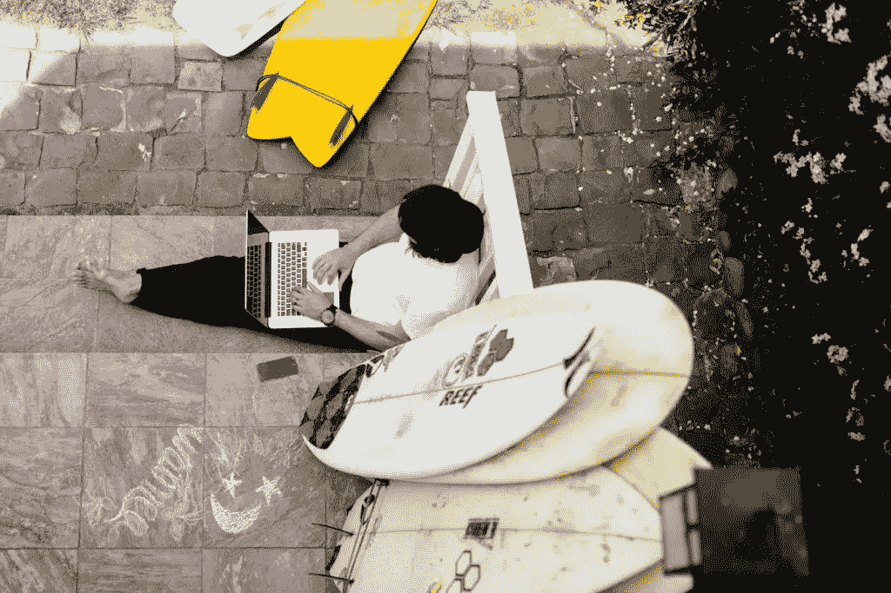

# 为什么“打卡”是扼杀你创造动力的最简单方式

> 原文：<https://medium.com/swlh/why-punching-the-clock-is-the-easiest-way-to-kill-your-creative-momentum-aabb231d85a9>

## 丹恩·佩蒂谈过上鼓舞人心的生活，寻找精神和身体的空间

我们经常看到其他创意人员的成功，并关注他们如何工作的*，认为如果我们跟随他们的脚步——当他们醒来时醒来，使用他们的工具，喝同样品牌的咖啡——我们的工作就会一样。*

*我们表现得好像你如何生活和你如何工作是分开的事情，但实际上，分开这两者就像试图拉开一个橡皮筋球——它们是如此地交织在一起，以至于你不能在没有另一个的至少一部分的情况下得到一个。*

*经验丰富的创意人员知道你是你创造的。*

*你的作品是你经历的精选——那些感动你的时刻，你被吸引的颜色，事情让你*感觉*的方式。*

*很少有设计师像 Dann Petty 一样将这种整体方法融入到他们的工作中。从他作为一名成功的自由职业者到被选为第一位媒体设计师，再到推出他自己的“非会议”活动，Dann 将他生活的方方面面都融入到了工作中。*

*我们和 Dann 坐下来讨论了如何过上鼓舞人心的生活，如何寻找精神和身体空间来发挥创造力，以及为什么“打卡”是扼杀你创造力的最简单方式。*

# *告诉我一点你喜欢如何工作*

*虽然很多人关注协作的重要性(这是理所当然的)，但我认为在创作过程中，需要对空间给予同等的关注。没有空间，我发现我无法思考，这是非常重要的一部分。有时候我们需要让自己分心。*

> *有好的分心和坏的分心。好的娱乐是史诗膨胀或权力日。糟糕的干扰是太多的会议，嘈杂的办公室，以及被迫进入严格的朝九晚五。*

*我有一些可能被认为是拖延症的灵感方法，比如冲浪——这可能会占用我一天的 2 个小时。*

*想象一下，你告诉你的老板，你要在上午 11:20 去冲浪，这是工作日的中段，其他人都在忙。或者想象一下，它正在太浩湖倾倒，你想休息一天。一整天。*

*抓住这些机会给自己空间将会改变你的想法，并提高你的表现，因为这纯粹是为了能够生活。因此，更好的最终结果。*

# *你去哪里寻找灵感？有什么地方或活动能让你充满创造的激情吗？*

*对我来说，很简单。出去吧。*

*生活是你能得到的最好的灵感，生活不会发生在明亮的屏幕后面。*

**

*在创作过程中休息一下并不意味着滚动你的无休止的提要。我最好的工作是在我冲浪、滑雪、逛新地方时，旅行时，和家人在一起时，以及诸如此类的事情时。*

*这就是为什么我创建了我的会议表。我想给人们一个借口，请一周的假来放松、娱乐，并与他们分享我获得灵感的方式——通过外出。*

*加州帕西菲卡的冲浪对我来说也是一个巨大的灵感。那里有各种各样的冲浪者，从第一次冲浪到半职业冲浪。在太平洋的一个小海湾里，群山环绕的光谱汇集在一起，有些特别。*

*一方面，你可以教新的冲浪者——这是我最喜欢做的事情之一——另一方面，你可以通过观察更好的冲浪者来学习。对我来说，这很像设计社区。我们都在教和学。*

*在 Pacifica，海浪平均很差，但我学到了很多关于耐心和享受简单时刻的含义。我认为这也与创作过程有关。你需要耐心——不能强迫你一天连续工作 8 小时。*

> *对我来说，最好的一天是在太平洋上我的冲浪板上最后一个看到日落的人。*

*那是我最大的励志时刻。你必须经历它才能感受它。任何时候我需要补充能量，这就是我所做的——不管冲浪条件如何。*

*像设计一样，冲浪并不总是为了抓住最好的浪。是关于你和水的联系。或者你和你的作品。*

# *你经常说要给自己空间，但你似乎总是同时有一百万件事情要做。*

*当我同时处理多个项目时，我会做得最好。我很少只运行一个项目。从学校开始，然后是广告，我不得不不断地做很多事情。现在，我相信这是我最大的技能，感谢我是如何开始的。当我同时进行 2-3 个项目时，我感觉最舒服。*

**

*我意识到每个项目都有某种形式的联系。无论是导航问题还是困难的概念问题，处理多个项目可以让你一次解决所有问题。*

*你知道当你思考如何设计登陆页面的时候，你想出的 100 多个概念吗？*

*一般来说，至少有几个伟大的人。好了，现在不用把这些想法扔掉，你可以把它们用在你正在做的另外两个项目上，而不必每次都重复这个循环。*

*设计激发设计。*

# *你说过不要打卡，而是要做正确的事，无论如何。你能多解释一下这种哲学吗？*

*首先，计算时间是任何创意所能做的最古老的事情。它不仅浪费时间，而且 50%的时间你都在欺骗自己或你的客户。*

*大多数创意人员不会因为鼓舞人心的散步、浏览 Dribbble 时的午餐或去冲浪获得灵感而向客户收费。但你必须这么做，这是过程的一部分。*

*我的哲学很简单。我相信收取项目价值或每周固定费用。没有隐性成本。每个人都清楚自己将面临什么样的局面，双方都能强势地坐到谈判桌前。有些人可能会说这种哲学有太多的未知，如果是这样的话，那是因为项目管理不当。*

> *我也相信不是每个项目都有相同的价格，也不总是需要一个价格。*

*太多的创意人员因为价格骄傲而失去项目。我最好的工作，以及我最好的高薪工作推荐，都来自免费项目。我免费去了 Nixon.com，因为我热爱这个行业和品牌。作为回报，我得到了一些免费手表和大量的推荐。更不用说，长期的朋友和关系。*

*对我来说，那是无价的。*

**

*我也免费做[美食](https://epicurrence.com/)。所有赚来的钱都回到了参与者的手中。为什么？因为关系和经历是无价的，比银行账户更有价值。*

*在今天的世界里，金钱是很容易被遗忘的，甚至很少是有形的。所以不要为了一些额外的钱而错过一个好的机会、经历或关系。*

# *最后，关于如何找到自己的空间并创造自己独特的风格，你有什么建议给任何新的或有抱负的设计师或创意人员？*

*这是我能说的最重要的一句话:过一个你能享受并感到兴奋的生活。*

*此外，如何收费要灵活。金钱不是一切。*

*记住这个:**关系+经历>金钱**。*

**在*[*@ dannpetty*](https://twitter.com/dannpetty)*在* [***的推特上捕捉丹恩，并在***](https://www.amazon.com/Unsplash-Book/dp/0995030618) *阅读更多关于他的书。**

# *停止打卡，开始构建你自己鼓舞人心的生活。*

**

## *看看 Crew 吧，这是一个人才市场，在这里你可以见到最好的设计师和开发人员，并与他们一起工作。超过 1000 万人使用过剧组生产的[产品。超过 300 万人阅读了](http://crew.co/?utm_source=Medium&utm_medium=CTA&utm_campaign=MediumCTAs)[我们的博客](http://blog.crew.co/?utm_source=Medium&utm_medium=CTA&utm_campaign=MediumCTAs)。在这里加入他们。*