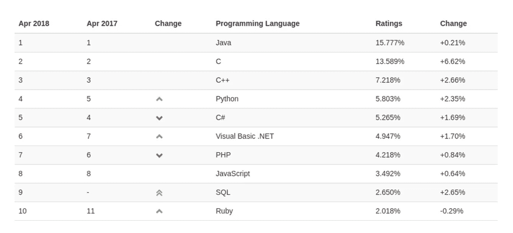
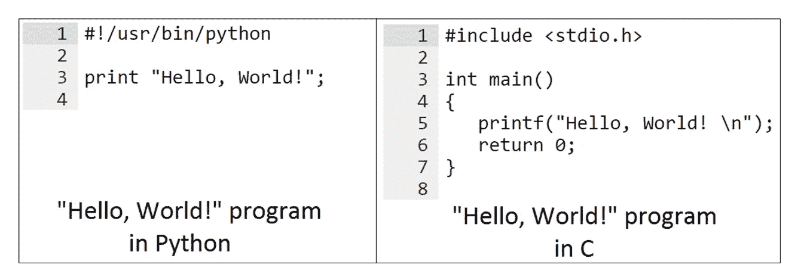
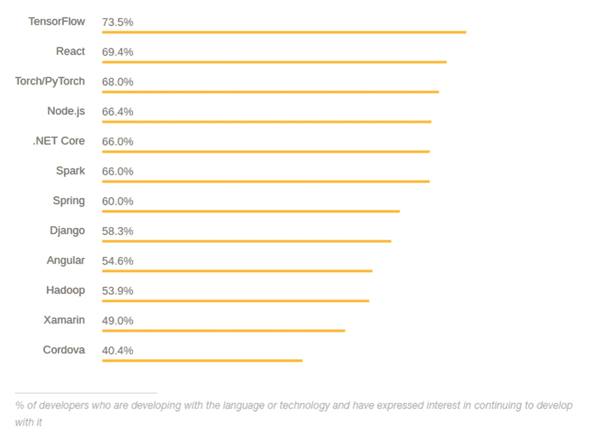

# 为什么 Python 和 Django 是 Web 开发的首选

> 原文：<https://medium.com/swlh/why-python-django-are-your-top-choice-for-web-development-bff93e129448>

在 SteelKiwi，Python 和 Django web 框架是我们后端 web 开发的主要工具。作为领先的 Python 和 Django 开发公司之一，我们有很多理由用 Python 和 Django 开发 web 项目。

## Python 的主要特性

Python 仍然是最流行的编程语言之一。

它在初创公司、谷歌、Quora、网飞和 Spotify 等蓝筹公司以及 NASA 等政府机构中受到同等重视。然而很少有人知道为什么 Python 是网站开发的顶级编程语言之一。

## 默认情况下简洁易读

因为 Python 使用空格而不是大括号和其他特殊字符来表示编程结构的开始和结束，所以可读性是一种内置特性。

这意味着无论何时你需要用 Python 更新一个项目，找一个可以查看它的代码并做出必要修改的人是相对容易的，即使他们以前从未见过它。

## 堆叠了大量的标准功能

Python 默认提供了许多特性，标准库几乎涵盖了所有编程任务。从科学计算到图像处理、操作系统界面和协议，Python 为开发人员提供了他们原本需要手动构建的解决方案，从而节省了他们的时间和精力。

## 非常适合创建原型

原型是测试想法所必需的。Python 允许您以最少的时间和金钱投入构建原型。

对于一家初创公司来说，这提供了快速向投资者展示工作原型的能力，增加了成熟产品获得资金的机会。对于一个大企业来说，快速原型是一种尝试新的商业想法的方法，并确保它们在投入大量资源之前有效。

## 加快上市速度

出于同样的原因，Python 适用于原型，它也适用于您希望尽快推向市场的产品。对于初创公司和成熟企业来说，这意味着更快的投资回报(ROI)和根据真实用户的评论和反馈定制产品的机会。

## 提供多种框架

尽管 Python 有多棒，但它也有其局限性。然而，它们主要是由[各种各样的 Python 框架和开发环境来弥补的。](https://steelkiwi.com/blog/top-10-python-web-frameworks-to-learn/)

在本文中，我们将只讨论 Django，因为它是我们在 SteelKiwi 使用的主要框架。但是还有许多其他工具可以用来加速开发和提高用 Python 构建的产品的质量。

## 与机器学习和数据科学携手并进

Python 整体的简单性和清晰性，以及强大的 [TensorFlow 库](https://www.tensorflow.org/)，使得它非常适合构建最复杂的机器学习结构。正因为如此，许多科学家和研究人员选择 Python 进行与人工智能和机器学习相关的项目。

此外，Python 的标准库包括数据处理方法，如用于数据可视化的[熊猫](https://pandas.pydata.org/)，这使得处理大数据变得简单而舒适。

# Django 的主要优势

Django 通常被认为是最好的 Python 特性之一。它甚至被列入了 [2018 Stack Overflow 开发者调查中最受喜爱的框架名单。](https://insights.stackoverflow.com/survey/2018/#technology-most-loved-dreaded-and-wanted-frameworks-libraries-and-tools)

首先，Django 是用 Python 编写的，允许开发人员使用易于维护的 Python 语法来构建复杂的 web 应用程序。该框架还添加了许多特性来使开发变得更好。

## 含电池

Django 的电池内置方法意味着该框架拥有开发成熟应用程序所需的一切。Django 提供内置的 HTML 模板、URL 路由、对象关系映射和会话管理，帮助开发人员避免寻找第三方工具的麻烦。

数百个 Django 包帮助你快速创建任何东西，从聊天机器人到复杂的 GPS 解决方案。

## 开发时间几乎减半

Django 自称是“有期限的完美主义者的网络框架”,并且做到了。开发者可以使用 Django 的内置特性为任何行业创建 web 应用程序。

Django 基于“不要重复自己”( do not Repeat Yourself )( DRY)理念，这激励开发人员重用他们为其他项目编写的代码，进一步减少开发您的产品所需的时间。

## 轻松扩展和扩展

Django 组件是解耦的，这意味着它们可以像乐高积木一样根据需要添加或删除。根据您特定的产品需求，开发可以扩大或缩小，根据需要改变 Django 组件的数量和复杂性。

阅读更多内容:[在 Python 中使用 Django 模型的最佳实践](https://steelkiwi.com/blog/best-practices-working-django-models-python/)

## 提供强大的安全性

默认情况下，Django 保护用它构建的应用程序。它减少了一些与 Python 相关的更常见的安全错误，同时还保护应用程序免受跨站点脚本、请求伪造和 SQL 注入的攻击。

## 适用于大多数主要数据库

Django 的对象关系映射(ORM)与许多流行的数据库兼容，但它的关键特性是允许开发人员同时处理几个数据库。此外，Django 使得从一个数据库迁移到另一个数据库并执行常见操作成为可能，而无需编写太多额外的代码。

## 帮助搜索引擎优化(SEO)

除此之外，Django 还提供了许多有用的 SEO 工具。有了 [Django SEO 框架](http://django-seo.readthedocs.io/en/latest/introduction/tutorial.html)，开发者可以通过使用[缓存模板](https://docs.djangoproject.com/en/dev/ref/templates/api/#loader-types)和[压缩 CSS 和 JavaScript](https://github.com/django-compressor/django-compressor) 来减少页面加载时间。甚至还有[管理 robots.txt](https://github.com/jazzband/django-robots) 的工具。总而言之，Django CMS 的能力超出了许多专业 SEO 专家的预期，证明了 Django 是搜索引擎优化的最佳框架之一。

## 由于它的社区而不断发展

Django 周围有一个很大的社区，每天都有更多的爱好者加入。他们不断更新和改进框架的组件，同时开发新的库来解决专业人员在开发 web 应用程序时经常面临的问题。

# 使用 SteelKiwi 开发您的 web 项目

SteelKiwi 用 Django 用 Python 编程已经七年多了。在这段时间里，我们开发了各种各样的 web 应用程序，并且还在继续开发更多的应用程序:

1.  [市场解决方案](https://steelkiwi.com/projects/promotional-app-with-erp-for-businesses/)SNA apy——一项在科威特寻找和雇佣最佳服务提供商的服务。
2.  [数字 CRM/ERP 平台 Nova Vita](https://steelkiwi.com/projects/creating-a-digital-workflow-for-healthcare-centre/) 或荷兰的医疗保健中心。
3.  [法律市场解决方案 NexDep](https://steelkiwi.com/projects/uber-for-court-reporters-making-court-staff-available/) —为美国法庭寻找和预约摄像师、口译员、记者和其他专业人士的服务。
4.  [Kimetrica](https://steelkiwi.com/projects/a-website-for-a-non-profit-humanitarian-organization/) ，肯尼亚内罗比一家非营利组织的信息网站。
5.  [大型社交媒体平台 PhotoBlog](https://steelkiwi.com/projects/improving-website-performance-for-a-photo-blogging/)——一个面向全球专业摄影师的社区。
6.  [招聘平台 AFR connection](https://steelkiwi.com/projects/an-ecosystem-for-african-entrepreneurs-professionals-and-job-seekers/)用于在非洲寻找和招聘专业人员

如果您想了解我们最新的案例研究，并查看我们使用 Python 和 Django 开发的更多项目，请访问[steel kiwi 项目页面](https://steelkiwi.com/projects/)或在社交媒体上关注我们。

要立即开始开发您的应用，[请联系我们的销售代表。](https://steelkiwi.com/contacts/)

## 有用的链接

1.  [单例设计模式示例:Django 中的单例模型](https://steelkiwi.com/blog/practical-application-singleton-design-pattern/)
2.  [第一手经验:SteelKiwi 的 Django 项目模板](https://steelkiwi.com/blog/django-project-template-by-steelkiwi/)
3.  [将一个用 aiohttp 编写的 WebSocket 服务器集成到一个现有的 Django 项目中](https://steelkiwi.com/blog/websocket-server-on-aiohttp-in-django-project/)

## 这篇文章发表在 [The Startup](https://medium.com/swlh) 上，这是 Medium 最大的创业刊物，拥有 340，876+的读者。

## 在这里订阅接收[我们的头条新闻](http://growthsupply.com/the-startup-newsletter/)。

