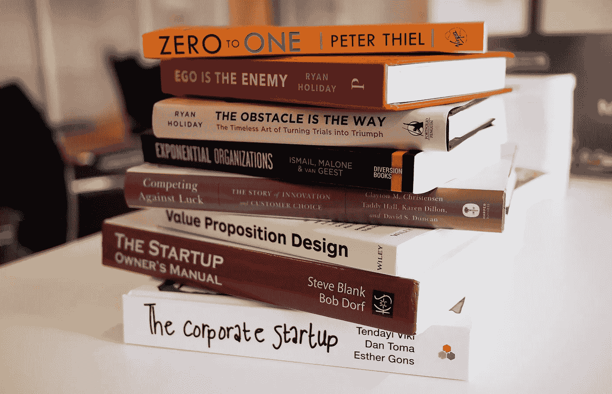

# 为什么一年读 100 本书不会让你成功

> 原文：<https://medium.com/swlh/why-reading-100-books-a-year-wont-make-you-successful-cd9c3cf672f5>

Originally published on [**JOTFORM.COM**](http://jotform.com)

阅读是趋势。

互联网把一些不酷的东西改头换面了。

阅读是新的甘蓝:值得接受，因为它对我们有好处。

事实上，太好了，我们应该尽我们所能去做。越多越好！每个人都应该每周读一本书——不，等等，一天一本书。