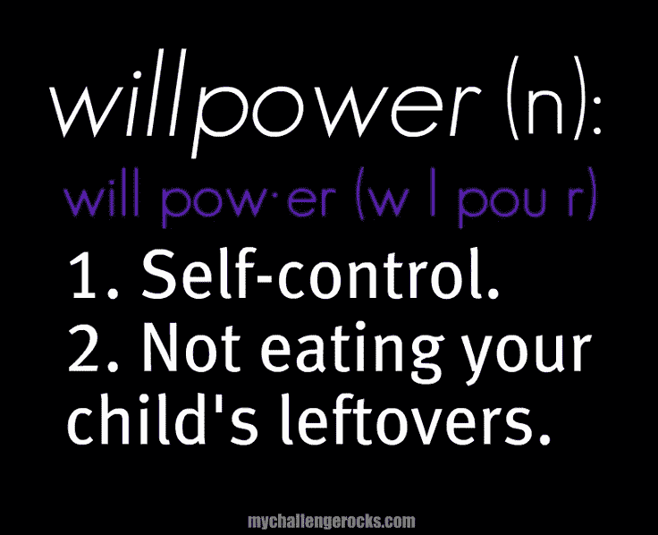

# 为什么依靠意志力变得更健康毫无意义(以及你应该做些什么)

> 原文：<https://medium.com/swlh/why-relying-on-willpower-to-get-healthier-is-a-waste-of-time-and-what-you-should-do-instead-8baa79631c66>

Photo by [Justin Medina](https://unsplash.com/photos/FvJuUaXWGiQ?utm_source=unsplash&utm_medium=referral&utm_content=creditCopyText) on [Unsplash](https://unsplash.com/search/photos/willpower?utm_source=unsplash&utm_medium=referral&utm_content=creditCopyText)

## 基于非习惯的方法来戒掉强迫性进食，轻松减肥。

*“有志者事竟成”*

*“人不缺乏力量；他们缺乏意志。”—维克多·雨果*

*“一个成功的人和其他人的区别不是缺乏力量，不是缺乏知识，而是缺乏意志。”——文斯·隆巴迪*

哎哟！

在我们的一生中，我们一直被告知，我们只需要不断尝试，直到成功。

如果我们真的想要某样东西并且愿意去做，我们就能做到。难怪我们认为自己没有表现出足够的自制力、纪律性或意志力是失败的。

也许最近，你听说意志力是一块肌肉，需要锻炼才能变得更强。

但是你一直在努力吃得更健康，你一直在努力去健身房，你一直在努力避免午夜大吃大喝，不是吗？

> *你锻炼意志力肌肉已经有一段时间了，那么现在呢？为什么它还不工作？*

# 为什么意志力不起作用

意志力(或其他术语中的自制力)不起作用不是因为缺乏尝试，而是因为我们不总是能控制的其他精神、情感和生物原因。

简单地说，一天中没有足够的意志力让我们满足生活的所有需求，同时还能保持健康饮食的自律(并且不在晚餐时偷吃一块或十块饼干)。

## 1.意志力来自于我们进行其他身体、精神和情感活动所需要的同样的能量。

这可能像去健身房一样简单，像在工作中不得不应付一个讨厌的同事一样令人疲惫，或者像与我们的伴侣进行一次严肃的关系谈话一样令人疲惫。因为我们每天都有太多这样的能量需求，所以到一天结束时，我们就没有任何意志力了。

线索——坐在电视机前，往我们脸上塞薯片。

## 2.意志力是用来在这个充满 F.O.M.O 的世界里延迟满足的。

每当我们在脸书上看到一个朋友惊人的海滩自拍，感到嫉妒，然后对自己进行合理化，我们就耗尽了意志力。每当我们走进星巴克买咖啡，瞥一眼松饼，告诉自己不应该买，我们就耗尽了意志力。

我们这一代人生活在对错过的恐惧中，以至于我们最终不得不付出额外的努力来保持脚踏实地。难怪我们没有精力去健身房，需要整个周末看无脑的网飞秀&吃美味的食物来休息。

等一下——这是你想为一周的剩余时间准备膳食的时候，是吗？😂

## 3.我们将每天努力满足外界的期望。

为了取悦一个爱唠叨的老板而花几个小时修改一个演示文稿，和令人讨厌的姻亲坐在一起吃一顿丰盛的晚餐——每天我们都在做出妥协，我们保持外交辞令，用尽我们的自制力去做我们并不完全相信的事情。

一天下来，我们太累了，我们在食物中寻找安慰。在那个时候，试图唤起我们的意志力资源(顺便说一下，意志力资源已经耗尽了)不去吃那些帮助我们感觉更好的东西是不可能的。

## 4.我们为多个目标奋斗，这需要更多的意志力。

仅仅吃一顿健康的午餐是不够的——我们想去健身房锻炼一个小时，甚至不去嗅一嗅饼干，吃五份蔬菜。最重要的是，我们想和客户开好会议，睡足 8 个小时，在家给孩子们做晚饭。

*这是在完成任务清单的一半之前耗尽意志力的完美方法。*

太多的目标意味着我们的精力被分散在众多的活动中，最终我们无法把其中任何一项做得足够好。*然后，我们会因为没有达到自己的期望而感到内疚，这进一步消耗了我们的精力。*

## 5.我们努力用意志力战胜食物。

我们吃超美味的食物，如薯片和饼干，它们让我们的大脑进入快乐超速档，然后以某种方式合理化我们不会再这样做了。我们忘记了从生物学的角度来看，我们的大脑喜欢这种食物，并且想要更多。

抵制这些食物需要额外的精神和体力，比我们一开始就不吃要多得多。

这就像给一个孩子糖果，然后告诉他们不要吃。那是不可能的！

# 你应该做什么而不是意志力

如果一天的精力很容易耗尽，也就是说，如果意志力不是纪律和自我控制最可靠的来源，我们应该做些什么来取得进步呢？

首先，我们需要承认意志力是一种有限的资源，我们迟早会耗尽它。

然后，我们可以修改我们完成任务的方法——也就是说，我们可以利用我们内在的动机，而不是依靠外在的意志力来完成任务。

## 1.了解你的“为什么”

需要依靠意志力的最大原因是因为我们的动机不明确。

*   我们为什么要减肥？
*   为什么我们要停止对食物的痴迷和强迫性进食？
*   这些事情是我们生活中最重要的还是最重要的？

> 当我们的动机显而易见、相关并且对我们来说有直观意义时，我们需要越来越少地依赖意志力来实现我们的目标。

要做出真正大的改变，比如将健康融入我们的生活方式，不仅仅是优先考虑它，而是真正深入挖掘我们的“为什么”，想象成功，每天用它来激励自己，打破旧的习惯模式。

*查看这些* [*免费资源*](https://goo.gl/5fNRSG) *了解更多关于如何利用可视化动机来克服惰性并开始更健康的生活。*

## 2.由内部驱动，而不是外部参与

研究表明，那些因为“想”而不是因为“应该”而从事活动的人并不真的需要多少意志力才能坚持下去。

> 我们应该总是试图找到为什么我们“想要”做一些事情来使生活变得更容易、更有效率和更愉快的原因。

这需要改变我们的思维方式，从像一个反叛者(或)强迫者那样思考转变为像一个提问者(或)支持者那样思考。

这是基于[格雷琴·鲁宾的四种倾向人格模型](https://gretchenrubin.com/take-the-quiz)，在这个模型中，支持者和提问者满足内心期望远比满足外部期望更容易。提问者尤其擅长将外部期望内化，这使得他们有内在动力去实现它们。

Credit — Gretchen Rubin

## 3.决定并去做。不要和自己争论。

我们用尽了大部分脑力来为自己的不同决定合理化。

*“我应该拿饼干吗？”*

“不，我不应该。”

“但这只是一块饼干。我不是读到过限制食物是不健康的，只会增加我对食物的渴望吗？”

嗯，是的，但是我绝不会只吃一块饼干就停下来。我最后总是吃掉整包。所以这是个坏主意。让我不要做。”

好吧，很好。那就没有饼干了。”

自豪地回到办公室，抵制饼干…30 分钟后，仍然在想那该死的饼干，现在还在做梦…

“为什么非得是黑巧克力双层巧克力脆片……唉！”

*“我觉得他们一般没有这个味道，可能是限量版吧”*

“闻起来真香！我就吃这一次！”

*走回咖啡店，买了块饼干，只是为了忘掉它*

唷！光是想想这种事就让人精疲力尽，让我想吃饼干！

你能想象这整个内心对话需要多少能量吗？然后在它结束的时候抗拒食物？

如果我们想吃东西，我们应该直接吃。

如果我们不想吃东西，那么我们应该事先想好要告诉我们爱发牢骚的大脑什么，这样我们就不会陷入幼稚的争论。

> 合理化和与自己争论实际上是自我破坏，因为在争论结束时，我们太累了，以至于我们实际上渴望我们正在避免的食物来提神以感觉更好。

归根结底，如果我们真的想变得更健康，我们应该把健康放在生活的第一位或第二位。这将意味着我们知道我们的“为什么”,并有足够的内在动力将更健康的生活融入我们的生活。

## 如果你真的想做出健康的改变，停止贪吃，停止强迫性进食，帮助你减肥，看看这些免费的资源开始 ***。***

## 多鼓掌(最多 50 次)——和我一起帮助其他工作狂戒掉强迫性进食，变得更健康，从食物中找到自由——我们都应该最终达到我们一直梦想的体重、身材和生活！

## 这篇文章发表在 [The Startup](https://medium.com/swlh) 上，这是 Medium 最大的创业刊物，有 303，461+人关注。

## 订阅接收[我们的头条新闻](http://growthsupply.com/the-startup-newsletter/)。

