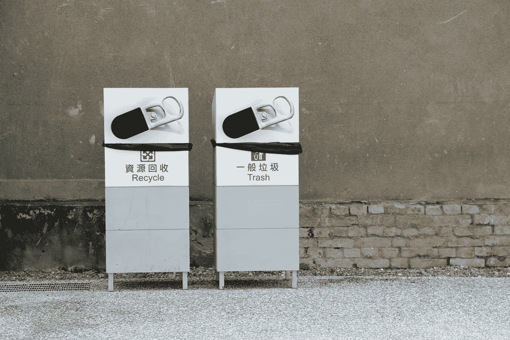

# 为什么在媒体上转贴内容是个好主意

> 原文：<https://medium.com/swlh/why-reposting-content-on-medium-is-a-good-idea-fcaf809d109a>

Image via Pixabay.com

回收不仅对环境有好处，对你的追随者也有好处。我最近做了一个实验，在那里我重新发布了一些我几年前写的常青树内容，看看它是否会有任何吸引力。结果确实令人吃惊。

这个想法是在我努力想写点什么，并查看我的统计数据，看看人们以前对什么感兴趣的时候产生的。我注意到我刚加入 [5 个简单的编辑技巧](https://medium.com/u/504c7870fdb6#.gbk43qdw3)。我找到最受欢迎的媒体写作刊物[如何开始写小说](https://medium.com/u/bdae83c7b0da#.jjhnk7985)一样相当平淡。但是，帖子[如何出版](https://writingcooperative.com/how-to-get-published-495398c2b638#.dguanojwk)，讲述了我如何能够出版我的第一部小说[地狱篇](https://www.timhawken.com/hellbound-trilogy/)的故事，获得了巨大的成功。它吸引了比原版多 10 倍的阅读量和多 25 倍的推荐量。诚然，这是一个低基数，与 Medium 上的流行作家相比，这些统计数据并不疯狂，但花时间重新发布一些在我的后备目录中萎靡不振的东西是非常值得的。

除此之外，这篇文章还让我在 Medium 上的粉丝数量从 471 个攀升至 662 个(增长了 40%)，有 55 人注册了我的个人通讯。一点也不差。

因此，基于这一点，我会建议你看看你的旧文章，并找出哪些可以回收，以吸引新的读者群。在一个几周前的任何东西都被视为古老思想而被抛弃的时代，一点点将内容打扮成“新鲜”的手法可以让相关的想法被认为值得人们关注。

总结一下，以下是我遵循的步骤，你可以用它来绘制你自己的流程图:

1.  选择“常青树”内容进行转发(想想今天仍然相关的东西…没有选前特朗普的文章，谢谢)。也不一定是灵媒的东西。你也可以从其他平台回收。
2.  整理帖子，添加你学到的任何额外的东西。可能会更新图像。
3.  以适合内容的[媒体](https://medium.com/u/504c7870fdb6?source=post_page-----fcaf809d109a--------------------------------)上的相关出版物为目标。
4.  发布和跟踪结果。

保持实验的心态，你永远不知道事情会把你引向何方。

我期待着不久能读到你的“新”文章。

如果你想要地狱三部曲第一本书的免费电子版，那么在这里注册[。](http://timhawken.us3.list-manage1.com/subscribe?u=695fe4e04b6b468b9e9800076&id=957f3ad9ec)

这是一次以撒旦为向导的地狱过山车之旅。