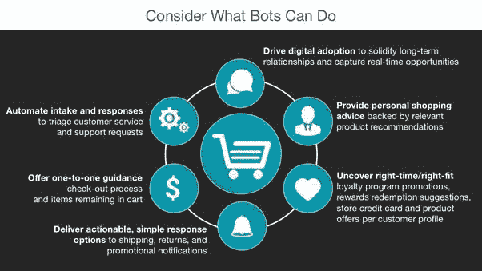

# 为什么零售商需要聊天机器人来增加增长和盈利

> 原文：<https://medium.com/swlh/why-retailers-need-chatbots-to-increase-growth-and-profitability-30f1b19a8617>

**聊天机器人正在改变全球数百万消费者的购物体验**

客户不在乎你在网络和移动开发上投入了多少；他们只想在需要时得到优质的服务和合适的产品。

**订婚的顾客花费更多。给他们一个全天候工作的机会。**

参与型客户在钱包份额、盈利能力、收入和关系增长方面产生了 23%的溢价，而非参与型客户仅为 13%。[让购物者保持数字化参与](https://kore.ai/smart-bots/commerce/)，并保持快乐，比以往任何时候都重要。对于有店面的零售商来说，增加商店的客流量以获得相关的购物体验也很重要。替代玩家每天都在涌现，攫取网上和店内业务。聊天机器人是你摆脱“追赶”模式、在竞争中领先的一种方式。

**Gartner 预测，到 2018 年，30%的与新智能技术的交互将通过与智能机器的对话来实现。**

聊天机器人将您的购物者习惯的传统数字体验转变为对话式、个性化和即时令人满意的互动。在购物者希望互动的时候，这些约定是全天候可用的。

使用聊天机器人，您的购物者可以:

*   即时接收私人购物者的实时建议，宣传您的品牌。
*   只需请求状态或接收关于可供购买和提货的店内库存的提醒。
*   通过文本、电子邮件、移动应用程序、网站、呼叫中心或店面等所有渠道快速获取客户服务。
*   以简单、基于消息的方式方便地购买产品。

**不要忽视聊天机器人为零售企业员工所做的工作。很强大。**

Business Insider 引用“事实证明，企业对企业(B2B)机器人对投资者特别有吸引力，比面向消费者的机器人更有吸引力。”

从库存管理到 IT 支持，再到营销和销售，零售商都在努力应对不断阻碍敏捷性、增长和盈利能力的常见挑战。尽管在企业软件上投入了大量资金，但员工发现完成工作比以往任何时候都更加困难。聊天机器人让你摆脱无休止的支出循环，以建立更多的定制应用程序和网站来满足当今劳动力的需求。

聊天机器人支持商业世界中一些最广泛使用的第三方应用程序，帮助员工轻松高效地完成任务。

借助聊天机器人，您的零售企业可以:

*   连接不同的系统和应用程序，简化您的数字工作流程。
*   交付相关更新、自动化任务、提供按需报告并执行库存管理工作流。
*   为员工配备易于使用的消息传递、协作工作区和安全的文件共享。
*   借助真正的多任务处理和更简单的通信，削减团队、部门和地点的时间和管理费用。

**你做过数码。做得更好。**

希望领先并加强数字化转型努力的零售商应该考虑人工智能丰富的聊天机器人，并为员工和客户提供日常对话。这项技术最大限度地提高了数字和店内产品的价值，以培养忠诚度，并通过合适/合适的对话推动购物者进行购买。一个[聊天机器人平台](https://kore.ai/bots-platform/)使企业能够快速构建和扩展，并更快实现投资回报。

谢谢你

[法妮·马鲁帕卡](https://www.linkedin.com/in/phani-marupaka-02646b33/)

## 这篇文章发表在 [The Startup](https://medium.com/swlh) 上，这是 Medium 最大的创业刊物，有 312，043+人关注。

## 订阅接收[我们的头条新闻](http://growthsupply.com/the-startup-newsletter/)。

